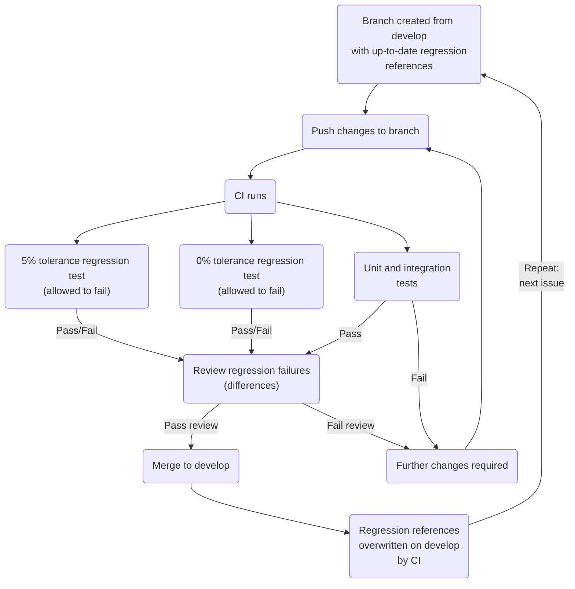

# Contributing
To contribute to Process, please follow this procedure.

## Quick Summary
- Push code to branch
- Unit and integration tests must pass
- Regression tests are allowed to fail
- Reviewer checks source changes and regression differences
- If they pass review, changes are merged to develop

## Contributing Guide
1. Raise an issue and describe the problem to be solved or the change to be made.
1. On that issue, create a branch and merge request.
1. Pull the branch and implement the solution, adding tests if appropriate.
1. Build the code, run it and check your solution works.
1. Run the tests using `pytest`; this runs the unit, integration and regression tests.
    - Unit and integration tests must pass. Any that fail require source or test modification.
    - Regression tests may fail; their purpose is to make you aware of significant changes to results as a result of your source changes. A 5% tolerance is applied by default to the regression tests: if any values differ by >5% from the reference, the regression test will fail for that scenario. This new value may be the desired result of the changes, however. Optionally, a 0% tolerance regression test can be run using `pytest --reg-tolerance=0`.
    - It is incumbent on the author to check the test results created by their code changes, and modify source or tests if required. Are the regression changes expected and acceptable?
1. Once everything passes (apart from the regression tests, which are allowed to fail), commit and push the changes. This triggers the CI system, which will run the test suite again, including 5% and 0% tolerance regression jobs. The purpose of this is so that the reviewer of the merge request can see from the pipeline's regression job traces what changes >5% and >0% (if any) your code changes create.
1. If the changes are notable and it would benefit other users to be aware, [create a changelog entry](documentation/proc-pages/development/versioning.md).
1. The reviewer reviews the source changes and the results of the regression jobs to see how they change the regression results. Once the changes are approved by the reviewer, the branch can then be merged.

### Contributing Workflow

### Explanation
For an explanation of the reasoning behind this approach, please read the [testing documentation](http://process.gitpages.ccfe.ac.uk/process/development/testing).
