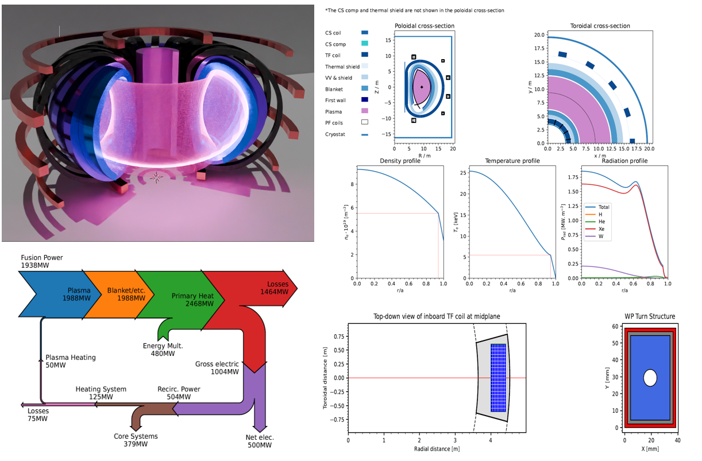

 

# PROCESS

**Here are the [PROCESS docs](https://ukaea.github.io/PROCESS/).**

PROCESS is the reactor systems code at the [UK Atomic Energy Authority](https://ccfe.ukaea.uk/). More information on PROCESS can be found on the PROCESS [webpage](https://ccfe.ukaea.uk/resources/process/).

PROCESS was originally a Fortran code, but is currently a mixture of Python and Python-wrapped Fortran; the eventual aim is to have an entirely Python code base. In order to use PROCESS, the Fortran must be compiled and a Python-Fortran interface generated for the Python to import. Once built, it can be installed and run as a Python package.

Overview of some outputs for a DEMO-like reactor (3D image generated using Fusrr-pipeline).

## Getting Started
Please see the [installation guide](https://ukaea.github.io/PROCESS/installation/introduction/) and the [usage guide](https://ukaea.github.io/PROCESS/usage/running-process/). Once installed, the `examples` directory provides Jupyter notebooks for interactively demonstrating usage of PROCESS, which is a good place to start. The `examples/README.md` provides more help.

## Documentation
To read about how the code works and the modules in it see the [documentation](https://ukaea.github.io/PROCESS/).

## Tracking and Testing
Process uses a mixture of tracking and testing to ensure code reliability. Tests are run on each branch and ensure the output of keys functions are correct. Tracking, on the other hand, shows graphs of a variables changes over time, and what commit caused the change.

* Our tracker can be found here: https://ukaea.github.io/PROCESS/tracking.html
* Documentation on testing can be found here: https://ukaea.github.io/PROCESS/development/testing/

## Development
Please see the CONTRIBUTING.md for guidance on how to contribute to PROCESS. Further information is found in the development section of the [documentation](https://ukaea.github.io/PROCESS/).

## Publications
A list of publications using PROCESS is given [here](https://ukaea.github.io/PROCESS/publications), including two papers outlining the physics and engineering models in PROCESS.

## Citing PROCESS
If you use PROCESS in your work, please cite it using the "Cite this repository" link in the "About" section of the repository.

## Contacts
[James Morris](james.morris2@ukaea.uk)

[Jonathan Maddock](jonathan.maddock@ukaea.uk)

[Michael Kovari](michael.kovari@ukaea.uk)

[Stuart Muldrew](stuart.muldrew@ukaea.uk)
