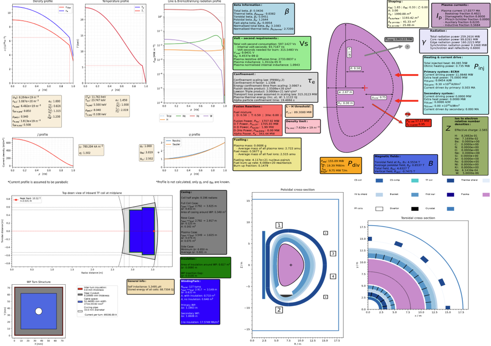

 

# PROCESS

**Here are the [PROCESS docs](https://ukaea.github.io/PROCESS/).**

PROCESS is the reactor systems code at the [UK Atomic Energy Authority](https://www.ukaea.org/). More information on PROCESS can be found on the PROCESS [webpage](https://www.ukaea.org/service/process/).

PROCESS was originally a Fortran code, but is now a pure-Python command line program. PROCESS is still undergoing a significant restructure and, as such, **PROCESS version 3 is unstable and does not guarantee backward compatibility**. PROCESS version 4 will be the first major version to enforce backward-compatible API changes and will be released following a refactor of the data structure. 

Overview of some outputs for a DEMO-like reactor.

## Getting Started
Please see the [installation guide](https://ukaea.github.io/PROCESS/installation/installation/) and the [usage guide](https://ukaea.github.io/PROCESS/usage/running-process/). Once installed, take a look at the [examples page](https://ukaea.github.io/PROCESS/usage/examples/) for examples of how PROCESS can be run, and its results visualised. 

## Documentation
To read about how the code works and the modules in it see the [documentation](https://ukaea.github.io/PROCESS/).

## Tracking and Testing
Process uses a mixture of tracking and testing to ensure code reliability. Tests are run on each branch and ensure the output of key functions are correct. Tracking, on the other hand, shows graphs of changes to variables over time, and what commit caused the change.

* Our tracker can be found here: https://ukaea.github.io/PROCESS/tracking.html
* Documentation on testing can be found here: https://ukaea.github.io/PROCESS/development/testing/

## Development
Please see the [CONTRIBUTING.md](https://github.com/ukaea/PROCESS/blob/main/CONTRIBUTING.md) for guidance on how to contribute to PROCESS. Further information is found in the development section of the [documentation](https://ukaea.github.io/PROCESS/development/git-usage/).

## Publications
A list of publications using PROCESS is given [here](https://ukaea.github.io/PROCESS/publications), including two papers outlining the physics and engineering models in PROCESS.

## Citing PROCESS
If you use PROCESS in your work, please cite it using the "Cite this repository" link in the "About" section of the repository. This will cite the latest version of PROCESS, if you are using a different release please find the appropriate DOI on [PROCESS' Zenodo page](https://doi.org/10.5281/zenodo.8335291). To ensure reproducible research, we recommend you run an [official release of PROCESS](https://github.com/ukaea/PROCESS/releases) by checking out the appropriate git tag.

## Contacts
[James Morris](mailto:james.morris2@ukaea.uk)

[Jonathan Maddock](mailto:jonathan.maddock@ukaea.uk)

[Michael Kovari](mailto:michael.kovari@ukaea.uk)

[Stuart Muldrew](mailto:stuart.muldrew@ukifs.uk)
