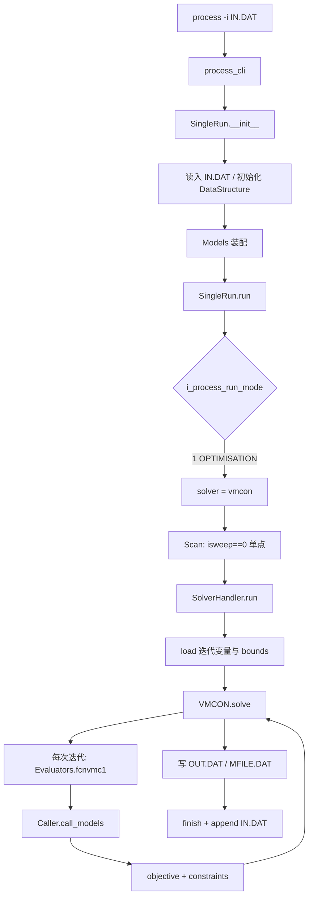
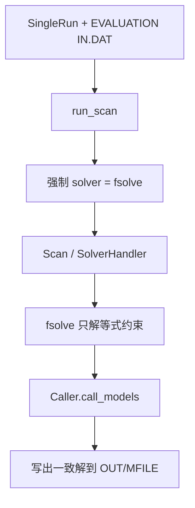
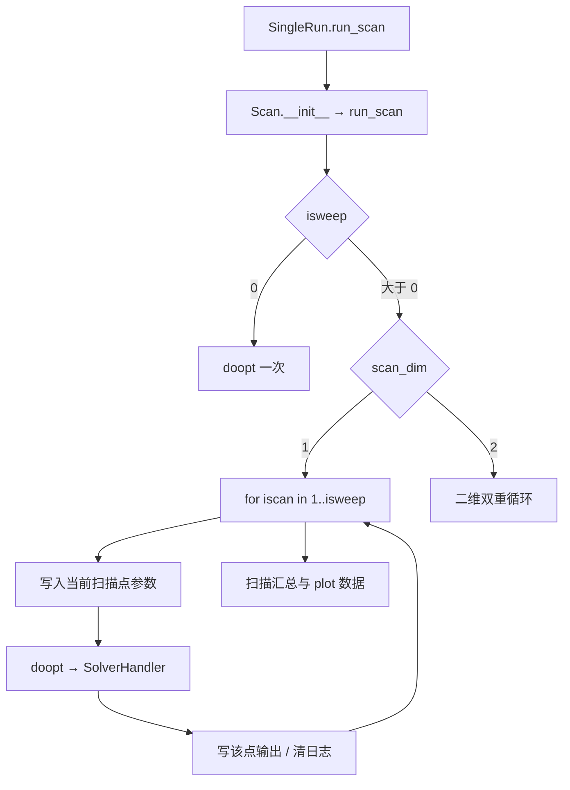
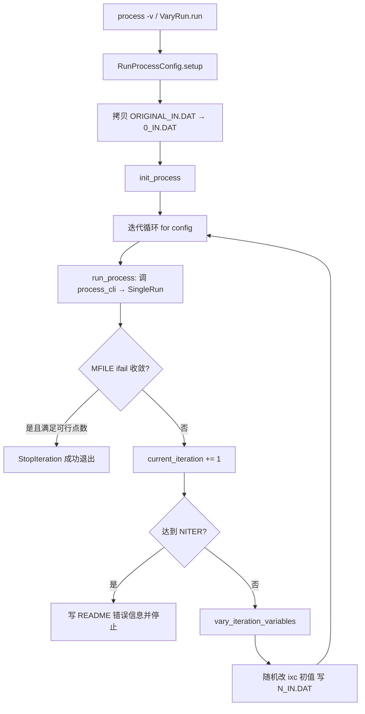
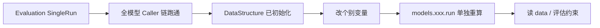

# PROCESS 用法与调用流程

本文梳理 PROCESS 的主要用法，并说明每种用法下的入口、关键类与调用链路。

## 总览

PROCESS 有两类入口：


| 入口            | 说明                                              |
| ------------- | ----------------------------------------------- |
| CLI：`process` | `pyproject.toml` 注册为 `process.main:process_cli` |
| Python API    | 直接构造 `SingleRun` / `VaryRun` 等                  |


按运行目的可分成下列用法（可叠加，例如「优化 + 扫描」）：

1. **优化运行（Optimisation）** — `i_process_run_mode = 1`
2. **评估运行（Evaluation）** — `i_process_run_mode = -2`
3. **参数扫描（Scan）** — `isweep > 0`（可挂在优化或评估之上）
4. **VaryRun** — 随机扰动迭代变量初值，反复优化直到收敛
5. **单模型评估** — 先跑一遍完整评估，再单独调用某个 `model.run()`
6. **后处理工具** — `process plot` / `process mfile` / `process indat`

---

## 共用核心调用链

除「单模型评估」和「纯后处理」外，正式求解都走同一条主链：

```text
process_cli / SingleRun
    → SingleRun.__init__
        → validate_input → set_filenames → initialise (读 IN.DAT)
        → Models(data)  # 装配物理/工程模型
    → SingleRun.run()
        → validate_user_model()   # 检查用户自选的成本模型
        → run_scan()
            → 按 i_process_run_mode 选择求解器
               · OPTIMISATION(1) → vmcon（默认）
               · EVALUATION(-2)  → fsolve
            → Scan(models, solver, data)   # 构造 Scan 时立即执行
                → SolverHandler(models, solver, data)
                → run_scan()
                    · isweep == 0（单点）
                        → doopt() → write_output_files → show_errors
                    · isweep > 0 且 scan_dim != 2（一维扫描）
                        → scan_1d()
                            → for iscan in 1..isweep:
                                → 写入当前扫描点（nsweep / sweep[iscan]）
                                → doopt()
                                → write_output_files → show_errors → 清日志
                            → 写扫描汇总 / 收敛摘要
                    · isweep > 0 且 scan_dim == 2（二维扫描）
                        → scan_2d()
                            → for iscan_1 in 1..isweep:
                                → for iscan_2 in 1..isweep_2:
                                    → 写入当前扫描点
                                       （nsweep/sweep 与 nsweep_2/sweep_2）
                                    → doopt()
                                    → write_output_files → show_errors → 清日志
                            → 写二维收敛摘要

                    其中 doopt() 公共链路为：
                        → SolverHandler.run()
                            → 加载迭代变量 x 与上下界
                            → 构造 Evaluators（内含 Caller 的构造）
                            → 配置并启动 solver.solve()
                               · 求解过程中反复回调 Evaluators.fcnvmc1
                               · fcnvmc1 → Caller.call_models(x)
                                   → 各 physics/engineering model.run()
                                   → 计算 objective_function 与 constraint_eqns
                                   → 将目标值/约束残差返回求解器
                            → 将解写回 numerics（xcm、约束残差等）
                        → constraints_output（约束汇总输出）
                    write_output_files 则：
                        → 用最终 x 再跑一遍 Caller.call_models_and_write_output
                        → 写出 OUT.DAT / MFILE.DAT
        → finish() → append_input()
```

对应核心类：


| 类               | 文件                                      | 职责                               |
| --------------- | --------------------------------------- | -------------------------------- |
| `process_cli`   | `process/main.py`                       | CLI 分发：SingleRun / VaryRun / 子命令 |
| `SingleRun`     | `process/main.py`                       | 单次完整运行（含可选 Scan）                 |
| `VaryRun`       | `process/main.py`                       | 多次 SingleRun，扰动初值                |
| `Models`        | `process/main.py`                       | 创建并持有全部模型实例                      |
| `Scan`          | `process/core/scan.py`                  | 单点或 1D/2D 扫描调度                   |
| `SolverHandler` | `process/core/solver/solver_handler.py` | 配置并调用求解器                         |
| `Evaluators`    | `process/core/solver/evaluators.py`     | 目标/约束函数求值接口                      |
| `Caller`        | `process/core/caller.py`                | 按顺序调用各物理/工程模型                    |


Tokamak 路径下，`Caller._call_models_once` 的典型顺序为：

```text
plasma_geom → build → physics → TF coil → pfcoil → pulse
→ divertor → fw → shield → vacuum_vessel → blanket
→ cryostat → structure → power → vacuum → availability
→ buildings → costs → water_use …
```

（Stellarator / IFE 走各自分支，提前 `return`。）

---


## 用法 1：优化运行（Optimisation）


### 适用场景

在约束满足的前提下，自动调节迭代变量（`ixc`），使目标函数（`i_figure_merit`）最大或最小。例如最小化大半径、最小化电价等。

### 触发方式

**输入开关：** `i_process_run_mode = 1`

**CLI：**

```bash
process -i path/to/xxx_IN.DAT
process -i path/to/xxx_IN.DAT --full-output   # 运行后画 summary / sankey
process -i path/to/xxx_IN.DAT -m /out/dir     # 指定输出位置
```

**Python：**

```python
from process.main import SingleRun

run = SingleRun("large_tokamak_IN.DAT")  # 默认 solver="vmcon"
run.run()
```

示例：`examples/introduction.ex.py`、`examples/optimum_solutions_comparison.ex.py`

### 调用流程




要点：

- 迭代变量由 `ixc`、`boundl`/`boundu` 定义；输入中的值是**初值**，解中会变。
- VMCON 失败时，`SolverHandler` 会尝试调整 `epsfcn` 或 Hessian 初值再求解。
- `Caller.call_models` 会对同一 `x` 最多评估约 10 次，直到目标与约束幂等，再返回求解器。

---


## 用法 2：评估运行（Evaluation）


### 适用场景

给定一组设计点，只求解等式（一致性）约束，使模型自洽，**不做**目标优化。适合固定参数点检查、或为单模型研究提供完整初值状态。

### 触发方式

**输入开关：** `i_process_run_mode = -2`

**CLI / Python：** 与用法 1 相同，区别只在 `IN.DAT` 中的 `i_process_run_mode`。

```python
# SingleRun.run_scan() 内部逻辑（示意）
if i_process_run_mode == PROCESSRunMode.EVALUATION:
    self.solver = "fsolve"   # 强制改用 fsolve
```

示例数据：`examples/data/large_tokamak_eval_IN.DAT`（见 `single_model_evaluation.ex.py`）

### 调用流程




与优化的差异：


| 项目                   | Optimisation | Evaluation |
| -------------------- | ------------ | ---------- |
| `i_process_run_mode` | `1`          | `-2`       |
| 求解器                  | `vmcon`（默认）  | `fsolve`   |
| 目标函数                 | 有（FoM）       | 无          |
| 典型用途                 | 找最优设计点       | 评估给定点的自洽性  |


---


## 用法 3：参数扫描（Scan）


### 适用场景

对某个**非迭代变量**按给定列表重复求解（每点仍可为优化或评估），用于敏感性分析。支持 1D（`scan_dim=1`）与 2D（`scan_dim=2`）。

### 触发方式

在 `IN.DAT` 中设置，例如：

```text
nsweep = 17          * 扫描变量编号（如 b_tf_inboard_max）
isweep = 6           * 扫描点数
sweep = 10.5, 10.4, 10.3, 10.2, 10.1, 10.0
```

- `isweep == 0`：不扫描，只跑单点（用法 1/2）
- `isweep > 0`：进入 `Scan.scan_1d()` 或 `scan_2d()`

**Python：**

```python
from process.main import SingleRun

single_run = SingleRun("scan_example_file_IN.DAT", solver="vmcon_bounded")
single_run.run()

from process.core.io.plot.scans import plot_scan
plot_scan(mfile_path, outputdir=..., output_names=["rmajor", "p_fusion_total_mw", ...])
```

示例：`examples/scan.ex.py`

### 调用流程




要点：

- 扫描变量**不能**同时是迭代变量。
- 每个扫描点独立走完整求解链（优化或评估取决于 `i_process_run_mode`）。
- 可用 `process plot scans` 或 `plot_scan()` 画结果。

---


## 用法 4：VaryRun（扰动初值找收敛点）


### 适用场景

优化不收敛时，在配置的 `FACTOR` 范围内随机扰动迭代变量初值，反复生成新 `IN.DAT` 并运行，直到找到可行解或达到 `NITER`。

### 触发方式

**CLI：**

```bash
process -v                              # 使用当前目录 run_process.conf
process -v -c path/to/my_conf.conf
```

**Python：**

```python
from process.main import VaryRun

vary_run = VaryRun("run_process.conf")
vary_run.run()
```

示例：`examples/vary_run_example.ex.py`，配置见 `examples/data/run_process.conf`

要求原输入为优化模式：`i_process_run_mode = 1`。

### 调用流程




`VaryRun.run` 伪代码结构：

```text
config.setup(data)
init_process(data)
for each iteration in config:          # __next__ 内先跑当前 IN.DAT
    vary_iteration_variables(...)      # 再为下一轮写扰动后的 IN.DAT
```

产物（工作目录内）：

```text
0_IN.DAT, 1_IN.DAT, …     # 各轮输入
X_OUT.DAT, X_MFILE.DAT    # 各轮输出
process.log, README.txt
```

---


## 用法 5：单模型评估（Isolated model evaluation）


### 适用场景

研究某个子模型响应（例如杂质浓度对辐射功率的影响），不想每次都做全系统优化。

### 典型步骤

1. 用 **Evaluation** 输入跑一次 `SingleRun`，把全系统变量初始化到一致状态
2. 修改感兴趣的变量
3. 只调用对应模型：`single_run.models.physics.run()` 等
4. （可选）用 `ConstraintManager.evaluate_constraint` 看约束残差

示例：`examples/single_model_evaluation.ex.py`

```python
from process.main import SingleRun
from process.core.solver.constraints import ConstraintManager

single_run = SingleRun("large_tokamak_eval_IN.DAT")
single_run.run()   # 全系统评估，初始化状态

# 参数扫描式单模型研究
single_run.data.impurity_radiation.f_nd_impurity_electron_array[13] = 5.0e-5
single_run.models.physics.run()

con15 = ConstraintManager.evaluate_constraint(15, single_run.data).normalised_residual
```


### 调用流程




注意：未先做评估初始化时，单独跑子模型可能导致不一致甚至崩溃（示例中有说明）。

---


## 用法 6：后处理与辅助工具

这些不重新求解，只处理已有 `MFILE.DAT` / `IN.DAT`。

### CLI 子命令


| 命令                                   | 作用              |
| ------------------------------------ | --------------- |
| `process plot summary -m MFILE.DAT`  | 总览图             |
| `process plot sankey -m MFILE.DAT`   | 功率 Sankey       |
| `process plot scans ...`             | 扫描结果图           |
| `process plot costs ...`             | 成本相关图           |
| `process mfile convert -m MFILE.DAT` | 转 JSON/CSV/TOML |
| `process mfile compare m1 m2`        | 比较两个 MFILE      |
| `process indat -m MFILE.DAT`         | 由解生成新 `IN.DAT`  |


也可在 `process -i ... --full-output` 结束后自动调用 `plot_summary` 与 `plot_sankey_plotly`。

### Python 常用接口

```python
from process.core.io.plot import plot_summary
from process.core.io.plot.scans import plot_scan
from process.core.io.plot.solutions import plot_mfile_solutions, RunMetadata
from process.core.io.mfile import MFile

plot_summary(mfile_path, show=True)
m = MFile("xxx_MFILE.DAT")
```

示例：`introduction.ex.py`（summary）、`scan.ex.py`（scan 图）、`optimum_solutions_comparison.ex.py`（多解对比）。

### 流程

```text
已有 MFILE.DAT
    → process plot / plot_*()
    → process mfile convert|compare
    → process indat → new_IN.DAT（可再喂回 SingleRun）
```

---


## 用法对照速查


| 用法      | 入口                              | 关键开关 / 配置                     | 求解器      | 典型示例                            |
| ------- | ------------------------------- | ----------------------------- | -------- | ------------------------------- |
| 优化      | `process -i` / `SingleRun`      | `i_process_run_mode=1`        | vmcon    | `introduction.ex.py`            |
| 评估      | 同上                              | `i_process_run_mode=-2`       | fsolve   | `large_tokamak_eval_IN.DAT`     |
| 扫描      | 同上 + scan 输入                    | `isweep>0`, `nsweep`, `sweep` | 随上两者     | `scan.ex.py`                    |
| VaryRun | `process -v` / `VaryRun`        | `run_process.conf`            | 多次 vmcon | `vary_run_example.ex.py`        |
| 单模型     | `SingleRun` 后再 `models.*.run()` | 先评估初始化                        | 无全局求解器   | `single_model_evaluation.ex.py` |
| 后处理     | `process plot                   | mfile                         | indat`   | 已有 MFILE                        |


---


## 输出文件约定

对输入 `name_IN.DAT`，同目录（或 `-m` 指定处）通常生成：

```text
name_OUT.DAT       # 可读文本报告
name_MFILE.DAT     # 机器可读结果（后处理主入口）
name_process.log   # 日志
name_SIG_TF.json   # TF 应力等（视模型而定）
```

`--full-output` 额外生成 summary PDF、Sankey HTML 等。

---


## 选择建议

```text
需要最优设计？
  ├─ 是 → 优化（用法 1）
  │         └─ 不收敛？ → VaryRun（用法 4）
  └─ 否 → 只要自洽点？ → 评估（用法 2）
            └─ 还要看参数趋势？ → 扫描（用法 3）
研究单个物理/工程子模型？ → 评估初始化 + 单模型（用法 5）
已有结果要画图/对比/生成新输入？ → 后处理（用法 6）
```

