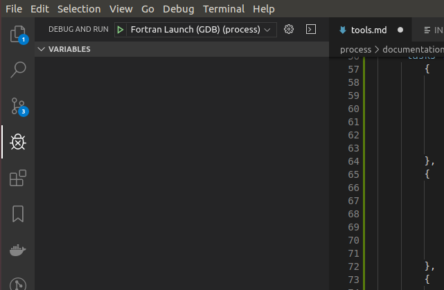

# Tools

## FORTRAN Debugging in VS Code

It is possible to debug FORTRAN in VS Code, which is arguably more intuitive than with a 
command-line debugger. This make debugging FORTRAN much easier. To get set up:

1. Make sure you have the "fortran" extension in VS Code, for Fortran language support. You can 
   find it in the extensions tab, or install it directly by hitting `Ctrl + P` in VS Code to quick 
   open, then pasting `ext install Gimly81.fortran` and hitting enter.

2. Install the "Fortran Breakpoint Support" extension in VS Code. You can again find it in the 
   extensions tab, or install with `Ctrl + P` in VS Code then pasting 
   `ext install ekibun.fortranbreaker` and hitting enter. Those should be the only two required extensions.

3. Then add a .vscode/launch.json file to the project, if you don't already have one. This can be 
   done by going to "Debug > Open Configurations" which will open the launch.json file, which you 
   can save within your project's root directory.

4. Add the following to the launch.json file:
   
    ```json
    {
        "version": "0.2.0",
        "configurations": [
            {
                "name": "Fortran Launch (GDB)",
                "type": "cppdbg",
                "request": "launch",
                "targetArchitecture": "x86",
                "program": "<path_to_process_root_dir>/bin/process.exe",
                // The entry point: what to run when you start debugging
                // Can also run the currently focussed file only, if not hardcoded
                "miDebuggerPath": "/usr/bin/gdb",
                "args": [],
                // Arguments to add to process.exe, e.g. the input file name
                "stopAtEntry": false,
                "cwd": "${workspaceRoot}",
                "externalConsole": false,
                // Run in the VS Code terminal
                "preLaunchTask": "run_cmake"
                // Compile afresh before debugging
            },
            {
                "name": "Intel Debug Attach",
                "type": "cppvsdbg",
                "request": "attach",
                "processId": "${command:pickProcess}"
            }
        ]
    }
    ```

5. Then you need to configure the "preLaunchTask"; the tasks that will be executed before launching 
   the debugger. In this case, this is the compilation of the FORTRAN source using cmake, so that 
   you're always debugging your latest changes. Open "Terminal > Configure Tasks..." and then 
   select "Open tasks.json file". Paste the following and save:
   
    ```json
    {
        "version": "2.0.0",
        "tasks": [
            {
                "label": "cmake1",
                "command": "cmake",
                "args": [
                    "-H.",
                    "-Bbuild",
                ],
            },
            {
                "label": "cmake2",
                "command": "cmake",
                "args": [
                    "--build",
                    "build"
                ]
            },
            {
                "label": "run_cmake",
                "dependsOn": [
                    "cmake1",
                    "cmake2"
                ]
            }
        ]
    }
    ```

6. Now open "Debug and Run" on the left-hand pane (`Ctrl + Shift + D`) and ensure that "Fortran 
   Launch (GDB)" is selected, as shown below:

    

    Now hit `F5` (or "Debug > Start debugging") to start debugging without setting any breakpoints; 
    this is just to check that everything runs. This will use the launch configuration "Fortran 
    Launch (GDB)" as defined in the launch.json file. This in turn calls the "preLaunchTask" 
    "run_cmake", defined in the tasks.json file, which runs the two cmake commands to compile 
    PROCESS. The gdb debugger is then attached, as defined in tasks.json, and process.exe is 
    executed. If everything goes to plan, PROCESS should build and a PROCESS run should begin in 
    your integrated terminal window in VS Code, and it should succeed.

7. Now you should be able to debug! Try opening a FORTRAN source file such as physics.f90 and 
   setting a breakpoint by clicking to the left of a line number. Then hit `F5`. Execution should 
   pause on your breakpoint, allowing you to inspect variables and step through code.

    Breakpoints can now be set anywhere in the FORTRAN source, and PROCESS can now be debugged easily 
    by hitting `F5`. They can be toggled on or off or made conditional, and the call stack pane can be 
    very useful for visualising the flow of execution.