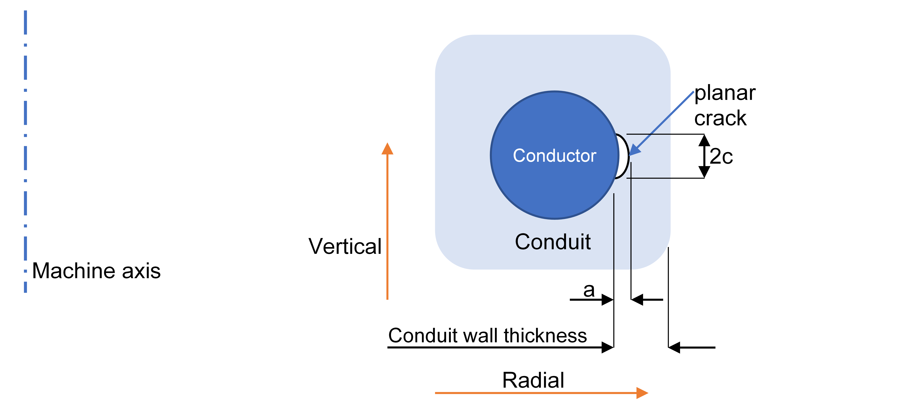

# Central Solenoid

The central solenoid (CS) is a PF coil used during start-up and during the burn phase to create and 
maintain the plasma current by electromagnetic induction. Swinging (changing) the current through 
the central solenoid causes a change in the flux linked to the plasma region, inducing a current in 
it. `PROCESS` calculates the amount of flux required to produce the plasma curren, and also the 
amount actually available. The code measures the magnetic flux in units of Volt.seconds (= Webers).

Switch `iohcl` controls whether a central solenoid is present. A value of 1 denotes that this coil 
is present, and should be assigned a non-zero thickness `dr_cs`. A value of `iohcl` = 0 denotes 
that no central solenoid is present, in which case the thickness `dr_cs` should be zero. No PF 
coils should be located at positions defined by `i_pf_location(j)` = 1 if no central solenoid is present.

The central solenoid can be either resistive or superconducting (controlled via switch `i_pf_conductor` as 
for the other PF coils), and if superconducting, switch `i_pf_superconductor` determines the superconducting 
material to use -  its value is used like `isumattf` and `i_pf_superconductor`. The copper fraction (by volume) 
of the superconducting strands is `fcuohsu`.

-----------

## CS Class | `CSCoil`

### CS Geoemetry | `calculate_cs_geometry()`

This method calculates the CS geometry parameters. The CS is assumed to be a perfect cylinder of uniform thickness.

1. The mean radius of the middle of the CS is given by:

    $$
    \overbrace{r_{\text{CS,middle}}}^{\texttt{r_cs_middle}} = dr_{\text{bore}} + \frac{dr_{\text{CS}}}{2}
    $$

2. The half height of the CS is set relative to that of the inside height of the TF and can be scaled by changing the input value of `f_z_cs_tf_internal`:

    $$
    \overbrace{z_{\text{CS,half}}}^{\texttt{z_cs_inside_half}} = \overbrace{z_{\text{TF,inside-half}}}^{\texttt{z_tf_inside_half}} \times \texttt{f_z_cs_tf_internal}
    $$

3. The full height of the CS is thus simply given by

    $$
    \overbrace{dz_{\text{CS}}}^{\texttt{dz_cs_full}} = z_{\text{CS,half}} \times 2
    $$

4. The outboard edge of the CS is given by:


    $$
    r_{\text{CS,outer}} = r_{\text{CS,middle}} + \frac{dr_{\text{CS}}}{2}
    $$

5. The full poloidal cross-sectional area is given by:

    $$
    \overbrace{A_{\text{CS,poloidal}}}^{\texttt{a_cs_poloidal}} = 2 \times dr_{\text{CS}} \times dz_{\text{CS}}
    $$


------------

### CS Current Filaments | `place_cs_filaments()`

----------

### General calculations | `ohcalc()`

-----------

### Self peak magnetic field | `calculate_cs_self_peak_magnetic_field()`

The general form for the field at the very centre of the central solenoid bore with uniform current density and rectangular cross-section is given by:

$$
B_0 = J_{\text{CS}}aF(\alpha,\beta)
$$

$$
F(\alpha,\beta) = \mu_0\beta \ln{\left[\frac{\alpha+\sqrt{\alpha^2+\beta^2}}{1+\sqrt{1+\beta^2}}\right]}
$$

where $\alpha = \frac{r_{\text{CS,outer}}}{r_{\text{CS,inner}}}$, is the ratio of the outer and inner radii of the solenoid and $\beta = \frac{z_{\text{CS,half}}}{r_{\text{CS,outer}}}$, is the ratio of the solenoid half height to its inboard radius.

The peak field at the bore of the central solenoid will not be the same as that felt by the conductors inside the structures. We require to know the peak field on the conductor if we are to design a superconducting central solenoid that has enough margin. Fits to data[^1] for different ranges of $\beta$ have been calulated as follows:

- $\beta > 3.0$

    $$
    B_{\text{conductor,peak}} = B_0 \times \left(\frac{3}{\beta}\right)^2 \times (1.007 + (\alpha -1.0)\times 0.005) \\
    +\left(1.0- \left(\frac{3}{\beta}\right)^2\right) \times  (J_{\text{CS}}dr_{\text{CS}})
    $$

- $\beta > 2.0$

    $$
    B_{\text{conductor,peak}} = B_0 \times \left(1.025-(\beta-2.0)\times 0.018\right) + (\alpha -1.0) \\
     \times (0.01-(\beta-2.0)\times 0.0045)
    $$


- $\beta > 1.0$

    $$
    B_{\text{conductor,peak}} = B_0 \times \left(1.117-(\beta-1.0)\times 0.092\right) + (\alpha -1.0) \\
     \times ((\beta-1.0)\times 0.01)
    $$


- $\beta > 0.75$

    $$
    B_{\text{conductor,peak}} = B_0 \times \left(1.3-0.732(\beta-0.75)\right) + (\alpha -1.0) \\
     \times 0.2((\beta-0.75)-0.05)
    $$

- $\beta \le 0.75$

    $$
    B_{\text{conductor,peak}} = B_0 \times \left(1.65-1.4(\beta-0.5)\right) + (\alpha -1.0) \\
     \times 0.6((\beta-0.5)-0.2)
    $$


-----------

### Axial stresses | `axial_stress()`


### Hoop stress | `hoop_stress()`


The hoop stress is calculated using equations 4.10 and 4.11 from "Superconducting magnets", Martin N. 
Wilson (1983).  This is divided by the fraction of the area occupied by steel to obtain the hoop 
stress in the steel, $\sigma_{hoop}$.

The axial stress can be calculated using "Case studies in superconducting magnets", Y. Iwasa, p. 
86, 3.5.2, Special Case 4: Midplane force.  This applies exactly only to a thin-walled solenoid. 
The axial stress in the steel is given by:

$$
\sigma_z = \frac{F_z}{f_z A_z}
$$

where $F_z$ is the axial force, $f_z$ is the fraction of the horizontal cross-section occupied by 
steel, and $A_z$ is the area of the horizontal cross-section.

The fraction of the horizontal cross-section occupied by steel is calculated assuming that the 
conductor is square and has a steel jacket with the same thickness on all four sides, giving:

$$
f_z = \frac{f_V}{2}.
$$

The radial stress is neglected. The hoop and axial stresses are combined to give the maximum shear 
stress, as required by the Tresca stress criterion:

$$
\sigma_{max shear} = max(|\sigma_{hoop} - \sigma_{z}| , |\sigma_z|, |\sigma_{hoop}|)
$$

However, the axial stress is only included if the switch `i_cs_stress` = 1.  The axial stress is 
set to zero if `i_cs_stress` = 0.  This option has no physical justification but can be used if 
there are reasons to be believe that the calculation above gives unrealistically large stresses.

## Fatigue

If the the reactor is assumed to be pulsed, the CS must be assessed against fatigue. 

A simple crack growth model based on Linear Elastic Fracture Mechanics is used to estimate the 
allowable hoop stress in the conduits. The model follows the method described in the ITER Magnet 
Structural Design Criteria, using the Paris law to model the growth of a planar elliptical crack 
across the thickness of a plate with the width and thickness of the conduit wall. The Paris law 
states that the crack growth rate follows a power law:

$$
\frac{da}{dN}=\rm{C}\Delta K^m
$$

where a is the size of the crack, N is the number of cycles, C and m are material constants, and 
$\Delta K$ is the stress intensity factor. The stress intensity factor is, in turn, a function of the crack 
geometry, the residual stress in the conduit, and the alternating tensile stress (i.e. hoop stress 
in the case of the CS coils).

!!! Info "Assumptions"
    1.  The initial defect is a planar half-elliptical surface crack, normal to the long axis of the conductor.  
    2.  Initial aspect ratio of ellipse (semi-major radius \(c) /semi-minor radius (a) = 3).  
    3.  Initial crack dimensions are input.  Defaults: a<sub>0</sub>=2, c<sub>0</sub>=6 mm.  
    4.  The coupled Paris equations for the crack dimensions are integrated using the "Life Cycle" 
        method, in which the crack dimension (either *a* or *c*) is the variable of integration.  
    6.  Only the hoop stress is taken into account.  
    7.  The stress is monotonic (since the hoop stress is always positive), and its minimum value 
        is the residual stress (input).  Default: 240 MPa.  
    8.  The mean stress is taken into account using the [Walker](https://en.wikipedia.org/wiki/Crack_growth_equation#Walker_equation) 
        modification of the Paris equation, with coefficient $\ejima_coeff$=0.436  
    9.  Failure occurs when the crack dimension a equals the conduit thickness, or dimension c reaches 
        the conductor width.  
    10. No safety factor is used for the number of cycles.  
    11. A safety factor of 2 is used for the crack size.   

<figure markdown>
{ width="100%"}
<figcaption>Figure 2: Sketch of CS conductor with a planar defect.</figcaption>
</figure>

An example output follows.  Note that in this example the cycle life is *not* sufficient.

```text
 Residual hoop stress in CS Steel (Pa)                                    (residual_sig_hoop)       2.400E+08     
 Minimum burn time (s)                                                    (t_burn_min)                  7.200E+03     
 Initial vertical crack size (m)                                          (t_crack_vertical)        8.900E-04     
 Initial radial crack size (m)                                            (t_crack_radial)          2.670E-03     
 CS turn area (m)                                                         (a_cs_turn)               1.904E-03     
 CS turn length (m)                                                       (dr_cs_turn)              7.557E-02     
 CS turn internal cable space radius (m)                                  (radius_cs_turn_cable_space)                6.732E-03     
 CS turn width (m)                                                        (dz_cs_turn)              2.519E-02     
 CS structural vertical thickness (m)                                     (dz_cs_turn_conduit)   5.863E-03     
 CS structural radial thickness (m)                                       (dr_cs_turn_conduit)     5.863E-03     
 Allowable number of cycles till CS fracture                              (n_cycle)                 7.529E+02  OP 
 Minimum number of cycles required till CS fracture                       (n_cycle_min)             2.000E+04  OP 
```

The parameters for the Paris law are hard-coded as follows, based on the properties of stainless steel 316LN from
Sarasola et al, IEEE Transactions on Applied Superconductivity, vol. 30, no. 4, pp. 1-5, (2020):

> C = 65e-14 m
> m = 3.5  

The model has some limitations:

1. Cycle life is just an output.  There is no constraint to ensure the cycle life is sufficient.
2. The model only includes hoop stress.

The required cycle life is set in different ways depending on the following switch.

If `bkt_life_csf` = 1 then `n_cycle_min` = `bktcycles`, which is calculated using the blanket life model.
If `bkt_life_csf` = 1 then `n_cycle_min` is an input.

## Pre-compression structure

The central solenoid model in PROCESS consists of a single coil.  In practice, however, a central 
solenoid usually consists of several coils, which can have opposite currents.  This leads to vertical 
forces that tend to separate the coils.  To prevent this, ITER has "tie-plates" which hold the coil 
segments together.  PROCESS has a corresponding structure, known as the pre-compression structure, 
made up of two cylinders, one on the inside and one on the outside, of the same thickness. The 
radii of the two cylinders are `dr_bore` and `dr_bore` + `dr_cs`.  The thickness is derived using the 
separation force and the combined cross-sectional area:

$$
p = \frac{F}{2 \pi f \sigma (2r+t) }
$$

where:
$p$ = `dr_cs_precomp`   CS coil precompression structure thickness (m)
$F$ = `fseppc`    Separation force
$f$ = `fcspc`     Fraction of space occupied by pre-compression structure
$\sigma$ = `sigallpc`   allowable stress in pre-compression structure (Pa)  

The central solenoid pre-compression structure is included in the model if and only if `i_cs_precomp` = 1.

## Current density inputs and limits

The absolute value of the central solenoid current density at the end-of-flat-top ('EOF'), `j_cs_flat_top_end`, 
is specified by the user, and can be used as an iteration variable (no. 37). The current density at 
the beginning-of-pulse ('BOP' - See Figure 1) is specified as a (positive) fraction of `j_cs_flat_top_end` 
using `f_j_cs_start_pulse_end_flat_top` (iteration variable no. 41). The current density in the CS at all other times is 
calculated by taking into account the flux swing necessary to initiate and maintain plasma current.

The current density in the central solenoid can be limited at BOP and at EOF. To limit the current 
density at BOP, constraint equation no. 27 is used with iteration variable no. 39 (`fjohc0`). To 
limit the current density at the EOF, constraint equation no. 26 should be turned on with iteration 
variable no. 38 (`fjohc`).

The critical current density *J*<sub>crit</sub> is a function of the temperature of the superconductor. 
The temperature margin $\Delta$*T* is the difference between the current sharing temperature and the 
operating temperature.  The current sharing temperature is the temperature at which *J*<sub>crit</sub> 
is equal to the operating current density *J*<sub>op</sub>. The minimum allowed $\Delta$*T* can be 
set using input parameter `tmargmin` together with constraint equation no. 60 and iteration variable 
no. 106 (`ftmargoh`).

It is recommended that EITHER the temperature margin constraint (60), OR the current density 
constraints (26 and 27) are activated.

!!! tip "Recommended maximum current ratio"
    For engineering feasibility, the centrepost currents at end of flat-top and beginning of pulse (`fjohc` and `fjohc0` respectively) shouldn't be set above 0.7.

!!! note "Central solenoid current over time"
    A plot of how the central solenoid current varies over time can be found [here](../physics-models/pulsed-plant.md#burn-time)


[^1]: M. N. Wilson, Superconducting Magnets. Oxford University Press, USA, 1983, ISBN 13: 9780198548102
‌