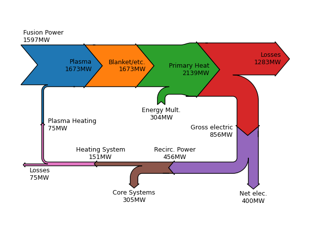

# Python Utilities

The PROCESS Python utilities are located in the repository folder

```
process
```
A number of utilities for `PROCESS` are available, for instance to modify the input file `IN.DAT`, or to extract and plot data from the `PROCESS` output.

The majority of utilities operate on `MFILE.DAT` files which are created by running `PROCESS` on an `IN.DAT` file.

All executables use Python library functions either from the publicly available `numpy`, `scipy` 
and `matplotlib` libraries or the `PROCESS` Python libraries. To use the `PROCESS` Python libraries, 
make sure their directory is in your Python path.

!!! Info "Python > 3"
    All Python code has been written for Python 3.


## Compare MFILEs

`process/io/mfile_comparison.py`

Tool for comparing two MFILEs and outputting significant differences in numerical values.

### Usage
```bash
python process/io/mfile_comparison.py [-f path/to/first_MFILE.DAT path/to/second_MFILE.DAT] [-s] [--acc] [--verbose]
```
### Options
| Argument     | Description                                   |
| ------------ | --------------------------------------------- |
| `-h, --help` | show help message and exit                    |
| `-f`         | Files to compare                              |
| `-s`         | Save output to file called comp.txt           |
| `--acc`      | Percentage difference threshold for reporting |
| `--verbose`  | Additional output                             |

### Output
Outputs variables and their values which differ significantly between the two MFILEs.

## CSV Exporter

```
process/io/mfile_to_csv.py
```

This script reads from a PROCESS MFILE and writes values into a CSV file. The variable list is given in a .json file which is defined by the user; a pre-made one can be found in `process/io/mfile_to_csv_vars.json`.

### Usage

```bash
python process/io/mfile_to_csv.py [-h] [-f path/to/MFILE] [-v path/to/variable_list.json]
```
### Options
| Argument         | Description                           |
| ---------------- | ------------------------------------- |
| `-h, --help`     | show help message and exit            |
| `-f, [filename]` | specify MFILE file path               |
| `-v, VARFILE`    | specify variable .json list file path |

### Output
A `.csv` file will be saved to the directory of the input file.


## PROCESS 14-Page PDF Summary

> `process/io/plot_proc.py`

A utility to produce a eleven-page PDF summary of the output from PROCESS, including the major parameters, poloidal and toroidal cross-sections, temperature and density profiles, TF coil layout and turn structure, density, bootstrap and L-H scaling comparisons, plasma and PF coil current over the pulse duration plot and first wall geometry and pumping plot.

### Usage

```bash
python process/io/plot_proc.py [-h] [-f path/to/MFILE.DAT] [-s] [-n N] [-d] [-c COLOUR]
```

If no `-f` argument is provided it assumes a file named `MFILE.DAT` is in the current directory.

### Options
| Argument               | Description                      |
| ---------------------- | -------------------------------- |
| `-h --help`            | Show help message and exit       |
| `-f FILENAME`          | Specify input/output file path   |
| `-s, --show`           | Show plot                        |
| `-n, N`                | Which scan number to plot        |
| `-d, --DEMO_ranges`    | Uses the DEMO dimensions as ranges for all graphics        |
| `-c, COLOUR`           | Which colour scheme to use for cross-section plots; 1: Original PROCESS (default), 2: BLUEMIRA        |

### Output
Produces a three-page PDF file in the same directory as the input MFILE. The PDF file name has the same prefix as the input MFILE but ending in `SUMMARY.pdf` 

### Parameters Displayed

`runtitle` - Variable describing the purpose of the run.

`PROCESS version` - Tagged version of the `PROCESS` used for the run.

`Date` - Date of the `PROCESS` run.

`Time` - Time of the `PROCESS` run.

`User` - Name of the user who ran `PROCESS`.

`Optimisation` - Figure of merit (`minmax`) for constrained optimisation.

`Plasma Composition` - Number densities of several ion species relative to the electron density.

`Coil Currents etc` - Peak coil currents of the PF coils in $\text{MA}$, flux swing of the central solenoid 
used for startup and total available in $\text{Wb}$. Total burn time `t_plant_pulse_burn` in hrs.

`Cost of electricity` - This is the cost of electricity in $ $/ \text{MWh}$. Check the respective cost model 
for the reference year of the inflation used.

| Geometry                                                   |
| :--------------------------------------------------------- |
| Major radius, $R_0$                                         |
| Minor radius, $a$                                           |
| Aspect ratio, $A$                                           |
| Elongation at the 95% flux surface, $\kappa_{95}$          |
| Plasma triangularity at the 95% flux surface, $\delta_{95}$|
| Plasma surface area                                        |
| Plasma volume                                              |
| Number of TF coils                                         |
| Inboard blanket + shield                                   |
| Outboard blanket + shield                                  |
| Total fusion power                                         |
| Plasma gain factor, $Q_{\text{p}}$                                             |

| Power flows                                                                                                 |
| :---------------------------------------------------------------------------------------------------------- |
| Nominal neutron wall load[^2]                     |
| Normalised radius of the 'core' region $\rho_{core}$ used in the radiation correction of the onfinement scaling[^3] [^4]               |
| The electron density at the pedestal top, $n_{\text{e,ped}}$                                               |
| The normalised radius $\rho=r/a$ at the pedestal top                                                        |
| The helium fraction relative to the electron density                                                        |
| The core radiation $P_{\text{rad}} (\rho<\rho_{\text{core}})$ subtracted from $P_{\text{heat}}$ in confinement scaling           |
|  The total radiation inside the separatrix (LCFS), $W_{\text{th}}$                                                         |
| Nuclear heating power to blanket $P_{\text{nuc,blkt}}= P_{\text{neutr}} \left(1-e^{-\frac{\Delta x_{\text{blkt}}}{\lambda_{\text{decay}}}}\right)$ |
| Nuclear heating power to the shield $P_{\text{nuc,shld}}=P_{\text{neutr}}-P_{\text{nuc,blkt}}$                                   |
| TF cryogenic power                                                                                   |
| Power to the divertor                                                                                   |
| Divertor lifetime in years                                                                                  |
| Primary high grade heat for electricity production, $P_{\text{therm}}$                                                      |
| Gross cycle efficiency, $P_{\text{e,gross}}/P_{\text{therm}}$                                                              |
| Net cycle efficiency, $\frac{P_{\text{e,gross}}-P_{\text{heat,pump}}}{P_{\text{therm}}-P_{\text{heat,pump}}}$                            |
| Net electric power, $P_{\text{e,net}}=P_{\text{e,gross}}-P_{\text{recirc}}$                                                       |
| Fusion-to-electric efficiency, $P_{\text{e,net}}/P_{\text{fus}}$                                                                        |

| Physics                                                                                                         |
| :-------------------------------------------------------------------------------------------------------------- |
| Plasma current, $I_{\text{P}}$                                                                                        |
| Vaccuum magnetic field at in the plasma centre, $B_{\text{T}}(R_0)$                                                       |
| Safety factor at the 95% flux surface, $q_{95}$                                                                 |
| Definitions of $\beta$ as given in [^1]                                                                         |
| Volume averaged electron temperature $\langle T_e\rangle$ and density $\langle n_e\rangle$                      |
| Fraction of the line averaged electron density over the Greenwald density, $\langle n_{\text{e,line}}\rangle / n_{\text{GW}}$  |
| Peaking of the electron temperature $T_{\text{e,0}}/\langle T_{\text{e}}\rangle$ and density $n_{\text{e,0}}/\langle n_{\text{e,vol}}\rangle$ |
| Plasma effective charge, $Z_{\text{eff}}=\sum_i f_iZ_i^2$                                                         |
| Impurity fraction, $f_Z=n_Z/\langle n_e\rangle$                                                                  |
| H-factor and confinement time calculated from a radiation corrected confinement scaling[^3] [^4].          |
| L-H threshold power, $P_{\text{LH}}$                                                                                |
| The confinement time scaling law used                            |

| Heating & Current Drive   |
| :------------------------------------------------------------------------------------------------------------------------------------------------------------------- |
| The steady state auxiliary power used for heating and current drive during the flat top phase (NOT to be confused with the start up or ramp down power requirements) |
| Part of the auxiliary power that is used for heating only, but not current drive                                                                                     |
| Current drive fractions for the bootstrap auxiliary and inductive current                                                                                           |
| The neutral beam current drive efficiency, $\gamma_{NB}$ (If NBI used)                                                                                                             |
| The neutral beam energy (If NBI used)                                                                                                                                             |
| The plasma heating used in the calculation of the confinement scaling / H-factor, $P_{\text{aux}} + P_\alpha - P_{\text{rad,core}}$                                                   |
|The normalised current drive efficiency|
| The divertor figures of merit, $\frac{P_{\text{sep}}}{R}$  &  $\frac{P_{\text{sep}}}{\langle n_e\rangle R}$                                                                                           |
| Fraction of the power crossing the separatrix with respect to the LH-threshold power $P_{\text{sep}}/P_{\text{LH}}$                                                                |
| Non-radiation corrected H-factor, $\text{H*}$ (Calculated for info only)                                                                                                          |

| TF and WP structure                                                                                                 |
| :---------------------------------------------------------------------------------------------------------- |
|Inboard TF nose case thickness|
|Inboard TF minimum distance between side case and WP|
|Radial width of inboard TF leg|
|Thickness of insualtion surrounding WP|
|Number of turns in WP|
|WP current density|
|Radial width of WP|
|Inter-turn insulation thickness|
|Turn steel conduit thickness|
|Turn cable space width and surface area|
|Turn cooling pipe diameter|

## Sankey Diagram

> `process/io/plot_sankey.py`

The power flows of the power plant will be extracted from MFILE.DAT and used to populate a
Sankey diagram. The diagram will start from the initial fusion power and show the inputs
and outputs for the power flows. The Recirculated power will finish by connecting the plasma
heating back into the fusion power.

### Usage

```
python process/io/plot_sankey.py [-h] [-e END] [-m path/to/MFILE.DAT]
```
If no `-m` argument is provided it assumes a file named `MFILE.DAT` is in the current directory.

### Options

| Argument     | Description                     |
| ------------ | ------------------------------- |
| `-h --help`  | show help message and exit      |
| `-e --end`   | file format, default = pdf      |
| `-m --mfile` | mfile name, default = MFILE.DAT |


### Output

A .pdf file is created called 'SankeyPowerFlow.pdf' in the directory the utility was run.
N.B. Rounding to whole integer can cause errors of $\pm$1 between adjacent arrows.

### Example Output

<figure markdown>

<figcaption>Figure 1: Sankey flow chart of power flows for the large tokamak scenario.</figcaption>
</figure>


## TF Stress distribution plots

> `process/io/plot_stress_tf.py`

Program to plot stress, strain and displacement radial distributions at the inboard mid-plane section of the TF coil.
This program uses the `SIG_TF.json` file created by running `PROCESS`, that stores stress distributions of the VMCON point and stores the output
plots in the `SIG_TF_plots/` folder, created if not existing.

### Discussion of the stress modelling assumptions

In case of a resisitive coil, the stress is calculated from a generalized plane strain model, hence providing vertical
stress radial distribution, alongside the radial and the toroidal ones. This is not the case for superconducting magnets
as a plane stress modelling is used for now. The reason is that a transverse orthotropic formulation of the generalized 
plane strain is needed to correctly take the difference of the casing in the vertical direction properly. This will be
done in the near future. 

### Usage

```bash
python process/io/plot_stress_tf.py [-h] [-f path/to/SIG_TF.json] [-p [PLOT_SELEC]] [-sf [SAVE_FORMAT]] [-as [AXIS_FONT_SIZE]]
```

### Option

| Argument                                 | Description                                                                |
| ---------------------------------------- | -------------------------------------------------------------------------- |
| `-h, --help`                             | show help message and exit                                                 |
| `-f, --input-file`                       | `SIG_TF.json` input file                                                   |
| `-p, --plot_selec [PLOT_SELEC]`          | Plot selection string :                                                    |
| -                                        | - if the string contains `sig`, plot the stress distributions              |
| -                                        | - if the string contains `strain`, plot the strain distributions           |
| -                                        | - if the string contains `disp`, plot the radial displacement distribution |
| -                                        | - if the string contains `all`, plot stress and displacement distributions |
| `-sf, --save_format [SAVE_FORMAT]`       | output format (default='pdf')                                              |
| `-as, --axis_font_size [AXIS_FONT_SIZE]` | Axis label font size selection (default=18)                                |


## Turn output into input

`process/io/write_new_in_dat.py`

This program creates a new `IN.DAT` file with the initial values of all the iteration variables 
replaced by their results in `OUT.DAT`, if that output is a feasible solution.

When a scan has been run, by default this program uses the last feasible point in that scan to write 
the new starting values. There is also an option to select the first feasible solution from a scan.

**Input**: `IN.DAT`, `MFILE.DAT`

**Output**: `new_IN.DAT`

### Usage
```
python process/io/write_new_in_dat.py [-h] [-f path/to/MFILE.DAT] [-i path/to/IN.DAT] [-o path/to/new_IN.DAT]
```

### Options

| Argument     | Description                                       |
| ------------ | ------------------------------------------------- |
| `-h, --help` | show help message and exit                        |
| `-f`         | file to read as MFILE.DAT                         |
| `-i`         | file to read as IN.DAT                            |
| `-o`         | file to write as new IN.DAT                       |
| `-lfp`       | use the last feasible point from a scan (default) |
| `-ffp`       | use the first feasible point from a scan          |


## Plot scan results

`process/io/plot_scans.py`

This utility plots the output of a PROCESS scan. PROCESS must be run on a scan-enabled input file to create an MFILE on which `plot_scans.py` can be run. More than one input file can be used and the different files will be plotted on the same graph.

**Input**: `MFILE.DAT`

**Output** `scan_var1_vs_var2.pdf` (var1 by default is `b_tf_inboard_peak_symmetric`, var2 specified by user)

### Usage

```
python process/io/plot_scans.py [-h] [-f path/to/MFILE(s)] [-yv output vars] [-yv2 2nd axis output variable] [-o [path/to/directory]] [-out] [-sf [SAVE_FORMAT]] [-as [AXIS_FONT_SIZE]] [-ln LABEL_NAME] [-2DC] [-stc]
```

### Options

| Argument     | Description                                                                                                                                         |
| ------------ | --------------------------------------------------------------------------------------------------------------------------------------------------- |
| `-h, --help` | show help message and exit                                                                                                                          |
| `-f, --input_files`         | Specify input file(s) path(s) (default = MFILE.DAT).More than one input file can be used eg: -f 'A_MFILE.DAT B_MFILE.DAT'. You can only specify the folder containing the MFILE. The different files scan will be plotted on the same graph. The scans must use the same scan variation.                                                                                                                       |
| `-yv, --y_vars`        | Select the output variables. More than one output can be plotted eg: -yv 'var1 var2'. A separate plot will be created for each inputs variables                                                                                                                         |
| `-yv2, --y_vars2`       | Select the 2nd axis output variable eg: -yv2 'var'. 2nd variable will be plotted on shared figure inputsvariable.                                                                                                                 |
| `-o, --outputdir`         | Output directory for plots, defaults to current working directory.                                                                                  |
| `-out, --term_output`         | Option to show scans values on terminal directory.                                                                                  |
| `-sf, --save_format`        | Output format (default='pdf')                                                                                                                    |
| `-as, --axis_font_size`        | Axis label font size selection (default=18)                                                                                                         |
| `-ln, --label_name`        | Label names for plot legend. If multiple input files used then list the same number of label names eg: -nl 'leg1 leg2', (default = MFile file name) |
| `-2DC, --two_dimensional_contour`        | Option to plot 2D scans as a coloured contour plot instead of a line plot. Note: Non convergent points will show up with a value of zero Note: The scan paramters must both be in increasing orderl |
| `-stc, --stack_plots`        | Option to plot multiple 1D plots in a column of subplots. Variables will be plotted in order of input |


## Plot a pie chart of the cost breakdown

`process/io/costs_pie.py`

This utility plots the cost breakdown as a pie chart giving each component as a percentage. This allows for the most expensive areas to be easily identified. For the 1990 cost model, an additional plot showing how direct, indirect and contingency costs contribute to the overall budget is shown.

**Input**: `MFILE.DAT`

**Output**: Displays plot of the cost breakdown to screen. For the 1990 cost model, the breakdown for direct, indirect and contingency are also shown. These can be saved with `-s` argument (`cost_pie.pdf` and `direct_cost_pie.pdf`).

### Usage
```
python process/io/costs_pie.py [-h] [-f path/to/MFILE] [-s]
```
If no `-f` argument is provided it assumes a file named `MFILE.DAT` is in the current directory.

### Options

| Argument     | Description                |
| ------------ | -------------------------- |
| `-h, --help` | show help message and exit |
| `-f MFILE`   | specify the MFILE          |
| `-s, --save` | save figure                |


## Plot a bar chart of the cost breakdown

`process/io/costs_bar.py`

This utility plots the cost breakdown as a bar chart giving the cost of each component. This allows for the most expensive areas to be easily identified. For the 1990 cost model, an additional plot showing how the direct, indirect and contingency costs contribute to the overall budget is shown. Multiple MFILEs can be specified allowing for different PROCESS runs to be compared on the same plot. An inflation factor can be specified using the `-inf` argument, which multiplies all the costs by that value.

**Input**: `MFILE.DAT`

**Output**: Displays plot of the cost breakdown to screen. For the 1990 cost model, the breakdown for direct, indirect and contingency is also shown. These can be saved with `-s` argument (`cost_bar.pdf` and `direct_cost_bar.pdf`).

### Usage
```
python process/io/costs_bar.py [-h] [-f f [f ...]] [-s] [-inf INF]
```

### Options

| Argument     | Description                         |
| ------------ | ----------------------------------- |
| `-h, --help` | show help message and exit          |
| `-f MFILE`   | specify the MFILE(s) to plot        |
| `-s, --save` | save figure                         |
| `-inf INF`   | Inflation Factor (multiplies costs) |


## References

[^1]: M. Kovari, R. Kemp, H. Lux, P. Knight, J. Morris, D. J. Ward *"PROCESS: a systems code for fusion power plants - Part 1: Physics"*, Fusion Engineering and Design 89, 30543069 (2014), http://dx.doi.org/10.1016/j.fusengdes.2014.09.018
[^2]: M. Kovari, F. Fox, C. Harrington, R. Kembleton, P. Knight, H. Lux, J. Morris *"PROCESS: a systems code for fusion power plants - Part 2: Engineering"*, Fus. Eng. & Des. 104, 9-20 (2016)
[^3]: H. Lux, R. Kemp, D.J. Ward, M. Sertoli *"Impurity radiation in DEMO systems modelling"*, Fus. Eng. & Des. 101, 42-51 (2015)
[^4]: H. Lux, R. Kemp, E. Fable, R. Wenninger, *"Radiation and confinement in 0D fusion systems codes"*, PPCF, 58, 7, 075001 (2016)
[^5]: H. Lux, R. Kemp, R. Wenninger, W. Biel, G. Federici, W. Morris, H. Zohm, "Uncertainties in power plant design point evaluations", Fusion Engineering and Design, Vol 123, 63-66, 2017
