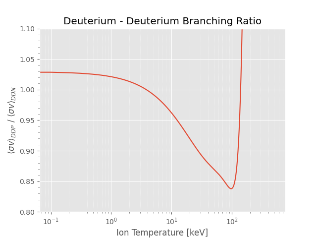

# Fusion Reactions

## Overview

The most likely fusion reaction to be utilised in a power plant is the
deuterium-tritium reaction:

$$
\mathrm{D + T} \Longrightarrow \mathrm{^{4}He + n + 17.6 \,MeV}
$$

Roughly 20% of the energy produced is given to the alpha particles (\(^4\)He). The remaining 80% is carried
away by the neutrons, which deposit their energy within the blanket and shield and other reactor components.
The fraction of the alpha energy deposited in the plasma is [`f_p_alpha_plasma_deposited`](#coupled-alpha-particle-power).

PROCESS can also model D-\(^3\)He power plants, which utilise the following
primary fusion reaction:

$$
\mathrm{D + \text{$^3$He}} \Longrightarrow \mathrm{^{4}He + p + 18.3 \,MeV}
$$

The fusion reaction rate is significantly different to that for D-T fusion,
and the power flow from the plasma is modified since charged particles are
produced rather than neutrons. Because only charged particles (which remain in
the plasma) are produced by this reaction, the whole of the fusion power is
used to heat the plasma. Useful energy is extracted from the plasma since the
radiation power produced is very high, and this, in theory, can be converted to
electricity without using a thermal cycle.

Since the temperature required to ignite the D-\(^3\)He reaction is considerably
higher than that for D-T, it is necessary to take into account the following
D-D reactions, which have significant reaction rates at such temperatures:

$$\begin{aligned}
\mathrm{D + D}  & \Longrightarrow \mathrm{^{3}He + n + 3.27 \,MeV} \\
\mathrm{D + D}  & \Longrightarrow \mathrm{T + p + 4.03 \,MeV}
\end{aligned}$$

Also, as tritium is produced by the latter reaction, D-T fusion also occurs.
As a result, there is still a small amount of neutron power
extracted from the plasma.

Pure D-\(^3\)He tokamak power plants do not include breeding blankets, because
no tritium needs to be produced for fuel.

The contributions from all four of the above fusion reactions are included in
the total fusion power production calculation. The fusion reaction rates are
calculated using the parameterizations in [^1], integrated over the plasma
profiles

-------------------------

## Setting of plasma fuel composition

The fractional composition of the 'fuel' ions ($\text{D}$, $\text{T}$ and $^3\text{He}$) is
controlled using the three variables `f_plasma_fuel_deuterium`, `f_plasma_fuel_tritium` and `f_plasma_fuel_helium3`, respectively.
More information about setting seeded impurities and simulating first wall sputtering can be found in the [composition and impurities section](../plasma_composition.md).

It is also possible to optimise on the deuterium-tritium fuel mixture ratio. For this, `f_plasma_fuel_tritium` **must** be set as an iteration variable with `ixc = 173`. More info can be found [here](#fuel-ions-mixture-self-consistency).

!!! note "Reactions not calculated"

    `PROCESS` at the moment does not do calculations for the core reactions of $\text{T-T}$,  $\text{T-}^3\text{He}$,  $^3$$\text{He}$ $-^3$$\text{He}$ and $\text{p}$ -$^{11}$$\text{B}$.

    Fusion reactions involving fusion products such as $\text{n}$, $\text{p}$ and $\alpha$ are also not calculated.

-------------------------

## Fusion Reaction Class | `FusionReactionRate`

### Initialization | `__init__()`

Initialize the FusionReactionRate class with the given plasma profile.

#### Parameters:
- `plasma_profile (PlasmaProfile)`: The parameterized temperature and density profiles of the plasma. Taken from the plasma_profile object.

#### Attributes:
- `plasma_profile (PlasmaProfile)`: The parameterized temperature and density profiles of the plasma.
- `sigmav_dt_average (float)`: Average fusion reaction rate $\langle \sigma v \rangle$ for D-T.
- `dhe3_power_density (float)`: Fusion power density produced by the D-3He reaction.
- `dd_power_density (float)`: Fusion power density produced by the D-D reactions.
- `dt_power_density (float)`: Fusion power density produced by the D-T reaction.
- `alpha_power_density (float)`: Power density of alpha particles produced.
- `pden_non_alpha_charged_mw (float)`: Power density of charged particles produced.
- `neutron_power_density (float)`: Power density of neutrons produced.
- `fusion_rate_density (float)`: Fusion reaction rate density.
- `alpha_rate_density (float)`: Alpha particle production rate density.
- `proton_rate_density (float)`: Proton production rate density.
- `f_dd_branching_trit (float)`: The rate of tritium producing D-D reactions to 3He ones.

All variables above are initialized to be 0.0.

---------------------

### Deuterium Branching fraction | `deuterium_branching()`

Calculates the relative rate of tritium producing D-D reactions to 3He ones based on the volume averaged ion temperature[^1].
Valid for ion temperatures between 0.5 keV and 200 keV.
The deviation of the fit from the R-matrix branching ratio is always smaller than 0.5%.

$$
 = 1.02934 - 8.3264\times 10^{-3}\langle T_{\text{i}} \rangle + 1.7631\times 10^{-4}\langle T_{\text{i}} \rangle^2 \\
-1.8201\times 10^{-6}\langle T_{\text{i}} \rangle^3 + 6.9855\times 10^{-9}\langle T_{\text{i}} \rangle^4
$$

<figure markdown>
{ width = "100"}
<figcaption>Figure 1: Ratio of the neutron producing to proton producing D-D reaction branches based on the ion temperature .</figcaption>
</figure>

#### Attributes updated
The method updates the following attributes:

- `self.f_dd_branching_trit`: The rate of tritium producing D-D reactions to 3He ones

-----------------------

### Calculate fusion reactions

There are 4 key functions for calculating the fusion reaction for the plasma. They are `dt_reaction()`, `dhe3_reaction()`, `dd_helion_reaction()` and `dd_triton_reaction()`. They all perform the same key calculations below but with their own specific values for their reactions.

#### Detailed Steps
1. **Initialize Bosch-Hale Constants**: Initializes the Bosch-Hale constants for the required reaction using predefined reaction constants stored in the BoschHaleConstants dataclass.
2. **Calculate Fusion Reaction Rate**: Uses Simpson's rule to integrate the fusion reaction rate over the plasma profile.
3. **Calculate Fusion Power Density**: Compute the fusion power density produced by the given reaction. Using the reaction energy calculated and stored in `constants.f90`. The reactant density is given by $\mathtt{f\_deuterium, f\_tritium}$ or $\mathtt{f\_helium3}$ multiplied by the volume averaged ion density. For the D-D reactions the fusion reaction rate is scaled with the output of [`deuterium_branching()`](#deuterium-branching-fraction--deuterium_branching) to simulate the different branching ratios.
4. **Calculate Specific Fusion Power Densities**: Compute the fusion power density for alpha particles, neutrons and other charged particles, depending on the reaction. Energy branching fractions used are calculated and called from `constants.f90`.
5. **Calculate Fusion Rate Densities**: Compute the total fusion rate density and fusion rates just for the alpha particles, neutrons and other charged particles, depending on the reaction.
6. **Update Reaction Power Density**: Updates the object attribute for the specific reaction power density.
7. **Sum Fusion Rates**: Call the [`sum_fusion_rates()`](#sum-the-fusion-rates--sum_fusion_rates) function to add the reaction to the global plasma power balance.

#### Attributes Updated
The method updates the following attributes:

- `self.sigmav_dt_average`: Average fusion reaction rate `<sigma v>` for D-T.
- `self.dt_power_density`: Fusion power density produced by the D-T reaction.
- `self.alpha_power_density`: Power density of alpha particles produced.
- `self.pden_non_alpha_charged_mw`: Power density of charged particles produced.
- `self.neutron_power_density`: Power density of neutrons produced.
- `self.fusion_rate_density`: Fusion reaction rate density.
- `self.alpha_rate_density`: Alpha particle production rate density.
- `self.proton_rate_density`: Proton production rate density.

-----------------------

### Sum the fusion rates | `sum_fusion_rates()`

This method updates the cumulative class fusion power densities and reaction rates for alpha particles, charged particles, neutrons, and protons.

#### Parameters:
- `alpha_power_add` (float): Alpha particle fusion power per unit volume [MW/m³].
- `charged_power_add` (float): Other charged particle fusion power per unit volume [MW/m³].
- `neutron_power_add` (float): Neutron fusion power per unit volume [MW/m³].
- `fusion_rate_add` (float): Fusion reaction rate per unit volume [reactions/m³/s].
- `alpha_rate_add` (float): Alpha particle production rate per unit volume [/m³/s].
- `proton_rate_add` (float): Proton production rate per unit volume [/m³/s].

The above input values are added to the current object values for their respective power density.

-----------------------

### Calculate fusion rates | `calculate_fusion_rates()`

This runner function is called to run all 4 fusion reaction calculation functions.

This method sequentially calculates the fusion reaction rates and power densities for the following reactions:
- Deuterium-Tritium (D-T)
- Deuterium-Helium-3 (D-3He)
- Deuterium-Deuterium (D-D) first branch
- Deuterium-Deuterium (D-D) second branch

It updates the instance attributes for the cumulative power densities and reaction rates for alpha particles, charged particles, neutrons, and protons.

-----------------------

### Set global physics variables | `set_physics_variables()`

This method sets the required physics variables in the `physics_variables` and `physics_module` modules. It updates the global physics variables and module variables with the current instance's fusion power densities and reaction rates.

#### Updates:
- `physics_variables.pden_plasma_alpha_mw`: Updated with `self.alpha_power_density`
- `physics_variables.pden_non_alpha_charged_mw`: Updated with `self.pden_non_alpha_charged_mw`
- `physics_variables.pden_plasma_neutron_mw`: Updated with `self.neutron_power_density`
- `physics_variables.fusden_plasma`: Updated with `self.fusion_rate_density`
- `physics_variables.fusden_plasma_alpha`: Updated with `self.alpha_rate_density`
- `physics_variables.proton_rate_density`: Updated with `self.proton_rate_density`
- `physics_module.sigmav_dt_average`: Updated with `self.sigmav_dt_average`
- `physics_module.dt_power_density_plasma`: Updated with `self.dt_power_density`
- `physics_module.dhe3_power_density`: Updated with `self.dhe3_power_density`
- `physics_module.dd_power_density`: Updated with `self.dd_power_density`
- `physics_functions.f_dd_branching_trit`: Updated with `self.f_dd_branching_trit`

-----------------------

## Coupled alpha particle power

!!! quote "ITER Physics Expert Group on Energetic Particles, Heating and Current Drive"

    *"Present day experiments (1999) show that in a quiescent plasma the diffusion rate of the fast particles is close to the neoclassical level. Even if one considers the case when anomalous diffusion by the fast alpha particles is at a rate nearly the same as that predicted by empirical scaling for the particles in the main plasma, estimates show that the energy loss fraction will be less than the ITER design specification of 5%.[^2]"*

The fraction of alpha particle power produced by the plasma that gets coupled to the plasma for internal heating can be set in `PROCESS` with the `f_p_alpha_plasma_deposited` input variable. By default it is set to 95% or 0.95 as is the assumed ITER default.[^2]

-----------------------------

## Key Constraints

### Global plasma power balance

This constraint can be activated by stating `icc = 2` in the input file.

**It is highly recommended to always have this constraint on as it is a global power balance checker**

This model ensures that the sum of the ion and electron power densities plus the radiation density is equal to the sum of the coupled alpha power density, charged particle power density, ohmic heating power density and injected heating power density.

If the plasma is classed as ignited then the injected heating power density is not considered.

-------------------------------

### Fusion Power Upper limit

This constraint can be activated by stating `icc = 9` in the input file.

The value of `p_fusion_total_max_mw` can be set to the desired maximum fusion power.

---------------------------------

### Q value lower limit

This constraint can be activated by stating `icc = 28` in the input file.

The value of `big_q_plasma_min` can be set to the minimum desired $Q_{\text{plasma}}$ value.

-------------------------

### Fuel ions mixture self-consistency

This constraint can be activated by stating `icc = 92` in the input file.

This constraint should be activated if the user wishes to allow the ratio of the fuel ions to be iterated upon. For this, `f_plasma_fuel_tritium` has to be set as an iteration variable with `ixc = 173`. This constraint ensure that the summation of the fuel fractions always sums to 1.0 and will modify the other compositions depending on the value of `f_plasma_fuel_tritium`.

[^1]: H.-S. Bosch and G. M. Hale, “Improved formulas for fusion cross-sections and thermal reactivities,” Nuclear Fusion, vol. 32, no. 4, pp. 611–631, Apr. 1992, doi: https://doi.org/10.1088/0029-5515/32/4/i07.
[^2]: I. P. E. G. on E. Drive and I. P. B. Editors, “Chapter 5: Physics of energetic ions,” Nuclear Fusion, vol. 39, no. 12, pp. 2471–2495, Dec. 1999, doi: https://doi.org/10.1088/0029-5515/39/12/305.
