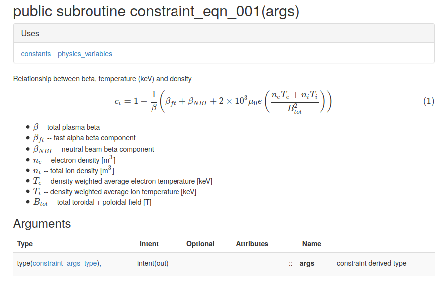

# Style Guide

`PROCESS` follows the Python [PEP8](https://peps.python.org/pep-0008/) style guide for its layout and namespace style. This should not conflict with Fortran90 in terms of names but may with the line lengths.

--------------------

## Line Length

For optimal readability, a limit of 79 characters for maximum line length has been encouraged, as recommended in [PEP8](https://peps.python.org/pep-0008/). This is below the maximum line length of 132 characters for Fortran (to prevent compilation errors) and prevents long lines that run on past the edge of the screen wasting programmers time with scrolling.

--------------------

## Double declarations

PROCESS uses the Fortran 2008+ intrinsic precision module as shown in the example below. The
use statement will need to be at the module level. See the 
[fortran wiki](http://fortranwiki.org/fortran/show/Real+precision) for more information.

```fortran
use, intrinsic :: iso_fortran_env, only: dp=>real64

real(dp) :: b
!! Variable description

```

all new models should have their own function

--------------------

## Naming conventions

!!! quote "The Zen of Python"

    *“Explicit is better than implicit.”*

    *"Readability counts."*

### Functions

Use a lowercase word or words. Separate words by underscores(`_`) to improve readability.

### Switches

Switches should start with the `i_` prefix in their name, be of integer type and should be indexed from 0.

### Constants

Use an uppercase single letter, word, or words. Separate words with underscores to improve readability.

Refrain from declaring or typing known numerical constants directly in the code. Instead call the value from `constants.f90`
If the constants doesn't exist then add it with a source link and uncertainty value.

### Variables

Use a lowercase single letter, word, or words. Separate words with underscores to improve readability.
If converting between units it may be required to have some capital letters at the end of the variable name to differentiate between different orders of magnitude, `m` and `M` etc.

#### Variables representing fractions

If a variable is intended to demonstrate a fraction of a value or distribution etc. Then it should start with the `f_` prefix.

#### F-values

Variables used within constraint equations to scale iteration variables (f-values) should start with the `f` prefix without an underscore before the next word.

### Length

Try to keep names to a sensible length while also keeping the name explicit and descriptive.

### Physical Type

The physical type of the variable should form the first part of the variable name, e.g. for plasma resistance the variable should be named:

```fortran
res_plasma = 1.0
```

Another example would be pulse length

```fortran
time_pulse_length = 7200.0
```

------------------

### Units

Inside PROCESS all variables should be in SI units unless otherwise stated. For example:

```fortran
! Fusion power [W]
fusion_power = 1000.0d6

! Fusion power [MW]
fusion_power_MW = 1000.0d0
```

### Coordinates and dimensions

Coordinates should be defined as

```fortran
r_plasma_centre = 9.0d0

z_plasma_centre = 0.0d0

theta_ = 
```

For dimensions

```fortran
dr_cs = 

dz_cs = 

dtheta_description =
```

### Loop order

Loop variables that use I, j etc. should use

```fortran
ii
    jj
        kk
            mm
```

### Examples

| Variable name | Description | Units |
| ------------- | ----------- | :---: |
| `plasma_current`    | Plasma current | A |
| `plasma_current_MA` | Plasma current | MA |
| `b_t_onaxis`  | Toroidal field on-axis | T |
| `b_t_max`     | Max toroidal field | T |
| `n_electron_vol` | Volume average electron density | m-3 |
| `t_electron_vol_ev` | Volume avgerage electron temperature | eV |
| `mass_steel` | Mass of steel | kg |
| `mass_steel_tonne` | Mass of steel | tonne |
| `e_neutron_ev` | Energy of neutron | eV |
| `e_neutron_MeV` | Energy of neutron | MeV |
| `v_tf_dump` | TF dump voltage | V |
| `time_plant_life` | Plant lifetime | s |
| `time_plant_life_yrs` | Plant lifetime | years |
| `dr_tf_inboard_leg` | TF coil inboard leg radial thickness | m |
| `dr_blanket_inboard` | Inboard blanket thickness | m |
| `velocity_coolant` | TF centrepost coolant velocity | m/s |
| `plasma_volume` | Plasma volume | m3 |
| `plasma_area` | Plasma area | m2 |
| `angle_div_target` | Divertor target angle | radians |
| `angle_div_target_deg` | Divertor target angle | deg |
| `sig_tf_r` | TF radial stress  | Pa |
| `` |  |  |

Please see issue [#940](https://github.com/ukaea/PROCESS/issues/940) to discuss new conventions.

## Type-Hints

It is greatly encouraged and recommended to include type hints for all inputs and outputs in Python. Please follow the guidelines set out in [PEP-484](https://peps.python.org/pep-0484/).

## Docstrings

The docstring style is that of the [Sphinx type](https://www.sphinx-doc.org/en/master/index.html). Though there are some additions for `Notes` and `References` in order to give mathematical reasoning and sources to some functions.

### Functions

If writing in new Python functions please use the docstring template below.

```python
def function_name(param1, param2):
    """
    Brief description of what the function does.

    Detailed description of the function. This can include information about the algorithm,
    any important notes, and other relevant details.

    :param type param1: Description of the first parameter.
    :param type param2: Description of the second parameter.
    :returns: Description of the return value.
    :rtype: return_type
    :raises ExceptionType: Description of the exception raised (if any).

    :notes:
        - Additional notes about the function.
        - Any important considerations or caveats.

    :references:
        - Reference 1: Description of the reference.
        - Reference 2: Description of the reference.
    """
```

### Classes

If writing in new Python classes please use the docstring template below.

```python
class ExampleClass:
    """
    Brief description of the class.

    Detailed description of the class. This can include information about the purpose
    of the class, how it should be used, and any other relevant details.

    Attributes:
        attribute1 (type): Description of attribute1.
        attribute2 (type): Description of attribute2.
        attribute3 (type): Description of attribute3.

    Methods:
        method1(param1, param2): Description of method1.
        method2(param1, param2): Description of method2.
    """

    def __init__(self, attribute1, attribute2, attribute3):
        """
        Initializes the ExampleClass with the given attributes.

        :param type attribute1: Description of attribute1.
        :param type attribute2: Description of attribute2.
        :param type attribute3: Description of attribute3.
        """
        self.attribute1 = attribute1
        self.attribute2 = attribute2
        self.attribute3 = attribute3
```

## Comments

- **Comments that contradict the code are worse than no comments**

- Comments should be complete sentences. The first word should be capitalized, unless it is an identifier that begins with a lower case letter.

- Use inline comments sparingly.

- Comments above apply to code below.


## Code Documentation Using FORD

PROCESS uses FORD (FORtran Documentation) to automatically generate documentation from comments 
in the FORTRAN code. FORD parses FORTRAN source to understand the structure of the project as well 
as picking up "docmarked" comments in the source to create the documentation.

Regular Fortran comments are prefixed with a "!"; these are ignored by FORD and don't go into 
the documentation. FORD comments are prefixed by a "!!", called a docmark; these are picked up 
by FORD and go into the documentation.

The "!!" docmark goes after the statement it documents. For example, to document variables:

```fortran
real(kind(1.0D0)) :: alphan = 0.25D0
!! Density profile index

real(kind(1.0D0)) :: alphap = 0.0D0
!! Pressure profile index

real(kind(1.0D0)) :: alpharate = 0.0D0
!! Alpha particle production rate (particles/m3/sec)
```

...and to document modules:
```fortran
module global_variables
  !! Module containing miscellaneous global variables
  !! This module contains miscellaneous global variables not
  !! well-suited to any of the other 'variables' modules.
```

This documentation will appear in the 
[FORD docs](http://process.gitpages.ccfe.ac.uk/process/ford_site/index.html) section in the 
left-hand navigation bar. Within this site, the "Variables" section in the top navigation bar 
provides variable descriptions in the same manner as the original "vardes" page. 

To document a statement before it occurs in the source, use "!>". However, it is encouraged to 
use "!!" for consistency. The rationale behind this and further information is included on the 
[FORD wiki](https://github.com/Fortran-FOSS-Programmers/ford/wiki/Writing-Documentation).

The FORD project on github can be found [here](https://github.com/Fortran-FOSS-Programmers/ford).

### Example of FORD documentation for a subroutine (constraint equation)

```fortran

subroutine constraint_eqn_001(args)
  !! author: J Morris
  !! category: equality constraint
  !!
  !! Relationship between beta, temperature (keV) and density
  !!
  !! \begin{equation} 
  !! c_i = 1 - \frac{1}{\beta}\left( \beta_{ft} + \beta_{NBI} + 2 \times 10^3 \mu_0 e
  !! \left( \frac{n_e T_e + n_i T_i}{B_{tot}^2} \right) \right)
  !! \end{equation}
  !!
  !! - \( \beta \) -- total plasma beta
  !! - \( \beta_{ft} \) -- fast alpha beta component
  !! - \( \beta_{NBI} \) -- neutral beam beta component
  !! - \( n_e \) -- electron density [m\(^3\)]
  !! - \( n_i \) -- total ion density [m\(^3\)]
  !! - \( T_e \) -- density weighted average electron temperature [keV]
  !! - \( T_i \) -- density weighted average ion temperature [keV]
  !! - \( B_{tot} \) -- total toroidal + poloidal field [T]

  use physics_variables, only: betaft, betanb, dene, ten, dnitot, tin, btot, beta
  use constants, only: echarge,rmu0

  implicit none

  type(constraint_args_type), intent(out) :: args
  !! constraint derived type

    args%cc = 1.0D0 - (betaft + betanb + &
      2.0D3*rmu0*echarge * (dene*ten + dnitot*tin)/btot**2 )/beta
    args%con = beta * (1.0D0 - args%cc)
    args%err = beta * args%cc
    args%symbol = '='
    args%units  = ''

end subroutine constraint_eqn_001

```

Creates:


