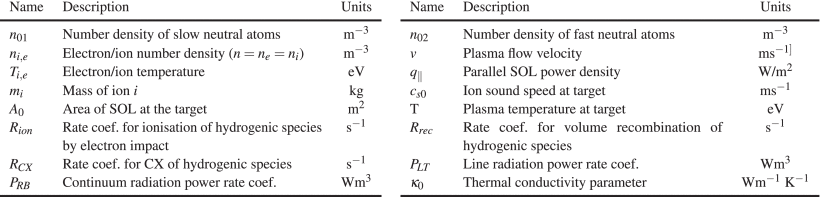

# Divertor

The divertor provides a means of removing plasma reaching the scrape-off layer. 
The principal outputs from the code are the divertor heat load, used to 
determine its lifetime, and its peak temperature. The divertor is cooled either 
by gaseous helium or by pressurised water.

Switch `snull` controls the overall plasma configuration. Setting `snull = 0` 
corresponds to an up-down symmetric, double null configuration, while 
`snull = 1` (the default) assumes a single null plasma with the divertor at the 
bottom of the machine. The vertical build and PF coil current scaling 
algorithms take the value of this switch into account, although not the plasma 
geometry at present.

The Harrison-Kukushkin-Hotston divertor model[^1] developed for ITER is available, but is unlikely to be relevant for a reactor.

The divertor heat flux `hldiv` can be calculated or it can be input by the user. Options are selected using the switch `i_hldiv`:

| `i_hldiv` | Description |
| :-: | - |
| 0 | the user inputs the value for `hldiv` |
| 1 | the chamber model (`divtart`) is called to calculate `hldiv` |
| 2 | the Wade heat flux model (`divwade`) is called to calculate `hldiv` |

## Chamber model

!!! Note ""
    `i_hldiv == 1`

The tight aspect ratio tokamak divertor model (`divtart`) calculates the divertor heat flux by 
assuming that the power is evenly spread around the divertor chamber by the action of a gaseous 
target. Each divertor is assumed to be approximately triangular in the R,Z plane.

## Wade Heat Flux Model

!!! Note ""
    `i_hldiv == 2`

A divertor heat flux model is provided in Appendix A.II. of [^2].  This uses the Eich scaling 
[^3] and S-factor [^4] to calculate the SOL width at the outboard divertor, mapped to the midplane:

$$
\lambda_{int} = \lambda_{q,Eich} + 1.64S
$$

where

$$
\lambda_{q,Eich} = 1.35 \, P_{\mathrm{SOL}}^{-0.02} \, R_{o}^{0.04} \, B_{p}^{-0.92} \, \epsilon^{0.42}
$$

$$
S = 0.12(n_{e,mid}/10^{19})^{-0.02} \, P_{\mathrm{SOL}}^{-0.21} \, R_{o}^{0.71} \, B_{p}^{-0.82}.
$$

This is then used to calculate the wetted area in the divertor

$$
A_{wetted} = 2\pi N_{div} R \lambda_{int} F_{exp} \sin(\theta_{div})
$$

where $N_{div}$ is the number of divertors (1 or 2), $F_{exp}$ is the relevant flux expansion, and 
$\theta_{div}$ is the tilt of the separatrix relative to the target in the poloidal plane, and has the form

$$
\theta_{div} = \sin^{-1} [(1+1/\alpha_{div}^{2})\sin\beta_{div}],
$$

where

$$
\alpha_{div} = F_{exp}\alpha_{mid}
$$

$$
\alpha_{mid} = \tan^{-1}\frac{B_{p,mid}}{B_{T,mid}}
$$

where $B_{p,mid}$ and $B_{T,mid}$ are the poloidal and toroidal fields on the outer midplane. The 
parameter $\beta_{div}$ is the angle of incidence between the field line and the target.

The divertor heat flux in $\mathrm{MW}/\mathrm{m^{2}}$ is then 

$$
q_{div} = P_{\mathrm{SOL}}(1-f_{rad,div})/A_{wetted}
$$

where $f_{rad,div}$ is the SOL radiative fraction.

For the purposes of this model, the following are inputs:

- Flux expansion $F_{exp}$  (`flux_exp`, default = 2)  
- Field line angle with respect to divertor target plate (degrees) $\beta_{div}$ (`beta_div`), also 
  available as an iteration variable (170)  
- SOL radiative fraction, $f_{rad,div}$ (`rad_fraction_sol`).

## 1D SOL model

The relevant variables are described in div_kal_vars in Variable Descriptions. A utility to plot the 
outputs is available: `kallenbach_plotting.py` (see Utilities). 

### Summary

We have implemented a one-dimensional scrape-off layer (SOL) model, based on that developed by 
Kallenbach et al [^5].  It allows reactor scenarios to be obtained while limiting both the plasma 
temperature of the SOL at the entrance to the sheath at the divertor target, and the power density 
on the target.  To take account of cross-field transport in an ad hoc way, the area of the flux tube 
is increased discontinuously part of the way along its length.  The following physical processes are 
included: convected heat flux; thermal conduction; momentum conservation; radiation by deuterium, 
tritium and impurities; charge exchange; electron impact ionisation; and surface recombination.  
Pumping is not included – all particles striking the target are recycled.  The strong shearing of 
the flux tube near the X-point is not taken into account.  The isotropic emission of fast neutrals 
due to charge exchange from the part of the SOL adjacent to the target dominates the total power 
density on the target when the plasma temperature is reduced below 5 eV.

As the seeded impurity concentration is increased a discontinuous transition is observed between an 
attached state where the plasma temperature at the target is 50 eV, and a state where the temperature 
at the target hits the lower bound of the simulation, 1.1 eV.  We interpret this as a detached state, 
within the limitations of the model.

###	Details

The model is described in [^6].   Only the outer divertor is included, as there are reasons to 
believe that a 1D approach is not suitable for the inner divertor leg.  The typical connection length 
from the outboard side of the plasma to the inner target is about three times as long as that to the 
outer target, giving time for extensive broadening of the SOL.  The outer target receives the majority 
of the divertor heat load, and generally shows a less detached state compared to the inner divertor.  
Experience with single-null divertors shows that if the power density on the outer target is acceptable 
then so is the power on the inner target.  If the outer divertor has an X or Super-X configuration, 
it may detach while the inner divertor is still attached, but these configurations are not considered 
here. The model allows optimised reactor scenarios to be obtained while limiting both the plasma 
temperature of the SOL at the entrance to the sheath at the divertor target, and the power density 
on the target.

Ref [^6] shows a comparison of this model in PROCESS with the 2-D divertor simulation code SONIC. 
The comparison shows how the systems code 1-D divertor model handles the power loss mechanisms from 
the outboard mid-plane to the outer divertor target for a Japanese DEMO (JA-DEMO) example design. 
The goal of a divertor model in a systems code is to enforce engineering limits, to determine detachment 
conditions, and to calculate the heat load.  Comparison of the plasma parameters along the flux tube 
near the separatrix showed agreement on the total power crossing the separatrix and rough agreement 
on the upstream mid-plane values of the SOL density and temperature, provided that we gave a value 
of the impurity concentration comparable to that in the core plasma.

In the comparison with SONIC, good agreement of the total outer divertor impurity radiation power 
was also seen. However, differences of the plasma and impurity profiles were seen along the divertor 
leg, since the SONIC code simulated numbers of physical processes not accounted for in a simple 1-D 
model with a fixed value of the impurity fraction. User inputs are used to constrain the boundary 
conditions such as the target SOL temperature and the allowable maximum heat load on the target.

We have used equations 2-7 from [5], but rewritten as a set of ordinary differential equations in 
the six dependent variables.  Quantities referred to as “at the target” should be understood to be 
defined at the entrance to the target sheath.

The neutral deuterium and tritium flux from the target is divided into two velocity groups each 
carrying half the flux.  The first group of atoms has a bulk velocity of ¼ of the mean thermal speed 
corresponding to a temperature of 5 eV, representing the typical kinetic energy of atoms after 
electron impact dissociation (Franck–Condon atoms) and reflection of sheath-accelerated ions.  The 
second group is started at the target with a nominal bulk velocity higher by a factor 10.  This choice 
was guided by the small angle pitch angle of the field line, which allows neutrals entering from the 
side to enter the flux tube at a relatively large connection length from the target. These velocities 
are assigned just to calculate a penetration depth – when the neutrals become part of the plasma by 
ionisation, their energy and momentum are set to zero.  The ionization rate is also calculated 
assuming the neutrals are at rest.  We have found that the value of the velocity multiplier does 
not have a big effect on the results.   The effect of impurity ions on radiation and on thermal 
conductivity has been taken into account, but their contribution to electron density is not yet included.

The processes captured in the model are convected heat flux (3), parallel thermal conduction (5), 
momentum conservation (6), radiation by D, T, and impurities (7) and (8)], charge exchange (9), 
electron impact ionization (10), surface recombination (11), and energy conservation (12)

$$\begin{align*}
q_{\parallel,\text {conv}}=&-{\mathrm{ nv}}\left ({5eT + \frac {1}{2} m_{\mathrm{ iv}}^{2}}\right)\tag{3}\\
P_{\mathrm{ tot}}=&n(m_{i} v^{2} + 2eT)\tag{4}\\
\frac {\mathrm{ dT}}{\mathrm{ dx}}=&q_{\parallel {\mathrm{ cond}}} \frac {1}{T^{5/2}\kappa _{0}}\tag{5}\\
\frac {dP_{\mathrm{ tot}}}{dx}=&-(R_{\mathrm{ CX}} (n_{01} + n_{02}) + R_{\mathrm{ rec}} n)(\mathrm {nv}) \mathrm{m_{i}}\tag{6}\\
\rho _{H}=&(n_{01} + n_{02})(p_{\mathrm{ LT}} + p_{\mathrm{ RB}})n\tag{7}\\
\rho _{\mathrm{ imp}}=&n^{2} \sum _{Z} c_{Z} L_{Z} \tag{8}\\
 \rho _{\mathrm{ CX}}=&eT_{e} R_{\mathrm{ CX}}(n_{01} + n_{02})n \tag{9}\\
 \rho _{\mathrm{ ion}}=&(R_{\mathrm{ ion}} n_{01}+ R_{\mathrm{ ion}} n_{02})e E_{\mathrm{ ion}} \tag{10}\\
 p_{\mathrm{ rec}}=&E_{\mathrm{ rec}} en_{e} c_{s0} A_{0} \tag{11}\\
 \frac {dQ}{dx}=&A(\rho _{\mathrm{ imp}} + \rho _{H} + \rho _{\mathrm{ CX}} + \rho _{\mathrm{ ion}}).\tag{12}\
\end{align*}$$

<figure markdown>
{ width="100%"}
<figcaption>Figure 1: Parameters of the Divertor Model</figcaption>
</figure>

As there is no general expression for the thermal conductivity of a multispecies plasma, an approximation is 
used from. The “slow” and “fast” neutrals have the following continuity equations:

$$\begin{align*}
\frac {dn_{01}}{{dx}}=&\frac {1}{v_{01}} (R_{\mathrm{ rec}} n^{2} -R_{\mathrm{ ion}} n_{01} n)\tag{13}\\
\frac {dn_{02}}{{dx}}=&-\frac {1}{v_{02}} R_{\mathrm{ ion}} n_{02} n.\tag{14}\
\end{align*} $$

The flux tube used in the model begins at the edge of the target sheath and ends at the plasma outboard 
mid-plane. Importantly, the parallel heat flux on the target q∥ and the target temperature Ttarget 
are bounded free parameters. This allows the user to constrain both values to ensure plasma 
detachment. The model then calculates backward from the target to the outboard mid-plane to determine 
what upstream parameters produce the prescribed target conditions. The radiation calculations are 
based on ADAS loss data for the impurity species available in PROCESS. The code enforces consistency 
between the calculated upstream Psep from the 1-D model and the Psep calculated by the core physics 
model (alpha power minus radiation losses).

The outputs are as shown in this example:

```text
 *************************************** Divertor: Kallenbach 1D Model ****************************************
 
 For graphical output use kallenbach_plotting.py
 
 Global SOL properties and geometry:
 
 Connection length:  [m]                                                  (lcon)                    1.087E+02  OP 
 Parameter for approach to local equilibrium  [ms.1e20/m3]                (netau_sol)               5.000E-01     
 Typical SOL temperature, used only for estimating zeff_div [eV]          (ttypical)                1.229E+02  OP 
 The zeff_div is used only for estimating thermal conductivity of the SOL plasma.
 Z effective [W]                                                          (zeff_div)                1.512E+00  OP 
 Plasma major radius [m]                                                  (rmajor)                  8.712E+00  ITV
 Outboard midplane radius [m]                                             (romp)                    1.152E+01  OP 
 Outboard strike point radius [m]                                         (rspo)                    8.087E+00  OP 
 Toroidal field at outboard midplane [T]                                  (Bt_omp)                 -3.858E+00  OP 
 Poloidal field at outboard midplane [T]                                  (Bp_omp)                  1.365E+00  OP 
 Total field at outboard midplane [T]                                     (Btotal_omp)              4.092E+00  OP 
 Toroidal field at strike point [T]                                       (Bt_target)              -5.496E+00  OP 
 Poloidal field at strike point [T]                                       (Bp_target)               5.056E-01  OP 
 Poloidal flux expansion: Bp_omp/Bp_target                                (poloidal_flux_expansion) 2.700E+00  OP 
 
 Properties of SOL plasma :
 
 SOL power fall-off length at the outer midplane [m]                      (lambda_q_omp)            2.000E-03     
 SOL radial thickness at the target, mapped to OMP [m]                    (lambda_q_target)         9.000E-03     
 SOL area (normal to B) at outer midplane [m2]                            (area_omp)                4.830E-02  OP 
 SOL area (normal to B) at target [m2]                                    (area_target)             1.612E-01  OP 
 Plasma temperature at outer midplane [eV]                                (teomp)                   2.458E+02  OP 
 Plasma density at outer midplane [m-3]                                   (neomp)                   3.326E+19  OP 
 Constraint 71 is applied as follows.
 . Ratio: SOL density at OMP / separatrix density                         (neratio)                 9.000E-01     
 . COMPARISON: Plasma density at separatrix [m-3]                         (nesep.)                  3.696E+19  OP 
 Poloidal field at outer midplane [T]                                     (Bp_omp)                  1.365E+00  OP 
 Power at outer midplane [W]                                              (Powerup)                 5.871E+07  OP 
 Power conducted through the separatrix, calculated by divertor model [W] (psep_kallenbach)         1.350E+08  OP 
 Separatrix power consistency constraint 69 is applied
 . COMPARISON: Separatrix power from main plasma model [MW]               (pdivt.)                  1.350E+02  OP 
 Ratio: psep_kallenbach / Powerup                                         (seppowerratio)           2.300E+00     
 
 Properties of SOL plasma adjacent to divertor sheath :
 
 Ion sound speed near target [m/s]                                        (cs0)                     1.965E+04  OP 
 Plasma density near target [m-3]                                         (nel0)                    6.179E+20  OP 
 Ion flux density perp to B at target m-2s-1                              (partfluxtar)             1.213E+25  OP 
 Ion flux density on target [partfluxtar/sinfact]  m-2s-1                 (ionfluxtarget)           5.554E+23  OP 
 Neutral density at target [m-3]                                          (neutral_target)          1.204E+21  OP 
 Nominal neutral pressure at target [Pa]                                  (p0partflux)              3.584E+00  OP 
 Plasma temperature near target [eV]                                      (ttarget)                 5.000E+00     
 Total plasma pressure near target (thermal+dynamic) [Pa]                 (pressure0)               1.978E+03  OP 
 momentum factor [-]                                                      (fmom)                    7.556E-01  OP 
 Nominal Chodura sheath width [m]                                         (lchodura)                1.130E-04  OP 
 
 Divertor target parameters :
 
 Angle between flux surface and normal to divertor target [deg]           (targetangle)             3.000E+01     
 Pitch angle of field line at target [deg]                                (pitch_angle)             5.256E+00  OP 
 Angle between B and the normal to divertor target [deg]                  (psi)                     8.737E+01  OP 
 Ratio: area of flux tube perpendicular to B / target wetted area         (sinfact)                 2.183E+01  OP 
 Total power on target [W]                                                (ptarget_total)           2.027E+07  OP 
 Total power on target [W]                                                (ptarget_complete)        2.027E+07  OP 
 These should be equal.
 Power on target due to convection [W]                                    (ptarget_conv)            9.393E+06  OP 
 Power on target due to conduction [W]                                    (ptarget_cond)            1.174E+06  OP 
 Power on target due to surface recombination [W]                         (ptarget_recomb)          4.978E+06  OP 
 Power on target due to isotropic losses [W]                              (ptarget_isotropic)       4.722E+06  OP 
 "Wetted area" of target [m2]                                             (WettedArea)              3.518E+00  OP 
 "Wetted length" of target measured in poloidal plane [m]                 (WettedLength)            6.924E-02  OP 
 Alternative calculation:
 "Wetted area" of target [m2]                                             (WettedAreaComparison)    3.518E+00  OP 
 "Wetted length" of target measured in poloidal plane [m]                 (WettedLengthComparison)  6.924E-02  OP 
 Total power density on target [W/m2]                                     (qtargetcomplete)         5.760E+06     
 Power density on target due to conduction and convection [W/m2]          (qtarget)                 3.004E+06  OP 
 Power density on target due to surface recombination [W/m2]              (qtargetrecomb)           1.415E+06  OP 
 Power density on target due to isotropic losses from SOL [W/m2]          (qtarget_isotropic)       1.342E+06  OP 
 (Based on 1/2 x (radiation + CX) in first "sab" of flux line.)
 Connection length used for "near zone" (m)                               (sab)                     1.746E+00  OP 
 Length of broadened downstream part of SOL [m]                           (lengthofwidesol)         1.087E+01  OP 
 
 Integrated powers :
 
 Power lost due to impurity radiation [W]                                 (impuritypowerlost)       3.879E+07  OP 
 Power lost due to hydrogenic radiation [W]                               (hydrogenicpowerlost)     9.201E+05  OP 
 Power lost due to charge exchange  [W]                                   (exchangepowerlost)       3.732E+06  OP 
 Power lost due to electron impact ionisation [W]                         (ionisationpowerlost)     4.698E+06  OP 
 Total power lost due to radiation, ionisation and recombination [W]      (totalpowerlost)          4.814E+07  OP 
 Power balance error [W]                                                  (balance)                -1.892E+07  OP 
```

[^1]: N.A. Uckan and ITER Physics Group, 'ITER Physics Design Guidelines: 1989',
ITER Documentation Series, No. 10, IAEA/ITER/DS/10 (1990)

[^2]: M.R. Wade & J.A. Leuer, 'Cost Drivers for a Tokamak-Based Compact Pilot Plant, Fusion Science and Technology, 77:2, 119-143 (2021)

[^3]: T. Eich et al, 'Scaling of the tokamak near the scrape-off layer H-mode power width and implications for ITER', Nucl. Fusion 53 093031 (2013)

[^4]: A. Scarabosio et al, 'Scaling of the divertor power spreading (S-factor) in open and closed divertor operation in JET and ASDEX Upgrade, Journal of Nuclear Materials, Vol. 463, 49-54 (2015)

[^5]: A. Kallenbach, M. Bernert, R. Dux, F. Reimold and M. Wischmeier, "Analytical calculations for impurity seeded partially detached divertor conditions", Plasma Phys. Control. Fusion, vol. 58, no. 4, Apr. 2016.

[^6]: J. Morris, N. Asakura, Y. Homma, K. Hoshino, M. Kovari, 'Comparison of the Process Systems Code With the SONIC Divertor Code', IEEE Transactions on Plasma Science (Volume: 48, Issue: 6, June 2020) 
