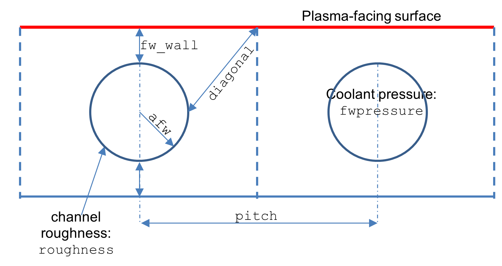

# Armour, First Wall and Breeding Blanket

The surface facing the plasma is a thin layer of a material highly resistant to 
melting and erosion, such as tungsten, referred to "armour". It is cooled by 
conduction to the first wall underneath.

The first wall sits behind the armour, and is dedicated to removing the heat 
landing on the armour. It does not breed tritium. Due to the hostile environment 
the first wall and armour have only a short lifetime and therefore need to be 
replaced regularly. It is cooled either by gaseous helium or by pressurised 
liquid water, depending on the selection of blanket type using the switch 
`blkttype`.

## Wall Load Calculation

Switch `iwalld` determines whether the neutron wall load (power per unit area) 
should be calculated using the plasma surface area (`iwalld = 1`) or the first 
wall area (`iwalld = 2`) as the denominator. In the former case, input 
parameter `ffwal` (default value 0.92) can be used to scale the neutron power 
reaching the first wall.

The breeding blanket performs a number of tasks. An incoming neutron from a
deuterium-tritium (D-T) fusion reaction in the plasma loses energy in the
blanket. This energy is removed by the blanket coolant and used to produce
electricity. The neutron may also react with a lithium nucleus present in the
blanket to produce ("breed") a tritium nucleus which can be re-used as
fuel. The competing requirements of heating and tritium synthesis mean that a
neutron multiplier must be present, to ensure balance between tritium
destruction and creation. The blanket therefore contains beryllium to fulfil
this purpose. As with the first wall, the blanket has a relatively short
lifetime because of the high neutron fluence.

### Blanket Model Options

The models used for the thermoydraulics of the first wall, the profile of 
deposition of the neutron energy, tritium breeding, and conversion of heat to 
electricity have been revised extensively.

`iblanket` -- This switch selects between different types of blanket.

- `== 1` -- CCFE HCPB (helium-cooled pebble bed) model. The energy 
    deposition in the armour and first wall, blanket and shield are calculated 
    using parametric fits to an MCNP neutron and photon transport model of a 
    sector of a tokamak. The blanket contains lithium orthosilicate 
    Li$_4$SiO$_4$, titanium beryllide TiBe$_{12}$, helium and Eurofer steel. 
- `== 2` -- KIT HCPB model. It allows the energy multiplication factor `emult`, 
    the shielding requirements and tritium breeding ratio to be calculated 
    self-consistently with the blanket and shielding materials and sub-assembly 
    thicknesses, and for constraints to be applied to satisfy the engineering 
    requirements. For further details of this model.
- `== 3` -- CCFE HCPB model with tritium breeding ratio. It has the features of 
    the CCFE HCPB model above, with a set of fitting functions for calculating 
    tritium breeding ratio (TBR).  It requires a choice of `iblanket_thickness`, 
    specifiying a `THIN`, `MEDIUM` or `THICK` blanket. This fixes the values 
    of inboard and outboard blanket thickness, and the initial values of first 
    wall thickness (3 cm) and first wall armour (3 mm). Note that these last 
    two can be modified by the first wall thermohydraulic module, in which case 
    the output will not be fully self-consistent. The lithium-6 enrichment and 
    the breeder fraction (Li4SiO4/(Be12Ti+Li4SiO4) by volume) are available as 
    iteration variables, and the minimum TBR can be set as a constraint. The 
    maximum values of TBR achievable are as follows:

    - `THIN` -- 1.247
    - `MEDIUM` -- 1.261
    - `THICK` -- 1.264.

`secondary_cycle` -- This switch controls how the coolant pumping power in the 
first wall and blanket is determined, and also how the calculation of the plant's 
thermal to electric conversion efficiency (the secondary cycle thermal 
efficiency) proceeds.

### KIT Blanket Neutronics Model

The model used if `blktmodel = 1` is based on the Helium-Cooled Pebble
Bed (HCPB) blanket concept developed by KIT (a second advanced model --
Helium-Cooled Lithium Lead, HCLL -- will be implemented in due course). The
blanket, shield and vacuum vessel are segmented radially into a number of
sub-assemblies. Moving in the direction away from the plasma/first wall, these
are:

Breeding Zone (BZ) (which includes the first wall), with radial
thicknesses (inboard and outboard, respectively) `fwith + blbuith`,
`fwoth+blbuoth`. This consists of beryllium (with fraction by volume `fblbe`), 
breeder material (`fblbreed`), steel (`fblss`) and helium coolant. Three 
forms of breeder material are available: 
  
| `breedmat` | Description                           |
| :--------: | ------------------------------------- |
|     1      | lithium orthosilicate (Li$_4$SiO$_4$) |
|     2      | lithium metatitanate (Li$_2$TiO$_3$)  |
|     3      | lithium zirconate (Li$_2$ZrO$_3$)     |

The $^6$Li enrichment percentage may be modified from the default 30% using 
input parameter `li6enrich`.

- Box Manifold (BM), with radial thicknesses (inboard and outboard,
  respectively) `blbmith`, `blbmoth` and helium fractions `fblhebmi`, `fblhebmo` 
  (the rest being steel).
- Back Plate (BP), with radial thicknesses (inboard and outboard,
  respectively) `blbpith`, `blbpoth` and helium fractions `fblhebpi`, `fblhebpo` 
  (the rest being steel).

Together, the BZ, BM and BP make up the `blanket`, with total radial
thicknesses `blnkith` (inboard) and `blnkoth` (outboard), and void (coolant) 
fraction `vfblkt`; Note that these quantities are `calculated` from the 
sub-assembly values if `blktmodel > 0`, rather than being input parameters.

Low Temperature Shield and Vacuum Vessel (lumped together for these 
calculations), with radial thicknesses (inboard and outboard, respectively) 
`shldith + d_vv_in`, `shldoth + d_vv_out` and **water** coolant fraction 
`vfshld` (the rest being assumed to be steel for its mass calculation; the 
neutronics model assumes that the shield contains 2% boron  as a neutron absorber, 
but this material is not explicitly mentioned elsewhere in the code -- so 
its cost is not calculated, for example).

!!! Note "Note" 
    The fact that water is assumed to be the coolant in the shield, whereas 
    helium is the coolant in the blanket, leads to an inconsistency when 
    specifying the coolant type via switch `coolwh`. At present we mitigate this 
    by forcing `coolwh=2` (making water the coolant), as in this case the
    coolant mass and pumping costs are higher, giving the more pessimistic
    solution with regards to costs.

A few other input parameters are useful for tuning purposes, as follows:

|     Parameter      | Description                                                                                                                                                                                                                    |
| :----------------: | ------------------------------------------------------------------------------------------------------------------------------------------------------------------------------------------------------------------------------ |
|  `fvolsi/fvolso`   | area (and volume) coverage factors for the inboard and outboard shields, respectively.                                                                                                                                         |
|      `fvoldw`      | multiplier for volume of vacuum vessel, used in mass calculations to account for ports, etc.                                                                                                                                   |
|      `npdiv`       | number of divertor ports, used in the calculation of the tritium breeding ratio.                                                                                                                                               |
| `nphcdin/nphcdout` | number of heating/current drive ports on the inboard and outboard sides, respectively, used in the calculation of the tritium breeding ratio. These may be either 'small'  (`hcdportsize = 1`) or 'large' (`hcdportsize = 2`). |
|      `wallpf`      | neutron wall load peaking factor (maximum/mean), used in the calculation of the blanket lifetime.                                                                                                                              |
|    `ucblbreed`     | unit cost (\$/kg) of the breeder material                                                                                                                                                                                      |

#### KIT model outputs and available constraints

The KIT blanket model has the following available constraints

| Constraint No. |  F-value  | F-value No. |    Limit    | Description                        |
| :------------: | :-------: | :---------: | :---------: | ---------------------------------- |
|       52       |  `ftbr`   |     89      |  `tbrmin`   | Min required `tbr`                 |
|       53       | `fflutf`  |     92      | `nflutfmax` | Max allowed TF fluence             |
|       54       | `fptfnuc` |     95      | `ptfnucmax` | Max allowed heating of TF coils    |
|       55       |  `fvvhe`  |     96      |  `vvhealw`  | Max allowed He concentration in VV |

The KIT blanket neutronics model provides the following outputs:

|   Output    |  Units   | Itvar. | Description                                                              |
| :---------: | :------: | ------ | ------------------------------------------------------------------------ |
| `pnucblkt`  |    MW    | -      | Total nuclear power deposited in blanket                                 |
| `pnucshld`  |    MW    | -      | Total nuclear power deposited in shield                                  |
|   `emult`   |    -     | -      | The energy multiplication factor in the blanket                          |
|    `tbr`    |    -     | -      | Tritium breeding ratio                                                   |
|  `blbuith`  |    m     | 90     | Inboard blanket thickness                                                |
|  `blbuoth`  |    m     | 91     | Outboard blanket thickness                                               |
| `tritprate` |    -     | -      | The tritium production rate in grammes/day is calculated.                |
|  `nflutfi`  | n/m$^2$  | -      | The fast neutron fluence on the inboard TF coils                         |
|  `nflutfo`  | n/m$^2$  | -      | The fast neutron fluence on the inboard TF coils                         |
|  `shldith`  |    m     | 93     | Inboard shield thickness                                                 |
|  `shldoth`  |    m     | 94     | Outboard shield thickness                                                |
|  `pnuctfi`  | MW/m$^3$ | -      | Nuclear heating power on inboard TF coil                                 |
|  `pnuctfo`  | MW/m$^3$ | -      | Nuclear heating power on outboard TF coil                                |
| `vvhemini`  |   appm   | -      | Min He concentration in the inboard VV at the end of the plant lifetime  |
| `vvhemaxi`  |   appm   | -      | Max He concentration in the inboard VV at the end of the plant lifetime  |
| `vvhemino`  |   appm   | -      | Min He concentration in the outboard VV at the end of the plant lifetime |
| `vvhemaxo`  |   appm   | -      | Max He concentration in the outboard VV at the end of the plant lifetime |
|  `bktlife`  |  fp-yrs  | -      | Blanket lifetime in full power years assuming max damage ~60 dpa         |

## Thermo-hydraulic model for first wall and blanket

!!! Note "Note" 
    This is only called for primary_pumping = 2

Summary of key variables and switches:  

|                          |       First Wall        | Breeding Blanket Primary | Liquid Breeder/Coolant               |
| :----------------------: | :---------------------: | ------------------------ | ------------------------------------ |
|     Coolant Channels     |      :-----------:      | ------------------------ | --------------------------           |
|        length (m)        |   `fw_channel_length`   | ---                      | ---                                  |
|        width (m)         | `afw` (radius, cicular) | `afw`                    | `a_bz_liq`, `b_bz_liq` (rectangular) |
|    wall thickness (m)    |        `fw_wall`        | fw_wall                  | `th_wall_secondary`                  |
|        pitch (m)         |         `pitch`         | ---                      | ---                                  |
|    roughness epsilon     |       `roughness`       | ---                      | ---                                  |
|     peak FW temp (K)     |         `tpeak`         | ---                      | ---                                  |
|     maximum temp (K)     |       `tfwmatmax`       | ---                      | ---                                  |
|        FCI switch        |           ---           | ---                      | `ifci`                               |
|         Coolant          |      :-----------:      | ------------------------ | --------------------------           |
|  primary coolant switch  |       `fwcoolant`       | `coolwh`                 | ---                                  |
| secondary coolant switch |           ---           | ---                      | `i_bb_liq`                           |
|      inlet temp (K)      |        `fwinlet`        | `inlet_temp`             | `inlet_temp_liq`                     |
|     outlet temp (K)      |       `fwoutlet`        | `outlet_temp`            | `outlet_temp_liq`                    |
|      pressure (Pa)       |      `fwpressure`       | `blpressure`             | `blpressure_liq`                     |

The default thermo-hydraulic model assumes that a solid breeder is in use, with both the first wall and the breeding blanket using helium as a coolant.
This can be changed using the switches detailed in the following subsection. 

### First wall

Figure 1: *First wall concept with coolant channels*

The first wall is assumed to be thermally separate from the blanket (Figure 1).  No separation has been made between the structural part of the first wall and the armour.  A simple heuristic model has been used to estimate the peak temperature, as follows.

Minimum distance travelled by surface heat load = $\texttt{fw} \_ \texttt{wall}$

Maximum distance travelled by surface heat load = $\texttt{diagonal}$

$$
\texttt{diagonal}=\sqrt{(\texttt{afw}+\texttt{fw} \_ \texttt{wall})^2 + \left(\frac{\texttt{pitch}}{2}-\texttt{afw}\right)^2 }
$$

Typical distance travelled by surface heat load:

$$
\texttt{mean} \_ \texttt{distance}=\frac{\texttt{fw} \_ \texttt{wall}+\texttt{diagonal}}{2}
$$

$$
\texttt{diagonal}=\sqrt{(\texttt{afw}+\texttt{fw} \_ \texttt{wall})^2 + \left(\frac{\texttt{pitch}}{2}-\texttt{afw}\right)^2 }
$$

The energy travels over a cross-section which is initially $= \texttt{pitch}$
It spreads out, arriving at the coolant pipe over an area of half the circumference.
We use the mean of these values:

$$ 
\texttt{mean} \_ \texttt{width} = \frac{\texttt{pitch} + \pi \times \texttt{afw}}{2}
$$

The temperature difference between the plasma-facing surface and the coolant is then:

$$ 
\texttt{deltat} \_ \texttt{solid} = \frac{\texttt{onedload} \times \texttt{mean} \_ \texttt{distance}}{\texttt{tkfw} \times \texttt{mean} \_ \texttt{width}}
$$

where $\texttt{tkfw}$ is the thermal conductivity of the first wall material and $\texttt{onedload}$ is the heat load per unit length.

The temperature difference between the channel inner wall (film temperature) and the bulk coolant is calculated using the heat transfer coefficient, which is derived using the [Gnielinski correlation](https://en.wikipedia.org/wiki/Nusselt_number#Gnielinski_correlation).  The pressure drop is based on the Darcy fraction factor, using the [Haaland equation](https://en.wikipedia.org/wiki/Darcy_friction_factor_formulae#Haaland_equation), an approximation to the implicit Colebrook–White equation.  The thermal conductivity of Eurofer is used, from "Fusion Demo Interim Structural Design Criteria - Appendix A Material Design Limit Data", F. Tavassoli, TW4-TTMS-005-D01, 2004"

### Model Switches

There are three blanket model options, chosen by the user to match their selected blanket design using the switch 'icooldual' (default=0):
    0.   Solid breeder - nuclear heating in the blanket is exctrated by the primary coolant.
    1.   Liquid metal breeder, single-coolant 
        - nuclear heating in the blanket is exctrated by the primary coolant.
        - liquid metal is circulated for tritium extraction, specified by number of circulations/day.
    2.   Liquid metal breeder, dual-coolant
        - nuclear heating in the liquid breeder/coolant is extracted by the liquid breeder/coolant.
        - nuclear heating in the blanket structure is extracted by the primary coolant

The default assuption for all blanket models is that the first wall and breeding blanket have the same coolant (flow = FW inlet -> FW outlet -> BB inlet-> BB outlet). 
It is possible to choose a different coolant for the FW and breeding blanket, in which case the mechanical pumping powers for the FW and BB are calculated seperately. 
The model has three mechanical pumping power options, chosen by the user to match their selected blanket design using the switch 'ipump' (default=0): 
    0.   Same coolant for FW and BB ('fwcoolant`=`coolwh`)
    1.   Different coolant for FW and BB ('fwcoolant`/=`coolwh`) 

!!! Note "Note" 
    For the dual-coolant blanket the 'ipump' switch is relavent for the blanket structure coolant and not the liquid metal breeder/coolant choice.  

The user can select the number poloidal and toroidal modules for the IB and OB BB. The 'ims' switch can be set to 1 for a single-module-segment blanket (default=0):
    0. Multi-module segment 
    1. Single-module-segment

|   Variable   | Units | Itvar. | Default | Description                                              |
| :----------: | :---: | ------ | ------- | -------------------------------------------------------- |
| `nblktmodpi` |  ---  |        | 7       | Number of inboard blanket modules in poloidal direction  |
| `nblktmodpo` |  ---  |        | 8       | Number of outboard blanket modules in poloidal direction |
| `nblktmodti` |  ---  |        | 32      | Number of inboard blanket modules in toroidal direction  |
| `nblktmodto` |  ---  |        | 48      | Number of outboard blanket modules in toroidal direction |

#### Liquid Breeder or Dual Coolant

There are two material options for the liquid breeder/coolant, chosen by the user to match their selected blanket design using the switch 'i_bb_liq' (default=0):
    0.  Lead-Lithium 
    1.  Lithium (needs testing)    
Both options use the mid-temperature of the metal to find the following properties: density, specific heat, thermal conductivity, dynamic viscosity and electrical conductivity. 
The Hartmann number is also calculated (using the magnetic feild strength in the centre of the inboard or outboard blanket module). 

|       Variable        | Units | Scanvar. | Usage         | Default | Description                                           |
| :-------------------: | :---: | -------- | ------------- | ------- | ----------------------------------------------------- |
|   `blpressure_liq`    |  Pa   | 70       | idualcool=1,2 | 1.7D6   | liquid metal breeder/coolant pressure                 |
|   `inlet_temp_liq`    |   K   | 68       | idualcool=1,2 | 570     | Inlet temperatute of liquid metal breeder/coolant     |
|   `outlet_temp_liq`   |   K   | 69       | idualcool=1,2 | 720     | Outlet temperatute of liquid metal breeder/coolant    |
|    `n_liq_recirc`     |  ---  | 71       | idualcool=1   | 10      | Number of liquid metal breeder recirculations per day |
| `f_nuc_pow_bz_struct` |  ---  | 73       | iblanket=5    | 0.34    | FW nuclear power as fraction of total                 |
|  `f_nuc_pow_bz_liq`   |  ---  | 74       | iblanket=5    | 0.66    | Fraction of BZ power cooled by primary coolant        |

#### Flow Channel Inserts for Liquid Metal Breeder

There are three model options, chosen by the user to match their selected blanket design using the switch 'ifci' (default=0):
    0.   No FCIs used. Conductivity of Eurofer steel is assumed for MHD pressure drop calculations in the liquid metal breeder.
    1.   FCIs used, assumed to be perfectly electrically insulating.  
    2.   FCIs used, with conductivity chosen by the user (`bz_channel_conduct_liq`).

|         Variable         |   Units   | Itvar. | Usage       | Default | Description                                                         |
| :----------------------: | :-------: | ------ | ----------- | ------- | ------------------------------------------------------------------- |
| `bz_channel_conduct_liq` | A V-1 m-1 | 72     | ifci = 0, 2 | 8.33D5  | Liquid metal coolant/breeder thin conductor or FCI wall conductance |
