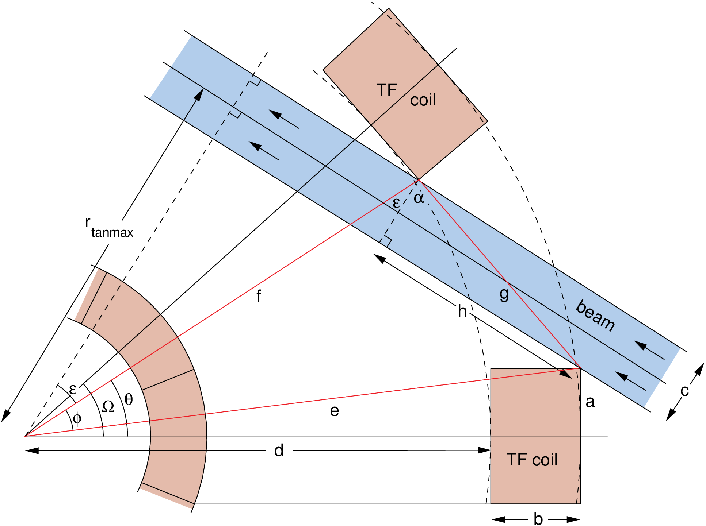

# Neutral Beam Injection Heating

!!! Warning "Warning" 
    At present, the neutral beam models do not include the effect of an edge transport barrier (pedestal) in the plasma profile.

## Neutral beam access

If present, a neutral beam injection system needs sufficient space between the TF coils to be able to intercept the plasma tangentially. The major radius `rtanbeam` at which the centre-line of the beam is tangential to the toroidal direction is user-defined using input parameter `frbeam`, which is the ratio of `rtanbeam` to the plasma major radius `rmajor`. The maximum possible tangency radius `rtanmax` is determined by the geometry of the TF coils - see Figure 1, and this can be enforced using constraint equation no. 20 with iteration variable no. 33 (`fportsz`). The thickness of the beam duct walls may be set using input parameter `nbshield`.

<figure>
    

    
      
    <figcaption><i>Figure 1: Top-down schematic of the neutral beam access geometry. The beam with the maximum possible tangency radius is shown here.
    </i></figcaption>
     
    

</figure>

## Neutral beam losses

Input parameter `forbitloss` can be used to specify the fraction of the net injected neutral beam power that is lost between the beam particles' ionisation and thermalisation (known as the first orbit loss). This quantity cannot easily be calculated as it depends on the field ripple and other three-dimensional effects. The power lost is assumed to be absorbed by the first wall.

The power in the beam atoms that are not ionised as they pass through the plasma (shine-through) is calculated by the code. There are two constraint equations that can be used to control the beam penetration and deposition, as follows:

- It is necessary to use a beam energy that simultaneously gives adequate penetration of the beam to the centre of the plasma and tolerable shine-through of the beam on the wall after the beam has traversed the plasma. The number of exponential decay lengths, $\tau$, for the beam power to fall before it reaches the plasma centre should be in the region of ~ 4-6[^2],. Constraint equation no. 14 may be used to force $\tau$ to be equal to the value given by input parameter `tbeamin`, and is therefore in effect a beam energy consistency equation.
- Alternatively, constraint equation no. 59 with iteration variable no. 105 (`fnbshineef`) may be used to ensure that the beam power fraction emerging from the plasma is no more than the value given by input parameter `nbshinefmax`.

It is recommended that <b>only one</b> of these two constraint equations is used during a run.

## Beam stopping cross-section

Both the [ITER](./iter_nb.md) and [Culham](culham_nb.md) NBI models both use the `sigbeam` method to calculate the stopping cross section[^1]. It finds a suitable analytic epressing for $\sigma_s^{(Z)}(E,n_e,T_e,Z_{\text{eff}})$ for fitting $\sigma_s$ data for a single impurity $(\text{Z)}$ plasma:

$$
\sigma_s^{(Z)}(E,n_e,T_e,Z_\text{eff}) = \frac{e^{[S_{1} (E,n_e, T_e)]}}{E} \times\left [1 +(Z_\text{eff}-1) S_z(E, n_e, T_e)\right] \  (\times 10^{-16} \text{cm}^2)
$$

where

$$
S_{1} = \sum_{i=1}^2 \sum_{j=1}^3 \sum_{k=1}^2 \ \{A_{ijk} \times (\ln E)^{i-1} \ [\ln(n/n_{0})]^{j-1} \ (\ln T_e)^{k-1} \}
$$

$$
S_{Z} = \sum_{i=1}^3 \sum_{j=1}^2 \sum_{k=1}^2 \ \{B_{ijk}^{(z)} \times (\ln E)^{i-1} \ [\ln(n/n_{0})]^{j-1} \ (\ln T_e)^{k-1} \}
$$

with $E, n_e, T$ expressed in units of keV/u, $\text{cm}^3$ and keV, respectively, and $n_0 = 10^{13} \text{cm}^3$. The function $S_1 (E, n_e, T_e)$ together with the $E^{-1}$ factor describes the beam stopping in a pure hydrogenic plasma, while the function $(Z_{\text{eff}}- 1)\  S_z (E, n_e, T_e)$ describes the effect of the impurity $Z$ on the beam stopping.

!!! info "Info" 
    For the full table of values for $A_{ijk}$ & $B_{ijk}^{(z)}$\  please see the accompanying paper[^1] or `current_drive.py`

For a plasma having an arbitrary mix of $N$ different types of impurities with densities $n$, and charges $Z_q (q = 1, ..., N)$, the beam stopping cross-section can be represented as the weighted sum of the stopping cross- sections for $N$ reference single-impurity plasmas. In each of these reference plasmas, the electron density and the proton density (including that of deuterium and tritium ions) are the same as in a true plasma. The impurity density, however, is increased in order to satisfy quasi-neutrality. The weighting function is the electron density $n_qZ_q$ associated with the aum impurity (in the true plasma), divided by the sum of these densities. The result is: 

$$
\sigma_s^{(N)}=\frac{ e^{S_{1}(E, n_e, T_e)}}{E} \times\left[1+\frac{1}{n_e} \sum_q n_q Z_q(Z_q-1) S_{Z_q}(E, n_e, T_e)\right] 
(\times 10^{-16} \mathrm{~cm}^2)
$$

[^1]:Janev, R. K., Boley, C. D., & Post, D. E. (1989). *"Penetration of energetic neutral beams into fusion plasmas."* Nuclear Fusion, 29(12), 006. https://doi.org/10.1088/0029-5515/29/12/006