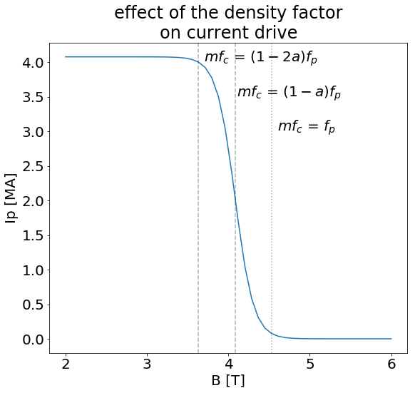

# Electron Bernstein Wave Model

The aim of the function below is to produce a 'simple as possible' function for estimating the current drive for an EBW system based solely on the 0D parameters available. It is noted that the efficiency of an actual EBW current drive system depends strongly on how it is used, in particular on the location and spatial distribution of the current and the plasma shape and launcher solution. None of these are included in the below. The model has significant room for improvement, but much more work is required in order to understand how best to do this.

Electron Bernstein waves (EBW) have the potential to be a source of relatively efficient current drive[^1] and have been predicted to be more efficient at driving current off-axis in spherical tokamaks[^2].

Microwave current drive efficiency is often expressed as a normalised quantity, $\xi_{CD}$, which captures its natural variation with temperature and density and is given by[^3]:

$$
\xi_{CD} = \frac{3.27 \ I_{\text{P}}  [\text{A}] \ R  [\text{m}] \ n_{\text{e}}[\times 10^{19} \text{m}^{-3}]}{T_{\text{e}}[\text{keV}] \ P[\text{W}]}
$$

We can rearrange this expression to give the current in terms of the other parameters:

$$
I_P[\text{A}] = \frac{\xi_{\text{CD}} \ T_{\text{e}}[\text{keV}]  \ P[\text{W}]}{3.27 \  R[\text{m}] \ n_{\text{e}} [\times 10^{19} \text{m}^{-3}]} 
$$

Experiments of EBW current drive on W7-AS found $\xi_{CD}=0.43\pm0.1$ [^1]. It should be noted that this may be different depending on the plasma and the location within the plasma that the current is driven. A more conservative assumptions might be $\xi_{\text{CD}} = 0.3$, optimistic $\xi_{\text{CD}}$ = 0.5.

Note that we neglect the coupling of the microwave beam in vacuum to the plasma.

Normalized current drive efficiency $\gamma$

$$
\gamma_{\text{CD}}= \frac{\xi_{CD}}{32.7}T_{\text{e}}
$$

Absolute current drive efficiency $\gamma$
$$
\gamma_{\text{CD}}= \frac{\gamma_{\text{CD}}}{n_{\text{e,20}}R_0}
$$

The EBWs can only couple to the plasma if the cyclotron harmonic is above the plasma density cut-off. In order to capture this behaviour, we introduce an ad-hoc model which reduces the plasma current up to this condition, by way of a tanh function:

Where $\mathtt{fp}$ is the plasma frequency, $\mathtt{fc}$ is the cyclotron frequency, $\mathtt{n_ecrh_harmonic}$ is the harmonic number and $a$ is a free parameter which defines the sharpness of the transition.

The effect of this factor can be seen below:

$$
a = 0.1
$$

$$
\mathtt{fc} = \frac{\frac{1}{2\pi}\times \mathtt{n_ecrh_harmonic} \times e B_{\text{T}}}{m_{\text{e}}}
$$

$$
\mathtt{fp} = \frac{1}{2\pi}\times \sqrt{\frac{n_{\text{e}}\text{e}^2}{m_{\text{e}} \epsilon_0}}
$$

$$
\mathtt{density factor} = 0.5 \times \left(1 + \tanh{\left(\frac{2}{\mathtt{a}}\times \frac{\mathtt{fp}-\mathtt{fc}}{\mathtt{fp}- \mathtt{a}}\right)}\right)
$$

$$
\text{Current drive efficiency [A/W]} = \gamma_{\text{CD}} \times \mathtt{densityfactor}
$$

<figure markdown>
{ width = "100"}
<figcaption>Figure 1: EBW coupling function as a function of on-axis toroidal field strength</figcaption>
</figure>

[^1]: Laqua HP, Maassberg H, Marushchenko NB, Volpe F, Weller A, Kasparek W; ECRH-Group. Electron-Bernstein-wave current drive in an overdense plasma at the Wendelstein 7-AS stellarator. Phys Rev Lett. 2003 Feb 21;90(7):075003. doi: 10.1103/PhysRevLett.90.075003. Epub 2003 Feb 21. PMID: 12633236.

[^2]: G. Taylor, P. C. Efthimion, C. E. Kessel, R. W. Harvey, A. P. Smirnov, N. M. Ershov, M. D. Carter, C. B. Forest; Efficient generation of noninductive, off-axis, Ohkawa current, driven by electron Bernstein waves in high 
$\beta$⁠, spherical torus plasmas. Phys. Plasmas 1 October 2004; 11 (10): 4733–4739. https://doi.org/10.1063/1.1792635

[^3]: Luce, T., Lin-Liu, Y., Harvey, R., Giruzzi, G., Politzer, P., Rice, B., Lohr, J., Petty, C., & Prater, R. (1999). Generation of Localized Noninductive Current by Electron Cyclotron Waves on the DIII-D Tokamak. Phys. Rev. Lett., 83, 4550–4553.