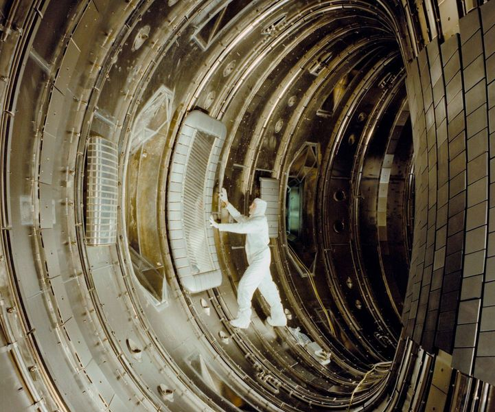

# Radio Frequency Heating

In the domain of RF heating, electromagnetic energy is introduced into plasma using radio or microwave frequencies, enabling resonant energy transfer from the waves to the plasma. Various RF heating methods are currently being explored, including Electron Cyclotron Resonance Heating (ECRH) operating in the microwave range, Ion Cyclotron Resonance Heating (ICRH) in the radio wave range, and Lower Hybrid Heating (LHH) in the intermediate range between ICRF and ECRH. As a result, RF heating encompasses a diverse range of independent approaches.

Ion Cyclotron Resonance Heating has demonstrated effectiveness in ion heating within plasma over an extended period. Both slow and fast wave systems have been developed for ion heating in various plasma confinement devices like stellarators, tokamaks, and mirrors. This method has shown efficiency at the first and second harmonic, as well as higher ion cyclotron frequencies. Achieving power levels of several megawatts has been successful, resulting in ion heating efficiencies comparable to those achieved with a neutral beam.

The transmitter serves as a wave generator, producing the required RF signal in terms of power and frequency, maintaining this signal from reactor startup to the burn phase. The RF wave is then transmitted through a coaxial cable or other suitable transmission line to the tuning network, which optimizes the system impedance for efficient power delivery to the plasma. The actual delivery is carried out by an antenna located in the plasma chamber. This antenna includes a radiating element, often a loop, covered by a Faraday shield. Designing the Faraday shield presents a significant challenge, requiring consideration of polarization requirements, heat loads from the plasma, erosion caused by plasma particles, and induced RF currents.

<figure markdown>
{ width = "100"}
<figcaption>Figure 1: The early interior of the Joint European Torus (JET) in 1984. This image shows the vacuum vessel and the first radio frequency antenna being installed.</figcaption>
</figure>

Electron Cyclotron Resonance Heating (ECRH) utilizes microwave energy within the gigahertz frequency range, generated by a device known as a "gyrotron." This process involves a high-power electron beam moving through a strong magnetic field produced by superconducting magnets. The electron beam follows a spiral path within the magnetic field, emitting microwave radiation. These microwaves are then directed to the plasma chamber via waveguides, passing through a dielectric window typically made from materials like ceramic or diamond, before being directed into the plasma for absorption. Successful ECRH systems, incorporating multiple 1-gigawatt gyrotrons, waveguides, and diamond windows, have been developed and deployed on DIII-D.

Lower Hybrid Heating (LHH) systems share similarities with ECRH and ICRH systems, employing similar equipment such as transmitters, transmission lines, and wave launchers or antennas. However, the key difference lies in the positioning and design of the launcher. Due to the higher frequency of waves used in ECRH and LHH, a waveguide can replace a loop antenna and Faraday shield. This waveguide allows for strategic placement of critical components, including ceramic windows, within the reactor's shielding, thereby reducing radiation damage to these essential elements.

In scenarios where the plasma frequency exceeds the microwave frequency, preventing microwaves from penetrating into the core plasma where electron cyclotron resonance (ECR) occurs, an alternative approach is required. In such cases, the electron Bernstein wave (EBW) is utilized due to its electrostatic nature, enabling it to propagate without encountering density limitations. The EBW originates through mode conversion from the slow X-mode at the upper hybrid resonance (UHR) and exhibits resonances at harmonics of the EC frequency.

In tokamak plasmas, where the magnetic field varies inversely with the major radius, spatial regions for EBW propagation are arranged in a band structure between two adjacent harmonic ECRs. By injecting microwaves from the outboard side and triggering EBW at the UHR layer through the OXB mode-conversion scheme, the EBW is confined to propagate solely between the UHR layer and the harmonic ECR layer on the inboard side.

