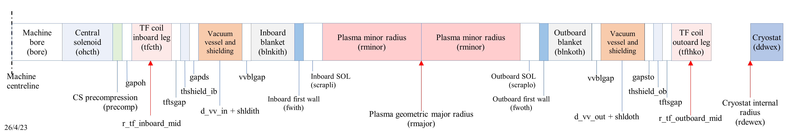
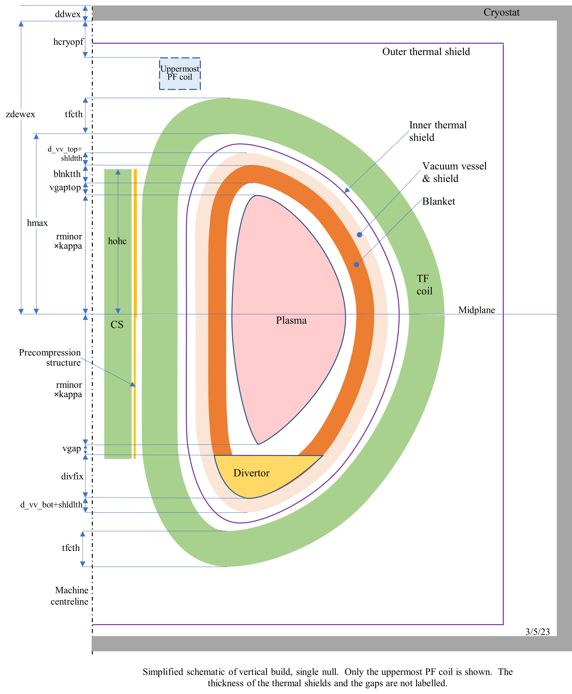

# Radial and Vertical Build


Simplified scale diagrams of the vertical and horizontal cross-sections of the machine can be
output in the `12-page summary` using the utility `plot_proc.py` (currently stored in `process/process/io`).  

The coordinate system is $(R,Z)$ system, where $R$ is the radial distance from the vertical
centreline (axis) of the torus, and $Z$ is the vertical distance from the equatorial midplane.

Components are often referred to as being 'inboard' or 'outboard', which simply
means that they lie at a radius $R$ less than or greater than $R_0$,
respectively, where $R_0$ is the plasma major radius (`rmajor`).

------------------

## Radial Build

The radial build is described in detail in the OUT.DAT file as in the example below, which lists
the major radius of each component in the midplane.  The machine is axisymmetric, except for the
TF coils which are discrete.  The variables marked "IP" below are input variables.  Those marked
"ITV" are available as iteration variables (although it is not always advisable to use them as
iteration variables).  Those marked with an asterisk (*) may or may not be input variables
depending on the switches used.  

```text
 ************************************************ Radial Build ***************************************
 
 Device centreline                            0.000           0.000                       
 Machine dr_bore                                 2.124           2.124   (dr_bore)              IP, ITV
 Central solenoid                             0.500           2.624   (dr_cs)             IP, ITV
 CS precompression                            0.065           2.689   (dr_cs_precomp)           
 Gap                                          0.050           2.739   (dr_cs_tf_gap)             IP, ITV
 TF coil inboard leg                          1.400           4.139   (dr_tf_inboard)             IP
 Gap                                          0.050           4.189   (dr_tf_shld_gap)           IP
 Thermal shield, inboard                      0.050           4.239   (dr_shld_thermal_inboard)       IP
 Gap                                          0.020           4.259   (dr_shld_vv_gap_inboard)             IP
 Vacuum vessel (and shielding)                0.600           4.859   (dr_vv_inboard + dr_shld_inboard) IP
 Gap                                          0.020           4.879   (dr_shld_blkt_gap)           IP
 Inboard blanket                              0.755           5.634   (dr_blkt_inboard)           IP*
 Inboard first wall                           0.018           5.652   (dr_fw_inboard)             
 Inboard scrape-off                           0.225           5.877   (dr_fw_plasma_gap_inboard)           IP, ITV
 Plasma geometric centre                      3.265           9.142   (rminor)            
 Plasma outboard edge                         3.265          12.408   (rminor)            
 Outboard scrape-off                          0.225          12.633   (dr_fw_plasma_gap_outboard)           IP, ITV
 Outboard first wall                          0.018          12.651   (dr_fw_outboard)             
 Outboard blanket                             0.982          13.633   (dr_blkt_outboard)           IP*
 Gap                                          0.020          13.653   (dr_shld_blkt_gap)           IP
 Vacuum vessel (and shielding)                1.100          14.753   (dr_vv_outboard+dr_shld_outboard)  IP
 Gap                                          1.900          16.652   (dr_shld_vv_gap_outboard)            
 Thermal shield, outboard                     0.050          16.702   (dr_shld_thermal_outboard)       IP
 Gap                                          0.050          16.752   (dr_tf_shld_gap)           IP
 TF coil outboard leg                         1.400          18.152   (dr_tf_outboard)          

```

The radial build is shown schematically below (click to zoom).



--------------------

## Vertical Build

The vertical build is described in detail in the OUT.DAT as in the following example, which lists
the vertical coordinate of each component at the point furthest from the midplane (excluding the
CS, the other PF coils and the cryostat).  The midplane is defined to be half way between the top
and bottom of the plasma.  A single-null scenario is assumed to have a lower divertor, in which
case the machine is not symmetric about the midplane.  

```text
 *********************************************** Vertical Build *************************
 
 Single null case
                                          Thickness (m)    Height (m)
 TF coil                                      1.576           9.862   (dr_tf_inboard)             
 Gap                                          0.050           8.286   (dr_tf_shld_gap)           
 Thermal shield                               0.050           8.236   (thshield)          
 Gap                                          0.050           8.186   (dz_shld_vv_gap)             
 Vacuum vessel (and shielding)                0.600           8.136   (dz_vv_upper+dz_shld_upper)  
 Gap                                          0.020           7.536   (dr_shld_blkt_gap)           
 Top blanket                                  0.869           7.516   (dz_blkt_upper)           
 Top first wall                               0.018           6.647   (dz_fw_upper)             
 Top scrape-off                               0.600           6.629   (dz_fw_plasma_gap)           
 Plasma top                                   6.029           6.029   (z_plasma_xpoint_upper)      
 Midplane                                     0.000          -0.000                       
 Plasma bottom                                6.029          -6.029   (z_plasma_xpoint_upper)      
 Lower scrape-off                             2.002          -8.031   (vgap)              
 Divertor structure                           0.621          -8.652   (dz_divertor)            
 Vacuum vessel (and shielding)                1.000          -9.652   (dz_vv_lower+dz_shld_lower)  
 Gap                                          0.050          -9.702   (dz_shld_vv_gap)             
 Thermal shield                               0.050          -9.752   (thshield)          
 Gap                                          0.050          -9.802   (dr_tf_shld_gap)           
 TF coil                                      1.576         -11.379   (dr_tf_inboard)    

```

The vertical build is shown schematically below (click to zoom).  



-------------------

## First Wall area

Since PROCESS is essentially a 0-D code, the shape of each component is used to estimate its mass
and cost, but is not used otherwise.  The first wall, blanket, shield and vacuum vessel may be
either D-shaped in cross-section, or each may be defined by two half-ellipses. The choice between
these two possibilities is set using input parameter `i_fw_blkt_vv_shape`, which should be

- 1 for D-shaped,
- 2 for ellipses.

The bottom of the first wall is given by:

$$
z_{\text{FW,bottom}} = \overbrace{z_{\text{x-point}}}^{\texttt{z_plasma_xpoint_lower}} + \overbrace{\mathrm{d}z_{\text{x-point,divertor}}}^{\texttt{dz_xpoint_divertor}} 
\\ + \overbrace{\mathrm{d}z_{\text{divertor}}}^{\texttt{dz_divertor}} - \overbrace{\mathrm{d}z_{\text{Blanket,upper}}}^{\texttt{dz_blkt_upper}} - \overbrace{\mathrm{d}z_{\text{FW,upper}}}^{\texttt{dz_fw_upper}}
$$

If there is two divertors then:

$$
z_{\text{FW,bottom}} = z_{\text{FW,top}}
$$

else:

$$
z_{\text{FW,top}} = z_{\text{x-point}} + \overbrace{\mathrm{d}z_{\text{FW,plasma-gap}}}^{\texttt{dz_fw_plasma_gap}}
$$

The full height is then the average of th two

$$
\mathrm{d}z_{\text{FW,half}} = \frac{z_{\text{FW,top}} + z_{\text{FW,bottom}}}{2}
$$

---------------

### D-shaped | `dshellarea()`

Major radius to outer edge of inboard section

$$
R_1 = R_0 - a - \overbrace{\Delta r_{\text{FW,plasma-gap inboard}}}^{\texttt{dr_fw_plasma_gap_inboard}}
$$

Area of inboard cylindrical shell is simply:

$$
A_{\text{FW,inboard}} = 4 \mathrm{d}z_{\text{FW,half}} \pi R_1
$$


$$
R_2 = R_0 + a + \overbrace{\Delta r_{\text{FW,plasma-gap outboard}}}^{\texttt{dr_fw_plasma_gap_outboard}} - R_1
$$

In a similar fashion, the area element for the inner surface of the outboard wall (initially assuming it is
semicircular) is given by:

$$
\mathrm{d}A = R_2 \left(R_1 + R_2 \sin{\left(\alpha\right)}\right) \mathrm{d} \phi \ \mathrm{d} \alpha
$$

where $\alpha$ is the poloidal angle and $\phi$ is the toroidal angle.

$$
A = 2\pi \int_{\alpha = 0}^\pi \left(R_1 R_2+R_2^2\sin{\left(\alpha\right)}\right) \ \mathrm{d} \alpha
\\ = 2\pi \left[\alpha R_1 R_2 - R_2^2 \cos{\left(\alpha\right)}\right]^{\pi}_0
$$

$$
A = 2 \pi \left(\pi R_1 R_2 + 2R_2^2\right)
$$

Taking into acount the elongation of the arc, $\kappa$:

$$
\kappa = \frac{\mathrm{d}z_{\text{FW,half}}}{R_2}
$$

$$
A_{\text{out}} = 2 \pi \kappa \left(\pi R_1 R_2 + 2R_2^2\right)
$$


<!DOCTYPE html>
<html lang="en">
  <head>
    <meta charset="utf-8">
    <title>Bokeh Plot</title>
    <style>
      html, body {
        box-sizing: border-box;
        display: flow-root;
        height: 100%;
        margin: 0;
        padding: 0;
      }
    </style>
    <script type="text/javascript" src="https://cdn.bokeh.org/bokeh/release/bokeh-3.6.0.min.js"></script>
    <script type="text/javascript" src="https://cdn.bokeh.org/bokeh/release/bokeh-widgets-3.6.0.min.js"></script>
    <script type="text/javascript">
        Bokeh.set_log_level("info");
    </script>
  </head>
  <body>
    <div id="c7a79374-714d-4583-b4ed-0d80c916cdf7" data-root-id="p1100" style="display: contents;"></div>
  
  <script type="application/json" id="e8166d6b-7123-49be-a91f-9eb5f1758c85">
    {"334a99a2-3b4d-4b4d-9e1a-4019fe6ac382":{"version":"3.6.0","title":"Bokeh Application","roots":[{"type":"object","name":"Column","id":"p1100","attributes":{"children":[{"type":"object","name":"Figure","id":"p1013","attributes":{"width":650,"x_range":{"type":"object","name":"Range1d","id":"p1023","attributes":{"end":10}},"y_range":{"type":"object","name":"Range1d","id":"p1024","attributes":{"start":-8,"end":8}},"x_scale":{"type":"object","name":"LinearScale","id":"p1025"},"y_scale":{"type":"object","name":"LinearScale","id":"p1026"},"title":{"type":"object","name":"Title","id":"p1016","attributes":{"text":"D-shaped first wall with divertor"}},"renderers":[{"type":"object","name":"GlyphRenderer","id":"p1056","attributes":{"data_source":{"type":"object","name":"ColumnDataSource","id":"p1010","attributes":{"selected":{"type":"object","name":"Selection","id":"p1011","attributes":{"indices":[],"line_indices":[]}},"selection_policy":{"type":"object","name":"UnionRenderers","id":"p1012"},"data":{"type":"map","entries":[["x",{"type":"ndarray","array":{"type":"bytes","data":"AAAAAAAACEA1nqiXTwAIQGazA40+AQhAaBoza80CCEC+sRMa/QQIQC6dM97OBwhA1M/DWEQLCEAMDYSHXw8IQJZTqMQiFAhAL2u2xpAZCEDlElqgrB8IQF4ULsB5JghAykd48PstCEAZXNZWNzYIQDkA2XMwPwhArtSKIuxICEB/WOCXb1MIQAfSDWLAXghAkgPAZ+RqCEAOTTTn4XcIQMqvLHW/hQhAtv+7+4OUCEDOZua4NqQIQNA7Ej3ftAhAfw1FaYXGCECopyhtMdkIQGa/08Tr7AhAHuFRNr0BCUDoLObOrhcJQJplBODJLglAgNT7+xdHCUD/h0/yomAJQIF+t8t0ewlArmHGxZeXCUCIkC9OFrUJQCJaqf360wlAjnZnklD0CUApASrqIRYKQMV23ft5OQpA1oPI0GNeCkB+w0R96oQKQPLv/xgZrQpADHDDtvrWCkAkpcBbmgILQIDfYPYCMAtAaW+YVD9fC0Aa5bwZWpALQEE637NdwwtA4FSrUFT4C0DNFM/RRy8MQD7q68BBaAxA/swWQ0ujDEAAUOsLbeAMQLB7N1CvHw1A6hFHuBlhDUCS39VRs6QNQNDIsYGC6g1AekwW9YwyDkCmT8yS13wOQHYaGmxmyQ5AFImQrTwYD0DYjcOPXGkPQNw4/UfHvA9AksZ9fD4JEEDlO+VRPjUQQOEgZgxiYhBAE+aB9KeQEECEaNqrDcAQQGudNyaQ8BBAWLTNoisiEUDI8c6l21QRQMnNVPKaiBFAvB2shGO9EUDWOxCNLvMRQFw54Wr0KRJAdzBhqKxhEkBVvgT3TZoSQE+NYizO0xJAup/NPyIOE0CGvaVIPkkTQPkAaX0VhRNA3f+QM5rBE0D7dkXgvf4TQGms7RlxPBRAF/OomqN6FEAW1rVDRLkUQLB1ziFB+BRAt4t/coc3FUBKYH6qA3cVQGC2AH2hthVAMWAY5Ev2FUACwhIq7TUWQJ8O2/NudRZAEX9cTLq0FkDjMOCwt/MWQGC2YB5PMhdAY73LH2hwF0Abhyjd6a0XQEZAmCu76hdAwKEjnsImGEAloEeX5mEYQGhaMVsNnBhAae6XIh3VGEAzYyEu/AwZQJd2PtqQQxlA2tJns8F4GUB5BKaKdawZQCB7TIqT3hlAG/fOSgMPGkBQAJjnrD0aQGZoxhN5ahpA9mi3LlGVGkDwqkJYH74aQA5vjYTO5BpA2ilaj0oJG0DMMLpOgCsbQEmSB6VdSxtAU98NktFoG0AZi0lDzIMbQGuRJiM/nBtAtk8o5xyyG0DZ4uWcWcUbQDbsx7Xq1RtAfFd2EcfjG0ACleYG5+4bQDS3/GtE9xtACPizm9r8G0D+WcV6pv8bQP5ZxXqm/xtACPizm9r8G0A0t/xrRPcbQAOV5gbn7htAfFd2EcfjG0A27Me16tUbQNni5ZxZxRtAtk8o5xyyG0BrkSYjP5wbQBqLSUPMgxtAU98NktFoG0BJkgelXUsbQMwwuk6AKxtA2ilaj0oJG0AOb42EzuQaQPCqQlgfvhpA92i3LlGVGkBmaMYTeWoaQFAAmOesPRpAG/fOSgMPGkAge0yKk94ZQHkEpop1rBlA29Jns8F4GUCXdj7akEMZQDNjIS78DBlAae6XIh3VGEBoWjFbDZwYQCWgR5fmYRhAwaEjnsImGEBGQJgru+oXQBuHKN3prRdAY73LH2hwF0BgtmAeTzIXQOMw4LC38xZAEX9cTLq0FkCfDtvzbnUWQALCEirtNRZAMWAY5Ev2FUBgtgB9obYVQEpgfqoDdxVAt4t/coc3FUCxdc4hQfgUQBfWtUNEuRRAGPOomqN6FEBqrO0ZcTwUQPp2ReC9/hNA3f+QM5rBE0D4AGl9FYUTQIa9pUg+SRNAup/NPyIOE0BPjWIsztMSQFW+BPdNmhJAeDBhqKxhEkBcOeFq9CkSQNY7EI0u8xFAvR2shGO9EUDKzVTymogRQMnxzqXbVBFAV7TNoisiEUBqnTcmkPAQQIRo2qsNwBBAE+aB9KeQEEDhIGYMYmIQQOU75VE+NRBAksZ9fD4JEEDeOP1Hx7wPQNiNw49caQ9AFomQrTwYD0B2GhpsZskOQKhPzJLXfA5Ae0wW9YwyDkDOyLGBguoNQJLf1VGzpA1A6hFHuBlhDUCwezdQrx8NQABQ6wtt4AxA/swWQ0ujDEA+6uvAQWgMQM0Uz9FHLwxA4FSrUFT4C0BBOt+zXcMLQBzlvBlakAtAaW+YVD9fC0CA32D2AjALQCSlwFuaAgtADHDDtvrWCkDy7/8YGa0KQH7DRH3qhApA1oPI0GNeCkDFdt37eTkKQCkBKuohFgpAjnZnklD0CUAiWqn9+tMJQIqQL04WtQlArmHGxZeXCUCCfrfLdHsJQP6HT/KiYAlAgNT7+xdHCUCaZQTgyS4JQOgs5s6uFwlAHuFRNr0BCUBmv9PE6+wIQKinKG0x2QhAfw1FaYXGCEDQOxI937QIQM5m5rg2pAhAtv+7+4OUCEDKryx1v4UIQA5NNOfhdwhAkgPAZ+RqCEAG0g1iwF4IQH9Y4JdvUwhArtSKIuxICEA5ANlzMD8IQBlc1lY3NghAykd48PstCEBeFC7AeSYIQOUSWqCsHwhAL2u2xpAZCECWU6jEIhQIQAwNhIdfDwhA1M/DWEQLCEAunTPezgcIQL6xExr9BAhAaBoza80CCEBmswONPgEIQDWeqJdPAAhAAAAAAAAACEA="},"shape":[256],"dtype":"float64","order":"little"}],["y",{"type":"ndarray","array":{"type":"bytes","data":"B1wUMyamwbyBQDQ6jzq5v885/leZOMm/NUU7zv/n0r+V3CC5wjDZv8ted2Wbdd+/nBzlM8ja4r/PLpaL1Pflv+/M7tl2Eem/KdnlxjMn7L+BoXSVkDjvv20cVZuJIvG/KeFRLiGm8r9/XbPG0ib0v28qzZpipPW/3HyOXZUe9784iblHMJX4v9UaBiH5B/q/K/MtSbZ2+7+MieHALuH8v1fGozIqR/6/qVmL+3Co/7+LKPQZZoIAwBhK5tsCLgHAbvq6F/TWAcAAQsyLH30CwKPww2RrIAPAdCCfQb7AA8Am9J83/10EwLrzLNYV+ATApW2dKuqOBcAaRfLDZCIGwKiZerZusgbA6bZjn/E+B8DCvjOo18cHwK2DLooLTQjACAykkXjOCMDnOiihCkwJwE0eszSuxQnAf2apZFA7CsC9jczo3qwKwHg7EhtIGgvAA3Ji+nqDC8CRGTwtZ+gLwGV/PwT9SAzAC2SefC2lDMDAN3FC6vwMwAco8bIlUA3A9qWW3tKeDcDfEByL5egNwFk1ZDVSLg7AAFVEEw5vDsDbbzEVD6sOwJKM0OdL4g7AQsFp9bsUD8Bjwz1nV0IPwHzJvSYXaw/AUY6l3vSOD8CoSff76q0PwHt32a70xw/AI0tW6w3dD8C3sPxpM+0PwKPDYqhi+A/AIaaJ6Zn+D8AYqiI22P8PwKvAtVwd/A/AZCqp8WnzD8DtZipPv+UPwMZn+JQf0w/AfA4PqI27D8BcAzQyDZ8PwKv2ZKGifQ/A72InJ1NXD8C/67m3JCwPwC55Jwke/A7AnzQ8kkbHDsCTkFyJpo0OwH6JPuNGTw7Ag1KFUTEMDsBrpT9BcMQNwM3xSNkOeA3A26uN+BgnDcDN/zI0m9EMwFMzotWidwzA1AJ42D0ZDMCrTFjoerYLwNFgpl5pTwvAtU8iQBnkCsAll2s6m3QKwEuQaaEAAQrA9gWabFuJCcBGXkY0vg0JwNHGny48jgjAQdbCLOkKCMBIGqOX2YMHwEEM32wi+QbA+ep8O9lqBsAs+5AgFNkFwDG0zcPpQwXAdWH+U3GrBMDtxGyDwg8EwN5JMoT1cAPAXlp1BCPPAsBZbZMqZCoCwKBlOJHSggHAgd1jQ4jYAMBC/Vy4nysAwDD7Kp9n+P6/GvP4mL+U/b+WbIOkfiz8v0kSFL/cv/q/tA0rlBJP+b9kUrB0Wdr3v1M0C07rYfa/gashoQLm9L+Bq0B52mbzv1T47mKu5PG/1uWrYrpf8L/Q4zbXdbDtv/BYQqzZnOq/scbWrBqF579kE+Dls2nkv0KsufUgS+G/3U3w8btT3L8Yij7uzgzWv8hkHT3phM+/sj7Ukk7rwr+J42m2DDupv4njabYMO6k/sj7Ukk7rwj/IZB096YTPP/iJPu7ODNY/3U3w8btT3D9CrLn1IEvhP2QT4OWzaeQ/scbWrBqF5z/wWEKs2ZzqP8HjNtd1sO0/1uWrYrpf8D9U+O5iruTxP4GrQHnaZvM/gashoQLm9D9TNAtO62H2P2RSsHRZ2vc/rQ0rlBJP+T9JEhS/3L/6P5Zsg6R+LPw/GvP4mL+U/T8w+yqfZ/j+P0L9XLifKwBAft1jQ4jYAECgZTiR0oIBQFltkypkKgJAXlp1BCPPAkDeSTKE9XADQO3EbIPCDwRAcmH+U3GrBEAxtM3D6UMFQCz7kCAU2QVA+ep8O9lqBkBBDN9sIvkGQEgao5fZgwdAQdbCLOkKCEDRxp8uPI4IQEZeRjS+DQlA9gWabFuJCUBLkGmhAAEKQCWXazqbdApAtU8iQBnkCkDPYKZeaU8LQKlMWOh6tgtA0gJ42D0ZDEBRM6LVoncMQM7/MjSb0QxA3KuN+BgnDUDO8UjZDngNQGylP0FwxA1Ag1KFUTEMDkB+iT7jRk8OQJOQXImmjQ5AnzQ8kkbHDkAteScJHvwOQL7rubckLA9A7mInJ1NXD0Cq9mShon0PQFwDNDINnw9AfQ4PqI27D0DHZ/iUH9MPQO1mKk+/5Q9AZCqp8WnzD0CrwLVcHfwPQBiqIjbY/w9AIaaJ6Zn+D0Cjw2KoYvgPQLew/Gkz7Q9AI0tW6w3dD0B8d9mu9McPQKlJ9/vqrQ9AUo6l3vSOD0B7yb0mF2sPQGPDPWdXQg9AQsFp9bsUD0CRjNDnS+IOQNtvMRUPqw5AAFVEEw5vDkBZNWQ1Ui4OQOAQHIvl6A1A96WW3tKeDUAIKPGyJVANQMI3cULq/AxADWSefC2lDEBnfz8E/UgMQJEZPC1n6AtAA3Ji+nqDC0B4OxIbSBoLQL2NzOjerApAf2apZFA7CkBNHrM0rsUJQOc6KKEKTAlACAykkXjOCECtgy6KC00IQMS+M6jXxwdA7LZjn/E+B0CrmXq2brIGQBdF8sNkIgZAom2dKuqOBUC68yzWFfgEQCb0nzf/XQRAdCCfQb7AA0Cj8MNkayADQABCzIsffQJAbvq6F/TWAUAYSubbAi4BQIso9BlmggBAsFmL+3Co/z9exqMyKkf+P5SJ4cAu4fw/JPMtSbZ2+z/OGgYh+Qf6PziJuUcwlfg/3HyOXZUe9z9vKs2aYqT1P39ds8bSJvQ/KeFRLiGm8j9tHFWbiSLxP4GhdJWQOO8/ONnlxjMn7D//zO7ZdhHpP94ulovU9+U/qxzlM8ja4j+rXndlm3XfP3XcILnCMNk/NUU7zv/n0j/POf5XmTjJP4FANDqPOrk/B1wUMyamwTw="},"shape":[256],"dtype":"float64","order":"little"}],["linspace",{"type":"ndarray","array":{"type":"bytes","data":"GC1EVPshCcAgjy7nhO8IwCjxGHoOvQjAMFMDDZiKCMA3te2fIVgIwD8X2DKrJQjAR3nCxTTzB8BP26xYvsAHwFc9l+tHjgfAX5+BftFbB8BmAWwRWykHwG5jVqTk9gbAdsVAN27EBsB+JyvK95EGwIaJFV2BXwbAjuv/7wotBsCWTeqClPoFwJ2v1BUeyAXApRG/qKeVBcCtc6k7MWMFwLXVk866MAXAvTd+YUT+BMDEmWj0zcsEwMz7UodXmQTA1F09GuFmBMDcvyetajQEwOQhEkD0AQTA7IP80n3PA8D05eZlB50DwPxH0fiQagPAA6q7ixo4A8ALDKYepAUDwBNukLEt0wLAG9B6RLegAsAjMmXXQG4CwCqUT2rKOwLAMvY5/VMJAsA6WCSQ3dYBwEK6DiNnpAHAShz5tfBxAcBSfuNIej8BwFrgzdsDDQHAYkK4bo3aAMBqpKIBF6gAwHEGjZSgdQDAeWh3JypDAMCBymG6sxAAwBFZmJp6vP+/IR1twI1X/78x4UHmoPL+v0ClFgy0jf6/UGnrMcco/r9gLcBX2sP9v2/xlH3tXv2/f7VpowD6/L+PeT7JE5X8v549E+8mMPy/rgHoFDrL+7++xbw6TWb7v86JkWBgAfu/3U1mhnOc+r/tETushjf6v/3VD9KZ0vm/DJrk96xt+b8cXrkdwAj5vywijkPTo/i/O+ZiaeY++L9LqjeP+dn3v1tuDLUMdfe/ajLh2h8Q97969rUAM6v2v4q6iiZGRva/mn5fTFnh9b+pQjRybHz1v7kGCZh/F/W/ycrdvZKy9L/YjrLjpU30v+hShwm56PO/+BZcL8yD878H2zBV3x7zvxefBXvyufK/J2PaoAVV8r82J6/GGPDxv0brg+wri/G/Vq9YEj8m8b9mcy04UsHwv3Y3Al5lXPC/CPetB/Hu778of1dTFyXvv0gHAZ89W+6/aI+q6mOR7b+IF1Q2isfsv6if/YGw/eu/xCenzdYz67/kr1AZ/WnqvwQ4+mQjoOm/JMCjsEnW6L9ESE38bwzov2TQ9keWQue/hFigk7x45r+g4Enf4q7lv8Bo8yoJ5eS/4PCcdi8b5L8AeUbCVVHjvyAB8A18h+K/QImZWaK94b9cEUOlyPPgv3yZ7PDuKeC/OEMseSrA3r94U38Qdyzdv7hj0qfDmNu/+HMlPxAF2r8whHjWXHHYv3CUy22p3da/sKQeBfZJ1b/wtHGcQrbTvzDFxDOPItK/cNUXy9uO0L9gy9XEUPbNv9Dre/Ppzsq/UAwiIoOnx7/QLMhQHIDEv1BNbn+1WMG/oNsoXJ1ivL+gHHW5zxO2vwC7gi0Eiq+/AD0b6Gjsor8A/M6KNjuJvwD8zoo2O4k/AD0b6Gjsoj8Au4ItBIqvP4AcdbnPE7Y/oNsoXJ1ivD9QTW5/tVjBP9AsyFAcgMQ/UAwiIoOnxz/Q63vz6c7KP1DL1cRQ9s0/cNUXy9uO0D8wxcQzjyLSP/C0cZxCttM/sKQeBfZJ1T9wlMttqd3WPzCEeNZccdg/8HMlPxAF2j+4Y9Knw5jbP3hTfxB3LN0/OEMseSrA3j98mezw7ingP1wRQ6XI8+A/PImZWaK94T8gAfANfIfiPwB5RsJVUeM/4PCcdi8b5D/AaPMqCeXkP6DgSd/iruU/gFigk7x45j9k0PZHlkLnP0RITfxvDOg/JMCjsEnW6D8EOPpkI6DpP+SvUBn9aeo/xCenzdYz6z+on/2BsP3rP4gXVDaKx+w/aI+q6mOR7T9IBwGfPVvuPyh/V1MXJe8/CPetB/Hu7z90NwJeZVzwP2RzLThSwfA/VK9YEj8m8T9E64PsK4vxPzgnr8YY8PE/KGPaoAVV8j8YnwV78rnyPwjbMFXfHvM/+BZcL8yD8z/oUocJuejzP9iOsuOlTfQ/yMrdvZKy9D+4BgmYfxf1P6hCNHJsfPU/mH5fTFnh9T+IuoomRkb2P3j2tQAzq/Y/bDLh2h8Q9z9cbgy1DHX3P0yqN4/52fc/POZiaeY++D8sIo5D06P4PxxeuR3ACPk/DJrk96xt+T/81Q/SmdL5P+wRO6yGN/o/3E1mhnOc+j/MiZFgYAH7P7zFvDpNZvs/rAHoFDrL+z+gPRPvJjD8P5B5PskTlfw/gLVpowD6/D9w8ZR97V79P2AtwFfaw/0/UGnrMcco/j9ApRYMtI3+PzDhQeag8v4/IB1twI1X/z8QWZiaerz/P4DKYbqzEABAeGh3JypDAEBwBo2UoHUAQGqkogEXqABAYkK4bo3aAEBa4M3bAw0BQFJ+40h6PwFAShz5tfBxAUBCug4jZ6QBQDpYJJDd1gFAMvY5/VMJAkAqlE9qyjsCQCIyZddAbgJAGtB6RLegAkASbpCxLdMCQAwMph6kBQNABKq7ixo4A0D8R9H4kGoDQPTl5mUHnQNA7IP80n3PA0DkIRJA9AEEQNy/J61qNARA1F09GuFmBEDM+1KHV5kEQMSZaPTNywRAvDd+YUT+BEC01ZPOujAFQKxzqTsxYwVAphG/qKeVBUCer9QVHsgFQJZN6oKU+gVAjuv/7wotBkCGiRVdgV8GQH4nK8r3kQZAdsVAN27EBkBuY1ak5PYGQGYBbBFbKQdAXp+BftFbB0BWPZfrR44HQE7brFi+wAdARnnCxTTzB0BAF9gyqyUIQDi17Z8hWAhAMFMDDZiKCEAo8Rh6Dr0IQCCPLueE7whAGC1EVPshCUA="},"shape":[256],"dtype":"float64","order":"little"}]]}}},"view":{"type":"object","name":"CDSView","id":"p1057","attributes":{"filter":{"type":"object","name":"AllIndices","id":"p1058"}}},"glyph":{"type":"object","name":"Patch","id":"p1053","attributes":{"x":{"type":"field","field":"x"},"y":{"type":"field","field":"y"},"line_color":"#1f77b4","line_width":0,"fill_color":"pink"}},"nonselection_glyph":{"type":"object","name":"Patch","id":"p1054","attributes":{"x":{"type":"field","field":"x"},"y":{"type":"field","field":"y"},"line_color":"#1f77b4","line_alpha":0.1,"line_width":0,"fill_color":"pink","fill_alpha":0.1,"hatch_alpha":0.1}},"muted_glyph":{"type":"object","name":"Patch","id":"p1055","attributes":{"x":{"type":"field","field":"x"},"y":{"type":"field","field":"y"},"line_color":"#1f77b4","line_alpha":0.2,"line_width":0,"fill_color":"pink","fill_alpha":0.2,"hatch_alpha":0.2}}}},{"type":"object","name":"GlyphRenderer","id":"p1065","attributes":{"data_source":{"type":"object","name":"ColumnDataSource","id":"p1062","attributes":{"selected":{"type":"object","name":"Selection","id":"p1063","attributes":{"indices":[],"line_indices":[]}},"selection_policy":{"type":"object","name":"UnionRenderers","id":"p1064"},"data":{"type":"map"}}},"view":{"type":"object","name":"CDSView","id":"p1066","attributes":{"filter":{"type":"object","name":"AllIndices","id":"p1067"}}},"glyph":{"type":"object","name":"Quad","id":"p1061","attributes":{"left":{"type":"value","value":2.6},"right":{"type":"value","value":2.7},"bottom":{"type":"value","value":-5.4},"top":{"type":"value","value":5.4},"fill_color":{"type":"value","value":"grey"}}}}},{"type":"object","name":"GlyphRenderer","id":"p1077","attributes":{"data_source":{"type":"object","name":"ColumnDataSource","id":"p1068","attributes":{"selected":{"type":"object","name":"Selection","id":"p1069","attributes":{"indices":[],"line_indices":[]}},"selection_policy":{"type":"object","name":"UnionRenderers","id":"p1070"},"data":{"type":"map","entries":[["x",{"type":"ndarray","array":{"type":"bytes","data":"m5mZmZmZBUA4tSwHr4cGQGCWdymfdQdAs4UJu0RjCECi5x+CelAJQOAAe1YbPQpAlPwvJwIpC0D8SncAChQMQH5vdhEO/gxAUVYEsunmDUBASmdoeM4OQGykC++VtA9AYSgZHY9MEEDCIcu+9r0QQK7+AxlwLhFAiR5/jemdEUDnfw2mUQwSQEb5UReXeRJArrx2w6jlEkCeudu8dVATQKxxvUjtuRNAnNXT4f4hFEDUweg6mogUQEyyZUGv7RRAu0fYHy5RFUDuOG1AB7MVQOVMYU8rExZAxvtnPYtxFkBgVgdCGM4WQK7V6N3DKBdAb7Ue3X+BF0DWfl1ZPtgXQABqKbzxLBhACD/3wIx/GEAsYUB3AtAYQOKwiURGHhlAYvNc5ktqGUCucDR0B7QZQOB6WGFt+xlAIJSufnJAGkCY6nn8C4MaQDHkDGwvwxpALHZrwdIAG0ATB95U7DsbQOWbdORydBtAzhN6lV2qG0BYONf1o90bQGNqZf09DhxA3rYwDyQ8HEDaIKn6TmccQAPxwvy3jxxAiN0FwVi1HEDE34piK9gcQAqQ6Gwq+BxAfOIN3VAVHUCzIgsimi8dQLcOyR0CRx1AkvStJYVbHUC5uDADIG0dQB2uWfTPex1A4CsxrJKHHUA2zxtTZpAdQBdbJIdJlh1AKiozXDuZHUAqKjNcO5kdQBdbJIdJlh1ANs8bU2aQHUDgKzGskocdQB2uWfTPex1AubgwAyBtHUCS9K0lhVsdQLcOyR0CRx1AsyILIpovHUB74g3dUBUdQAqQ6Gwq+BxAxN+KYivYHECI3QXBWLUcQAPxwvy3jxxA2iCp+k5nHEDetjAPJDwcQGJqZf09DhxAWDjX9aPdG0DOE3qVXaobQOWbdORydBtAEwfeVOw7G0ArdmvB0gAbQDDkDGwvwxpAmOp5/AuDGkAglK5+ckAaQOB6WGFt+xlArnA0dAe0GUBi81zmS2oZQOGwiURGHhlALGFAdwLQGEAHP/fAjH8YQAFqKbzxLBhA1n5dWT7YF0BvtR7df4EXQK7V6N3DKBdAYFYHQhjOFkDF+2c9i3EWQORMYU8rExZA7jhtQAezFUC7R9gfLlEVQEyyZUGv7RRA1MHoOpqIFECc1dPh/iEUQKtxvUjtuRNAnrnbvHVQE0CuvHbDqOUSQEb5UReXeRJA538NplEMEkCJHn+N6Z0RQK7+AxlwLhFAwiHLvva9EEBgKBkdj0wQQGqkC++VtA9AQ0pnaHjODkBRVgSy6eYNQH5vdhEO/gxA/Ep3AAoUDECU/C8nAikLQN0Ae1YbPQpAn+cfgnpQCUCxhQm7RGMIQGOWdymfdQdAOLUsB6+HBkCbmZmZmZkFQJuZmZmZmQVAobRPO56CBkDszN9cfmsHQAKR24MVVAhAxSxDQT88CUDsSjo31yMKQGlnuh65CgtABY5BzcDwC0BooXw6ytUMQGhH7IWxuQ1ANJiD/FKcDkAUrz8ei30PQEKe21GbLhBAOp3QQZmdEEC68ij8rQsRQC6PlkLIeBFAHa0G/tbkEUDnI09ByU8SQPUp1UuOuRJAEhwtjBUiE0CL4LKiTokTQEZ+GmQp7xNAtID425VTFEA0w0FPhLYUQKs/wj7lFxVAcH2Kaal3FUBGP1PPwdUVQI8Q17IfMhZAc1MhnLSMFkBzc9JacuUWQILhWAhLPBdAfoAeCjGRF0C+KqoTF+QXQDz7tCjwNBhA3gYzn6+DGEAyNE8hSdAYQDriWa+wGhlAmhCqodpiGUD8vXCqu6gZQEozftdI7BlA3PT4k3ctGkC3FAaqPWwaQJajYkSRqBpAYwDu72jiGkCDyCSduxkbQIgtjKGAThtAa3cNua+AG0DSfEEHQbAbQHfdqxgt3RtAXc3l42wHHEDyQbjK+S4cQAJVJZvNUxxAyrNgkOJ1HEBg87ZTM5UcQBymY/26sRxAiBBWFXXLHEAEX+STXeIcQPs/beJw9hxAfsnn26sHHUCJk2HNCxYdQGPzanaOIR1A/UZxCTIqHUBHQgcs9S8dQBIzG/fWMh1AEjMb99YyHUBHQgcs9S8dQP1GcQkyKh1AY/Nqdo4hHUCJk2HNCxYdQH7J59urBx1A+z9t4nD2HEAEX+STXeIcQIgQVhV1yxxAHKZj/bqxHEBg87ZTM5UcQMqzYJDidRxAAlUlm81THEDyQbjK+S4cQF3N5eNsBxxAd92rGC3dG0DTfEEHQbAbQGt3DbmvgBtAiC2MoYBOG0CDyCSduxkbQGQA7u9o4hpAmKNiRJGoGkC4FAaqPWwaQNz0+JN3LRpASjN+10jsGUD8vXCqu6gZQJoQqqHaYhlAOuJZr7AaGUAzNE8hSdAYQN4GM5+vgxhAPfu0KPA0GEC+KqoTF+QXQH6AHgoxkRdAguFYCEs8F0B0c9JacuUWQHRTIZy0jBZAkBDXsh8yFkBGP1PPwdUVQHB9immpdxVAqz/CPuUXFUA0w0FPhLYUQLSA+NuVUxRARn4aZCnvE0CM4LKiTokTQBIcLYwVIhNA9inVS465EkDnI09ByU8SQB2tBv7W5BFALo+WQsh4EUC68ij8rQsRQDqd0EGZnRBAQ57bUZsuEEAWrz8ei30PQDKYg/xSnA5AaEfshbG5DUBooXw6ytUMQAWOQc3A8AtAaWe6HrkKC0DuSjo31yMKQMgsQ0E/PAlABJHbgxVUCEDqzN9cfmsHQKG0TzueggZAm5mZmZmZBUA="},"shape":[256],"dtype":"float64","order":"little"}],["y",{"type":"ndarray","array":{"type":"bytes","data":"AAAAAAAAFsBJ9+nkRv4VwHxwwNgb+RXA2VLCqn/wFcDZYjS0c+QVwMQsK9j51BXA4Fg/gxTCFcA5dSyrxqsVwChEWs4TkhXAMKJQ8/90FcAsGRaoj1QVwA86eQHIMBXA39lEmq4JFcDBUV+SSd8UwGHl1I2fsRTAHnbNs7eAFMC7rG2tmUwUwH/Go6RNFRTA4jXgQtzaE8ARSrqvTp0TwLITgY+uXBPAZMC4AQYZE8CaqYSfX9ISwExW/nnGiBLAN7J5GEY8EsAIwLZ26uwRwPcOAQPAmhHAEj89nNNFEcBO4uSPMu4QwCML8ZfqkxDAcNyz2Ak3EMBQ4UK9Pa8PwJ3iEDhx6w7A/XN1zcwiDsD7yUzrb1UNwDdDv7x6gwzAOm43JQ6tC8BxMju7S9IKwNbqKMNV8wnAX0XZKU8QCcBFviZ/WykIwMGSW/CePgfAYwqHQj5QBsBw+rrMXl4FwB9qMnImaQTAWEJinLtwA8Dm9vQ0RXUCwGwasp/qdgHAgNFStNN1AMC4OIhwUeT+v//ir7Ak2Py/MkzMRHPH+r9uR7z9j7L4v5falFTOmfa/2O6NXYJ99L8ctNa6AF7yv4/HU4+eO/C/G2KS4mIt7L+im+S5Ht/nv72EE04djeO/MD4OvRdw3r/upO1KMMHVv+Bzy/LAHcq/LVH2EhRqsb8tUfYSFGqxPwx0y/LAHco/7qTtSjDB1T8wPg69F3DeP72EE04djeM/rJvkuR7f5z8bYpLiYi3sP4/HU4+eO/A/HLTWugBe8j/d7o1dgn30P5falFTOmfY/bke8/Y+y+D8yTMxEc8f6PwXjr7Ak2Pw/uDiIcFHk/j+A0VK003UAQG8asp/qdgFA5vb0NEV1AkBYQmKcu3ADQB9qMnImaQRAcvq6zF5eBUBmCodCPlAGQMSSW/CePgdAQ74mf1spCEBeRdkpTxAJQNbqKMNV8wlAcTI7u0vSCkA7bjclDq0LQDhDv7x6gwxA/slM629VDUAAdHXNzCIOQJziEDhx6w5AUOFCvT2vD0Bw3LPYCTcQQCML8ZfqkxBATuLkjzLuEEAUPz2c00URQPcOAQPAmhFAB8C2dursEUA3snkYRjwSQExW/nnGiBJAmqmEn1/SEkBkwLgBBhkTQLITgY+uXBNAEkq6r06dE0DjNeBC3NoTQH/Go6RNFRRAu6xtrZlMFEAeds2zt4AUQGHl1I2fsRRAwVFfkknfFEDf2USargkVQA86eQHIMBVAKxkWqI9UFUAwolDz/3QVQChEWs4TkhVAOXUsq8arFUDgWD+DFMIVQMQsK9j51BVA2mI0tHPkFUDZUsKqf/AVQHxwwNgb+RVASffp5Eb+FUAAAAAAAAAWQJqZmZmZmRVA9DOpg+iXFUAU+q6F1ZIVQMMwJWthihVA8ooJh41+FUAHEKizW28VQEfQUFLOXBVAF3P4SuhGFUD5rcMLrS0VQIO2fYggERVA7sT5OUfxFED8v18dJs4UQFkuZLPCpxRAx4xr/yJ+FECvK5mGTVEUQMq5yU5JIRRA8KR53R3uE0ASfZc207cTQLGIQttxfhNAF711yAJCE0DZT591jwITQPwZJdMhwBJAQwjWSMR6EkAO10i0gTISQDJbKGdl5xFA9ZttJXuZEUBjBYgjz0gRQMX8cwRu9RBAAiTA12SfEEA6m4EXwUYQQDklb0wh1w9AdQI9mcMbD0Dyr+ZuhlsOQM0UTuqHlg1AH5MF5+bMDEAXn3r6wv4LQAc5A288LAtA8hDPPnRVCkBtHr0OjHoJQPZ7FimmmwhAD1kveOW4B0CS2u6AbdIGQGTEPl1i6AVAAMxjtuj6BEApdj+/JQoEQGBmfC4/FgNArwmmOFsfAkCqiSyKoCUBQJb3VUE2KQBAp0U70IdU/j8OIAXc4lH8P/USjEPOSvo/S4c2Vps/+D++JZIInDD2P4pjfeciHvQ/KTM5C4MI8j+4v8kUIODvPxc7zNk7qus/xbR+PQJw5z99w6zFHDLjPzCMtRZr4t0/hMJBQO5b1T+haMzNMaTJP03p1b4FGbE/TenVvgUZsb92aMzNMaTJv4TCQUDuW9W/MIy1Fmvi3b99w6zFHDLjv7y0fj0CcOe/FzvM2Tuq67+4v8kUIODvvykzOQuDCPK/hmN95yIe9L++JZIInDD2v0uHNlabP/i/9RKMQ85K+r8JIAXc4lH8v6dFO9CHVP6/lvdVQTYpAMCniSyKoCUBwK8JpjhbHwLAYGZ8Lj8WA8Apdj+/JQoEwP7LY7bo+gTAYsQ+XWLoBcCP2u6AbdIGwBFZL3jluAfA93sWKaabCMBtHr0OjHoJwPIQzz50VQrABjkDbzwsC8AWn3r6wv4LwByTBefmzAzAyxRO6oeWDcD0r+ZuhlsOwHUCPZnDGw/AOSVvTCHXD8A6m4EXwUYQwAIkwNdknxDAw/xzBG71EMBiBYgjz0gRwPabbSV7mRHAMlsoZ2XnEcAO10i0gTISwEMI1kjEehLA/Bkl0yHAEsDZT591jwITwBa9dcgCQhPAsIhC23F+E8ASfZc207cTwPCked0d7hPAyrnJTkkhFMCvK5mGTVEUwMeMa/8ifhTAWS5ks8KnFMD8v18dJs4UwO/E+TlH8RTAg7Z9iCARFcD5rcMLrS0VwBdz+EroRhXAR9BQUs5cFcAHEKizW28VwPKKCYeNfhXAwzAla2GKFcAU+q6F1ZIVwPQzqYPolxXAmpmZmZmZFcA="},"shape":[256],"dtype":"float64","order":"little"}]]}}},"view":{"type":"object","name":"CDSView","id":"p1078","attributes":{"filter":{"type":"object","name":"AllIndices","id":"p1079"}}},"glyph":{"type":"object","name":"Patch","id":"p1074","attributes":{"x":{"type":"field","field":"x"},"y":{"type":"field","field":"y"},"line_color":"#1f77b4","line_width":0,"fill_color":"grey"}},"nonselection_glyph":{"type":"object","name":"Patch","id":"p1075","attributes":{"x":{"type":"field","field":"x"},"y":{"type":"field","field":"y"},"line_color":"#1f77b4","line_alpha":0.1,"line_width":0,"fill_color":"grey","fill_alpha":0.1,"hatch_alpha":0.1}},"muted_glyph":{"type":"object","name":"Patch","id":"p1076","attributes":{"x":{"type":"field","field":"x"},"y":{"type":"field","field":"y"},"line_color":"#1f77b4","line_alpha":0.2,"line_width":0,"fill_color":"grey","fill_alpha":0.2,"hatch_alpha":0.2}}}},{"type":"object","name":"GlyphRenderer","id":"p1090","attributes":{"data_source":{"type":"object","name":"ColumnDataSource","id":"p1081","attributes":{"selected":{"type":"object","name":"Selection","id":"p1082","attributes":{"indices":[],"line_indices":[]}},"selection_policy":{"type":"object","name":"UnionRenderers","id":"p1083"},"data":{"type":"map","entries":[["x",[0,10,10,0]],["y",[-5.0,-5.0,-6.0,-6.0]]]}}},"view":{"type":"object","name":"CDSView","id":"p1091","attributes":{"filter":{"type":"object","name":"AllIndices","id":"p1092"}}},"glyph":{"type":"object","name":"Patch","id":"p1087","attributes":{"x":{"type":"field","field":"x"},"y":{"type":"field","field":"y"},"line_color":"#1f77b4","line_alpha":0,"fill_color":"blue","fill_alpha":0.15}},"nonselection_glyph":{"type":"object","name":"Patch","id":"p1088","attributes":{"x":{"type":"field","field":"x"},"y":{"type":"field","field":"y"},"line_color":"#1f77b4","line_alpha":0.1,"fill_color":"blue","fill_alpha":0.1,"hatch_alpha":0.1}},"muted_glyph":{"type":"object","name":"Patch","id":"p1089","attributes":{"x":{"type":"field","field":"x"},"y":{"type":"field","field":"y"},"line_color":"#1f77b4","line_alpha":0.2,"fill_color":"blue","fill_alpha":0.2,"hatch_alpha":0.2}}}}],"toolbar":{"type":"object","name":"Toolbar","id":"p1022","attributes":{"tools":[{"type":"object","name":"PanTool","id":"p1037"},{"type":"object","name":"WheelZoomTool","id":"p1038","attributes":{"renderers":"auto"}},{"type":"object","name":"BoxZoomTool","id":"p1039","attributes":{"overlay":{"type":"object","name":"BoxAnnotation","id":"p1040","attributes":{"syncable":false,"line_color":"black","line_alpha":1.0,"line_width":2,"line_dash":[4,4],"fill_color":"lightgrey","fill_alpha":0.5,"level":"overlay","visible":false,"left":{"type":"number","value":"nan"},"right":{"type":"number","value":"nan"},"top":{"type":"number","value":"nan"},"bottom":{"type":"number","value":"nan"},"left_units":"canvas","right_units":"canvas","top_units":"canvas","bottom_units":"canvas","handles":{"type":"object","name":"BoxInteractionHandles","id":"p1046","attributes":{"all":{"type":"object","name":"AreaVisuals","id":"p1045","attributes":{"fill_color":"white","hover_fill_color":"lightgray"}}}}}}}},{"type":"object","name":"SaveTool","id":"p1047"},{"type":"object","name":"ResetTool","id":"p1048"},{"type":"object","name":"HelpTool","id":"p1049"}]}},"left":[{"type":"object","name":"LinearAxis","id":"p1032","attributes":{"ticker":{"type":"object","name":"BasicTicker","id":"p1033","attributes":{"mantissas":[1,2,5]}},"formatter":{"type":"object","name":"BasicTickFormatter","id":"p1034"},"axis_label":"Height","major_label_policy":{"type":"object","name":"AllLabels","id":"p1035"}}}],"below":[{"type":"object","name":"LinearAxis","id":"p1027","attributes":{"ticker":{"type":"object","name":"BasicTicker","id":"p1028","attributes":{"mantissas":[1,2,5]}},"formatter":{"type":"object","name":"BasicTickFormatter","id":"p1029"},"axis_label":"Radius","major_label_policy":{"type":"object","name":"AllLabels","id":"p1030"}}}],"center":[{"type":"object","name":"Grid","id":"p1031","attributes":{"axis":{"id":"p1027"}}},{"type":"object","name":"Grid","id":"p1036","attributes":{"dimension":1,"axis":{"id":"p1032"}}},{"type":"object","name":"Legend","id":"p1059","attributes":{"location":"top_left","items":[{"type":"object","name":"LegendItem","id":"p1060","attributes":{"label":{"type":"value","value":"Plasma"},"renderers":[{"id":"p1056"}]}},{"type":"object","name":"LegendItem","id":"p1080","attributes":{"label":{"type":"value","value":"FW"},"renderers":[{"id":"p1077"}]}},{"type":"object","name":"LegendItem","id":"p1093","attributes":{"label":{"type":"value","value":"Divertor region"},"renderers":[{"id":"p1090"}]}}]}},{"type":"object","name":"Span","id":"p1094","attributes":{"location":-5.0,"line_color":"blue","line_width":2}},{"type":"object","name":"Span","id":"p1095","attributes":{"location":-6.0,"line_color":"blue","line_width":2}}]}},{"type":"object","name":"Row","id":"p1099","attributes":{"children":[{"type":"object","name":"Column","id":"p1097","attributes":{"width":300,"children":[{"type":"object","name":"Slider","id":"p1001","attributes":{"js_property_callbacks":{"type":"map","entries":[["change:value",[{"type":"object","name":"CustomJS","id":"p1096","attributes":{"args":{"type":"map","entries":[["source",{"id":"p1010"}],["fw_source",{"id":"p1068"}],["divertor_source",{"id":"p1081"}],["r0",{"id":"p1001"}],["a",{"type":"object","name":"Slider","id":"p1002","attributes":{"js_property_callbacks":{"type":"map","entries":[["change:value",[{"id":"p1096"}]]]},"title":"Minor radius","start":0.01,"end":2.5,"value":2.0,"step":0.01}}],["delta",{"type":"object","name":"Slider","id":"p1003","attributes":{"js_property_callbacks":{"type":"map","entries":[["change:value",[{"id":"p1096"}]]]},"title":"Triangularity | delta","start":0.0,"end":1,"value":0.5,"step":0.01}}],["kappa",{"type":"object","name":"Slider","id":"p1004","attributes":{"js_property_callbacks":{"type":"map","entries":[["change:value",[{"id":"p1096"}]]]},"title":"Elongation | kappa","start":0.0,"end":2.5,"value":2.0,"step":0.01}}],["square_value",0.0],["hline",{"id":"p1094"}],["hline_1",{"id":"p1095"}],["first_wall_gap",{"type":"object","name":"Slider","id":"p1005","attributes":{"js_property_callbacks":{"type":"map","entries":[["change:value",[{"id":"p1096"}]]]},"title":"First Wall Gap","start":0.01,"end":0.5,"value":0.3,"step":0.01}}],["dr_first_wall",{"type":"object","name":"Slider","id":"p1006","attributes":{"js_property_callbacks":{"type":"map","entries":[["change:value",[{"id":"p1096"}]]]},"title":"First Wall Thickness","start":0.05,"end":0.3,"value":0.1,"step":0.01}}],["plasma_divertor_gap",{"type":"object","name":"Slider","id":"p1007","attributes":{"js_property_callbacks":{"type":"map","entries":[["change:value",[{"id":"p1096"}]]]},"title":"Plasma to Divertor Gap","start":0.01,"end":1.0,"value":1.0,"step":0.01}}],["divertor_height",{"type":"object","name":"Slider","id":"p1008","attributes":{"js_property_callbacks":{"type":"map","entries":[["change:value",[{"id":"p1096"}]]]},"title":"Divertor vertical height","start":0.01,"end":1.5,"value":1.0,"step":0.01}}],["dz_blkt_upper",{"type":"object","name":"Slider","id":"p1009","attributes":{"js_property_callbacks":{"type":"map","entries":[["change:value",[{"id":"p1096"}]]]},"title":"Blanket upper height","start":0.01,"end":1.5,"value":0.5,"step":0.01}}],["left_rect",{"id":"p1061"}],["plot",{"id":"p1013"}]]},"code":"\n    const A = r0.value;\n    const B = a.value;\n    const D = delta.value;\n    const K = kappa.value;\n    const S = square_value;\n    const F = first_wall_gap.value;\n    const DR = dr_first_wall.value;\n    const P = plasma_divertor_gap.value;\n    const H = divertor_height.value;\n    const DZ = dz_blkt_upper.value;\n    const x = source.data['linspace'];\n    const R = source.data['x'];\n    const Z = source.data['y'];\n    for (let i = 0; i &lt; x.length; i++) {\n        R[i] = A + B * Math.cos(x[i] + D * Math.sin(x[i]) - S * Math.sin(2 * x[i]));\n        Z[i] = K * B * Math.sin(x[i] + S * Math.sin(2 * x[i]));\n    }\n    const z_fw_inboard_half = (K * B) + P + H - DR - DZ;\n    hline.location = -(K*B + P);\n    hline_1.location = -(K*B + P + H);\n    left_rect.left = A - B - F - DR;\n    left_rect.right = A - B - F;\n    left_rect.bottom = -z_fw_inboard_half;\n    left_rect.top = z_fw_inboard_half;\n\n    // Update outboard FW ellipse\n    const n = 128;\n    const theta = [];\n    for (let i = 0; i &lt; n; i++) {\n        theta.push(-Math.PI/2 + i * Math.PI/(n-1));\n    }\n    const a_outer = 2*B + 2*F + DR;\n    const b_outer = (K*B) + P + H - DZ;\n    const a_inner = 2*B + 2*F;\n    const b_inner = (K*B) + P + H - DR - DZ;\n    const x0 = A - B - F;\n    const x_outer = [];\n    const y_outer = [];\n    const x_inner = [];\n    const y_inner = [];\n    for (let i = 0; i &lt; n; i++) {\n        x_outer.push(x0 + a_outer * Math.cos(theta[i]));\n        y_outer.push(b_outer * Math.sin(theta[i]));\n        x_inner.push(x0 + a_inner * Math.cos(theta[i]));\n        y_inner.push(b_inner * Math.sin(theta[i]));\n    }\n    const x_fw = x_outer.concat(x_inner.slice().reverse());\n    const y_fw = y_outer.concat(y_inner.slice().reverse());\n    fw_source.data['x'] = x_fw;\n    fw_source.data['y'] = y_fw;\n    fw_source.change.emit();\n\n    // Update divertor patch\n    const x_start = plot.x_range.start;\n    const x_end = plot.x_range.end;\n    const y_top = -(K*B + P);\n    const y_bottom = -(K*B + P + H);\n    divertor_source.data['x'] = [x_start, x_end, x_end, x_start];\n    divertor_source.data['y'] = [y_top, y_top, y_bottom, y_bottom];\n    divertor_source.change.emit();\n\n    source.change.emit();\n"}}]]]},"title":"Major radius","start":0.1,"end":10,"value":5.0,"step":0.1}},{"id":"p1002"},{"id":"p1003"},{"id":"p1004"}]}},{"type":"object","name":"Column","id":"p1098","attributes":{"width":300,"children":[{"id":"p1005"},{"id":"p1006"},{"id":"p1007"},{"id":"p1008"},{"id":"p1009"}]}}],"spacing":20}}]}}]}}
  </script>
  <script type="text/javascript">
    (function() {
      const fn = function() {
        Bokeh.safely(function() {
          (function(root) {
            function embed_document(root) {
            const docs_json = document.getElementById('e8166d6b-7123-49be-a91f-9eb5f1758c85').textContent;
            const render_items = [{"docid":"334a99a2-3b4d-4b4d-9e1a-4019fe6ac382","roots":{"p1100":"c7a79374-714d-4583-b4ed-0d80c916cdf7"},"root_ids":["p1100"]}];
            root.Bokeh.embed.embed_items(docs_json, render_items);
            }
            if (root.Bokeh !== undefined) {
              embed_document(root);
            } else {
              let attempts = 0;
              const timer = setInterval(function(root) {
                if (root.Bokeh !== undefined) {
                  clearInterval(timer);
                  embed_document(root);
                } else {
                  attempts++;
                  if (attempts > 100) {
                    clearInterval(timer);
                    console.log("Bokeh: ERROR: Unable to run BokehJS code because BokehJS library is missing");
                  }
                }
              }, 10, root)
            }
          })(window);
        });
      };
      if (document.readyState != "loading") fn();
      else document.addEventListener("DOMContentLoaded", fn);
    })();
  </script>
  </body>
</html>

--------------

### Ellipse-shaped | `eshellarea()`


-------------

!!! Info "TF coil placement"
    The radial build can vary from the figures above dependant on the placement of the inboard TF
    coil leg when using the `i_tf_inside_cs` switch. See [TF coil page](tf-coil.md)**
