# Toroidal field (TF) coils

## Topology of TF coils and Central Solenoid
The engineering models are based on a topology like that used in ITER: the central solenoid and the TF coils are not linked: the central solenoid can be inserted or removed without cutting the TF coils.

However, an option does exist wich permits the alternative topology, in which the inboard legs of the TF coils pass through the middle of the central solenoid.  This layout is used in MAST, where the copper TF coils can be dismantled to allow the central solenoid to be inserted or removed.

The topology is set as follows:    
- `tf_in_cs = 0` (default) ITER-like topology: the central solenoid and the TF coils are not linked.   
- `tf_in_cs = 1` The inboard legs of the TF coils pass through the middle of the central solenoid.  Note that this model does not provide a physically self-consistent result for superconducting coils.  

## Coil type
Two major types of toroidal field (TF) coils can be considered in PROCESS: Resistive magnets or Superconducting magnets.  The choice of conductor type is made using the following integer switch:

- `i_tf_sup == 0` : Resistive copper or copper alloy magnets with water cooling. 
- `i_tf_sup == 1` : Superconducting magnets with helium cooling.
- `i_tf_sup == 2` : Resistive aluminium (high purity) magnet with helium cooling at low temperature (15-30 K at the helium inlet).

This section presents the <em>PROCESS</em> TF coil models and how to use them. The associated  module computes first the coil current from the plasma major radius and toroidal magnetic field. The inboard leg mid-plane cross-section geometry is then set up to the conductor level. The vertical geometry is defined and the TF components masses are deduced. The inboard mid-plane stress distributions, the coil inductance and the toroidal field ripple are then estimated. Finally, the resistive heating (if resistive coil) and the ratio between the critical current density and the conductor current density (superconducting coil) is estimated. 

## TF coil currents
The total current flowing in the TF coil set \( I_\mathrm{TF}^\mathrm{tot} \) (`ritfc`) is calculated using the approximation of axisymmetry from the vacuum toroidal field at the plasma geometric centre \( B_\mathrm{T} \) (`bt`) and the plasma geometric major radius $ R_0 $ (`rmajor`):

$$
I_\mathrm{TF}^\mathrm{tot} = \frac{2\pi}{\mu_0} B_\mathrm{T} R_0
$$

This approximation is sufficiently accurate at the plasma centre.

!!! tip "Recommended maximum critical current ratio"
    For engineering feasibility, the TF coil operating current / critical current ratio shouldn't be set above 0.7, i.e. `fiooic` shouldn't be above 0.7.

## TF coil inboard mid-plane geometry
This section describes TF coil inboard leg geometry of the cross-section defined by z=0 (mid-plane).  Resistive and superconducting coils are described separately.

### Superconducting coil geometry
The TF coils are assumed to be supporting each other against the net centering force.  This can be described as a vaulted or wedged design. Each coil, illustrated in <em>Figure 1</em>, can be separated in two main sections:

- **The winding pack (WP)** : section containing the superconducting cables (Blue area  in <em>Figure 1</em>). The ground insulation and the insertion gap (the clearance required to allow the winding pack to be inserted, shown as the dark grey area in <em>Figure 1</em>) is considered part of the WP by convention.
- **The steel casing**: Section holding the WP providing the necessary structural support (light grey area in <em>Figure 1</em>).

 The next sub-section describes the different parametrization proposed in <em>PROCESS</em>:

<figure>
    

    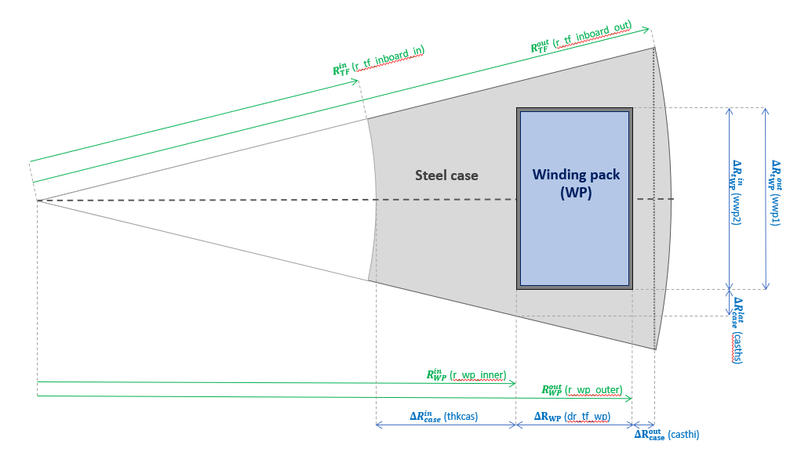
     
    <figcaption><i>
 
      Figure 1: Inboard mid-plane cross-section of the superconducting TF coils considered in PROCESS with associated parametrization. The green variables are calculated by the machine_build module subroutine while the blue ones are specific to the sctfcoil module. The light grey area corresponds to the steel casing containing the Winding pack and providing structural support. The dark grey area corresponds to the winding pack insertion gap, and its ground insulation. Finally the light blue area corresponds to the winding pack containing the conductor cables. More details on the parametrization is discussed in this section.

    </i></figcaption>
     
    

</figure>

#### TF coil inboard radial size

 
  Following the geometry and its parametrization presented in <em>Figure 1</em>, the TF total thickness <em>tfcth</em> \( \left( \Delta R_\mathrm{TF} \right) \) is related with the inner and outer case radial thicknesses (<em>thkcas</em>, \(  \Delta R_\mathrm{case}^\mathrm{in} \) and <em>casthi</em>, \( \Delta R_\mathrm{case}^\mathrm{out} \) respectively) and the WP radial thickness <em>dr_tf_wp</em> \(\Delta R_\mathrm{WP}\) by the following equation :

$$ 
\Delta R_\mathrm{TF} = \frac{R_\mathrm{TF}^\mathrm{in} + \Delta R_\mathrm{WP} + \Delta R_\mathrm{case}^\mathrm{out} + \Delta R_\mathrm{case}^\mathrm{in} }{\cos\left(\frac{\pi}{N_\mathrm{TF}}\right)} - R_\mathrm{TF}^\mathrm{in}
$$

 
  with \( R_\mathrm{TF}^\mathrm{in} \) (<em>r_tf_inboard_in</em>) the radius of the innermost TF edge, set by the central  solenoid coil size and \( N_\mathrm{TF} \) the number of TF coils. Reverted, to provide the WP thickness, the same equation simply becomes:

$$  
\Delta R_\mathrm{WP} = \cos\left(\frac{\pi}{N_\mathrm{TF}}\right) \left( R_\mathrm{TF}^\mathrm{in} + \Delta R_\mathrm{TF} \right) - R_\mathrm{TF}^\mathrm{in} - \Delta R_\mathrm{case}^\mathrm{out} - \Delta R_\mathrm{case}^\mathrm{in}
$$

 
  The TF coil radial thickness (<em>tfcth</em>) can parametrized in two ways in <em>PROCESS</em>:

- 
 
    **Direct parametrization**: the TF radial inboard thickness width is set as an input variable : `tfcth` (iteration variable 57). The WP radial thickness (`dr_tf_wp`) is calculated from `tfcth` and the two case radial thicknesses. This parametrization is used by default.
  

- 
 
    **WP thickness parametrization**: the TF inboard radial thickness is calculated from the the case and the WP radial thickness. This option is selected by using the WP thickness (`dr_tf_wp`, iteration variable 140) as an iteration variable. Doing so, any `tfcth` values will be overwritten and for this reason `dr_tf_wp` and `tfcth` cannot be used as iteration variables simultaneously. Although not set by default for backward compatibility, this parametrization provides a more stable optimization procedure (negative WP area layer cannot be obtained by construction) and is hence encouraged.
  

#### Case geometry

 
  Although not physically divided into pieces, three sections of the case can be considered: 

- 
 
    **The nose casing:** this section corresponds to the case separating the WP with the machine center. Due to the presence of net electromechanical centering forces, this case has a major structural purpose and is often much larger than the other sides. The nose case dimension is set by its radial thickness that the user can specify using the `thkcas`  input variable (iteration variable 57).
  

- 
 
    **Sidewall casing:** this section corresponds to the lateral side of the case, separating the WP with the other vaulted coils. As in the WP geometry is generally squared, the sidewall case thickness may vary with the machine radius. For this reason, the user sets its dimensions though its minimal thickness `casths`. The user can either directly specify `casths` or define it as a fraction of the total coil thickness at the inner radius of the WP (`r_wp_inner`) with the `casths_fraction` input. If `casths_fraction` is set in the input file, the `casths` value will be overwritten.
  

- 
 
    **Plasma side casing:** this section corresponds to the case section separating the WP with the plasma. As the geometry of this section is rounded, its thickness is set by its minimal value `casthi` (user input). This parameter can also be defined as a fraction of the total TF coil thickness `tfcth` using `casthi_fraction`. If the `casthi_fraction` parametrization is used, the `casthi` value will be overwritten.
  

Two different plasma side casing shapes can be selected using the `i_tf_case_geom` integer switch:

- 

    `i_tf_case_geom = 0` : The case has a rounded (cylindrical) profile on the plasma side. As it is the ITER design choice, this configuration is taken as default.
  

- 

    `i_tf_case_geom = 1` : The case has a flat profile on the plasma side.
  

*Figure 2* illustrates the two plasma side casing configurations.

<figure>
    

    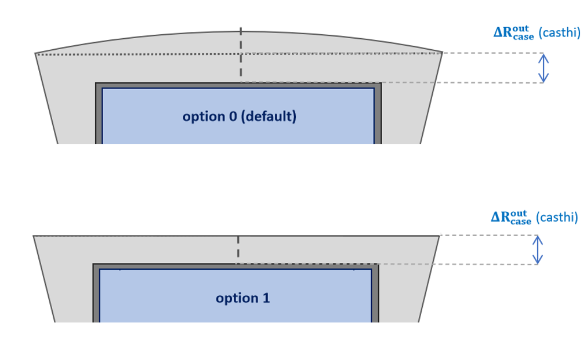
     
    <figcaption><i>
 
      Figure 2: Visual illustration of the two front casing geometry options. The to diagram shows the default i_tf_case_geom = 0 rounded option and the bottom the i_tf_case_geom = 1 straight option.

    </i></figcaption>
     
    

</figure>

#### Winding pack geometry

Several Winding pack geometries can chosen with the `i_tf_wp_geom` integer switch as shown in Figure 3: 

- 

    `i_tf_wp_geom = 0` : Rectangular winding pack. It is the only geometry compatible with the integer turn parametrization (`i_tf_turns_integer = 1`).

- 

    `i_tf_wp_geom = 1` : Double rectangle winding pack. The two rectangles are have the same radial thickness and their width in the toroidal direction is defined with the minimal sidewall thickness at their innermost radius.
  

- 
 
    `i_tf_wp_geom = 2` : Trapezoidal WP. The WP area is defined with a trapezoid, keeping the sidewall case thickness constant. This is however probably not a realistic shape as the turns are generally rectangular. This option has been added mostly to allow comparison with simplified FEA analysis configurations.
  

<figure>
    

    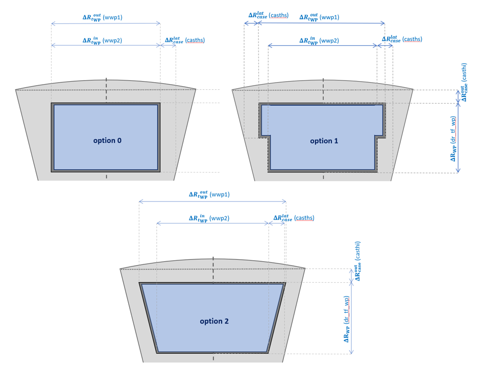
      
    <figcaption><i>
 
      Figure 3: Visual illustration of the WP shapes the user can select with the i_tf_wp_geom integer switch. The wwp1 and wwp2 parameters, added in option i_tf_wp_geom = 1 are calculated using the minimal sidewall case thickness.
    
</i></figcaption>
     
    

</figure>

#### Turns geometry

  <em>Figure 4</em> illustrates the winding pack internal structure and the
  individual turns structure.

<figure>
    

    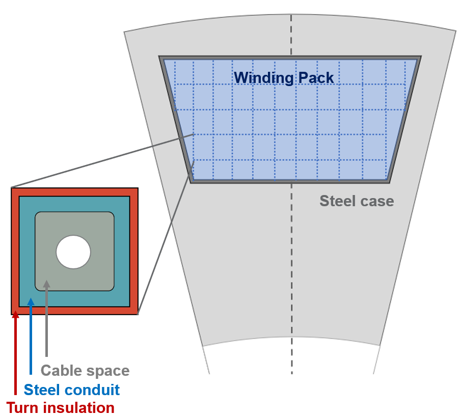
      
    <figcaption><i>
 
      Figure 4: Illustration of the winding pack internal structure. The top 
      right diagram shows the inboard mid-plane cross section of a TF coil with
      the steel case in light grey and the winding pack in light blue. The dotted
      lines illustrate the rectangular conductor. The bottom left zoom-in section shows the conductor structure used in the
      <em>PROCESS</em> module. The red section represent the individual turn
      electrical insulation, the turquoise the steel jacket/conduit providing
      structural support, the grey is the area allocated to the superconductor
      material, copper stabiliser and inter-strand coolant, and the white circle the helium cooling channel.  (The superconductor,
      copper stabiliser and coolant together make up the 'cable'.)
    
</i></figcaption>
     
    

</figure>

The winding pack is assumed to be made of \(N_\mathrm{turn} \) (`n_tf_turn`) 
turns. The number of turns can be parametrized in three different ways :

- 

    **Current per turn parametrization (default):** `i_tf_turns_integer = 0` the
    user sets the value of the current flowing in each turns `cpttf`. The number
    of turns necessary to carry the total TF coil current is then deduced from
    `cpttf`. There is no guarantee that a realistic turn configuration (with all
    the turn geometrically fitting in the allocated space) or even have an
    integer number of turn is used with this parametrization. If the turn
    thickness `t_turn_tf` or the cable thickness `t_cable_tf` is defined by
    the user, this parametrization is not selected.
  
   
- 

    **Turn size parametrization:** the dimension of the turn `t_turn_tf` can be
    set by the user. To do so, the user just have to select the following option:
    `i_tf_turns_integer = 0` and to set a value to the variable `t_turn_tf`. The
    area of the corresponding squared turn and the number of turns necessary to
    fill the WP area is deduced. There is no guarantee that a realistic turn
    configuration (with all the turn geometrically fitting in the allocated
    space) or even have an integer number of turns is used with this parametrization.
    The current per turn `cpttf` will be overwitten.
  

- 

    **Cable size parametrization:** the dimension of the SC cable `t_cable_tf`
    can be set by the user. To do so, the user just have to select the following
    option: `i_tf_turns_integer = 0` and to set a value to the variable
    `t_cable_tf`. The area of the corresponding squared turn is deduced adding
    the steel conduit structure and the turn insulation. The number of turns
    necessary to fill the WP area is then deduced. There is no guarantee that a
    realistic turn configuration (with all the turn geometrically fitting in the
    allocated space) or even have an integer number of turns is used with this
    parametrization. The current per turn `cpttf` will be overwitten.
  
 
- 
 
    **Integer turn parametrization:** `i_tf_turns_integer = 1` the user sets the
    number of layers in the radial direction (`n_layer`) and the number of turns in the toroidal direction
    (`n_pancake`). The number of turns is integer. The turn cross-section is not necessarily square, giving different
    averaged structural properties in the radial and toroidal directions. Only a rectangular WP can be used for this parametrization.
  

  
  The turn internal structure, illustrated in <em>Figure 4</em>, is inspired
  from the cable-in-conduit-conductor (CICC) design, with the main different
  being that a rounded squared cable space is used (grey area in <em>Figure 4
  </em>). The rounding curve radius is take as 0.75 of the steel conduit 
  thickness. The turn geometry is set with with the following thicknesses:

- 

    **Turn insulation thickness `thicndut`:** user input setting the thickness
    of the inter-turn insulation.
  

- 

    **Steel jacket/conduit thickness `thwcndut` (iteration variable 58):** user
    input thickness of the turn steel structures. As it is a crucial variable
    for the TF coil structural properties it is also an iteration variable.
  

- 

    **Helium cooling channel diameter `dhecoil`:** user input defining the 
    size of the cooling channel.
  

#### Cable composition

  As the conductor cable composition is only used to correct the area used to
  compute current density flowing in the superconductor material, to be compared
  with its critical current density, an average material description is enough
  for the <em>PROCESS</em>models. The composition is set with the following
  material fractions:

- 

    **Cable void fraction (`vftf`):** user input setting the void fraction
    between the strands. This fraction does not include the helium cooling
    pipe at the cable center.
  

- 
 
    **Copper fraction (`fcutfsu`):** user input setting the copper fraction.
    This fraction is applied after the void and helium cooling channels areas
    has been removed from the conductor area.
  

### Resistive coil geometry

A much simpler inboard mid-plane geometry is used for resistive TF coils, as shown in <em>Figure 6</em>. The most important difference is the absence of the lateral steel casing structure. Three main sections can be distinguished:

- **The bucking cylinder:** radial thickness `thkcas` (iteration variable 57), is present to support the centering forces.  Its presence is however not mandatory and can be can be removed setting TODO.
- **The conductor area:** radial thickness `dr_tf_wp` (iteration variable 140). Ground insulation, corresponding to the dark grey area in *Figure 6* is included in this section by convention.
- **The outer cylinder:** radial thickness `casthi`. This cylinder plays no role in the structural models in PROCESS.
  
<figure>
    

    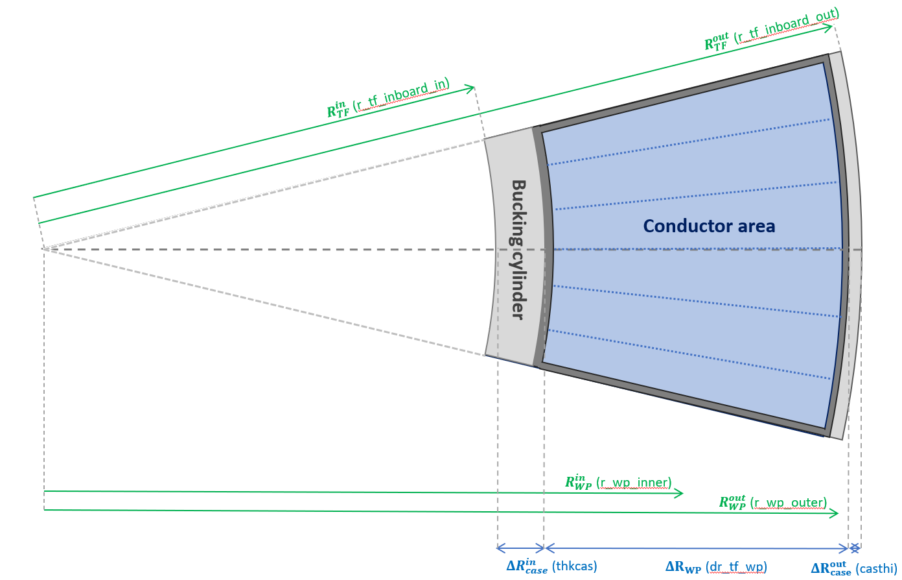
      
    <figcaption><i>
      

        Figure 6: Resistive TF coil inboard leg structure at mid-plane. The
        disjoint steel case (no lateral case) are shown in light grey. The
        ground insulation wrapping the turns is shown in grey and the conductor
        region containing the turns in light blue. The dotted blue illustrate 
        the location of the 6 coils turn.
      

    </i></figcaption>
     
    

</figure>

The conductor layer is made of \(N_\mathrm{turn}\) turns per coil, set by the `n_tf_turn` user input. The entire coil is wrapped with ground insulation of thickness `tinstf`. Inside the ground insulation, each conductor ("turn") is wrapped in a turn insulation,  thickness `thicndut`. The coolant occupies using a fraction of the mid-plane cross-section given by `fcoolcp` (iteration variable 23).

<figure>
    

    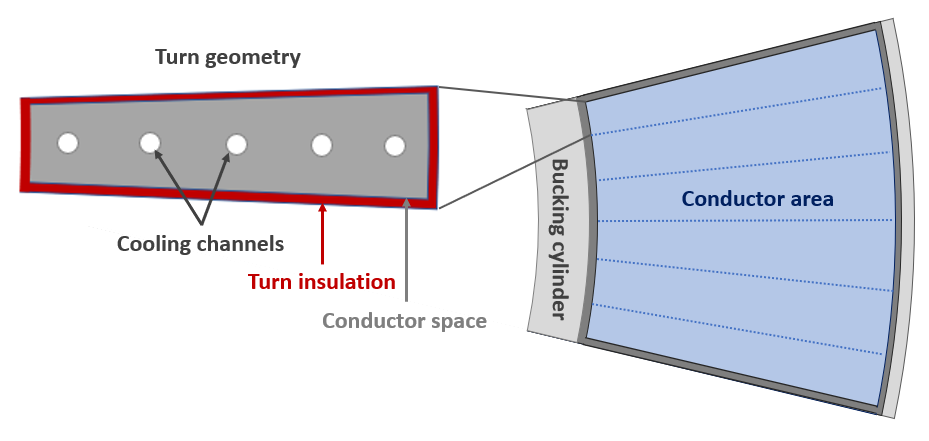
      
    <figcaption><i>
      

      Figure 7: Schematic view of a single TF coil cross-section with four resistive turns. The positions of the cooling channels are 
      not specified in PROCESS - only the area occupied by coolant and the channel diameters.
      

    </i></figcaption>
     
    

</figure>

## TF coil shape

### Coil shape

Two shapes can be selected using the `i_tf_shape` integer switch:

- 

    **D-shape (`i_tf_shape = 1`):** simplified D-shape parametrization defined
    in the (R,Z) plane by a straight section and four elliptical arcs. The
    corresponding shape is not exactly the constant tension Princeton D but, but
    it is not so critical as the shape is mostly used to provide the coil 
    circumference and illustration purposes in the current version of the
    *PROCESS* code. This shape is considered by default for conventional aspect
    ratio tokamaks (`itart = 0`).
  

- 

    **Picture frame `i_tf_shape = 2`:** rectangular shape, allowing space for
    an eventual super-X divertor. However this design can only be used for at
    low aspect ratio, characterized by low vertical forces on the TF outboard
    section. This shape is considered by default for low aspect ratios
    tokamaks (`itart = 1`).
  

  Resistive coils can benefit in having a larger outboard conductor area than
  the inboard one, to reduce resistive heating without increasing the plasma
  major radius or increasing its aspect ratio. For this reason, thicker outboard
  can be set using the <em>tfootfi</em> user input defined as the ratio between
  ouboard and inboard TF coil legs. The possibility of having different coil
  thicknesses is only available for resistive coils and <em>tfootfi</em>
  would have no effect if superconducting coils are selected (<em>i_tf_sup = 1
  </em>).

### Resistive centre-post

In a spherical tokamak the inboard legs of a resistive TF coil are known collectively as the "centre-post" (CP).

  As the resistive heating depends on the magnet cross-section (in the plan
  perpendicular to the current direction), heating can be substantially reduced
  by flaring the central section of the TF coils. The corresponding shape is
  illustrated in the right hand side of <em>Figure 8</em>. The radius of the inboard
  leg then increases away from the midlane as shown. This design is used by default for spherical tokamaks (<em>itart = 1</em>).

<figure>
    

    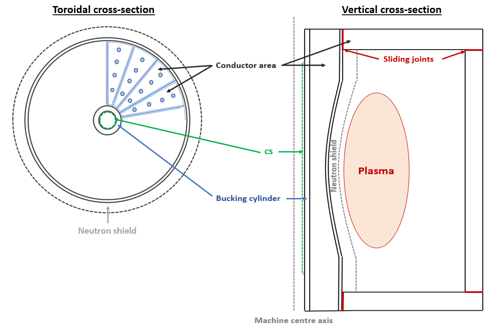
      
    <figcaption><i>
      

        Figure 8: Mid-plane toroidal (left) and vertical (right) 
        cross-section of a magnet using the itart == 1 geometry option. The toroidal
        cross-section (left) shows the presence of vaulted turn geometry with a
        bucking cylinder (that is not present by default for copper magnets) with
        insulation and cooling. The vertical cross-section (right) shows the
        presence of 4 sliding joints for remote maintenance purposes.
      

    </i></figcaption>
     
    

</figure>

The radius of the top and bottom of the inboard leg `r_cp_top` (iteration variable 174) can be set in three
different ways:

- 

    **Calculated (`i_r_cp_top = 0`, default):** , the top CP radius is calculated
    from the positions of the X-points. This option generally leads to a relatively
    large degree of flare.
  

- 

    **User input (`i_r_cp_top = 1`):** the user sets the value of `r_cp_top`, or selects it as an iteration
    variable (174).  If `r_cp_top` is less than 1.01$R_\mathrm{TF}^\mathrm{mid}$
    (TF inboard mid-plane outer radius), the TF top radius is set to
    `1.01*r_tf_inboard_out` with an error warning.  If `r_cp_top` is too large, causing the centre-post to interfere with the X-point, an error message is generated.
  

- 

    **Mid/top TF radius ratio (`i_r_cp_top = 2`):** `r_cp_top` is set as a ratio
    of the inboard mid-plane radius to the input parameter `f_r_cp`, defined as \( \frac{
    R_\mathrm{TF}^\mathrm{top} }{R_\mathrm{TF}^\mathrm{out}} \). If `r_cp_top` is too large, causing the centre-post to interfere with the X-point, an error message is generated. This option allows the shape of the centre-post to remain constant when varying the machine size.

  The resistive heating, cooling requirement and material masses are calculated taking the
  flaring into account, parametrized with an arc. The cross-sectional area of the coolant channels is uniform throughout the centre-post, making the coolant fraction smaller at the top where less resistive heating is expected due to the larger conductor section. 

### TF coil joins

  Another aspect of the TF coil design is the presence of demountable joints.
  Having demountable joints can ease the maintenance strategy by allowing to
  remove the inboard section of the coil vertically without moving the
  outboard section of the Tokamak. Moreover, if the joints allows some
  longitudinal and toroidal movements (sliding joints), they can also ease the
  TF coils structural design by significantly reducing the inboard mid-plane
  vertical tension. Some other advantages not captured by process of sliding
  joins is the reduction of out-of-plane stresses generated from PF coils fields
  of the TF corners. Finally, although the increase of resistive power
  dissipation is took into account in <em>PROCESS</em>, the technical feasibility
  of sliding joints with superconducting magnets is not addressed. The joint
  option can by selected by following switch:

- 

    **No TF joints (`i_cp_joints = 0`, SC magnets default):** this corresponds
    to a conservative DEMO/ITER like strategy making the coil more reliable at
    the cost of a more complex remote maintenance strategy.
  

- 

    **Sliding joints (`i_cp_joints = 1`, resistive magnet default):** the joints
    is made of Feldmetal connectors allowing longitudinal sliding and toroidal
    torsion. Such joints allows to decouple the inboard TF coil vertical tension
    from the outer legs ones (effect captured in *PROCESS*) and cancel the
    out-of-plane (OOP) shear stress at the joints (effect not captured in
    *PROCESS* as OOP stress is not calculated). The joint resistive heating is
    also calculated and more specific design can be set by tuning the
    joints surfacic resistivity (`rho_tf_joints`), the number of joints per coil
    (`n_tf_joints`), the number of contact per joints (`n_tf_joints_contact`)
    and the thickness of the joint contact (`th_joint_contact`). It is possible
    to use sliding joints with SC coils in *PROCESS*, but it is not advised to
    do so except if the user has a very specific design in mind.
  

## TF stress modelling

  The <em>PROCESS</em> TF coil module only considers the inboard mid-plane stress
  constraint. Although it is the most stringent design constraint for the
  machine build, out-of-plane stress, local bending stresses due to the coil
  shaping, ripple and inter-coil structure effects remains to be evaluated after  
  a <em>PROCESS</em> run. Inboard mid-plane stress limits can be introduced
  using the following constraints equations:

- 

    **Conducting layer stress limit (`icc = 32`):** stress limit on the
    conductor layer on the material take the most of stress that supports.
    For superconducting TF coils, the stress limit is applied on the steel case
    jacket/conduit while for resistive coil, the stress limit is applied on the
    conductor itself. Set the maximum stress using the variable
    `sig_tf_wp_max`. This constraint can also be used with a stellarator.
  

- 

    **Centring support structure stress limit (`icc = 31`):** stress limit on the
    coil centering support structures. For superconducting coils, this stress
    limit is applied on the nose case (machine center direction) while for
    resistive coil this stress limit is applied on a cylindrical bucking
    cylinder. Set the maximum stress using the variable `sig_tf_case_max`.
    This constraint can not be used with a stellarator.
  

### Vertical tension

#### No sliding joints case

  The interaction between the TF coil field with the horizontal
  component of its current induces an identical and opposite vertical force
  \( F_\mathrm{z}\) on the upper and lower sections of the TF coils. If
  axisymmetry is assumed, this force only depends on the coil current
  \( \left( \frac{I_\mathrm{TF}^\mathrm{tot}}{N_\mathrm{TF}} \right) \)  
  and its radial build. If we parametrize the conductor layer radial build
  with its in/outboard (\(R_\mathrm{in}\)/\(R_\mathrm{out}\) )  radii and
  its thickness (\(\Delta R_\mathrm{cond} \)), the vertical force is given by:

$$
\begin{align}\label{eq: vforce}
	F_\mathrm{z} = \frac{ I_\mathrm{TF}^\mathrm{tot} }{N_\mathrm{TF}} 
   \frac{B_\mathrm{T} R_\mathrm{maj}}{2 {\Delta R_\mathrm{cond}}^2}  
    & \left[{R_\mathrm{out}}^2 \ln\left( \frac{R_\mathrm{out} + \Delta R_\mathrm{cond}}{R_\mathrm{out}} \right)  + {R_\mathrm{in}}^2 \ln\left( \frac{R_\mathrm{in} }{R_\mathrm{out} - \Delta R_\mathrm{cond}} \right) \right.  \\
	& \qquad \left. {} + {\Delta R_\mathrm{cond}}^2 \ln\left( \frac{R_\mathrm{out} + \Delta R_\mathrm{cond} }{R_\mathrm{in} - \Delta R_\mathrm{cond}} \right)  - \Delta R_\mathrm{cond}\left( R_\mathrm{in} + R_\mathrm{out} \right)   \right.\nonumber \\
	& \qquad \left. {} + 2\Delta R_\mathrm{cond} \left\{ R_\mathrm{in}\ln\left(\frac{R_\mathrm{in}-\Delta R_\mathrm{cond}}{R_\mathrm{in}} \right) + R_\mathrm{out}\ln\left(\frac{R_\mathrm{out}+ \Delta R_\mathrm{cond}}{R_\mathrm{out}}  \right)   \right\}  \right] \nonumber
\end{align}
$$

  with \(B_\mathrm{T}\) and \(R_\mathrm{maj}\) the plasma center toroidal field
  and major radius, respectively. This force is distributed between inboard
  \( \left( T_\mathrm{z}^\mathrm{in}\right)\) and outboard \(\left(T_\mathrm{z}
  ^\mathrm{out}\right)\) legs. The resulting tensions are in general not equals
  as they depends on coil shape. This asymmetry is parametrized <em>PROCESS</em>
  buy the following user input <em>f_vforce_inboard</em> \(\left(f_{F_\mathrm{z}}
  ^\mathrm{in}\right)\) defined as:

$$
  T_\mathrm{z}^\mathrm{in} = f_{F_\mathrm{z}} F_\mathrm{z}
$$

  with \(T_\mathrm{z}^\mathrm{in}\) the vertical tension acting on the inboard
  leg of a TF coil. The <em>f_vforce_inboard</em> default value (0.5)
  corresponds to the special case of a perfect Princeton-D. On the other hand
  a picture frame coil can show larger asymmetries with <em>f_vforce_inboard</em>
  values around 0.65.

#### Sliding joint case

  The presence of sliding joints allows to decouple the vertical tension
  generated by the outboard legs horizontal current from inboard coil section.
  If the joints are placed just after the TF coil central section, significant
  inboard tension reduction can be achieved (the inboard section takes 10-20%
  of the total vertical force depending on the configurations). The same method
  as the no sliding joints case is used to estimate the vertical tension with
  the only difference being that the force integral is stopped at the joint
  location \(\left( R_\mathrm{joint}\right)\) instead of the outboard leg. The
  inboard vertical tension is then given by:

$$
\begin{align}
	T_\mathrm{z}^\mathrm{in} = \frac{1}{2} \frac{B_\text{max}R_{B_\mathrm{max}} I_\mathrm{tot}}{N_\mathrm{TF} {\Delta R_\mathrm{cond}}^2} &\left[ 
	{R_\mathrm{in}}^2 \ln\left( \frac{R_\mathrm{in}}{R_\mathrm{in}-\Delta R_\mathrm{cond}} \right) + {\Delta R_\mathrm{cond}}^2 \ln\left( \frac{ R_\mathrm{joint} }{ R_\mathrm{in}-\Delta R_\mathrm{cond}} \right) \right. \\	
	& \qquad \left. {} + \frac{2}{3} {\Delta R_\mathrm{cond}}^2  +  R_\mathrm{in} \Delta R_\mathrm{cond} 
	\left(2\ln\left( \frac{R_\mathrm{in}-\Delta R_\mathrm{cond}}{R_\mathrm{in}} \right) -1 \right) \right]\nonumber
\end{align}
$$

  with \(R_\mathrm{in}\) and \(\Delta R_\mathrm{cond} \) the inboard mid-plane
  plasma facing side conductor radius and its inboard thickness.

### Inboard mid-plane stress

  The inboard mid-plane stress is calculated using a simplified cylindrical
  geometry. This geometry assumption applies perfectly for the resistive coil
  geometry but is less adapted to the SC coil more complex geometry, that mixes
  a discontinuous WP-case nose interface with a continuous sidewall-nose case
  interface depending (depending on the toroidal angle). Thus even if the
  <em>PROCESS</em> TF SC coil stress
  model provide acceptable (within 4-10% error margins) stress distributions
  for global machine design, it is advised to finalize the stress analysis with
  FEA models that captures the stress variations in the toroidal direction and 
  its associated maximum stresses. Two models can be used to calculate inboard
  mid-plane normal stresses radial distributions. They both support an arbitrary
  number of different material layers and mainly differs in the way the vertical
  tension is introduced:

- 

    **Plane stress (`i_tf_stress_model = 1`, default):** the calculations are
    made under the plane stress assumption. Plane strain model applies for thin
    layer in the vertical direction and is there fore not applicable to
    this configuration in theory. The radial and toroidal stress calculations
    are made assuming no vertical tension. A constant vertical stress is then
    estimated *a posteriori* by dividing the inboard vertical tension by the
    support sutructure area to obtain the 3 normal stress necessary to for the
    *TRESCA* yield stress estimate as described in [1]. Although using
    un-adapted model hypothesis this model is still used by default as it
    has been validated on FEA analysis and benchmarked with the *MADMAX* *CEA*
    code on DEMO designs.

- 

    **Generalized plane strain (`i_tf_stress_model = 0,2`):** the
    calculations are made using the generalized plane strain hypothesis that
    applies for tall cylinders with external external force applied at the end
    (vertical tension). This is the correct assumption for inboard mid-plane
    stress calculations that allows to derive the vertical stress distribution
    coherently [2]. This formulation has been developed for transverse orthotropic
    materials (isotropic in the \(\left(r, \theta\right) \) plane with different
    properties in the vertical direction). This allows to applies different
    Poisson's ratio, one for the \(\left(r, \theta\right) \) plane to \(z\) and
    another for the radial to toroidal direction. Although more coherent and
    complete this model is not yet used by default as more FEA validations
    are needed. `i_tf_stress_model = 0` is the older model, which is O(n^3)
    in the number of layers and fails if there is a solid bore. 
    `i_tf_stress_model = 2` is the newr model, which is O(n) and accepts a solid
    bore, but is otherwise identical to the older model `i_tf_stress_model = 0`.
  

  These two models can use any number of material layers with different
  Young modulus and Poisson's ratios for each layers (two pairs of Young modulus
  and Poisson's ratio are used for the generalized plane strain model). As the
  conductor layer of a TF coil is relatively complex, smeared properties are
  used to set the Young modulus, as described in the next section.

#### Stress layer definition

  Defining the stress model layers is straightforward for resistive as the
  inboard coils and the model shares the same axi-symmetry (see <em>Figure 6
  </em>). However the SC coils inboard geometry shown in <em>Figure
  4</em> is more complex as the presence of lateral case breaks the
  axi-symmetry and the rectangular nature of the winding pack breaks the
  cylindrical geometry of the stress layers. Therefore, several adjustments must
  be made to properly define the stress model parametrization. First, as the
  model does not allow to take the lateral to plasma side case connection into
  account (axi-symmetry), the plasma side case effect is taken into account
  by reducing the effective vertical tension in the calculation assuming a
  constant vertical strain (generalized plane strain) by the following factor :

$$
  f_{F_\mathrm{z}} = \frac{ E_\mathrm{steel} A_\mathrm{steel}^{eff} + E_\mathrm{ins} A_\mathrm{ins} }
                          { E_\mathrm{steel} A_\mathrm{steel}^{tot} + E_\mathrm{ins} A_\mathrm{ins} }
$$

  with \( A_\mathrm{steel}^{eff} \) the effective steel cross-section area
  defined as the total steel TF cross section \(A_\mathrm{steel}^{tot}\) minus
  the front casing one. For free standing coils, only two layers are therefore
  considered for the stress calculations TF coils (<em>Figure 9</em>):

- 

    **Structural support layer:** made of the steel case nose section. No <em>e.
    m.</em> body forces are present in this layer, therefore so the stress 
    variations are only driven by geometrical effects (constant vertical stress)
- 

    **Conductor layers:** made of the winding packs and the lateral casings.
    Two levels of property smearing is performed for this layer, the WP-lateral
    case smearing and the internal WP smearing from the turn structure. This
    section contains the <em>e.m.</em> body forces driving a vertical stress
    radial dependency though Poisson's ratio effects.
  

<figure>
    

    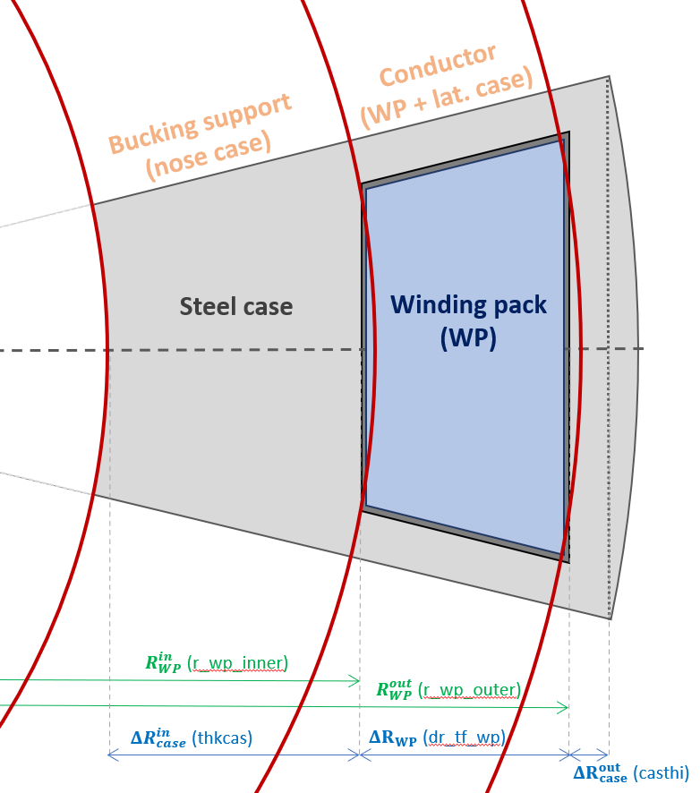
     
    <figcaption><i>
      
 
        Figure 9: Positioning of the layers used in the stress calculations
        delimited by the red lines. The corresponding radii are defined keeping
        the nose and plasma side casing area constant to get consistent vertical
        stress calculations.
      

    </i></figcaption>
     
    

</figure>

  Due to the squared WP geometry, its inner/outer radius can take different
  values depending on the considered toroidal angle. To bypass this difficulty,
  the WP stress layer radii (\( R_\mathrm{WP,\ eff}^\mathrm{in/out}\)) has been
  defined is such a way that the nose casing and the plasma side area remain the
  same between the geometrical calculation and the cylindrical ones with [3].
  As the property smearing is based on area fractions in the vertical direction
  this definition allows consistent vertical tension calculations. These
  \(R_\mathrm{WP,\ eff}^\mathrm{in}\) and \(R_\mathrm{WP,\ eff}^\mathrm{out}\)
  radii are given by:

$$
  R_\mathrm{WP,\ eff}^\mathrm{in/out} = R_\mathrm{WP}^\mathrm{in/out}
    \sqrt{\frac{\tan\theta_\mathrm{TF}}{\theta_\mathrm{TF}}}
$$

  with \(R_\mathrm{WP}^\mathrm{in/out}\) the inner or outer middle-coil WP
  radius used to parametrize the coil geometry (see <em>Figure 1</em>) and
  \(\theta_\mathrm{TF} = \frac{\pi}{N_\mathrm{TF}}\) the half radial extent
  of the TF coil inboard leg.

#### Structural properties smearing

##### Resistive coil conductor smearing

  The resistive TF coil properties are only smeared in the vertical direction
  to take the effect of the cross section taken by the cooling and the, with the
  corresponding effective young modulus \(\bar{E_\mathrm{z}}\)

$$
  \bar{E_\mathrm{z}}\ = f_\mathrm{ins} E_\mathrm{ins} +  \left( 1 - f_\mathrm{ins} \right)
    \left( 1 - f_\mathrm{cool} \right) E_\mathrm{cond}
$$

  with \(E_\mathrm{ins}\)/\(E_\mathrm{cond}\) the insulation layer/ conductor
  material Young modulus and \(f_\mathrm{ins}\)/\(f_\mathrm{cool}\) the
  insulation/conductor cooling mid-plane cross-section area fractions.
  \(f_\mathrm{ins}\) is calculated from the insulation layers thicknesses and
  number of turns while \(f_\mathrm{cool}\) is a defined by the user with
  <em>fcoolcp</em>, defined with the conductor area after the insulation area
  subtracted. Even though the presence of insulation layer tends lower the Young
  modulus in the toroidal direction, no property smearing is done for now for
  resistive coils for now.

##### Superconducting coil winding pack smearing

  The transverse and the vertical WP smeared properties are calculated
  separately. The WP smeared Young modulus in the vertical direction
  \(\bar{E}_\mathrm{z}^\mathrm{WP}\) is calculated assuming constant vertical
  strain (generalized plane strain or parallel case), and is give by:

$$
  \bar{E}_\mathrm{z}^\mathrm{WP} = \frac{A^\mathrm{steel}_\mathrm{WP\ eff} E_\mathrm{steel}
                                   + A^\mathrm{ins}_\mathrm{WP} E_\mathrm{ins}}
                               { \pi \left( {R_\mathrm{WP,\ eff}^\mathrm{out}}^2
                                 - {R_\mathrm{WP,\ eff}^\mathrm{in}}^2 \right) }
$$

  with \(A^\mathrm{steel}_\mathrm{WP\ eff}\) and \(A^\mathrm{ins}_\mathrm{WP}\)
  being the area taken by the WP steel turn jackets plus the sidewall case area
  and the WP total insulation area, respectively. The WP transverse properties
  are calculated decomposing the turn geometry in series (constant strain), as
  illustrated in <em>Figure 10</em>.

  
<figure>
    

    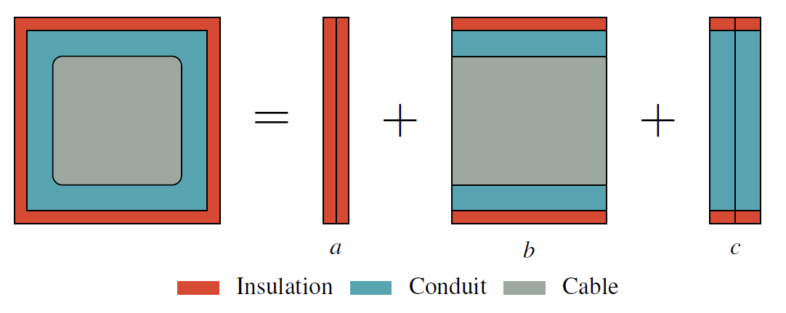
     
    <figcaption><i>
      
 
        Figure 10: turn structure decomposition used to estimate the average
        winding pack average Young modulus. The decomposition is made considering
        a vertical stress component, corresponding to a parallel decomposition
        (constant strain).
      

    </i></figcaption>
     
    

</figure>

  As the steel conduit is much stiffer the force is approximated to go only on
  the \(c\) section, lowering the young by ratio between the total and the steel
  conduit case thickness. This approximation is wrong if the insulation's or the
  conductor cable Young modulus is at the same order of magnitude as the steel
  support's one. The \(c\) section properties are then calculated using the
  series case assumption (constant stress). The final WP effective young modulus
  is then given by

$$
  \bar{E}_\mathrm{t}^\mathrm{WP} = \frac{2t_\mathrm{cond}}
    {2\frac{t_\mathrm{ins}}{E_\mathrm{ins}} + \frac{ t_\mathrm{turn} - 2t_\mathrm{ins} }{E_\mathrm{steel}} }
$$

  with \( t_\mathrm{ins} \), \( t_\mathrm{turn} \) and \( t_\mathrm{cond} \) the
  insulation, turn and steel conduit structures thicknesses. For CICC cables
  the vertical Young's modulus is generally about 2-3 times larger than the
  transverse. It is expected as the vertical smearing is based on steel area
  and the transverse one steel thickness ratios, with the support structure
  being round the cable, the area ratio is naturally more favorable. Finally, to
  properly take the effect on the lateral casing on the WP layer properties, an
  additional series smearing is performed, using the average lateral casing
  thickness for the smearing. The effective Young modulus for the stress
  calculation is therefore given by:

$$
  \bar{E}_\mathrm{t}^\mathrm{WP\ eff} = \frac{ 2 \left< t_\mathrm{side\ case} \right>
                                               + \left< t_\mathrm{WP} \right> }
                                             { 2 \frac{\left< t_\mathrm{side\ case} \right>}{E_\mathrm{ins}}
                                               + \frac{\left< t_\mathrm{WP} \right>}{\bar{E}_\mathrm{t}^\mathrm{WP}} }
$$

  with \(\left< t_\mathrm{side\ case} \right>\) and \(\left< t_\mathrm{side\ case
  } \right>\) the average thickness in the toroidal direction of the sidewall
  case and the winding pack, respectively.
  If the integer turn option is used (<em>i_tf_turns_integer = 1</em>), the cases
  are not always squared. The smearing procedure will therefore produce a
  different young modulus in the radial and the toroidal direction. However, a
  study using a similar stress model, but with fully orthotropic material
  (different radial and toroidal Young modulus) [3], has shown that the radial
  direction Young's modulus value has almost no effect on the stress distribution
  ITER like magnets. For this reason the toroidal direction Young modulus on the
  toroidal direction is used as the WP transverse young modulus.

#### Stress unsmearing

  The raw stress distributions calculated with the smeared properties cannot be
  used directly for the conductor structural constraints. The stress distribution
  must be corrected to get the stress on the actual support structures. The
  un-smeared support structure stress on the vertical direction \(\sigma_
  \mathrm{zz}\) is obtained simply by:

$$
  \sigma_\mathrm{zz} = \bar{\sigma}_\mathrm{zz} \frac{E_\mathrm{struc.}}
    {\bar{E}_\mathrm{z}^\mathrm{WP\ eff}}
$$

  A stress unsmearing is also necessary on the transverse direction for SC coils.
  Two unsmearing transverse factors are defined (lateral and toroidal), that
  will differ if the integer turn option is selected (non squared turns
  selected with <em>i_tf_turns_integer = 1</em>).

#### Inboard TF coil support

Several centering forces support options structures are proposed in *PROCESS*,
selected with the `i_tf_bucking` integer switch.

- 

    **No support (`i_tf_bucking = 0`):** the TF coil is only made of
    a conducting layer. This is the default option for copper magnets
    (`i_tf_sup = 0`). However, as the superconducting magnets winding pack is
    surrounded by a closed steel case, this option is incompatible with
    superconducting coils (`i_tf_sup = 1`).
  

- 

    **Free standing TF bucking (`i_tf_bucking == 1`):** the conductor is
    supported by a dedicated centering support and is not in contact with the CS
    coil. This support is nown as a bucking cylinder for resistive magnets, and is referred to as the 'nose'
    of the case for superconducting magnets. This is the default option
    for aluminium (`i_tf_sup = 2`) and superconducting magnets (`i_tf_sup = 1`).
  

- 

    **Bucked and wedged (`i_tf_bucking == 2,3`):** the TF coil uses the CS coil
    as centering forces structural support. This design allows to substantially
    reduce the thickness of the TF coil individual suport structure if a large
    CS coil is present. As the CS coil current generates a beneficial CS radial
    outward forces, the most critical instant for structural support is the
    moment when no current flows in the CS coil. The CS coil is therefore
    represented as an additionnal stress layer with `e.m.` no body forces.
    The layer strctural properties are defined using using similar smearing/
    unsmeating procedure as the TF coil, as detailed in issue [4]. The maximum
    between the CS stress from the this model and the on calculated in the
    `pfcoil` module is taken as the CS coil stress limit (constraint 72). A fast
    version, neglecting the interface layer properties is implemented 
    (`i_tf_bucking == 2`). And a more complete one, taking explicitly the Kapton
    interface into account in the stress calcualtions (`i_tf_bucking == 3`) is
    also implemented. Before using this design option, the user must know two
    major potential issues not captured by *PROCESS*. The first is the fatigue
    introduced by the CS on the TF coil. The second is the nature of the CS-TF
    coil interface that has to allow vertical slinding at cryogenic temperatures,
    as the CS vertical size reduces when energized and the TF coil vertical
    tension makes TF grow taller with current flowing in it. The CS and the TF
    coil are therefore strain insulated, therefore all the vertical tension is
    taken by the TF coil structures.
  

  It is also possible to fill the CS coil bore with structural material to
  further support the TF centering forces. Although not currently implemented
  in <em>PROCESS</em>, to technical issues prevents simulating its structural
  effects. Please contact the <em>PROCESS</em> team if you wish to consider
  this option in your design and you are sure to understand the increase in
  complexity such design requires.

#### Stress limits

  The maximum of the stress distributions after unsmearing, is used to compute
  the TRESCA yield stress, defined as:

$$
  \sigma_\mathrm{TRESCA} = \max{ \left(
                                 \left| \sigma_\mathrm{rr} - \sigma_\mathrm{\theta\theta} \right|,
                                 \left| \sigma_\mathrm{\theta\theta} - \sigma_\mathrm{zz} \right|,
                                 \left| \sigma_\mathrm{zz} - \sigma_\mathrm{rr} \right|
                                 \right)
                               }
$$

  The transverse stresses (\(\sigma_\mathrm{rr}\) and \(\sigma_\mathrm{\theta\theta}\))
  are negative and the vertical streess (\(\sigma_\mathrm{zz}\)) positive. As
  the toroidal stress is generally larger than the toroidal one, the \(\left|
  \sigma_\mathrm{\theta\theta} - \sigma_\mathrm{zz} \right|\) term is expected
  to drive the yield stress value. The associated constraint equations are the
  31, 32 and the 72 (if <em>i_tf_bucking == 2 or 3</em>). The value of the
  Von-Mises yeild stress is also shown in the output for information.

## TF coil ripple

  Because of the finite number of TF coils used in a tokamak (18 for ITER and 16
  for DEMO), the axisymmetry is effectively broken. Therefore, in addition to
  the radial dependency, the toroidal field also varies as a function of the toroidal
  angle and the vertical position. This effect is known as ripple. Electromagnetic
  ripple impacts TF coil design in two ways:

- 

    **Plasma ripple:** The toroidal filed variation on the low field side
    generates some instabilities that degrades the plasma confinement.
    Moreover, some significant fast particles losses can be present if the
    field variation becomes too large between coils, threatening the divertor
    and first wall integrity.  
  

- 

    **On coil ripple:** If the lateral case is separating the conductor region
    (winding pack), the genuine magnetic field at the inboard superconducting
    conductor is larger than the value obtained using the axisymmetric
    assumption.
  

### Plasma ripple

The maximum plasma ripple is defined in *PROCESS* with the user input `ripmax`
as:

$$
  \delta = \frac{B_\mathrm{max}-B_\mathrm{min}}{B_\mathrm{max}+B_\mathrm{min}}
$$

  with \( B_\mathrm{min}\) and \( B_\mathrm{max}\) minimum field (between coils)
  and the maximum field (on coil toroidal direction) respectively, measured at
  the mid-plane plasma outer limit (separatrix). <em>PROCESS</em> plasma ripple
  is estimated using a parametric Bio-Savart calculation fitted using the
  <em>UKAEA</em> free boundary MHD code <em>FIESTA</em>. The shape (Princeton-D) 
  used for these MHD model is shown in the left section of Figure 11. 
  

<figure>
    

    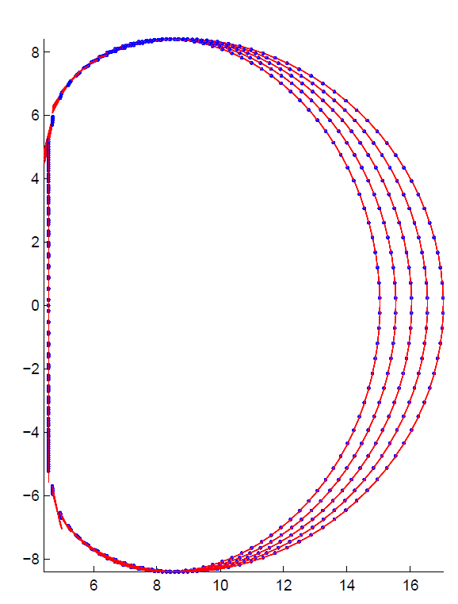
    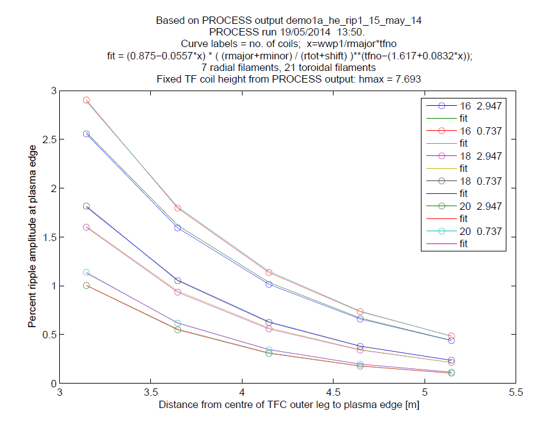
     
    <figcaption><i>
      
 
        Figure 11 : The left graph shows the filament shape used in the
        <em>FIESTA</em> ripple calculations. The current loops are made straight
        section (red lines) connecting vertices (blue dots) following the coil
        shape. The right plot shows the ripple calculated by <em>FIESTA</em> (lines with
        open circles) compared to the fit values (lines without circles) for
        different number of coils (16, 18 and 20) and lateral winding pack to
        TF size ratio (\(x = 0.737\) and \(x = 2.947\)) as a function of the
        outer leg winding centre position.
      

    </i></figcaption>
     
    

</figure>

  The results of the ripple fit is shown on the right section of Figure 11 and
  its analytical expression given by:

$$
  \delta = (0.875 - 0.0557x)\ y^{N_\mathrm{TF}-\left(1.617+0.0832x\right)}
$$

  with \(x\) the lateral thickness of the winding pack normalized to the coil
  dimensions defined as:

$$
  x = \frac{\Delta R_\mathrm{tWP}^\mathrm{out}}{R_\mathrm{maj}} N_\mathrm{TF}
$$

  

  with \(\Delta R_\mathrm{tWP}^\mathrm{out}\) the plasma side WP thickness
  defined in the Figures 1 and 3, \(N_\mathrm{TF}\) the number of coils and
  \(R_\mathrm{maj}\) the plasma centre radius. \(y\) is the plasma outer
  mid-plane separatrix to outboard TF leg mid-plane radius ratio:

$$
  y = \frac{R_\mathrm{maj} + a_\mathrm{min}}{R_\mathrm{outboard\ TF}^\mathrm{mid}}
$$

  with \(a_\mathrm{min}\) the plasma minor radius and \(R_\mathrm{outboard\ TF}
  ^\mathrm{mid}\) the TF winding pack outboard leg midplane radius at its
  centre. The scaling fitting range is provided by:

- 

    **Number of coils:** \( N_\mathrm{TF} \in \{16, 18, 20\} \).
  

- 

    **Winding pack size ratio:** \( x \in [0.737-2.95] \)
  

- 

    **separatrix to TF ratio:** \( y \in [0.7-0.8] \)
  

  

  To prevent intolerable fast particles losses and plasma instabilities,
  \(\delta\) must be limited to a few percent, approximatively \( \delta \in
  [0.5-1]\) . If intolerable, the plasma ripple can be reduced with many
  different techniques, for example the TF coil shape, stabilisation coils can
  be added, more coils can be used or the coil outboard radius can be increased.
  All these design modifications affects the coil system design, for example
  ripple shape optimisation should be done without generating too much bending
  stress due to the un-adapted curvature radius, and adding coils must not prevent
  remote maintenance. To keep the design procedure as simple as possible in
  <em>PROCESS</em>, unacceptable ripple is reduced by simply moving the
  TF coil leg to a larger radius. The outboard ripple is directly obtained reverting the ripple fit to provide
  \(R_\mathrm{outboard\ WP}^\mathrm{mid}\) as a function of the ripple.
  The minimal \(R_\mathrm{outboard\ WP}^\mathrm{mid}\) is technically obtained
  by increasing the gap between the vacuum vessel and the coil (gapsto).

  The currently implemented plasma ripple evaluation assumes a Princeton-D shape
  and is therefore not valid anymore if very different shapes are considered,
  with picture frame coils, for example, different models should be 
  considered/implemented in <em>PROCESS</em>.

### On coil ripple

  The ratio of TF coil magnetic field increase with respect to the axisymmetric
  formula has been defined as :

$$
  f_\mathrm{rip}^\mathrm{coil} = \frac{B_\mathrm{rip}}{B_\mathrm{nom}}
$$

  with \(B_\mathrm{rip}\) being the maximum field measured at the middle of the
  plasma facing sides of the winding pack and \(B_\mathrm{nom}\) the nominal maximum
  field obtained with the axisymmetric formula (see section TF coils current).
  The same <em>FIESTA</em> runs have been used to estimate the on-coil ripple.
  This peaking factor has been fitted separately for 16, 18 and 20 coils using
  the following formula:

$$
  f_\mathrm{rip}^\mathrm{coil} = A_0 + A_1 e^{-t} + A_2 z + A_3 zt
$$

  with the \(A_n\) the fitted coefficients and \(t\) the relative winding pack
  lateral thickness defined as:

$$
  t = \frac{\Delta R_\mathrm{tWP}^\mathrm{out}}{\Delta R_\mathrm{tWP}^\mathrm{out\ max}}
$$

  with \(\Delta R_\mathrm{tWP}^\mathrm{out}\) defined in Figure 1 and 3 and
  \( \Delta R_\mathrm{tWP}^\mathrm{out\ max} \) the same value calculated without
  sidewall case as illustrated in Figure 12.

  
<figure>
    

    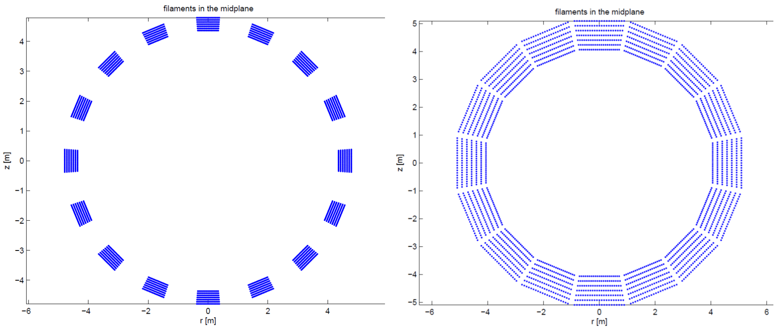
     
    <figcaption><i>
      
 
        Figure 12: Inboard midplane cross section showing the filaments used for
        the on-coil ripple calculations with <em>FIESTA</em> with 16 coils. A
        radial and toroidal winding pack thickness of 0.5 m and 0.8 m for the 
        left graph, while a radial and toroidal thickness of 1.2 m and 1.9 m, 
        respectively, is used in the right figure. The right graph provides
        a visual illustration of the case where the parameter \(t\) is close to
        unity.
      

    </i></figcaption>
     
    

</figure>
  

  And the relative winding pack radial thickness \(z\) given by

$$
  z = \frac{\Delta R_\mathrm{WP}}{\Delta R_\mathrm{tWP}^\mathrm{out\ max}}
$$

  The three fits (for 16, 18 and 20 coils) are valid for:

- 

    **relative toroidal thickness:**  $t\in[0.35-0.99]$
  

- 

    **relative radial thickness:** $z\in[0.2-0.7]$
  

- 

    **Number of TF coils:** Individual fits has been made for 16, 18 and 20.
    <b>For any other number of coils, the *FIESTA* calculations are not used</b>
    and a default ripple increase of 9% is taken (\( f_\mathrm{rip}^\mathrm{coil}
    = 1.09\)). This default value is also used for 17 and 19 coils.
  

  Figure 13 shows a contour plot of the on-coil ripple peaking factor as a
  function of the winding pack sizing parameters for 16 coil.

<figure>
    

    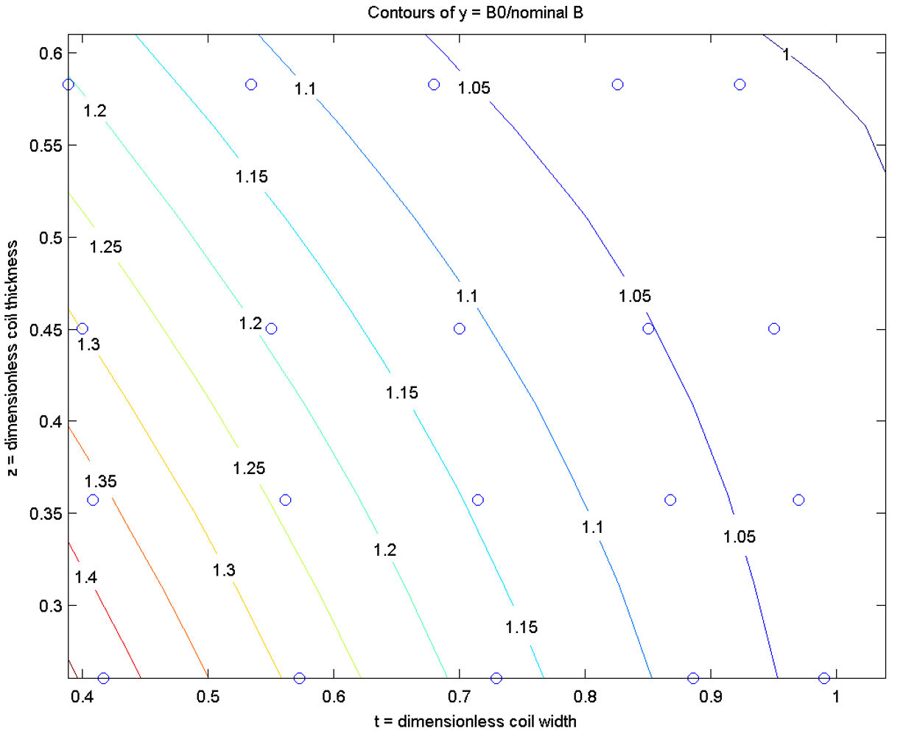
     
    <figcaption><i>
      

        Figure 13: Contour plots of the on-coil peaking factor \(f_\mathrm{rip}
        ^\mathrm{coil}\) obtained with <em>FIESTA</em> and used in the
        <em>PROCESS</em> scaling for 16 coils. The horizontal and vertical
        axis corresponds to the relative transverse \(t\) and radial thickness
        \(z\), respectively.
      

    </i></figcaption>
     
    

</figure>

  These ripple calculations are out of the spherical tokamak design range, having generally
  fewer coils (between 10 and 14) and more radially thick winding packs.
  It is also worth mentionning that the the ripple must be evaluated layer-by-layer for graded coil designs, to get the genuine B field of each layer
  used to quatify the SC cross-section area per layer. Finally, resistive
  coils do not suffer from on-coil ripple as there is no radial case is present.

## TF coil stored energy
The stored magnetic energy is calculated.

## Critical current density for the superconductor 
The minimum conductor cross-section is derived from the critical current density for the superconductor in the operating magnetic field and temperature, and is enforced using constraint 33.

Switch `i_tf_sc_mat` specifies which superconducting material is to be used:

- `i_tf_sc_mat == 1` -- Nb$_3$Sn superconductor, ITER critical surface parameterization[^5], standard critical values
- `i_tf_sc_mat == 2` -- Bi-2212 high temperature superconductor
- `i_tf_sc_mat == 3` -- NbTi superconductor
- `i_tf_sc_mat == 4` -- Nb$_3$Sn superconductor, ITER critical surface parameterization[^5], user-defined critical parameters
- `i_tf_sc_mat == 5` -- WST Nb$_3$Sn parameterization
- `i_tf_sc_mat == 6` -- REBCO HTS tape in CroCo strand
- `i_tf_sc_mat == 7` -- Durham Ginzburg-Landau critical surface model for Nb-Ti
- `i_tf_sc_mat == 8` -- Durham Ginzburg-Landau critical surface model for REBCO
- `i_tf_sc_mat == 9` -- Hazelton experimental data combined with Zhai conceptual model for REBCO

The fraction of copper present in the superconducting filaments is given by `fcutfsu` (iteration variable number 59).

For `i_tf_sc_mat = 2`, a technology adjustment factor `fhts` may be used to modify 
the critical current density fit for the Bi-2212 superconductor, to describe the 
level of technology assumed (i.e. to account for stress, fatigue, radiation, 
AC losses, joints or manufacturing variations). The default value for `fhts` is 
0.5 (a value of 1.0 would be very optimistic).

For `i_tf_sc_mat = 4`, important superconductor properties may be input as follows:
- Upper critical field at zero temperature and strain: `bcritsc`,
- Critical temperature at zero field and strain: `tcritsc`.

The toroidal field falls off at a rate $1/R$, with the peak value occurring at the outer edge of the inboard portion of the TF coil winding pack (radius `rbmax`). 

Three constraints are relevant to the operating current density $J_{\mbox{op}}$ in the TF coils.

- Criticial current (`constraint 33`): $J_{\mbox{op}}$ must not exceed the critical value $J_{\mbox{crit}}$.  Iteration variable 50 must be active (`fiooic`).  The current density margin can be set using the upper bound of `fiooic`:

$$
  J_{\mbox{op}} < \texttt{fiooic} \cdot J_{\mbox{crit}}
$$

- `Constraint 35` -- To ensure that $J_{\mbox{op}}$ does not exceed the current density protection limit, constraint equation no.\ 35 should be turned on with iteration variable 53 ( `fjprot`).

- Temperature margin (`constraint 36`) -- The critical current density $J_{\mbox{crit}}$ falls with 
  the temperature of the superconductor. The temperature margin $\Delta T$ is the difference between the current sharing temperature (at which $J_{\mbox{crit}}$ would be equal to $J_{\mbox{op}}$) and the operating temperature. The minimum allowed $\Delta T$
can be set using `tmargmin` together with constraint equation 36 and iteration variable 54 (`ftmargtf`). Note that if the temperature margin is positive, $J_{\mbox{op}}$ is guaranteed to be lower than \jcrit, and so constraints 33 and 36 need not both be turned on. It is recommended that only one of these two constraints is activated.

### Resistive heating

To be done. Please contact the PROCESS team if you need more informations.

## Code structure

The TF coil structure is illustrated by the box diagram in Figure 14.

<figure>
    

    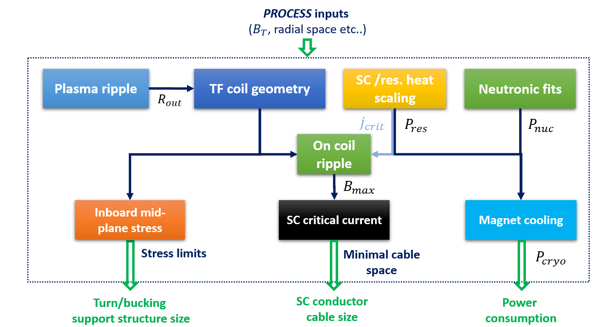
     
    <figcaption><i>
      

        Figure 14: Box diagram illustrating the TF coil codes structure in
        <em>PROCESS</em>. The neutronic/plasma ripple/magnet cooling boxes are
        effectively placed in other modules, but should be effectively contained
        in an eventual standalone version of the module.
      

    </i></figcaption>
     
    

</figure>
More technically, models are coded in the `sctfcoil` subroutine, structured in
the following order:

1. `ripple_amplitude`: Plasma ripple. Subroutine effectively contained in
  `machine_build.f90`
2. `tf_global_geometry` : In/outboard leg areas at mid-lane
3. `tf_current` : Calculate the TF coil currents
4. `sc_tf_internal_geom`/`res_tf_internal_geom` : Set the exact superconducting/resistive magnets inboard mid-plane geometry, including the Turn geometry.
5. `coilhap`: Define the vertical TF coil shape
6. `tf_res_heating`: Estimate the TF coil resistive heating (not used for SC magnets)
7. `tf_field_and_force`: Estimate the inboard/outboard vertical tensions
8. `tfcind`: Estimate the TF coil inductance
9. `tf_coil_area_and_masses`: Estimate the mass of the different coil materials
10. `peak_tf_with_ripple`: Estimate the ripple peak field correction.
11. `stresscl`: Estimate the inboard mid-plane stress distributions.

Another subroutine, `tfspcall` is called outside `stfcoil` to estimate to check on the TF superconducting properties.

## TF coil parameter summary table

### General parameters

|  Parameter | description | Default |
| - | - | - |
| `n_tf` | Number of TF coils | 16 |
| `i_tf_sup` | Swich selecting the conductor technology:    - 0 : Water cooled copper (GLIDCOP)    - 1 : Superconducting TF magnets    - 2 : Helium cooled Aluminium magnets | 1 |
| `i_tf_sc_mat` | Swich for superconducting material    1 : Nb$_3$Sn superconductor, ITER critical surface parameterization[^1], standard critical values   2 : Bi-2212 high temperature superconductor   3 : NbTi superconductor   4 : Nb$_3$Sn superconductor, ITER critical surface  parameterization[^1], user-defined critical parameters   5 : WST Nb$_3$Sn parameterization   6 : REBCO HTS tape in CroCo strand   7 : Durham Ginzburg-Landau critical surface model for Nb-Ti   8 : Durham Ginzburg-Landau critical surface model for REBCO   9 : Hazelton experimental data combined with Zhai conceptual model for REBCO | 1 |

 

### Mid-plane geometry parameters

|  Parameter | description | Iteration variable | Default | Unit |
| - | - | - | - | - |
| `tf_in_cs` | TF coil inboard leg radial placement switch.   - 0 : Outside of central solenoid   - 1 : Inside of central solenoid |  - | 0 | - |
| `tfcth` | TF coil maximum radial size   calculated if `dr_tf_wp` is used as iteration variable |  ixc = 13 | No default | m |
| `tfootfi` | Outboard/inboard TF coil thickness ratio | - | 1 | - | 
| `dr_tf_wp` | Winding pack radial thickness   calculated if `tfcth` is used as iteration variable. Include the ground insulation and the insertion gap. | ixc = 140 | No default | m | 
| `thkcas` | Nose/inner case radial thickness | ixc = 57 | 0.3 | m |
| `casths` | Minimal sidewall casing thickness | - | - | m |
| `casths_fraction` | Minimal sidewall casing thickness as a fraction of the TF coil toroidal thickness. Overwites the `casths` input value | - | 0.03 | - |
| `casthi` | Minimal plasma side casing thickness | - | - | m |
| `casthi_fraction` | Minimal plasma side casing thickness as a fraction of the TF thickness (`tfcth`). Overwites the `casthi` input value | - | 0.05 | - |
| `i_tf_case_geom` | Plasma side casing geometry option:  - 0 : rounder front casing (ITER)   - 1 : Straight casing | - | 0 | - |
| `i_tf_wp_geom` | Winding pack geometry option:  - 0 : rectangular   - 1 : double rectangle   - 2 : trapezoidal | - | Integer turn : 0    otherwise : 1  | - |
| `tinstf` | WP ground insulation thickness | - | 0.018 | m |
| `tfinsgap` | WP insertion gap thickness | - | 0.01 | m |

 

### Turn parameters

|  Parameter | description | Iteration variable | Default | Unit |
| - | - | - | - | - |
| `i_tf_turns_integer` | Switch activating the integer turn parametrization   - 0 : Integer number of turns   - 1 : non integer number of turn | - | 0 | - |
| `n_layer` | Number of turns in the radial direction (`i_tf_turns_integer = 1` only) | - | 20 | - |
| `n_pancake` | Number of turns in the toroidal direction (`i_tf_turns_integer = 1` only) | - | 10 | - |
| `t_turn_tf` | TF turn squared size | - | No default | m |
| `t_cable_tf` | TF cable diameter size | - | No default | m |
| `f_t_turn_tf` | f-value for TF turn squared size constraint (icc = 86) | 175 | 1. | m |
| `t_turn_tf_max` | Maximum turn squared size for constraint (icc = 86) | - | 0.05 | m |
| `cpttf` | Current per turn   Overwitten if `t_turn_tf` is set by the user | ixc = 60 | $70.10^3$ | A |
| `thicndut` | Turn insulation layer thickness | -  | $0.8.10^{-3}$ | m |
| `thwcndut` | Steekl jacket/conduit thickness | 58 |  $8.10^{-3}$  | m |
| `dhecoil`  | Helium cooling channel diameter | -  |  $5.10^{-3}$  | m |
|   `vftf`   | Cable void fraction | -  | 0.4 | - |
| `fcutfsu`  | Copper cable fraction   defined with the cable area minus the void and cooling channel area | ixc = 59 | 0.69 | - |

 

### Vertical shape

|  Parameter | description | Iteration variable | Default | Unit |
| - | - | - | - | - |
| `itart` | Switch for tapered inboard TF section   0 : conventional inboard leg   1 : Tapered inboard leg (centrepost, CP) | - | 0 | - |
| `i_tf_shape` | Switch selecting the TF coil shape   1 : D-shape approximation   2 : Rectangular (picture frame) shape | - | 1 : if `itart = 0`   2 : if `itart = 1`| - |
|  `r_cp_top` | CP TF coil top/bottom radius | ixc = 174 | No default | m |
|  `f_r_cp` | CP TF top/mid-plane outer radius fraction | - | 1.4 | - |
|  `i_r_cp_top` | Switch selecting the `r_cp_top` parametrization   0 : `r_cp_top` calculated using the X-point location   1 : Set by user   2 : Set with `f_r_cp` | - | 0 | - |

 

### TF coil joints

|  Parameter | description | Iteration variable | Default | Unit |
| - | - | - | - | - |
|  `i_cp_joints` | Switch selecting the TF coil demoutable joints strategy   0 : No demountable joints    1 : MAST like sliding joints  | - | 0 : if `itart = 0`   1 : if `itart = 1` | - |
|  `n_tf_joints` | Number of joints per coils | - | 4 | - |
|  `n_tf_joints_contact` | Number of contacts per joints | - | 6 | - |
|  `rho_tf_joints` | Joint surfacic resistivity | - | $2.5.10^{-10}$ | $\Omega.m$ |
| `th_joint_contact` | Joint contact thickness | - | 0.03 | m |

 

### TF coil inboard mid-plane stress

|  Parameter | description | Iteration variable | Default | Unit |
| - | - | - | - | - |
| `f_vforce_inboard` | Fraction of the vertical force supported by the inboard leg | - | 0.5 | - |
|  `i_tf_stress_model` | Switch to select the inboard mid-plane stress model   1 : Plane stress   0,2 : Generalized plane stress | - | 0 | - |
|  `i_tf_bucking` | Switch to select the bucking strategy   0 : No bucking structure   1 : TF bucking structure   2 : TF bucked on CS coil   3 : TF bucked on CS coil (CS-TF layer included in the stress calc.) | - | 0 : if `i_tf_coil \= 1`   1 : if `i_tf_coil = 1` | - |

 

## TF coil python utilities

  The <em>plot_stress_tf.py</em> utility provides a summary of the stress
  calculations providing by plotting the radial distributions of:

- 

    **Radial displacement** used to calculated the strain/stress distribtions.
    No toroidal displacement is assumed on the vertical direction due to up/down
    symmetry and no toriodal diplacement is present as axysymmetry is assumed
    in the stress model
  

- 

    **Smeared normal strains:** in the radial, toroidal and vertical directions.
    By definition the vertical strain distribution is constant in the generalized
    plane strain formulation. Continuous toroidal strain and discontinuouns
    radial strain is expected between the different layers.
  

- 

    **Smeared normal stress:** in the radial, toroidal and vertical directions.
    Vertical stress is expected to vary in the condictor layer but to remain
    constant in each other layers (no body forces). Continuous radial stress is
    expected as the layers are assumed to be in contact while discontinous
    toroidal stress is expexted between layer if the toroilal young modulus are
    different.
- 

    **Structure normal stress:** in the three directions. These corresponds to
    the stress after unsearing. The associated *Von-Mises* and *TRESCA* yield
    are also shown. The maximum *TRESCA* stress is used to set the limit on the
    TF coil structures.
  

Please note that only a fraction of the plots will be performed if the plane
stress option is chosen (this is the default stress option). The full set of
plots is however performed if the generalized plane strain option chosen.

# TF coil fast discharge : stress in vacuum vessel

In a TF coil fast discharge a large poloidal current is induced in the vessel.  See Vacuum Vessel.

# References

[^1]: "PROCESS": A systems code for fusion power plants - Part 2: Engineering M. Kovari, F. Fox, C. Harrington, R. Kembleton, P. Knight, H. Lux, J. Morris Fusion Engineering and Design 104 (2016) 9-20 
[^2]: Derivation_of_multilayer_generalized_plain_strain.docx in 
<a href="https://github.com/ukaea/PROCESS/issues/992"> PROCESS issue 992</a>
[^3]:  <a href = "https://github.com/ukaea/PROCESS/issues/1049"> PROCESS issue 1049 </a>
[^4]: <a href = "https://github.com/ukaea/PROCESS/issues/1032"> PROCESS issue 1032 </a>
[^5]: $J_c(B,T,\epsilon)$ Parameterizations for the ITER Nb$_3$Sn Production',
ITER Document 2MMF7J (2008), \texttt{https://user.iter.org/?uid=2MMF7J\&action=get\_document}

(Updated 13/4/23)
