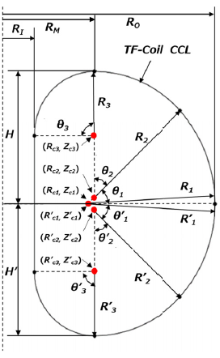
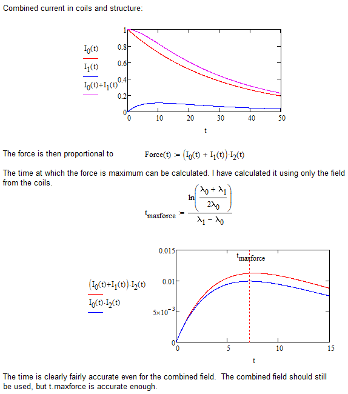

# Vacuum vessel

## Stress in vacuum vessel due to fast discharge of superconducting TF coil

If a superconducting TF coil undergoes a quench (rapid loss of superconductivity), a protection circuit will initiate a fast discharge of the entire TF coil set, in which much of the stored magnetic energy is discharged into an external dump resistor. The discharge is characterised by an exponential time constant, determined by the resistance of the dump resistor, but limited by the maximum permissible induced voltage. In a fast discharge a poloidal current is induced in the vessel. In the initial phase of the fast discharge a large fraction of the initial toroidal field is still present. The consequent Lorentz forces act outward on the vessel, analagous to an internal pressure.  Making the vessel stronger by increasing its overall thickness is of limited value, as this also reduces the electrical resistance.  However, the vessel can be strengthened using ribs and ports.

A model has been implemented, based on  
[Empirical Formulas for Estimating Self and Mutual Inductances of Toroidal Field Coils and Structures, Itoh et al](https://www.jstage.jst.go.jp/article/pfr/15/0/15_1405078/_article) (2020)[^1].

This model takes account of the currents induced in both the vacuum vessel and the steel TF coil structures.

Constraint 65 implements this model, by applying a maximum permitted stress in the vacuum vessel.  
`fmaxvvstress` f-value for constraint 65. Iteration variable 113.   
`theta1_coil` An angle, shown as $\theta_1$ in Figure 1, relating to the shape of the TF coil conductor centre-line (degrees).   
`theta1_vv` An angle, shown as $\theta_1$ in Figure 1, relating to the shape of the vacuum vessel centre-line (degrees).   
`max_vv_stress` The maximum permissible maximum shear stress in the vacuum vessel (Pa) (as used in the Tresca criterion).    

Example output:  
```
Minimum allowed quench time due to stress in VV (s)                      (taucq)                   2.831E+01  OP 
Actual quench time (or time constant) (s)                                (tdmptf)                  2.840E+01  ITV
Vacuum Vessel stress on quench (Pa)                                      (vv_stress_quench)        4.589E+07  OP 
```
In this example the stress is much smaller than the permissible value, so the constraint is satisfied but has no effect on the design.


The reference above proceeds as follows.

1.  An analytical formula is derived for the self-inductance of a TF coil composed of 6 circular arcs:
    
    <figure markdown>
    
    <figcaption>Figure 1: Shape definition of current center lines in poloidal cross-section[^1]. This diagram is a representation of the geometry of both the TF coils and the vacuum vessel.</figcaption>
    </figure>

2.  The parameters of the 6 arcs are expressed in terms of the overall parameters $\kappa$, $\delta$, A, H and $\theta_1$.  (Note these are parameters of the coil or vessel, not the plasma.  Also, $\theta_1$ is rather arbitrary, not a meaningful quantity.)

3.  As the analytical formula for the self-inductance is complicated, three surrogate formulae are derived by a regression analysis for the range:  
$1.5 ≤ \kappa ≤ 2.0$,  
1.5 ≤ A ≤ 2.0,   
$0.22 ≤ \delta ≤ 0.5$,   
$0 < \theta_1/90^{\circ} ≤ 0.7$ <br>
H sets the scale and can have any value.

All the inductance formulae are based determining the dimensionless factor $\xi$ in the equations below.  

The aspect ratio A of the vacuum vessel will always be smaller than the aspect ratio of the plasma, but it could easily exceed the maximum figure of 2.0 used for the surrogate formula.

Surrogate 1: Equation 2[^1]: 

$$\xi = c_0 + c_\kappa \kappa + c_\delta \delta + c_{A1}A + c_{A2}A^2 + c_\theta(\theta_1/90) + \varepsilon,$$

with $c_0 = 4.933$, $c_\kappa = 0.03728$, $c_\delta = 0.06980$, $c_{A1} = −3.551$, $c_{A2} = 0.7629$, and $c_\theta = −0.06298$.

(Note that $\varepsilon$ is not actually part of the formula - it just represents the error.)  
Maximum error 1.5%.

Surrogate 2 (most accurate): Equation 2 and a correction term $\Delta \xi$ given by   

$$\Delta \xi = C_0 + C_\kappa \kappa + C_\delta \delta + C_A A,$$

and had optimum coefficients $C_0 = 0.05808$, $C_\kappa = −0.05846$, $C_\delta = −0.02906$, and $C_A = 0.03008$.

Surrogate 3: $\xi$ is given by

$$\xi ' = {C'}_0 + {C'}_\kappa \kappa + {C'}_\delta \delta + {C'}_A A,$$

with ${C'}_0 = 3.026$, ${C'}_\kappa = −0.03238$, ${C'}_\delta = 0.1091$, and ${C'}_A = −1.093$.

Maximum error 1.4%. This is the simplest formula and doesn't use $\theta_1$, which is useful since $\theta_1$ is rather arbitrary.

The surrogate formulae assume up/down symmetry, but the exact formulae in the appendix do not, I think.

1.  The exact and surrogate self-inductance formulae have been checked against the value for the ITER TF coil set.

2.  In a fast discharge, eddy currents are induced in the TF coil structures, consisting of the coil cases and the steel in the winding pack (conduit plus radial plates if any).  Eddy currents are also induced in the vacuum vessel.  The induced currents and voltages are related by two simultaneous circuit equations involving the inductances and resistances.

3.  Based on a conceptual design, we estimate the parameters $\kappa$, $\delta$, A, and H for the midlines of the TF coil, the coil structure, and the vacuum vessel.

4.  The self and mutual inductances of these three structures are calculated using the exact or the surrogate formulae.  Note that the mutual inductance of the vacuum vessel and the coils is identical to the self-inductance of the vacuum vessel (multiplied by the number of turns).  The vessel is inside the coils, and with axisymmetry, the field generated by the vessel is zero outside the vessel.  All the field inside the vessel also links the coil set.  Therefore the flux linkage used for self-inductance is identical to that used for mutual inductance.

$$M_{02} = L_2 N_0$$

where  
throughout, subscript 0 denotes the TF-coil conductor, 1 denotes the coil structure, and 2 denotes the vacuum vessel (VV).  
$M_{02} =$ mutual inductance of TF coils and the vacuum vessel,  
$L_2 =$ self-inductance of vacuum vessel,    
$N_0 = N_{TFC} N_C$,  
$N_{TFC}$ is the number of TF coils,  
$N_C$ is the number of turns per coil.

8.  The poloidal loop resistance of the TF structure is approximately  

$$R_1 = \frac{\eta_{SSL} l_{CCL}}{N_{TFC} S_{\rm{structure}}}$$

where, giving some numerical values from the paper,    
$\eta_{SSL} =$ resistivity of SS316 (∼0.5 $\mu \Omega$m) at low temperature (4.2K),   
$l_{CCL} =$ the poloidal length of the midline of the TF structure,  
$S_{\rm{structure}} =$ the cross-sectional area of the TF structure (including the case and the steel content of the winding pack).

The poloidal loop resistance of the vessel is approximately  

$$R_2 = \frac{\eta_{SSH}}{\Delta_{VV}} \phi$$

where, giving some numerical values from the paper,    
$\eta_{SSH} =$ the resistivity of SS316 (0.84 $\mu \Omega$m) at high temperature ($100^{\circ}$C),  
$\Delta_{VV} =$ the vacuum vessel thickness, including an allowance for any poloidally continuous ribs,  
$\phi = 0.94$ an approximate numerical factor.

9.  The L/R time constant of the TF coil structure is assumed to be much greater than that for the vacuum vessel.  (This approximation is probably fine, but is not strictly needed.  The equations can be solved without it.)

10.  The current can now be derived as a function of time for each structure.  The TF coil structure has a significant influence on the induced current in the vacuum vessel.  The current in the TF coils is assumed to decay exponentially.


$$I_0(t) = I_{OP} \space e^{-\lambda_0 t}$$


$$I_1(t) = \lambda_0 N_0 I_{OP} \frac{e^{-\lambda_1 t} - e^{-\lambda_0 t}}{\lambda_0 - \lambda_1}$$


$$I_2(t) = \frac{\lambda_1}{\lambda_2} I_1   \space \space \space \space  (\rm{assuming} \space \lambda_2>>\lambda_0, \lambda_1)$$


where  
$I_0 =$ current in the TF coil conductor  
$I_1 =$ current in TF coil structure   
$I_2 =$ current in vacuum vessel  


$$\lambda_0 = 1/\tau_d$$


$$\lambda_1 = R_1 / L_1$$


$$\lambda_2 = R_2 / L_2$$

$\tau_d =$ decay time constant for the fast discharge of the TF coils,   
$R_1 =$ poloidal loop resistance of TF coil structure,  
$R_2 =$ poloidal loop resistance of vacuum vessel,  
$L_1 =$ self-inductance of the TF coil structure,  
$L_2 =$ self-inductance of vacuum vessel.  

The force on the vessel is proportional to the product of the field and the current in the vessel.  




The field in the inboard VV wall is due to the coils, plus the current in the structure, plus the current in the vessel itself:  

$$B_{VVI} = \mu_0 \frac{I_0 + I_1 + I_2/2} {2 \pi R_{VVI}}$$

$R_{VVI} =$ major radius of the inboard VV wall.

This should be evaluated at time $t_{\rm{maxforce}}$.

The current density in the inboard wall of the vessel is

$$J_{VVI} = \frac{I_2}{2 \pi \Delta_{VV} R_{VVI}}$$

This should also be evaluated at time $t_{\rm{maxforce}}$.

The stress used for the Tresca criterion (the maximum shear stress) is then given by:

$$\sigma_{VV} = |\sigma_\theta - \sigma_Z| = \zeta B_{VVI}J_{VVI}R_{VVI},$$

where $\zeta = 1+(A_{VV} - 1) \rm{ln}[(A_{VV} + 1) / (A_{VV} - 1)] / (2 A_{VV})$ with the $VV$ aspect ratio $A_{VV} = (R_{VVO} + R_{VVI})/(R_{VVO} - R_{VVI})$, where


$R_{VVI} =$ major radius of the inboard VV wall.  
$R_{VVO} =$ major radius of the outboard VV wall.


Obviously there are some key uncertainties.  The VV will include numerous ports that may tend to interrupt the poloidal flow of current, although the current can still flow around the port tube itself.  The thermal shield and in-vessel components have been ignored.  Only the stress in the inboard VV wall is included, and the possibility of buckling is ignored.


## References

[^1]: ITOH, Y. et al. (2020) *‘Empirical formulas for estimating self and mutual inductances of toroidal field coils and structures’*, Plasma and Fusion Research, 15(0), pp. 1405078–1405078. doi:10.1585/pfr.15.1405078. 