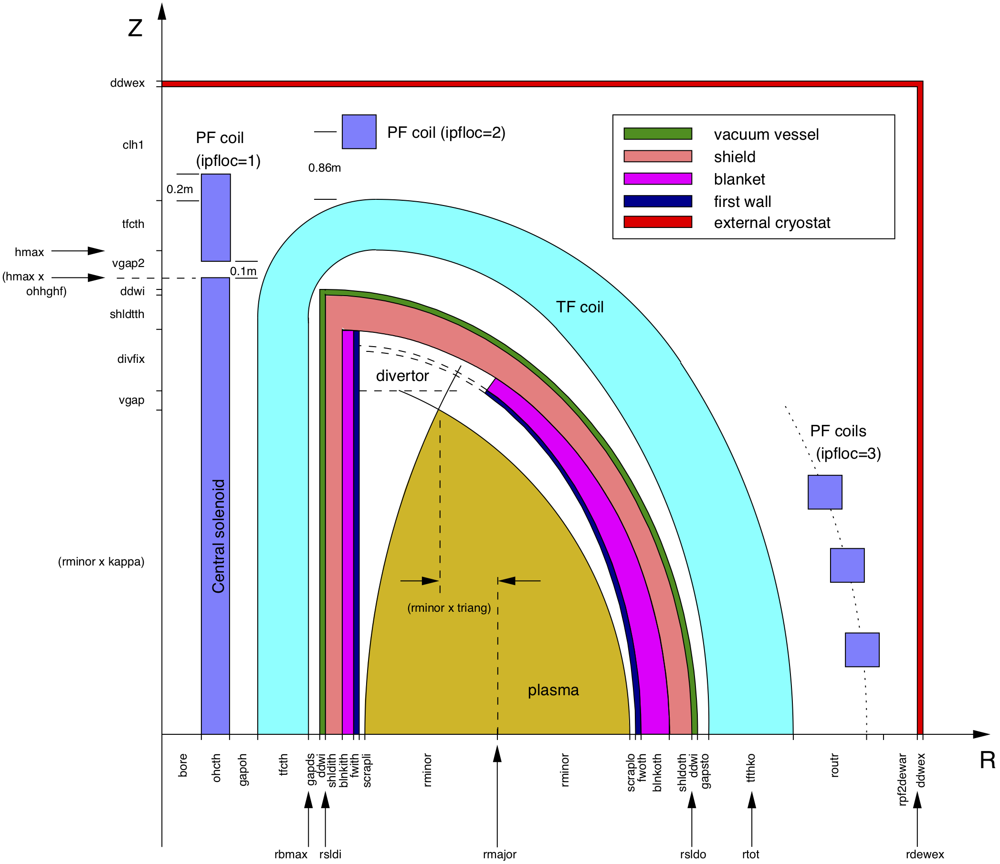
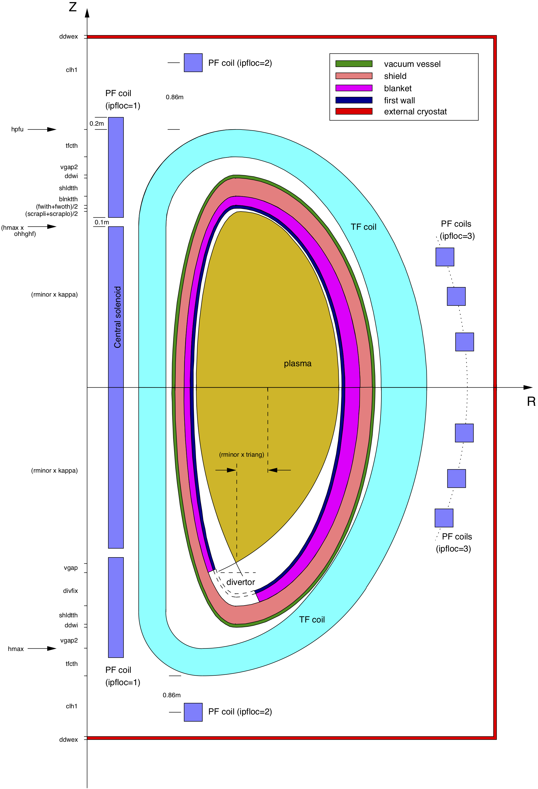
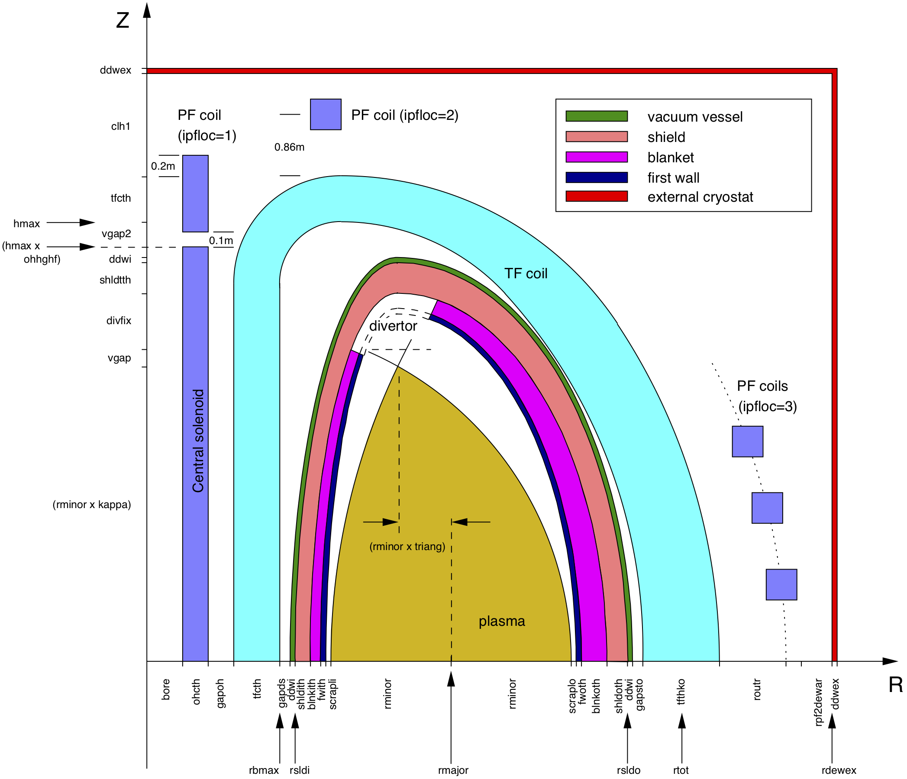

# Spherical Tokamak Model

`PROCESS` has the ability to perform studies on tokamaks in the low aspect ration regime (major radius $\leq$ 2 $\times$ minor radius). The physics and engineering issues[^1] associated with these machines are somewhat different from those of conventional aspect ratio, and this is reflected by the following special models[^2] in `PROCESS`.

1. The inboard build of a spherical tokamak (ST) is very different from that in a conventional tokamak. There is no inboard blanket (and possibly no inboard shield), and the inboard TF coil legs are replaced by a single centrepost. The radial build is altered so that, starting from the centreline (*R* = 0), the component order is: TF coil, gap, central solenoid, vacuum vessel, and then continuing as in Figure 1 (a D-shaped cross-section is assumed for the first wall, blanket, shield and vacuum vessel). 

    <figure>
        

        
          
        <figcaption><i>Figure 1: Schematic diagram of the fusion power core of a typical tokamak power plant modelled by `PROCESS`, showing the relative positions of the components. A double null plasma is assumed (`snull=0`) - compare Figure 2, and the first wall, blanket, shield and vacuum vessel are D-shaped in cross-section (chosen by setting switch `fwbsshape=1`) - compare Figure 3. Also shown are the code variables used to define the thicknesses of the components. The arrowed labels adjacent to the axes are the total 'builds' to that point. The precise locations and sizes of the PF coils are calculated within the code.
        </i></figcaption>
         
        

    </figure>

2. Spherical tokamaks have resistive TF coils that combine into a single centrepost at the centre of the machine. The centrepost is constructed from copper (as are the outboard TF coil sections), and tapered length ways so that it is narrowest at the midplane of the device. Routine `CNTRPST` calculates various parameters relevant to the centrepost, including the pump pressure, maximum temperature and pip radius, and these may be limited using constraint equations 43 to 45 of required:
    * Equation 43 is a consistency equation for the average centrepost temperature.
    * Equation 44 can be used to limit the peak centrepost temperature to a maximum value (`ptempalw`) using iteration variable no. 68 (`fptemp`).
    * Equation 45 can be used to force a lower; limit to the edge safety factor *q$_{lim}$* using iteration variable no. 71 (`fq`).
    Equation 46 can be used to apply an upper limit to the ratio of plasma current to TF coil ("rod") current , using iteration variable no. 72 (`fipir`)  

3. A gaseous divertor model is used, and a simple divertor heat load calculation is employed, rather than the more complex divertor model assumed for conventional aspect ratio tokamaks.   

4. A simple PF coil current scaling algorithm is available for use with the ST option.   

5. The plasma shaping terms (elongation and triangularity) can be calculated directly given the spect ratio, using `isahpe` = 1. This setting also scales the lower limit for the edge safety factor, for use with constraint equation no. 45:

    $$
    q_{lim} = 3 (1 + 2.6 \epsilon^{2.8})
    $$

    where ${\epsilon = a/R}$.   

6. Among the physics models that differ from those relevant to conventional aspect ratio machines are (i) the plasma poloidal field *B$_pol$*, (ii) the bootstrap current fraction, (iii) the beta limit, and (iv) the neutron heating of the centrepost[^2].   

## Spherical tokamak switches

Switch `itart` provides overall control of the ST switches within the code, and subroutine `CHECK` ensures that no conflicting values are inadvertently set by the user in the input file. Table 1 summarises the switch values relevant to each aspect ratio regime.

| Switch | Conventional aspect ratio (`itart = 0`) | Low aspect ratio (`itart = 1`) |
| --- | --- | --- |
| `ishape` | 0, 2, 3, 4 | 1, 5, 6, 7, 8 |
| `ibss` | 1, 2, 3 | 2, 3 |
| `icurr` | 1, 3, 4, 5, 6, 7 | 2, 9 |
| `itfsup` | 0, 1 | 0 |

Table 1: <i> Summary of the switch values in 'PROCESS' that relate to conventional aspect ratio and low aspect ratio machines.</i>

<figure>
    

    
      
    <figcaption><i>Figure 2: Schematic diagram of the fusion power core of a typical tokamak power plant modelled by `PROCESS`, showing the relative positions of the components. A single null plasma is assumed ('snull=1') - compare Figure 3. The radial build is the same as for a double null configuration; shown along the vertical axis are the code variables used to define the vertical thicknesses of the components. The arrow labels adjacent to the axis are the total 'builds' (distance from the midplane, Z=0) to that point. The precise locations and sizes of the PF coils are calculated within the code.
    </i></figcaption>
     
    

</figure>

<figure>
    

    
      
    <figcaption><i>Figure 3: Schematic diagram of the fusion power core of a typical tokamak power plant modelled by `PROCESS`. The first wall, blanket, shield and vacuum vessel cross-sectional shapes are each assumed to be defined by two ellipses (chosen by setting switch `fwbsshape=2`) - compare Figure 2.
    </i></figcaption>
     
    

</figure>

[^1]: Y-K. M. Peng and J. B. Hicks, *"Engineering Feasibility of Tight Aspect Ratio Tokamak (Spherical Torus) Reactors"*, AEA Fusion Report AEA FUS 64 (1990) 
[^2]: J. D. Galambos, *"STAR Code : Spherical Tokamak Analysis and Reactor Code", Unpublished internal Oak Ridge document. A copy exists in the `PROCESS` Project Work File[^3]. 
[^3]: P. J. Knight, *"`PROCESS` Reactor Systems Code"*, AEA Fusion Project Work File, F/RS/CIRE5523/PWF (1992) 