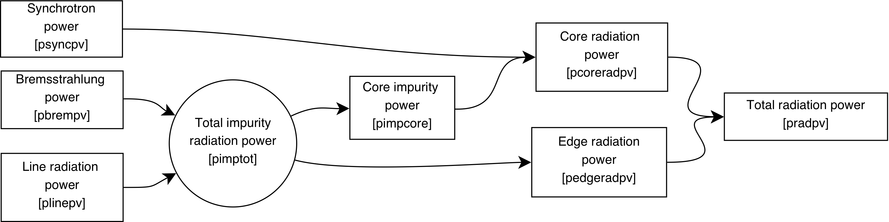
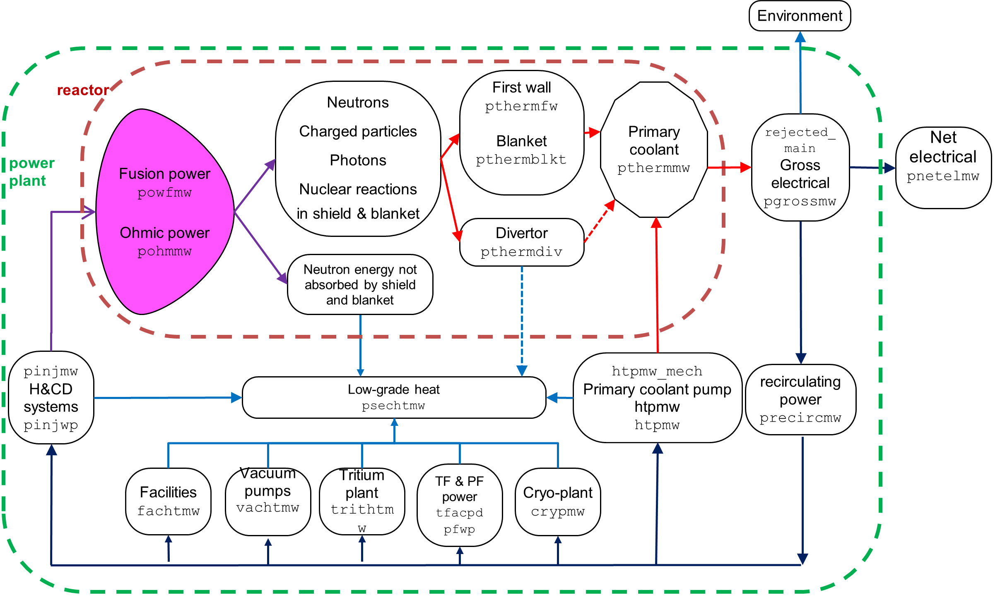

# Plasma physics

## Introduction

By default, the plasma is assumed to have an up-down asymmetric, single null
configuration (although this can be changed with user inputs). A great number 
of physics models are coded within PROCESS to describe the behaviour of the 
plasma parameters such as its current, temperature, density, pressure, 
confinement etc., and also the various limits that define the stable operating 
domain. 

More detail is given in [^19], but this webpage is more up to date.

## Plasma Geometry

The plasma geometric major radius $R_0$ (`rmajor`) and aspect ratio $A$ (`aspect`) 
define the size of the plasma torus. The plasma minor radius $a$ (`rminor`) is 
calculated from these values. The shape of the plasma cross-section is given by the
elongation of the last closed flux surface (LCFS) $\kappa$ (`kappa`) and the triangularity of the LCFS 
$\delta$ (`triang`), which can be scaled automatically with the aspect ratio if 
required using switch `ishape`:

- `ishape = 0` -- `kappa` and `triang` must be input.  The elongation and triangularity of the 95% 
    flux surface are calculated as follows [^8]:
  $$
   \kappa_{95} = \kappa / 1.12
  $$
  $$
   \delta_{95} = \delta / 1.5
  $$

- `ishape = 1` -- `kappa` and `triang` must not be input.  They are calculated by the following equations, 
  which estimate the largest elongation and triangularity achievable for 
  low aspect ratio machines ($\epsilon = 1/A$) [^1]:
  
  $$
  \kappa = 2.05 \, (1 + 0.44 \, \epsilon^{2.1})
  $$

  $$
  \delta = 0.53 \, (1 + 0.77 \, \epsilon^3)
  $$

  The values for the plasma shaping parameters at the 95% flux surface are calculated using a fit 
  to a family of equilibria calculated using the FIESTA code, equivalent to `ishape = 8`.

- `ishape = 2` -- the Zohm ITER scaling [^2] is used to calculate the elongation:
  
  $$
  \kappa = F_{kz} \, \times \, \mathrm{minimum} \left( 2.0, \, \, 1.5 + \frac{0.5}{A-1} \right)
  $$

  where input variable `fkzohm` $= F_{kz}$ may be used to adjust the scaling, while the input 
  value of the triangularity is used unchanged.

- `ishape = 3` -- the Zohm ITER scaling is used to calculate the elongation (as for `ishape = 2` 
  above), but the triangularity at the 95% flux surface is input via variable `triang95`, and the 
  LCFS triangularity `triang` is calculated from it, rather than the other way round.
  
- `ishape = 4` -- the 95% flux surface values `kappa95` and `triang95` are both used as inputs, 
  and the LCFS values are calculated from them by inverting the equations given above 
  for ``ishape = 0``.

- `ishape = 5` -- the 95% flux surface values `kappa95` and `triang95` are both used as inputs and 
  the LCFS values are calculated from a fit to MAST data:
  
  $$
  \kappa = 0.91 \, \kappa_{95} + 0.39
  $$

  $$
  \delta = 0.77 \, \delta_{95} + 0.19 
  $$

- `ishape = 6` -- the input values for `kappa` and `triang` are used directly and the 95% flux 
  surface values are calculated using the MAST scaling from `ishape = 5`.

- `ishape = 7` -- the 95% flux surface values `kappa95` and `triang95` are both used as inputs and 
  the LCFS values are calculated from a fit to FIESTA runs:
  
  $$
  \kappa = 0.91 \, \kappa_{95} + 0.39
  $$

  $$
  \delta = 1.38 \, \delta_{95} + 0.05 
  $$

- `ishape = 8` -- the input values for `kappa` and `triang` are used directly and the 95% flux 
  surface values are calculated using the FIESTA fit from `ishape = 7`.

An explicit constraint relating to the plasma's vertical stability may be turned on if
required. In principle, the inner surface of the outboard shield could be used
as the location of a conducting shell to mitigate the vertical
displacement growth rate of plasmas with significant elongation [^4]. The 
maximum permissible distance $r_{\text{shell, max}}$ of this shell from the geometric 
centre of the plasma may be set using input parameter `cwrmax`, such that 
$r_{\text{shell, max}} =$ `cwrmax*rminor`. Constraint equation 
no. 23 should be turned on with iteration variable no.\ 104 (`fcwr`) to enforce 
this. 

The plasma surface area, cross-sectional area and volume are calculated using
formulations that approximate the LCFS as a revolution of two arcs which
intersect the plasma X-points and the plasma midplane outer and inner
radii. (This is a reasonable assumption for double-null diverted plasmas, but
will be inaccurate for single-null plasmas, `snull = 1`).

## Fusion Reactions

The most likely fusion reaction to be utilised in a power plant is the
deuterium-tritium reaction:

$$
\mathrm{D + T} \Longrightarrow \mathrm{^{4}He + n + 17.6 \,MeV}
$$

20% of the energy produced is given to the alpha particles (\(^4\)He). The remaining 80% is carried 
away by the neutrons, which deposit their energy within the blanket and shield and other reactor components. 
The fraction of the alpha energy deposited in the plasma is `falpha`.

PROCESS can also model D-\(^3\)He power plants, which utilise the following 
primary fusion reaction:

$$
\mathrm{D + \text{$^3$He}} \Longrightarrow \mathrm{^{4}He + p + 18.3 \,MeV}
$$

The fusion reaction rate is significantly different to that for D-T fusion,
and the power flow from the plasma is modified since charged particles are
produced rather than neutrons. Because only charged particles (which remain in
the plasma) are produced by this reaction, the whole of the fusion power is
used to heat the plasma. Useful energy is extracted from the plasma since the
radiation power produced is very high, and this, in theory, can be converted to
electricity without using a thermal cycle.

Since the temperature required to ignite the D-\(^3\)He reaction is considerably
higher than that for D-T, it is necessary to take into account the following
D-D reactions, which have significant reaction rates at such temperatures:

$$\begin{aligned}
\mathrm{D + D}  & \Longrightarrow \mathrm{^{3}He + n + 3.27 \,MeV} \\
\mathrm{D + D}  & \Longrightarrow \mathrm{T + p + 4.03 \,MeV}
\end{aligned}$$

Also, as tritium is produced by the latter reaction, D-T fusion also occurs. 
As a result, there is still a small amount of neutron power
extracted from the plasma.

Pure D-\(^3\)He tokamak power plants do not include breeding blankets, because 
no tritium needs to be produced for fuel.

The contributions from all four of the above fusion reactions are included in
the total fusion power production calculation. The fusion reaction rates are
calculated using the parameterizations in [^4], integrated over the plasma 
profiles (correctly, with or without pedestals).

The fractional composition of the 'fuel' ions (D, T and \(^3\)He) is
controlled using the three variables `fdeut`, `ftrit` and `fhe3`, respectively:

$$\begin{aligned}
n_{\mbox{fuel}}  & = n_D + n_T + n_{\mathrm{^{3}He}}  \;\;\; \mbox{particles/m$^3$} \\
n_D  & = \mathtt{fdeut} \, n_{\mbox{fuel}} \\
n_T  & = \mathtt{ftrit} \, n_{\mbox{fuel}} \\
n_{\mathrm{^{3}He}} & = \mathtt{fhe3} \, n_{\mbox{fuel}}
\end{aligned}$$

PROCESS checks that $fdeut + ftrit + fhe3 = 1.0$, and stops with an error message otherwise.

Constraint equation no. 28 can be turned on to enforce the fusion gain *Q* to be at 
least equal to `bigqmin`.

## Plasma Profiles

If switch `ipedestal = 0`, no pedestal is present.  The plasma profiles are assumed to be of the form

$$\begin{aligned}
\mbox{Density : } n(\rho) & = n_0 \left( 1 - \rho^2 \right)^{\alpha_n} \\
\mbox{Temperature : } T(\rho) & = T_0 \left( 1 - \rho^2 \right)^{\alpha_T} \\
\mbox{Current : } J(r) & = J_0 \left( 1 - \rho^2 \right)^{\alpha_J}
\end{aligned}$$

where $\rho = r/a$, and $a$ is the plasma minor radius. This gives
volume-averaged values $\langle n \rangle = n_0 / (1+\alpha_n)$, and
line-averaged values $\bar{n} \sim n_0 / \sqrt{(1+\alpha_n)}$, etc.  These
volume- and line-averages are used throughout the code along with the profile
indices $\alpha$, in the various physics models, many of which are fits to
theory-based or empirical scalings. Thus, the plasma model in PROCESS may
be described as 1/2-D.  The relevant profile index variables are
`alphan`, `alphat` and `alphaj`, respectively.

If `ipedestal` = 1, 2 or 3 the density and temperature profiles include a pedestal.  
If `ipedestal` = 1 the density and temperature profiles use the forms given below [^6].  

$$\begin{aligned}
\mbox{density:} \qquad n(\rho) = \left\{ 
\begin{aligned}
    & n_{ped} + (n_0 - n_{ped}) \left( 1 -
    \frac{\rho^2}{\rho_{ped,n}^2}\right)^{\alpha_n}
   & \qquad 0 \leq \rho \leq \rho_{ped,n} \\
   & n_{sep} + (n_{ped} - n_{sep})\left( \frac{1- \rho}{1-\rho_{ped,n}}\right)
   & \qquad \rho_{ped,n} < \rho \leq 1
\end{aligned}
\right.
\end{aligned}$$

$$\begin{aligned}
\mbox{temperature:} \qquad T(\rho) = \left\{ 
\begin{aligned}
   & T_{ped} + (T_0 - T_{ped}) \left( 1 - \frac{\rho^{\beta_T}}
    {\rho_{ped,T}^{\beta_T}}\right)^{\alpha_T}  & \qquad 0 \leq \rho \leq \rho_{ped,T} \\
   & T_{sep} + (T_{ped} - T_{sep})\left( \frac{1- \rho}{1-\rho_{ped,T}}\right)
   & \qquad \rho_{ped,T} < \rho \leq 1
\end{aligned}
\right.
\end{aligned}$$

Subscripts $0$, $ped$ and $sep$, denote values at the centre ($\rho = 0$), the
pedestal ($\rho = \rho_{ped}$) and the separatrix ($\rho=1$),
respectively. The density and temperature peaking parameters $\alpha_n$ and a
$\alpha_T$ as well as the second exponent $\beta_T$ (input parameter
`tbeta`, not to be confused with the plasma beta) in the temperature
profile can be chosen by the user, as can the pedestal heights and the values
at the separatrix (`neped, nesep` for the electron density, and
`teped, tesep` for the electron temperature); the ion equivalents are
scaled from the electron values by the ratio of the volume-averaged values).

The density at the centre is given by:

$$\begin{aligned}
  \nonumber
  n_0 & = & \frac{1}{3\rho_{ped,n}^2} \left[3\langle n\rangle (1+\alpha_n)
    + n_{sep} (1+\alpha_n) (-2 + \rho_{ped,n} + \rho_{ped,n}^2) \right.\\
   & & \left. - n_{ped}\left( (1 + \alpha_n)(1+ \rho_{ped,n}) + (\alpha_n -2)
    \rho_{ped,n}^2 \right) \right]
\end{aligned}$$

where $\langle n \rangle$ is the volume-averaged density. The temperature at
the centre is given by

$$\begin{aligned}
T_0 = T_{ped} + \gamma \left[ T_{ped}\, \rho_{ped,T}^2 - \langle T \rangle +
  \frac{1}{3}(1 - \rho_{ped,T}) \left[ \, (1 + 2\rho_{ped,T}) \, T_{ped} + ( 2 +
    \rho_{ped,T}) \, T_{sep} \, \right] \right]
\end{aligned}$$

with 

$$\begin{aligned}
\gamma = \left\{
\begin{aligned}
  & \frac{ -\Gamma(1+\alpha_T+2/\beta_T)}
  {\rho_{ped,T}^2 \, \Gamma(1+\alpha_T) \, \Gamma((2+\beta_T)/\beta_T)}
  \qquad \text{for integer} \, \alpha_T \\
  &\frac{\Gamma(-\alpha_T)\sin(\pi\alpha)\, \Gamma(1+\alpha_T+2/\beta_T)}
  {\pi\rho_{ped,T}^2 \, \Gamma((2+\beta_T)/\beta_T)}
  \qquad \text{for non-integer} \, \alpha_T
\end{aligned}
\right.
\end{aligned}$$

where $\Gamma$ is the gamma function.

Note that density and temperature can have different pedestal positions
$\rho_{ped,n}$ (`rhopedn`) and $\rho_{ped,T}$ (`rhopedt`) in agreement with 
simulations.

If `ipedestal` = 1 or 2 then the pedestal density `neped` is set as a fraction `fgwped` of the 
Greenwald density (providing `fgwped` >= 0).  The default value of `fgwped` is 0.8[^7]. 

## Beta Limit

The plasma beta limit[^7] is given by 

$$\begin{aligned}
\beta < g \, \frac{I(\mbox{MA})}{a(\mbox{m}) \, B_0(\mbox{T})}
\end{aligned}$$

where $B_0$ is the axial vacuum toroidal field. The beta
coefficient $g$ is set using input parameter `dnbeta`. To apply the beta limit, 
constraint equation 24 should be turned on with iteration variable 36
(`fbetatry`). 

By default, $\beta$ is defined with respect to the total equilibrium B-field [^9]. 

| `iculbl` | Description |
| :-: | - |
| 0 (default) | Apply the $\beta$ limit to the total plasma beta (including the contribution from fast ions) |
| 1 | Apply the $\beta$ limit to only the thermal component of beta |
| 2 | Apply the $\beta$ limit to only the thermal plus neutral beam contributions to beta |
| 3 | Apply the $\beta$ limit to the total beta (including the contribution from fast ions), calculated using only the toroidal field |

### Scaling of beta $g$ coefficient

Switch `gtscale` determines how the beta $g$ coefficient `dnbeta` should 
be calculated, using the inverse aspect ratio $\epsilon = a/R$.

| `gtscale` | Description |
| :-: | - |
| 0 | `dnbeta` is an input. |
| 1 | $g=2.7(1+5\epsilon^{3.5})$ (which gives g = 3.0 for aspect ratio = 3) |
| 2 | $g=3.12+3.5\epsilon^{1.7}$ (based on Menard et al. "Fusion Nuclear Science Facilities and Pilot Plants Based on the Spherical Tokamak", Nucl. Fusion, 2016, 44)  |

!!! Note 
    `gtscale` is over-ridden if `iprofile` = 1.

### Limiting $\epsilon\beta_p$

To apply a limit to the value of $\epsilon\beta_p$, where $\epsilon = a/R$ is
the inverse aspect ratio and $\beta_p$ is the poloidal $\beta$, constraint equation no. 6 should be 
turned on with iteration variable no. 8 (`fbeta`). The limiting value of $\epsilon\beta_p$ 
is be set using input parameter `epbetmax`.

## Fast Alpha Pressure Contribution

The pressure contribution from the fast alpha particles can be controlled using switch `ifalphap`. 
There are two options 1[^8] and 2[^10]:

$$\begin{aligned}
\frac{\beta_{\alpha}}{\beta_{th}} & = 0.29 \, \left( \langle T_{10} \rangle -
  0.37 \right) \, \left( \frac{n_{DT}}{n_e} \right)^2
\hspace{20mm} \mbox{if alphap = 0} \\
\frac{\beta_{\alpha}}{\beta_{th}} & = 0.26 \, \left( \langle T_{10} \rangle -
  0.65 \right)^{0.5} \, \left( \frac{n_{DT}}{n_e} \right)^2
\hspace{16mm} \mbox{if alphap = 1 (default)}
\end{aligned}$$

The latter model is a better estimate at higher temperatures.

## Density Limit

Several density limit models[^8] are available in PROCESS. These are
calculated in routine `culdlm`, which is called by `physics`. To enforce any of 
these limits, turn on constraint equation no. 5 with iteration variable no. 9 
(`fdene`). In addition, switch `idensl` must be set to the relevant value, as 
follows:

| `idensl` | Description |
| :-: | - |
| 1 | ASDEX model |
| 2 | Borrass model for ITER, I |
| 3 | Borrass model for ITER, II |
| 4 | JET edge radiation model |
| 5 | JET simplified model |
| 6 | Hugill-Murakami $M.q$ model |
| 7 | Greenwald model: $n_G=10^{14} \frac{I_p}{\pi a^2}$ where the units are m and ampere. For the Greenwald model the limit applies to the line-averaged electron density, not the volume-averaged density. |

## Impurities and Radiation

The impurity radiation model in PROCESS uses a multi-impurity model which 
integrates the radiation contributions over an arbitrary choice of density and 
temperature profiles[^10]

The impurity number density fractions relative to the electron density are constant and are set 
using input array `fimp(1,...,14)`. The available species are as follows:

| `fimp` | Species |
| :-: | - |
| 1 | Hydrogen isotopes (fraction calculated by code) |
| 2 | Helium (fraction calculated by code) |
| 3 | Beryllium |
| 4 | Carbon |
| 5 | Nitrogen |
| 6 | Oxygen |
| 7 | Neon |
| 8 | Silicon |
| 9 | Argon |
| 10 | Iron |
| 11 | Nickel |
| 12 | Krypton |
| 13 | Xenon |
| 14 | Tungsten |

As stated above, the number density fractions for hydrogen (all isotopes) and
helium need not be set, as they are calculated by the code to ensure 
plasma quasi-neutrality taking into account the fuel ratios
`fdeut`, `ftrit` and `fhe3`, and the alpha particle fraction `ralpne` which may 
be input by the user or selected as an iteration variable.

The impurity fraction of any one of the elements listed in array `fimp` (other than hydrogen 
isotopes and helium) may be used as an iteration variable.
The impurity fraction to be varied can be set simply with `fimp(i) = <value>`, where `i` is the corresponding number value for the desired impurity in the table above.

The synchrotron radiation power[^11] [^12] is assumed to originate from the 
plasma core. The wall reflection factor `ssync` may be set by the user.

By changing the input parameter `coreradius`, the user may set the normalised 
radius defining the 'core' region. Only the impurity and synchrotron radiation 
from this affects the confinement scaling. Figure 1 below shows the
radiation power contributions.

*Figure 1: Schematic diagram of the radiation power contributions and how they are split between core and edge radiation*

Constraint equation no. 17 with iteration variable no. 28 (`fradpwr`)
ensures that the calculated total radiation power does not exceed the total
power available that can be converted to radiation (i.e. the sum of the fusion
alpha power, other charged particle fusion power, auxiliary injected power and
the ohmic power). This constraint should always be turned on.

## Plasma Current Scaling Laws

A number of plasma current scaling laws are available in PROCESS $[^9]. These are calculated in 
routine `culcur`, which is called by `physics`. The safety factor $q_{95}$ required to prevent 
disruptive MHD instabilities dictates the plasma current Ip:

$$\begin{aligned}
I_p = \frac{2\pi}{\mu_0} B_t \frac{a^2 f_q}{Rq_{95}}
\end{aligned}$$

The factor $f_q$ makes allowance for toroidal effects and plasma shaping (elongation and 
triangularity). Several formulae for this factor are available [11,19] depending on the value of 
the switch `icurr`, as follows:

| `icurr` | Description |
| :-: | - |
| 1 | Peng analytic fit | 
| 2 | Peng double null divertor scaling (ST)[^1] | 
| 3 | Simple ITER scaling | 
| 4 | Revised ITER scaling[^14]  $f_q = \frac{1.17-0.65\epsilon}{2(1-\epsilon^2)^2} (1 + \kappa_{95}^2 (1+2\delta_{95}^2 - 1.2\delta_{95}^3) )$| 
| 5 | Todd empirical scaling, I | 
| 6 | Todd empirical scaling, II | 
| 7 | Connor-Hastie model | 
| 8 | Sauter model, allows negative $\delta$ | 
| 9 | Scaling for spherical tokamaks, based on a fit to a family of equilibria derived by Fiesta: $f_q = 0.538 (1 + 2.44\epsilon^{2.736}) \kappa^{2.154} \delta^{0.06}$|

## Plasma Current Profile Consistency

A limited degree of self-consistency between the plasma current profile and other parameters [^3] can be 
enforced by setting switch `iprofile = 1`. This sets the current 
profile peaking factor $\alpha_J$ (`alphaj`) and the normalised internal inductance $l_i$ (`rli`) using the 
safety factor on axis `q0` and the cylindrical safety factor $q*$ (`qstar`):   

$$\begin{aligned}
\alpha_J = \frac{q*}{q_0} - 1
\end{aligned}$$

$$\begin{aligned}
l_i = ln(1.65+0.89\alpha_J)
\end{aligned}$$

The beta $g$ coefficient `dnbeta` also scales with $l_i$, as described above.

It is recommended that current scaling law `icurr = 4` is used if `iprofile = 1`. 
Switch `gtscale` is over-ridden if `iprofile = 1`.

## Confinement Time Scaling Laws

The energy confinement time $\tau_E$ is calculated using one of a choice of empirical scalings. ($\tau_E$ is defined below.)

Many energy confinement time scaling laws are available within PROCESS, for
tokamaks, RFPs and stellarators. These are calculated in routine `pcond`. The 
value of `isc` determines which of the scalings is used in the plasma energy 
balance calculation. The table below summarises the available scaling laws. The 
most commonly used is the so-called IPB98(y,2) scaling.       

| `isc` | scaling law | reference |
| :-: | - | - |
| 1 | Neo-Alcator (ohmic) | [^8] | 
| 2 | Mirnov (H-mode) | [^8] |
| 3 | Merezhkin-Muhkovatov (L-mode) | [^8] |
| 4 | Shimomura (H-mode) | JAERI-M 87-080 (1987) |
| 5 | Kaye-Goldston (L-mode) | Nuclear Fusion **25** (1985) p.65 |
| 6 | ITER 89-P (L-mode) | Nuclear Fusion **30** (1990) p.1999 |
| 7 | ITER 89-O (L-mode) | [^7] |
| 8 | Rebut-Lallia (L-mode) | Plasma Physics and Controlled Nuclear Fusion Research **2** (1987) p. 187 |
| 9  | Goldston (L-mode)| Plas.\ Phys.\ Controlled Fusion **26** (1984) p.87 |
| 10 | T10 (L-mode) | [^7] |
| 11 | JAERI-88 (L-mode) | JAERI-M 88-068 (1988) |
| 12 | Kaye-Big Complex (L-mode) | Phys.\ Fluids B **2** (1990) p.2926 |
| 13 | ITER H90-P (H-mode) |  |
| 14 | ITER Mix (minimum of 6 and 7) |  |
| 15 | Riedel (L-mode) |  |
| 16 | Christiansen et al. (L-mode) | JET Report JET-P (1991) 03 |
| 17 | Lackner-Gottardi (L-mode) | Nuclear Fusion **30** (1990) p.767  |
| 18 | Neo-Kaye (L-mode) | [^7] |
| 19 | Riedel (H-mode) |  |
| 20 | ITER H90-P (amended) | Nuclear Fusion **32** (1992) p.318 |
| 21 | Large Helical Device (stellarator) | Nuclear Fusion **30** (1990) |
| 22 | Gyro-reduced Bohm (stellarator) | Bull. Am. Phys. Society, **34** (1989) p.1964 |
| 23 | Lackner-Gottardi (stellarator) | Nuclear Fusion **30** (1990) p.767 |
| 24 | ITER-93H (H-mode) | PPCF, Proc. 15th Int. Conf.Seville, 1994 IAEA-CN-60/E-P-3 |
| 25 | TITAN (RFP) | TITAN RFP Fusion Reactor Study, Scoping Phase Report, UCLA-PPG-1100, page 5--9, Jan 1987 |
| 26 | ITER H-97P ELM-free (H-mode) | J. G. Cordey et al., EPS Berchtesgaden, 1997 |
| 27 | ITER H-97P ELMy (H-mode) | J. G. Cordey et al., EPS Berchtesgaden, 1997 |
| 28 | ITER-96P (= ITER97-L) (L-mode) | Nuclear Fusion **37** (1997) p.1303 |
| 29 | Valovic modified ELMy (H-mode) | |
| 30 | Kaye PPPL April 98 (L-mode) |  |
| 31 | ITERH-PB98P(y) (H-mode) | |
| 32 | IPB98(y) (H-mode)   | Nuclear Fusion **39** (1999) p.2175, Table 5,  |
| 33 | IPB98(y,1) (H-mode) | Nuclear Fusion **39** (1999) p.2175, Table 5, full data |
| 34 | IPB98(y,2) (H-mode) | Nuclear Fusion **39** (1999) p.2175, Table 5, NBI only |
| 35 | IPB98(y,3) (H-mode) | Nuclear Fusion **39** (1999) p.2175, Table 5, NBI only, no C-Mod |
| 36 | IPB98(y,4) (H-mode) | Nuclear Fusion **39** (1999) p.2175, Table 5, NBI only ITER like |
| 37 | ISS95 (stellarator) | Nuclear Fusion **36** (1996) p.1063  |
| 38 | ISS04 (stellarator) | Nuclear Fusion **45** (2005) p.1684  |
| 39 | DS03 (H-mode) | Plasma Phys. Control. Fusion **50** (2008) 043001, equation 4.13  |
| 40 | Non-power law (H-mode) | A. Murari et al 2015 Nucl. Fusion 55 073009, Table 4.  |
| 41 | Petty 2008 (H-mode) |  C.C. Petty 2008 Phys. Plasmas **15** 080501, equation 36 |
| 42 | Lang 2012 (H-mode) | P.T. Lang et al. 2012 IAEA conference proceeding EX/P4-01 |
| 43 | Hubbard 2017 -- nominal (I-mode) | A.E. Hubbard et al. 2017, Nuclear Fusion **57** 126039 |
| 44 | Hubbard 2017 -- lower (I-mode) | A.E. Hubbard et al. 2017, Nuclear Fusion **57** 126039 |
| 45 | Hubbard 2017 -- upper (I-mode) | A.E. Hubbard et al. 2017, Nuclear Fusion **57** 126039 |
| 46 | NSTX (H-mode; spherical tokamak) | J. Menard 2019, Phil. Trans. R. Soc. A 377:201704401 |
| 47 | NSTX-Petty08 Hybrid (H-mode) | J. Menard 2019, Phil. Trans. R. Soc. A 377:201704401 |
| 48 | NSTX gyro-Bohm (Buxton) (H-mode; spherical tokamak) | P. Buxton et al. 2019 Plasma Phys. Control. Fusion 61 035006 |
| 49 | Use input `tauee_in` |  |

### Effect of radiation on energy confinement

Published confinement scalings are all based on low radiation pulses. A power
plant will certainly be a high radiation machine --- both in the core, due to
bremsstrahlung and synchrotron radiation, and in the edge due to impurity
seeding. The scaling data do not predict this radiation --- that needs to be
done by the radiation model. However, if the transport is very "stiff", as
predicted by some models, then the additional radiation causes an almost equal
drop in power transported by ions and electrons, leaving the confinement
nearly unchanged.

To allow for these uncertainties, three options are available, using the switch
`iradloss`. In each case, the particle transport loss power `pscaling` is
derived directly from the energy confinement scaling law.

`iradloss = 0` -- Total power lost is scaling power plus radiation:

`pscaling + pradpv = falpha*palppv + pchargepv + pohmpv + pinjmw/vol`

`iradloss = 1` -- Total power lost is scaling power plus radiation from a region defined as the "core":
  
`pscaling + pcoreradpv = falpha*palppv + pchargepv + pohmpv + pinjmw/vol`

`iradloss = 2` -- Total power lost is scaling power only, with no additional 
allowance for radiation. This is not recommended for power plant models.

`pscaling = falpha*palppv + pchargepv + pohmpv + pinjmw/vol`

## Plasma Core Power Balance

The figure below shows the flow of power as calculated by the code.

<figure markdown>
{ width="100%"}
<figcaption>Figure 1: Machine build for D-shaped major components</figcaption>
</figure>

The primary sources of power are the fusion reactions themselves, ohmic power
due to resistive heating within the plasma, and any auxiliary power provided
for heating and current drive. The power carried by the fusion-generated 
neutrons is lost from the plasma, but is deposited in the surrounding material. 
A fraction `falpha` of the alpha particle power is assumed to stay within the
plasma core to contribute to the plasma power balance. The sum of this core
alpha power, any power carried by non-alpha charged particles, the ohmic power
and any injected power, is converted into charged particle transport power
($P_{\mbox{loss}}$) plus core radiation power, as shown in the Figure. The core 
power balance calculation is turned on using constraint equation no. 2 (which 
should therefore always be used).

## Bootstrap, Diamagnetic and Pfirsch-Schlüter Current Scalings

The fraction of the plasma current provided by the bootstrap effect
can be either input into the code directly, or calculated using one of four
methods, as summarised here. Note that methods `ibss = 1-3` do not take into account the 
existence of pedestals, whereas the Sauter et al. scaling 
(`ibss = 4`) allows general profiles to be used. 

| `ibss` | Description |
| :-: | - |
| 1 | ITER scaling -- To use the ITER scaling method for the bootstrap current fraction.  Set `bscfmax` to the maximum required bootstrap current fraction ($\leq 1$). This method is valid at high aspect ratio only.
| 2 | General scaling[^15] -- To use a more general scaling method, set `bscfmax` to the maximum required bootstrap current fraction ($\leq 1$).
| 3 | Numerically fitted scaling[^16] -- To use a numerically fitted scaling method, valid for all aspect ratios, set `bscfmax` to the maximum required bootstrap current fraction ($\leq 1$).
| 4 | Sauter, Angioni and Lin-Liu scaling[^17] [^18] -- Set `bscfmax` to the maximum required bootstrap current fraction ($\leq 1$).

!!! Note "Fixed Bootstrap Current"
    Direct input -- To input the bootstrap current fraction directly, set `bscfmax` 
    to $(-1)$ times the required value (e.g. -0.73 sets the bootstrap faction to 0.73).

The diamagnetic current fraction $f_{dia}$ is strongly related to $\beta$ and is typically small,
hence it is usually neglected.  For high $\beta$ plasmas, such as those at tight
aspect ratio, it should be included and two scalings are offered.  If the diamagnetic
current is expected to be above one per cent of the plasma current, a warning
is issued to calculate it.

`idia = 0` Diamagnetic current fraction is zero.

`idia = 1` Diamagnetic current fraction is calculated using a fit to spherical tokamak calculations by Tim Hender:

$$f_{dia} = \frac{\beta}{2.8}$$

`idia = 2` Diamagnetic current fraction is calculated using a SCENE fit for all aspect ratios:

$$f_{dia} = 0.414 \space \beta \space (\frac{0.1 q_{95}}{q_0} + 0.44)$$

A similar scaling is available for the Pfirsch-Schlüter current fraction $f_{PS}$.  This is
typically smaller than the diamagnetic current, but is negative.

`ips = 0` Pfirsch-Schlüter current fraction is set to zero.

`ips = 1` Pfirsch-Schlüter current fraction is calculated using a SCENE fit for all aspect ratios:

$$ f_{PS} = -0.09 \beta $$

There is no ability to input the diamagnetic and Pfirsch-Schlüter current
directly.  In this case, it is recommended to turn off these two scalings 
and to use the method of fixing the bootstrap current fraction.

## L-H Power Threshold Scalings

Transitions from a standard confinement mode (L-mode) to an improved
confinement regime (H-mode), called L-H transitions, are observed in most
tokamaks. A range of scaling laws are available that provide estimates of the
heating power required to initiate these transitions, via extrapolations
from present-day devices. PROCESS calculates these power threshold values
for the scaling laws listed in the table below, in routine `pthresh`.

For an H-mode plasma, use input parameter `ilhthresh` to
select the scaling to use, and turn on constraint equation no. 15 with
iteration variable no. 103 (`flhthresh`). By default, this will ensure
that the power reaching the divertor is at least equal to the threshold power
calculated for the chosen scaling, which is a necessary condition for
H-mode. 

For an L-mode plasma, use input parameter `ilhthresh` to
select the scaling to use, and turn on constraint equation no. 15 with 
iteration variable no. 103 (`flhthresh`). Set lower and upper bounds for 
the f-value `boundl(103) = 0.001` and `boundu(103) = 1.0` 
to ensure that the power does not exceed the calculated threshold, 
and therefore the machine remains in L-mode.

| `ilhthresh` | Name | Reference |
| :-: | - | - |
| 1 | ITER 1996 nominal | ITER Physics Design Description Document |
| 2 | ITER 1996 upper bound | D. Boucher, p.2-2 |
| 3 | ITER 1996 lower bound | 
| 4 | ITER 1997 excluding elongation | J. A. Snipes, ITER H-mode Threshold Database |
| 5 | ITER 1997 including elongation |  Working Group, Controlled Fusion and Plasma Physics, 24th EPS conference, Berchtesgaden, June 1997, vol.21A, part III, p.961 |
| 6 | Martin 2008 nominal | Martin et al, 11th IAEA Tech. Meeting |
| 7 | Martin 2008 95% upper bound |  H-mode Physics and Transport Barriers, Journal |
| 8 | Martin 2008 95% lower bound |  of Physics: Conference Series **123**, 2008 |
| 9 | Snipes 2000 nominal | J. A. Snipes and the International H-mode |
| 10| Snipes 2000 upper bound | Threshold Database Working Group |
| 11| Snipes 2000 lower bound |  2000, Plasma Phys. Control. Fusion, 42, A299 |
| 12| Snipes 2000 (closed divertor): nominal | 
| 13| Snipes 2000 (closed divertor): upper bound | 
| 14| Snipes 2000 (closed divertor): lower bound | 
| 15| Hubbard 2012 L-I threshold scaling: nominal | [Hubbard et al. (2012; Nucl. Fusion 52 114009)](https://iopscience.iop.org/article/10.1088/0029-5515/52/11/114009) |
| 16| Hubbard 2012 L-I threshold scaling: lower bound | [Hubbard et al. (2012; Nucl. Fusion 52 114009)](https://iopscience.iop.org/article/10.1088/0029-5515/52/11/114009 |
| 17| Hubbard 2012 L-I threshold scaling: upper bound | [Hubbard et al. (2012; Nucl. Fusion 52 114009)](https://iopscience.iop.org/article/10.1088/0029-5515/52/11/114009 |
| 18| Hubbard 2017 L-I threshold scaling | [Hubbard et al. (2017; Nucl. Fusion 57 126039)](https://iopscience.iop.org/article/10.1088/1741-4326/aa8570) |
| 19 | Martin 2008 aspect ratio corrected nominal | Martin et al (2008; J Phys Conf, 123, 012033) |
| 20 | Martin 2008 aspect ratio corrected 95% upper bound | [Takizuka et al. (2004; Plasma Phys. Contol. Fusion, 46, A227)](https://iopscience.iop.org/article/10.1088/0741-3335/46/5A/024)  |
| 21 | Martin 2008 aspect ratio corrected 95% lower bound |  

## Ignition

Switch `ignite` can be used to denote whether the plasma is ignited, i.e. fully self-sustaining 
without the need for any injected auxiliary power during the burn. If `ignite` = 1, the calculated 
injected power does not contribute to the plasma power balance, although the cost of the auxiliary 
power system is taken into account (the system is then assumed to be required to provide heating 
and/or current drive during the plasma start-up phase only). If `ignite` = 0, the plasma is not 
ignited, and the auxiliary power is taken into account in the plasma power balance during the burn 
phase. An ignited plasma will be difficult to control and is unlikely to be practical. This 
option is not recommended.

## Other Plasma Physics Options

### Neo-Classical Correction Effects

Neo-classical trapped particle effects are 
included in the calculation of the plasma resistance and ohmic heating power in 
subroutine `pohm`, which is called by routine `physics`.  The scaling used is only valid for aspect 
ratios between 2.5 and 4, and it is possible for the plasma resistance to be 
incorrect or even negative if the aspect ratio is outside this range.  An error is reported if the 
calculated plasma resistance is negative.

### Inverse Quadrature in $\tau_E$ Scaling Laws

Switch `iinvqd` determines whether the energy confinement time scaling
laws due to Kaye-Goldston (`isc = 5`) and Goldston (`isc = 9`) should include 
an inverse quadrature scaling with the Neo-Alcator result (`isc = 1`). A value 
`iinvqd = 1`includes this scaling.

### Plasma-Wall Gap

The region directly outside the last closed flux surface of the core plasma is
known as the scrape-off layer, and contains no structural material. Plasma
entering this region is not confined and is removed by the divertor. PROCESS
treats the scrape-off layer merely as a gap. Switch `iscrp` determines
whether the inboard and outboard gaps should be calculated as 10% of the
plasma minor radius (`iscrp = 0`), or set equal to the input values `scrapli` 
and `scraplo` (`iscrp = 1`).

[^1]: J.D. Galambos, 'STAR Code : Spherical Tokamak Analysis and Reactor Code',
Unpublished internal Oak Ridge document.
[^2]: H. Zohm et al, 'On the Physics Guidelines for a Tokamak DEMO',
FTP/3-3, Proc. IAEA Fusion Energy Conference, October 2012, San Diego
[^3]: Y. Sakamoto, 'Recent progress in vertical stability analysis in JA',
Task meeting EU-JA #16, Fusion for Energy, Garching, 24--25 June 2014
[^4]: H.S. Bosch and G.M. Hale, 'Improved Formulas for Fusion Cross-sections 
and Thermal Reactivities', Nuclear Fusion **32** (1992) 611
[^5]: J. Johner, 'Helios: A Zero-Dimensional Tool for Next Step and Reactor 
Studies', Fusion Science and Technology **59** (2011) 308--349
[^6]: M. Bernert et al. Plasma Phys. Control. Fus. **57** (2015) 014038
[^7]: N.A. Uckan and ITER Physics Group, 'ITER Physics Design Guidelines: 1989',
ITER Documentation Series, No. 10, IAEA/ITER/DS/10 (1990)
[^8]: T. C. Hender et al., 'Physics Assessment for the European Reactor Study',
AEA Fusion Report AEA FUS 172 (1992)
[^9]: D.J. Ward, 'PROCESS Fast Alpha Pressure', Work File Note F/PL/PJK/PROCESS/CODE/050
[^10]: H. Lux, R. Kemp, D.J. Ward, M. Sertoli, 'Impurity radiation in DEMO 
systems modelling', Fus. Eng.  | Des. **101**, 42-51 (2015)
[^11]:  Albajar, Nuclear Fusion **41** (2001) 665
[^12]: Fidone, Giruzzi and Granata, Nuclear Fusion **41** (2001) 1755
[^13]: N.A. Uckan, Fusion Technology **14** (1988) 299
[^14]: W.M. Nevins, 'Summary Report: ITER Specialists' Meeting on Heating and
Current Drive', ITER-TN-PH-8-4, 13--17 June 1988, Garching, FRG
[^16]: H.R. Wilson, Nuclear Fusion **32** (1992) 257
[^17]: O. Sauter, C. Angioni and Y.R. Lin-Liu, Physics of Plasmas **6** (1999) 2834 
[^18]: O. Sauter, C. Angioni and Y.R. Lin-Liu, Physics of Plasmas **9** (2002) 5140
[^19]: M. Kovari, R. Kemp, H. Lux, P. Knight, J. Morris, D.J. Ward, '“PROCESS”: A systems code for fusion power plants—Part 1: Physics' Fusion Engineering and Design 89 (2014) 3054–3069
