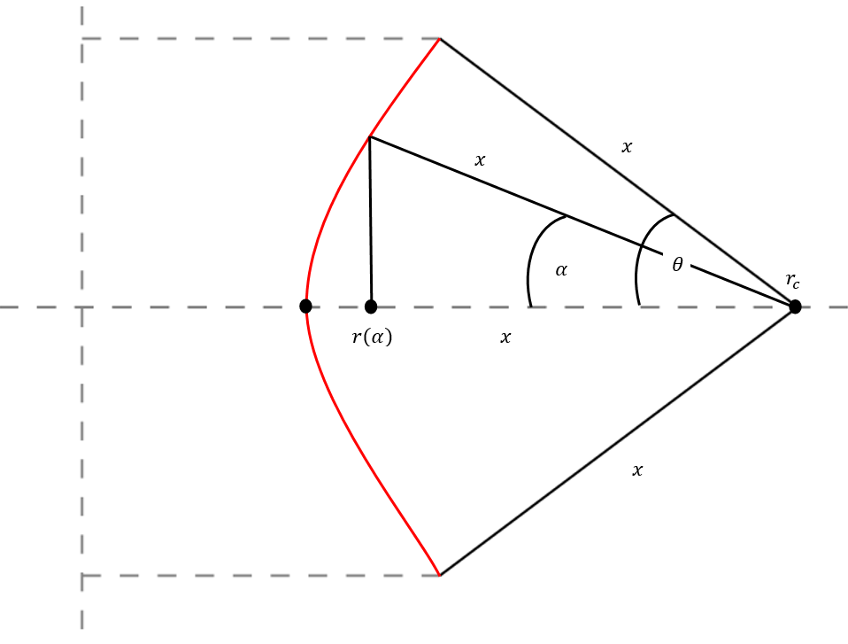
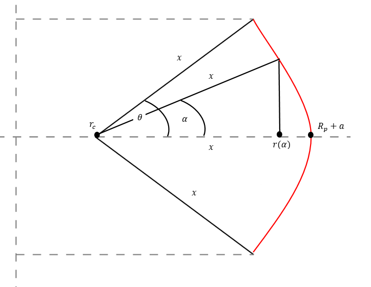

# Plasma Geometry

The plasma geometric major radius $R_0$ (`rmajor`) and aspect ratio $A$ (`aspect`) 
define the size of the plasma torus. The plasma minor radius $a$ (`rminor`) is 
calculated from these values. The inverse aspect ratio is given by, $\epsilon$ (`eps`) = $1/A$ .

The shape of the plasma cross-section is given by the
elongation of the last closed flux surface (LCFS) $\kappa$ (`kappa`) and the triangularity of the LCFS 
$\delta$ (`triang`), which can be scaled automatically with the aspect ratio if 
required using switch `ishape`:

## Elongation & Triangularity

- `ishape = 0` -- `kappa` and `triang` **must** be input.  The elongation and triangularity of the 95% 
    flux surface are calculated as follows, based on the 1989 ITER guidelines [^1]:
  $$
   \kappa_{95} = \kappa / 1.12
  $$
  $$
   \delta_{95} = \delta / 1.5
  $$
-------------------------------------------------------------------
- `ishape = 1` -- `kappa` and `triang` **must not** be input.  They are calculated by the following equations, 
  which estimate the largest elongation and triangularity achievable for 
  low aspect ratio machines based on the STAR code[^2]:
  
  $$
  \kappa = 2.05 \, \left(1 + 0.44 \, \epsilon^{2.1}\right)
  $$

  $$
  \delta = 0.53 \, \left(1 + 0.77 \, \epsilon^3\right)
  $$

  The values for the plasma shaping parameters at the 95% flux surface are calculated using a fit 
  to a family of equilibria calculated using the FIESTA code, equivalent to that used in `ishape = 8`.

  $$
   \kappa_{95} = \frac{(\kappa - 0.39467)}{0.90698}
  $$

  $$
   \delta_{95} = \frac{(\delta - 0.048306)}{1.3799}
  $$
---------------------------------------------------------------------
- `ishape = 2` -- the Zohm ITER scaling [^3] is used to calculate the elongation, where input variable `fkzohm` $= F_{kz}$ may be used to adjust the scaling, while the input 
  value of the triangularity is used unchanged
  
  $$
  \kappa = F_{kz} \, \times \, \mathrm{minimum} \left( 2.0, \, \, 1.5 + \frac{0.5}{A-1} \right)
  $$

  The elongation and triangularity of the 95% flux surface are calculated as follows, based on the 1989 ITER guidelines [^1]:
  
  $$
   \kappa_{95} = \kappa / 1.12
  $$
  $$
   \delta_{95} = \delta / 1.5
  $$

---------------------------------------------------------------------
- `ishape = 3` -- the Zohm ITER scaling[^3] is used to calculate the elongation (as for `ishape = 2` 
  above), but the triangularity at the 95% flux surface is input via variable `triang95`, and the 
  LCFS triangularity `triang` is calculated from it, rather than the other way round.
---------------------------------------------------------------------  
- `ishape = 4` -- the 95% flux surface values `kappa95` and `triang95` are both used as inputs, 
  and the LCFS values are calculated from them by inverting the equations given above 
  for ``ishape = 0``.
---------------------------------------------------------------------
- `ishape = 5` -- the 95% flux surface values `kappa95` and `triang95` are both used as inputs and 
  the LCFS values are calculated from a fit to MAST data:
  
  $$
  \kappa = 0.913 \, \kappa_{95} + 0.38654
  $$

  $$
  \delta = 0.77394 \, \delta_{95} + 0.18515 
  $$
---------------------------------------------------------------------
- `ishape = 6` -- the input values for `kappa` and `triang` are used directly and the 95% flux 
  surface values are calculated using the MAST scaling from `ishape = 5`.
---------------------------------------------------------------------
- `ishape = 7` -- the 95% flux surface values `kappa95` and `triang95` are both used as inputs and 
  the LCFS values are calculated from a fit to FIESTA runs:
  
  $$
  \kappa = 0.91 \, \kappa_{95} + 0.39
  $$

  $$
  \delta = 1.38 \, \delta_{95} + 0.05 
  $$
---------------------------------------------------------------------
- `ishape = 8` -- the input values for `kappa` and `triang` are used directly and the 95% flux 
  surface values are calculated using the FIESTA fit from `ishape = 7`.
---------------------------------------------------------------------
- `ishape = 9` -- the input values for `triang` and `rli` are used, `kappa` and the 95% flux 
  surface values are calculated.

  $$
   \kappa = \left(\left(1.09+\frac{0.26}{l_i}\right)\left(\frac{1.5}{A}\right)^{0.4}\right)
  $$

  The elongation and triangularity of the 95% flux surface are calculated as follows, based on the 1989 ITER guidelines [^1]:
  
  $$
   \kappa_{95} = \kappa / 1.12
  $$
  $$
   \delta_{95} = \delta / 1.5
  $$
---------------------------------------------------------------------
- `ishape = 10` -- the input values for  `triang` are used directly to calculate 95% flux surface values. `kappa` is calculated to a fit from CREATE data for  a EU-DEMO type machine ($2.6\le A \le 3.6$). 

  $$
  \kappa_{95} = \frac{(-18.84 -(0.87 \times A)) - \sqrt{4.84A^2 -28.77 A+52.51+14.72 m_{s limit}})}{2a}
  $$

  Values rounded to 2 dp

  If $\kappa_{95}>1.77$ then:

  $$
  \kappa_{95} =  \kappa_{95}^{\frac{1.77}{\kappa_{95}}} + \frac{0.3(\kappa_{95}-1.77)}{\frac{1.77}{\kappa_{95}}}
  $$

  The elongation and the triangularity of the 95% flux surface is calculated as follows, based on the 1989 ITER guidelines [^1]:
  
  $$
   \kappa = 1.12\kappa_{95}
  $$
  $$
   \delta_{95} = \delta / 1.5
  $$
  
---------------------------------------------------------------------
- `ishape = 11` -- the elongation is calculated directly dependant on the aspect ratio for spherical tokamak aspect ratios.[^4]

    $$
    \kappa = 0.95 \left(1.9+\frac{1.9}{A^{1.4}}\right)
    $$

  The elongation and triangularity of the 95% flux surface are calculated as follows, based on the 1989 ITER guidelines [^1]:
    
  $$
  \kappa_{95} = \kappa / 1.12
  $$
  $$
  \delta_{95} = \delta / 1.5
  $$

---------------------------------------------------------------------
An explicit constraint relating to the plasma's vertical stability may be turned on if
required. In principle, the inner surface of the outboard shield could be used
as the location of a conducting shell to mitigate the vertical
displacement growth rate of plasmas with significant elongation [^5]. The 
maximum permissible distance $r_{\text{shell, max}}$ of this shell from the geometric 
centre of the plasma may be set using input parameter `cwrmax`, such that 
$r_{\text{shell, max}} =$ `cwrmax*rminor`. Constraint equation 
no. 23 should be turned on with iteration variable no.\ 104 (`fcwr`) to enforce 
this. 

The plasma surface area, cross-sectional area and volume are calculated using
formulations that approximate the LCFS as a revolution of two arcs which
intersect the plasma X-points and the plasma midplane outer and inner
radii. (This is a reasonable assumption for double-null diverted plasmas, but
will be inaccurate for single-null plasmas, `snull = 1`).
 
## Geometrical properties (`xparam`)

This method calculates the radius and half angle of the arc describing the inboard and outboard plasma surfaces. This calculation is appropriate for plasmas with a separatrix. It requires the plasma minor radius (`rminor`), elongation (`kappa`) and triangularity (`triang`)
THE NOTATION USED BY PETER KNIGHT SEEMS TO BE WRONG
<figure markdown>
{ width="100%"}
<figcaption>Figure 1: Geometrical dimensions used to determine plasma shape parameters</figcaption>
</figure>

$$
 x_i^2 = a^2\kappa^2 + (ay + a +\delta a)^2 \\
= a^2\kappa^2 + a^2L^2, \ \ \ \text{where} \ \ L= 1+\delta+y
$$

$$
x_i = (a+\delta a +ay)+a-\delta a \\
= aL+a(1-\delta) \\
= a(L+T), \ \ \ \text{where}\ \ T=1-\delta
$$

$$
\therefore a^2\kappa^2 + a^2L^2 = a^2(L+T)^2 \\
\kappa^2+L^2 = L^2 +2LT +T^2 \\
\therefore L = \frac{\kappa^2-T^2}{2T}
$$

$$
\fbox{$ \mathtt{thetai} = \theta_i = \arctan \left({\frac{\kappa}{L}}\right) \\
\mathtt{xi} = x_i = a(L+1-\delta)$}
$$

Similarly for the inboard side:

$$
 x_o^2 = a^2\kappa^2 + (aw + a -\delta a)^2 \\
= a^2\kappa^2 + a^2M^2, \ \ \ \text{where} \ \ M= 1-\delta+w
$$

$$
x_o = aM +\delta a + a \\
= aM+a(1+\delta) \\
= a(M+N), \ \ \ \text{where}\ \ N=1+\delta
$$

$$
\therefore a^2\kappa^2 + a^2M^2 = a^2(M+N)^2 \\
\kappa^2+M^2 = M^2 +2MN +N^2 \\
\therefore M = \frac{\kappa^2-N^2}{2N}
$$

$$
\fbox{$\mathtt{thetao}= \theta_o = \arctan \left({\frac{\kappa}{M}}\right) \\
\mathtt{xo}=x_o = a(M+1+\delta)$}
$$

## Surface Area (`xsurf`)
This function finds the plasma surface area, using the
revolution of two intersecting arcs around the device centreline.
This calculation is appropriate for plasmas with a separatrix.
It uses the geometrical properties derived in `xparam`

<figure markdown>
{ width="100%"}
<figcaption>Figure 2: Inboard surface area calculation parameters</figcaption>
</figure>

$$
\mathtt{rc}  = R_0-a + \mathtt{xi} \\ 
\mathtt{xsi} = 4\pi \times \mathtt{xi} (\mathtt{rc} \times (\mathtt{thetai - xi}) \times \sin({\mathtt{thetai})})
$$

For the outboard side:
<figure markdown>
{ width="100%"}
<figcaption>Figure 3: Outboard surface area calculation parameters</figcaption>
</figure>
$$
\mathtt{rc}  = R_0+a - \mathtt{xo} \\ 
\mathtt{xso} = 4\pi \times \mathtt{xo} (\mathtt{rc} \times (\mathtt{thetao + xi}) \times \sin({\mathtt{thetao})})
$$

### STAR Code version (`surfa`) 
It was the original method in PROCESS[^6].

$$
\mathtt{radco} = \frac{a(1+(\kappa^2+\delta^2-1))}{2(1+\delta)} \\
\mathtt{thto}=\arcsin{\frac{\kappa a}{\mathtt{radco}}} \\
\underbrace{\mathtt{so}}_{\text{Outboard surface area}} = 4\pi \times \mathtt{radco}((R_0+a-\mathtt{radco})\mathtt{thto}+\kappa a)
$$

For the inboard edge:

$$
\mathtt{radci} = \frac{a(1+(\kappa^2+\delta^2-1))}{2(1-\delta)} \\
\mathtt{thti}=\arcsin{\frac{\kappa a}{\mathtt{radci}}} \\
\underbrace{\mathtt{si}}_{\text{Inboard surface area}} = 4\pi \times \mathtt{radci}((R_0-a+\mathtt{radci})\mathtt{thti}-\kappa a)
$$

## Volume `(xvol)`
The plasma volume is calculated using the `xvol` method with the inputted $R_0 & a$ along with the outputs of `xparam`.

$$

$$

##  Poloidal Perimeter 
The polidal perimeter is given by simply using the variables outputted from `xpram`

$$
\underbrace{\mathtt{pperim}}_{\text{Poloidal perimiter}} = 2 \times(\mathtt{xo} \times \mathtt{thetao} \times \mathtt{xi} \times \mathtt{thetai}) 
$$

$$
\underbrace{\mathtt{sf}}_{\text{Shape factor}} = \frac{\mathtt{pperim}}{(
            2.0\pi \times a
        )}
$$

$\mathtt{sf}$ is a variable used in the calculation of plasma current, used in some scalings.

### `perim` method
Inboard arc

$$
\mathtt{denomi} = \frac{(\delta^2 + \kappa^2 - 1.0)}{(2.0 \times (1.0 - \delta)) + \delta} \\
\mathtt{thetai} = \arctan(\frac{\kappa}{\mathtt{denomi}}) \\
\mathtt{xli} = a \times (\mathtt{denomi} + 1.0 - \delta)
$$

Outboard arc

$$
\mathtt{denomo} = \frac{(\delta^2 + \kappa^2 - 1.0)}{(2.0 \times (1.0 + \delta)) - \delta} \\
\mathtt{thetao} = \arctan(\frac{{\kappa}}{\mathtt{denomo}}) \\
\mathtt{xlo} = a \times (\mathtt{denomo} + 1.0 + \delta)
$$

$$
\mathtt{perim} = 2.0 \times (\mathtt{xlo} \times \mathtt{thetao} + \mathtt{xli} \times \mathtt{thetai})
$$

## Cross-section

[^1]: N.A. Uckan and ITER Physics Group, *ITER Physics Design Guidelines: 1989*, 
ITER Documentation Series, No. 10, IAEA/ITER/DS/10 (1990)
[^2]: J.D. Galambos, *'STAR Code : Spherical Tokamak Analysis and Reactor Code'*,
Unpublished internal Oak Ridge document.
[^3]: H. Zohm et al, *'On the Physics Guidelines for a Tokamak DEMO'*,
FTP/3-3, Proc. IAEA Fusion Energy Conference, October 2012, San Diego
[^4]: Menard, J.E. & Brown, T. & El-Guebaly, L. & Boyer, M. & Canik, J. & Colling, Bethany & Raman, Roger & Wang, Z. & Zhai, Yunbo & Buxton, Peter & Covele, B. & D’Angelo, C. & Davis, Andrew & Gerhardt, S. & Gryaznevich, M. & Harb, Moataz & Hender, T.C. & Kaye, S. & Kingham, David & Woolley, R.. (2016). *Fusion nuclear science facilities and pilot plants based on the spherical tokamak.* Nuclear Fusion. 56. 106023. 10.1088/0029-5515/56/10/106023. 
[^5]: H.S. Bosch and G.M. Hale, *Improved Formulas for Fusion Cross-sections* 
and Thermal Reactivities', Nuclear Fusion 32 (1992) 611
[^6]: J D Galambos, *STAR Code : Spherical Tokamak Analysis and Reactor Code*,
unpublished internal Oak Ridge document

