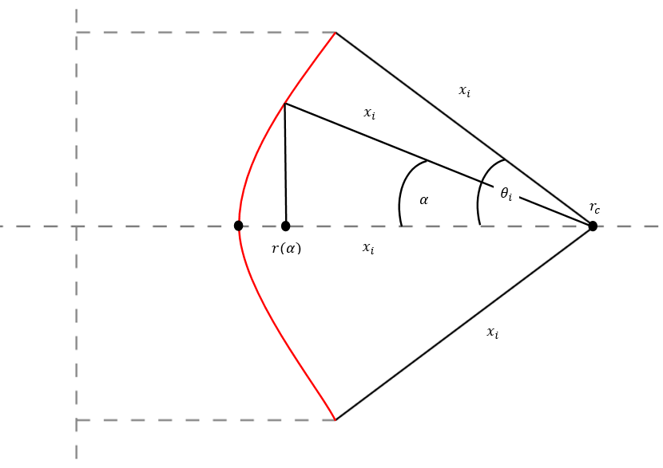
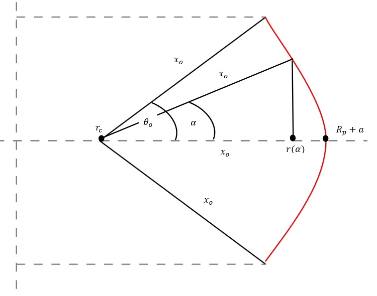

# Plasma Geometry | `PlasmaGeom`

The control of the plasma shaping is done by the `PlasmaGeom` class in `plasma_geometry.py`

The plasma geometric major radius $R_0$ (`rmajor`) and aspect ratio $A$ (`aspect`) 
define the size of the plasma torus. The plasma minor radius $a$ (`rminor`) is 
calculated from these values. The inverse aspect ratio is given by, $\epsilon$ (`eps`) = $1/A$ .

The shape of the plasma cross-section is given by the
elongation of the last closed flux surface (LCFS) $\kappa$ (`kappa`) and the triangularity of the LCFS 
$\delta$ (`triang`), which can be scaled automatically with the aspect ratio if 
required using certain switch conditions of `ishape`:

## Plasma Geometry Parameters | `plasma_geometry()`

This subroutine calculates the plasma geometry parameters based on the given input values.
The plasma geometry parameters include the shaping terms, plasma aspect ratio, elongation, and triangularity.
The function uses various scaling laws and formulas to calculate these parameters based on the specified shape type.

### Elongation & Triangularity 

----

- `ishape = 0` -- `kappa` and `triang` **must** be input.  The elongation and triangularity of the 95% 
    flux surface are calculated as follows, based on the 1989 ITER guidelines [^1]:
  $$
   \kappa_{95} = \kappa / 1.12
  $$
  $$
   \delta_{95} = \delta / 1.5
  $$

----

- `ishape = 1` -- `kappa` and `triang` **must not** be input.  They are calculated by the following equations, 
  which estimate the largest elongation and triangularity achievable for 
  low aspect ratio machines based on the STAR code[^2]:

  $$
  \kappa = 2.05 \, \left(1 + 0.44 \, \epsilon^{2.1}\right)
  $$

  $$
  \delta = 0.53 \, \left(1 + 0.77 \, \epsilon^3\right)
  $$

  The lower limit for the edge safety factor `q95_min` is also set here
  $$
  q_{\text{lim}} = 3 \, \left(1 + 2.6 \, \epsilon^{2.8}\right)
  $$

  The values for the plasma shaping parameters at the 95% flux surface are calculated using a fit 
  to a family of equilibria calculated using the FIESTA code, equivalent to that used in `ishape = 8`.

  $$
   \kappa_{95} = \frac{(\kappa - 0.39467)}{0.90698}
  $$

  $$
   \delta_{95} = \frac{(\delta - 0.048306)}{1.3799}
  $$

----

- `ishape = 2` -- The Zohm ITER scaling [^3] is used to calculate the elongation, where input variable `fkzohm` $= F_{kz}$ may be used to adjust the scaling, while the input 
  value of the triangularity is used unchanged

  $$
  \kappa = F_{kz} \, \times \, \mathrm{minimum} \left( 2.0, \, \, 1.5 + \frac{0.5}{A-1} \right)
  $$

  The elongation and triangularity of the 95% flux surface are calculated as follows, based on the 1989 ITER guidelines [^1]:

  $$
   \kappa_{95} = \kappa / 1.12
  $$
  $$
   \delta_{95} = \delta / 1.5
  $$

---------------------------------------------------------------------
- `ishape = 3` -- The Zohm ITER scaling[^3] is used to calculate the elongation (as for `ishape = 2` 
  above), but the triangularity at the 95% flux surface is input via variable `triang95`, and the 
  LCFS triangularity `triang` is calculated from it, rather than the other way round.
---------------------------------------------------------------------  
- `ishape = 4` -- The 95% flux surface values `kappa95` and `triang95` are both used as inputs, 
  and the LCFS values are calculated from them by inverting the equations given above 
  for `ishape = 0`.
---------------------------------------------------------------------
- `ishape = 5` -- The 95% flux surface values `kappa95` and `triang95` are both used as inputs and 
  the LCFS values are calculated from a fit to MAST data:

  $$
  \kappa = 0.913 \, \kappa_{95} + 0.38654
  $$

  $$
  \delta = 0.77394 \, \delta_{95} + 0.18515 
  $$
---------------------------------------------------------------------
- `ishape = 6` -- The input values for `kappa` and `triang` are used directly and the 95% flux 
  surface values are calculated using the MAST scaling from `ishape = 5`.
---------------------------------------------------------------------
- `ishape = 7` -- The 95% flux surface values `kappa95` and `triang95` are both used as inputs and 
  the LCFS values are calculated from a fit to FIESTA runs:

  $$
  \kappa = 0.90698 \, \kappa_{95} + 0.39467
  $$

  $$
  \delta = 1.3799 \, \delta_{95} + 0.048306 
  $$
---------------------------------------------------------------------
- `ishape = 8` -- The input values for `kappa` and `triang` are used directly and the 95% flux 
  surface values are calculated using the FIESTA fit from `ishape = 7`.
---------------------------------------------------------------------
- `ishape = 9` -- The input values for `triang` and `rli` are used, `kappa` and the 95% flux 
  surface values are calculated.

  $$
   \kappa = \left(\left(1.09+\frac{0.26}{l_i}\right)\left(\frac{1.5}{A}\right)^{0.4}\right)
  $$

  Where $l_i$ is the plasma normalised internal inductance.

  The elongation and triangularity of the 95% flux surface are calculated as follows, based on the 1989 ITER guidelines [^1]:

  $$
   \kappa_{95} = \kappa / 1.12
  $$
  $$
   \delta_{95} = \delta / 1.5
  $$
---------------------------------------------------------------------
- `ishape = 10` -- The input values for  `triang` are used directly to calculate 95% flux surface values. `kappa` is calculated to a fit from CREATE data for  a EU-DEMO type machine with aspect ratios of ($2.6\le A \le 3.6$). Coefficient values are rounded to 2 decimal places

  $$
  \kappa_{95} = \frac{(18.84 -(0.87 \times A)) - \sqrt{4.84A^2 -28.77 A+52.52+14.74 \times  m_{\text{s,limit}}}}{2a}
  $$
Where $m_{\text{s,limit}}$ is the inputted vertical stablity margin limit (default = 0.3)
  

If $\kappa_{95}>1.77$ then its value is adjusted:

$$
\kappa_{95} =  \kappa_{95}^{\frac{1.77}{\kappa_{95}}} + \frac{0.3 \ (\kappa_{95}-1.77)}{\frac{1.77}{\kappa_{95}}}
$$

The elongation and the triangularity of the 95% flux surface is calculated as follows, based on the 1989 ITER guidelines [^1]:

$$
\kappa = 1.12 \ \kappa_{95}
$$

$$
\delta_{95} = \delta / 1.5
$$

---------------------------------------------------------------------
- `ishape = 11` -- The elongation is calculated directly dependant on the aspect ratio for spherical tokamak aspect ratios.[^4]

    $$
    \kappa = 0.95 \left(1.9+\frac{1.9}{A^{1.4}}\right)
    $$

  The elongation and triangularity of the 95% flux surface are calculated as follows, based on the 1989 ITER guidelines [^1]:

  $$
  \kappa_{95} = \kappa / 1.12
  $$
  $$
  \delta_{95} = \delta / 1.5
  $$

---------------------------------------------------------------------
An explicit constraint relating to the plasma's vertical stability may be turned on if
required. In principle, the inner surface of the outboard shield could be used
as the location of a conducting shell to mitigate the vertical
displacement growth rate of plasmas with significant elongation [^5]. The 
maximum permissible distance $r_{\text{shell, max}}$ of this shell from the geometric 
centre of the plasma may be set using input parameter `cwrmax`, such that 
$r_{\text{shell, max}} =$ `cwrmax*rminor`. Constraint equation 
no. 23 should be turned on with iteration variable no.\ 104 (`fcwr`) to enforce 
this

The plasma surface area, cross-sectional area and volume are calculated using
formulations that approximate the LCFS as a revolution of two arcs which
intersect the plasma X-points and the plasma midplane outer and inner
radii. (This is a reasonable assumption for double-null diverted plasmas, but
will be inaccurate for single-null plasmas, `snull = 1`)

### Plasma-Wall Gap

The region directly outside the last closed flux surface of the core plasma is
known as the scrape-off layer, and contains no structural material. Plasma
entering this region is not confined and is removed by the divertor. PROCESS
treats the scrape-off layer merely as a gap.

The plasma and first wall clearance can be calculated or input by setting the `i_plasma_wall_gap` switch.

- `i_plasma_wall_gap` == 0, then the inboard and outboard plasma wall gaps are set to be 10% of the plasma minor radius ($a$).
- `i_plasma_wall_gap` == 1, then the inboard and outboard plasma wall gaps are set by defining `scrapli` and `scraplo` respectively.

### Geometrical properties | `xparam()`

This method calculates the radius and half angle of the arc describing the inboard and outboard plasma surfaces. This calculation is appropriate for plasmas with a separatrix. It requires the plasma minor radius ($a$,     `rminor`), elongation ($\kappa$, `kappa`) and triangularity ($\delta$, `triang`).

| Input Variable | Description                          |
|----------|--------------------------------------|
| `rminor`, $a$        | Plasma minor radius [$\text{m}$]              |
| `kappa`, $\kappa$      | Plasma separatrix elongation         |
| `triang`, $\delta$      | Plasma separatrix triangularity      |

| Output Variable | Description                          |
|----------|--------------------------------------|
| `xi`       | Radius of arc describing inboard surface [$\text{m}$] |
| `thetai`   | Half-angle of arc describing inboard surface |
| `xo`       | Radius of arc describing outboard surface [$\text{m}$] |
| `thetao`   | Half-angle of arc describing outboard surface |

<figure markdown>
{ width="100%"}
<figcaption>Figure 1: Geometrical dimensions used to determine plasma shape parameters</figcaption>
</figure>

$$
 x_i^2 = a^2\kappa^2 + (ay + a +\delta a)^2 \\
= a^2\kappa^2 + a^2L^2, \ \ \ \text{where} \ \ L= 1+\delta+y
$$

$$
x_i = (a+\delta a +ay)+a-\delta a \\
= aL+a(1-\delta) \\
= a(L+T), \ \ \ \text{where}\ \ T=1-\delta
$$

$$
\therefore a^2\kappa^2 + a^2L^2 = a^2(L+T)^2 \\
\kappa^2+L^2 = L^2 +2LT +T^2 \\
\therefore L = \frac{\kappa^2-T^2}{2T}
$$

$$
\fbox{$ \mathtt{thetai} = \theta_i = \arctan \left({\frac{\kappa}{L}}\right) \\
\mathtt{xi} = x_i = a(L+1-\delta)$}
$$

Similarly for the inboard side:

$$
 x_o^2 = a^2\kappa^2 + (aw + a -\delta a)^2 \\
= a^2\kappa^2 + a^2M^2, \ \ \ \text{where} \ \ M= 1-\delta+w
$$

$$
x_o = aM +\delta a + a \\
= aM+a(1+\delta) \\
= a(M+N), \ \ \ \text{where}\ \ N=1+\delta
$$

$$
\therefore a^2\kappa^2 + a^2M^2 = a^2(M+N)^2 \\
\kappa^2+M^2 = M^2 +2MN +N^2 \\
\therefore M = \frac{\kappa^2-N^2}{2N}
$$

$$
\fbox{$\mathtt{thetao}= \theta_o = \arctan \left({\frac{\kappa}{M}}\right) \\
\mathtt{xo}=x_o = a(M+1+\delta)$}
$$

### Surface Area | `xsurf()`
This function finds the plasma surface area, using the
revolution of two intersecting arcs around the device centreline.
This calculation is appropriate for plasmas with a separatrix.
It uses the geometrical properties derived in `xparam()`

| Input Variable | Description                          |
|----------|--------------------------------------|
| `rmajor`, $R$        | Plasma major radius [$\text{m}$]              |
| `rminor`, $a$        | Plasma minor radius [$\text{m}$]              |
| `xi`       | Radius of arc describing inboard surface [$\text{m}$] |
| `thetai`   | Half-angle of arc describing inboard surface |
| `xo`       | Radius of arc describing outboard surface [$\text{m}$] |
| `thetao`   | Half-angle of arc describing outboard surface |

| Output Variable | Description                          |
|----------|--------------------------------------|
| `xsi`       | Inboard surface area [$\text{m}^2$] |
| `xso`       | Outboard surface area [$\text{m}^2$] |

<figure markdown>
{ width="80%"}
<figcaption>Figure 2: Inboard surface area calculation parameters</figcaption>
</figure>

$$
\mathtt{rc}  = R_0-a + \mathtt{xi} \\ 
\mathtt{xsi} = 4\pi \times \mathtt{xi} (\mathtt{rc} \times \mathtt{thetai} -(\mathtt{xi} \times \sin({\mathtt{thetai}))})
$$

For the outboard side:
<figure markdown>
{ width="80%"}
<figcaption>Figure 3: Outboard surface area calculation parameters</figcaption>
</figure>
$$
\mathtt{rc}  = R_0+a - \mathtt{xo} \\ 
\mathtt{xso} = 4\pi \times \mathtt{xo} (\mathtt{rc} \times \mathtt{thetao}+ (\mathtt{xo}\times \sin({\mathtt{thetao}))})
$$

### Sauter geoemtry | `sauter_geometry()`

Plasma geometry based on equations (36) in O. Sauter, Fusion Engineering and Design 112 (2016) 633–645
'Geometric formulas for system codes including the effect of negative triangularity'

| Input Variable | Description                          |
|----------|--------------------------------------|
| `rminor`, $a$        | Plasma minor radius [$\text{m}$]              |
| `rmajor`, $R$        | Plasma major radius [$\text{m}$]              |
| `kappa`, $\kappa$      | Plasma separatrix elongation         |
| `triang`, $\delta$      | Plasma separatrix triangularity      |

| Output Variable | Description                          |
|----------|--------------------------------------|
| `len_plasma_poloidal`       | Plasma Poloidal perimeter length [$\text{m}$] |
| `a_plasma_surface`       | Plasma surface area [$\text{m}^2$] |
| `a_plasma_poloidal`       | Plasma cross-sectional area [$\text{m}^2$] |
| `vol_plasma`       | Plasma volume [$\text{m}^3$] |

$$
\mathtt{w07} = 1
$$

$$
\epsilon = \frac{a}{R}
$$

Poloidal perimeter (named Lp in Sauter)

$$
\mathtt{len_plasma_poloidal} = 2.0\pi a (1 + 0.55 (\kappa - 1))(1 + 0.08 \delta^2)(1 + 0.2 (\mathtt{w07} - 1))
$$

A geometric factor

$$
\mathtt{sf} = \frac{\mathtt{len_plasma_poloidal}}{2.0\pi a}
$$

Surface area (named Ap in Sauter)

$$
\mathtt{a_plasma_surface} = 2.0\pi R (1 - 0.32 \delta \epsilon) \mathtt{len_plasma_poloidal}
$$

Cross-section area (named S_phi in Sauter)
$$
\mathtt{a_plasma_poloidal} = \pi a^2 \kappa (1 + 0.52 (\mathtt{w07} - 1))
$$

Volume
$$
\mathtt{vol_plasma} = 2.0\pi R (1 - 0.25 \delta \epsilon) \mathtt{a_plasma_poloidal}
$$

### Poloidal perimeter
The poloidal plasma perimtere length `len_plasma_poloidal` is calculated as follows:
$$
\mathtt{len_plasma_poloidal} = 2.0 \times (\mathtt{xo} \times \mathtt{thetao} + \mathtt{xi} \times \mathtt{thetai})
$$

The shaping factor for `i_plasma_current = 1` is also calculated here:
$$
\mathtt{sf} = \frac{\mathtt{len_plasma_poloidal}}{
    2.0\pi  a}
$$

### Plasma Volume | `xvol()`

The plasma volume is calculated using the `xvol` method with the inputted $R_0$ & $a$ along with the outputs of `xparam`.
The `cvol` iteration variable can be used to scale this output

| Input Variable | Description                          |
|----------|--------------------------------------|
| `rmajor`, $R$        | Plasma major radius [$\text{m}$]              |
| `rminor`, $a$        | Plasma minor radius [$\text{m}$]              |
| `xi`       | Radius of arc describing inboard surface [$\text{m}$] |
| `thetai`   | Half-angle of arc describing inboard surface |
| `xo`       | Radius of arc describing outboard surface [$\text{m}$] |
| `thetao`   | Half-angle of arc describing outboard surface |

| Output Variable | Description                          |
|----------|--------------------------------------|
| `xvol`       | Plasma volume [$\text{m}^3$] |

Calculate the volume for the inboard plasma side:

$$
\mathtt{rc} = R_0 - a + \mathtt{xi} \\
\mathtt{vin} = (2\pi \times \mathtt{xi}) \times(\mathtt{rc}^2 \times \sin{(\mathtt{thetai})} - (\mathtt{rc}\times \mathtt{xi} \times \mathtt{thetai})-(0.5\times\mathtt{rc} \mathtt{xi} \times \sin{(2\times\mathtt{thetai})})+(\mathtt{xi}^2\times \sin{(\mathtt{thetai})})-\left(\frac{1}{3}\times \mathtt{xi}^2 \times (\sin{(\mathtt{thetai})})^3\right)
$$

Calculate the volume for the outboard plasma side:

$$
\mathtt{rc} = R_0 + a - \mathtt{xo} \\
\mathtt{vout} = (2\pi \times \mathtt{xo}) \times(\mathtt{rc}^2 \times \sin{(\mathtt{thetao})} + (\mathtt{rc}\times \mathtt{xo} \times \mathtt{thetao})+(0.5\times\mathtt{rc} \times\mathtt{xo} \times \sin{(2\times\mathtt{thetao})})+(\mathtt{xo}^2\times \sin{(\mathtt{thetao})})-\left(\frac{1}{3}\times \mathtt{xo}^2 \times (\sin{(\mathtt{thetao})})^3\right)
$$

The volume is then the difference between the two volumes

$$
\mathtt{xvol} = \mathtt{vout}-\mathtt{vin}
$$

### Plasma cross-sectional area | `xsecta()`

This function finds the plasma cross-sectional area, using the
revolution of two intersecting arcs around the device centreline.
This calculation is appropriate for plasmas with a separatrix.

| Input Variable | Description                          |
|----------|--------------------------------------|
| `xi`       | Radius of arc describing inboard surface [$\text{m}$] |
| `thetai`   | Half-angle of arc describing inboard surface |
| `xo`       | Radius of arc describing outboard surface [$\text{m}$] |
| `thetao`   | Half-angle of arc describing outboard surface |

| Output Variable | Description                          |
|----------|--------------------------------------|
| `xsecta`       | Plasma cross-sectional area [$\text{m}^2$] |

$$
\mathtt{xsecta} = \mathtt{xo}^2 \times (
            \mathtt{thetao} - \cos{(\mathtt{thetao})} \times \sin({\mathtt{thetao}})
        ) + \mathtt{xi}^2 \times (\mathtt{thetai} - \cos{(\mathtt{thetai})} \times \sin{(\mathtt{thetai}))}
$$

## Legacy claculations

### STAR Code plasma surface area | `surfa()` 

This function finds the plasma surface area, using the
revolution of two intersecting arcs around the device centreline.
This calculation is appropriate for plasmas with a separatrix.
It was the original method in PROCESS[^6].

| Input Variable | Description                          |
|----------|--------------------------------------|
| `rminor`, $a$        | Plasma minor radius [$\text{m}$]              |
| `rmajor`, $R$        | Plasma major radius [$\text{m}$]              |
| `kappa`, $\kappa$      | Plasma separatrix elongation         |
| `triang`, $\delta$      | Plasma separatrix triangularity      |

| Output Variable | Description                          |
|----------|--------------------------------------|
| `sa`       | Plasma total surface area [$\text{m}^2$] |
| `so`   | Plasma outboard surface area [$\text{m}^2$] |

$$
\mathtt{radco} = a \frac{(1.0 + (\kappa^2 + \delta^2 - 1.0)}{(2.0 \times (1.0 + \delta))}
$$

$$
\mathtt{b} = \kappa \times a
$$

$$
\mathtt{thto} = \arcsin{(\mathtt{b}/\mathtt{radco})}
$$

$$
\mathtt{so} = 4.0\pi \times \mathtt{radco} \times ((R + a - \mathtt{radco}) \times \mathtt{thto} + \mathtt{b})
$$

Inboard side

$$
\mathtt{radci} = a \frac{(1.0 + (\kappa^2 + \delta^2 - 1.0)}{(2.0 \times (1.0 - \delta))}
$$

$$
\mathtt{b} = \kappa \times a
$$

$$
\mathtt{thti} = \arcsin{(\mathtt{b}/\mathtt{radci})}
$$

$$
\mathtt{si} = 4.0\pi \times \mathtt{radci} \times ((R - a + \mathtt{radci}) \times \mathtt{thti} - \mathtt{b})
$$

$$
\mathtt{sa} = \mathtt{so} + \mathtt{si}
$$

### Plasma poloidal perimeter calculation | `perim()`

This function finds the plasma poloidal perimeter, using the
revolution of two intersecting arcs around the device centreline.
This calculation is appropriate for plasmas with a separatrix.

| Input Variable | Description                          |
|----------|--------------------------------------|
| `rminor`, $a$        | Plasma minor radius [$\text{m}$]              |
| `kappa`, $\kappa$      | Plasma separatrix elongation         |
| `triang`, $\delta$      | Plasma separatrix triangularity      |

| Output Variable | Description                          |
|----------|--------------------------------------|
| `perim`       | Plasma poloidal perimeter length [$\text{m}$] |

Inboard arc

$$
\mathtt{denomi} = \frac{(\delta^2 + \kappa^2 - 1.0)}{(2.0 \times (1.0 - \delta))}+ \delta
$$

$$
\mathtt{thetai} = \arctan\left(\frac{\kappa}{\mathtt{denomi}}\right)
$$

$$
\mathtt{xli} = a \times (\mathtt{denomi} + 1.0 - \delta)
$$

Outboard arc

$$
\mathtt{denomo} = \frac{(\delta^2 + \kappa^2 - 1.0)}{(2.0 \times (1.0 + \delta))} -\delta \\
$$

$$
\mathtt{thetao} = \arctan\left(\frac{\kappa}{\mathtt{denomo}}\right) \\
$$

$$
\mathtt{xlo} = a \times (\mathtt{denomo} + 1.0 + \delta) \\
$$

$$
\mathtt{perim} = 2.0 \times (\mathtt{xlo} \times \mathtt{thetao} + \mathtt{xli} \times \mathtt{thetai})
$$

### Plasma volume calculation | `fvol()`

 This function finds the plasma volume, using the
revolution of two intersecting arcs around the device centreline.
This calculation is appropriate for plasmas with a separatrix.

| Input Variable | Description                          |
|----------|--------------------------------------|
| `rmajor`, $R$        | Plasma major radius [$\text{m}$]              |
| `rminor`, $a$        | Plasma minor radius [$\text{m}$]              |
| `kappa`, $\kappa$      | Plasma separatrix elongation         |
| `triang`, $\delta$      | Plasma separatrix triangularity      |

| Output Variable | Description                          |
|----------|--------------------------------------|
| `fvol`       | Plasma volume [$\text{m}^3$] |

$$
\mathtt{zn} = \kappa \times a
$$

$$
\mathtt{c1} = \frac{{(R + a)^2 - (R - \delta \times a)^2 - \mathtt{zn}^2}}{{2 \times (1 + \delta) \times a}}
$$

$$
\mathtt{rc1} = R + a - \mathtt{c1}
$$

$$
\mathtt{{vout}} = -\frac{2}{3} \pi \times \mathtt{zn}^3 + 2 \pi \times \mathtt{zn} \times (\mathtt{c1}^2 + \mathtt{rc1}^2) + 2 \pi \times \mathtt{c1} \times \left(\mathtt{zn} \times \sqrt{\mathtt{rc1}^2 - \mathtt{zn}^2} + \mathtt{rc1}^2 \times \arcsin{\left(\frac{\mathtt{zn}}{\mathtt{rc1}}\right)}\right)
$$

$$
\mathtt{c2} = \frac{-((R - a)^2) + (R - \delta \times a)^2 + \mathtt{zn}^2)}{(2 \times (1 - \delta) \times a)}
$$

$$
\mathtt{rc2} = \mathtt{c2} - R + a
$$

$$
\mathtt{vin} = -\frac{2}{3} \pi \times \mathtt{zn}^3 + 2 \pi \times \mathtt{zn} \times (\mathtt{rc2}^2 + \mathtt{c2}^2) - 2 \pi \times \mathtt{c2} \times \left(\mathtt{zn} \times \sqrt{\mathtt{rc2}^2 - \mathtt{zn}^2} + \mathtt{rc2}^2 \times \arcsin{\left(\frac{\mathtt{zn}}{\mathtt{rc2}}\right)}\right)
$$

$$
\mathtt{fvol} = \mathtt{vout} - \mathtt{vin}
$$

### Plasma cross sectional area calculation | `xsecto()`

This function finds the plasma cross-sectional area, using the
revolution of two intersecting arcs around the device centreline.
This calculation is appropriate for plasmas with a separatrix.

| Input Variable | Description                          |
|----------|--------------------------------------|
| `rminor`, $a$        | Plasma minor radius [$\text{m}$]              |
| `kappa`, $\kappa$      | Plasma separatrix elongation         |
| `triang`, $\delta$      | Plasma separatrix triangularity      |

| Output Variable | Description                          |
|----------|--------------------------------------|
| `xsect0`       | Plasma cross-sectional area [$\text{m}^2$] |

$$
\mathtt{denomi} = \frac{(\delta^2 + \kappa^2 - 1.0)}{(2.0 \times (1.0 - \delta))}+ \delta
$$

$$
\mathtt{thetai} = \arctan\left(\frac{\kappa}{\mathtt{denomi}}\right)
$$

$$
\mathtt{xli} = a \times (\mathtt{denomi} + 1.0 - \delta)
$$

$$
\mathtt{cti} = \cos(\mathtt{thetai})
$$

$$
\mathtt{sti} = \sin(\mathtt{thetai})
$$

$$
\mathtt{denomo} = \frac{(\delta^2 + \kappa^2 - 1.0)}{(2.0 \times (1.0 + \delta))}- \delta
$$

$$
\mathtt{thetao} = \arctan\left(\frac{\kappa}{\mathtt{denomo}}\right)
$$

$$
\mathtt{xlo} = a \times (\mathtt{denomo} + 1.0 + \delta)
$$

$$
\mathtt{cto} = \cos(\mathtt{thetao})
$$

$$
\mathtt{sto} = \sin(\mathtt{thetao})
$$

$$
\mathtt{xsect0} = \mathtt{xlo}^2 \times (\mathtt{thetao} - \mathtt{cto} \times \mathtt{sto}) + \mathtt{xli}^2 \times (\mathtt{thetai} - \mathtt{cti} \times \mathtt{sti})
$$

[^1]: N.A. Uckan and ITER Physics Group, *ITER Physics Design Guidelines: 1989*, 
ITER Documentation Series, No. 10, IAEA/ITER/DS/10 (1990)
[^2]: J.D. Galambos, *'STAR Code : Spherical Tokamak Analysis and Reactor Code'*,
Unpublished internal Oak Ridge document.
[^3]: H. Zohm et al, *'On the Physics Guidelines for a Tokamak DEMO'*,
FTP/3-3, Proc. IAEA Fusion Energy Conference, October 2012, San Diego
[^4]: Menard, J.E. & Brown, T. & El-Guebaly, L. & Boyer, M. & Canik, J. & Colling, Bethany & Raman, Roger & Wang, Z. & Zhai, Yunbo & Buxton, Peter & Covele, B. & D’Angelo, C. & Davis, Andrew & Gerhardt, S. & Gryaznevich, M. & Harb, Moataz & Hender, T.C. & Kaye, S. & Kingham, David & Woolley, R.. (2016). *Fusion nuclear science facilities and pilot plants based on the spherical tokamak.* Nuclear Fusion. 56. 106023. 10.1088/0029-5515/56/10/106023. 
[^5]: H.S. Bosch and G.M. Hale, *Improved Formulas for Fusion Cross-sections* 
and Thermal Reactivities', Nuclear Fusion 32 (1992) 611
[^6]: J D Galambos, *STAR Code : Spherical Tokamak Analysis and Reactor Code*,
unpublished internal Oak Ridge document