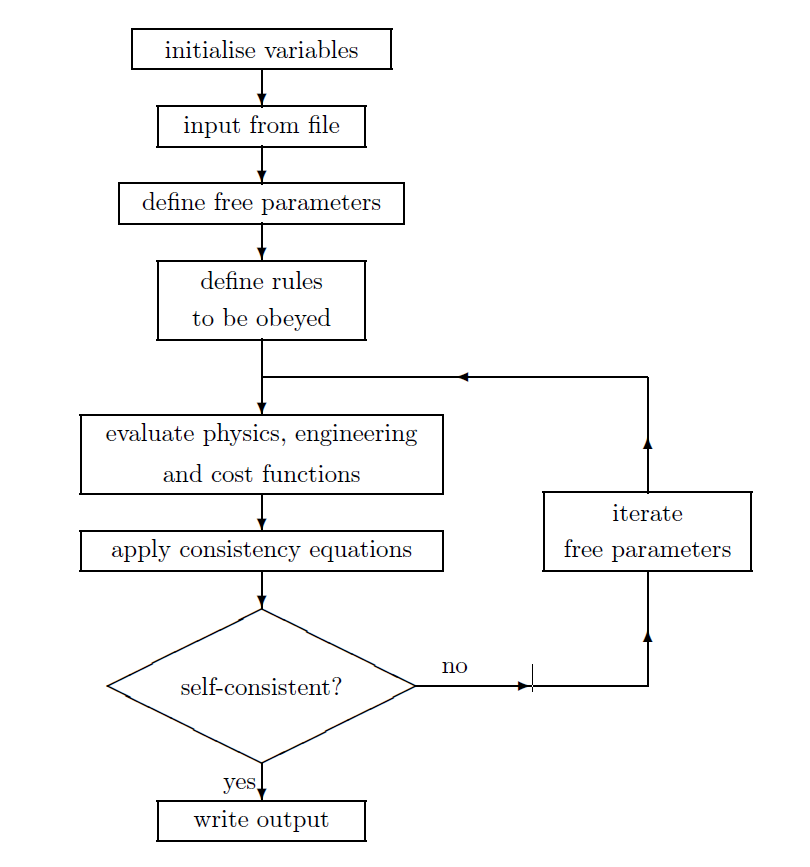

# Equation Solvers

`PROCESS` contains a constrained non-linear optimiser, and a constrained non-linear equation solver, which reflect the two modes of operation available. Each of these has its own uses.

# Non-optimisation mode

The first of the two equation solvers present in `PROCESS` is the non-optimisation package HYBRD.[^1] [^2] Formally, HYBRD finds a zero of a systems of $N$ non-linear functions in $N$ variables. This means simply that $N$ variables (power plant parameters) are iterated by `PROCESS` in such a way as to solve a set of $N$ equation (physics or engineering laws), i.e. a set of set-consistent power plant parameters is found. This is useful for performing benchmark comparisons, when the device size is kept fixed, and one only wishes to find calculated stresses, beta values, fusion powers, etc. A flow diagram of `PROCESS` in non-optimisation mode is shown in Figure 1.

Figure 1: *Flow diagram of `PROCESS` in non-optimisation mode*

# Non-optimisation mode

Sometimes one wants to find an optimal machine that is both consistent with the physics and engineering constraints but also minimises or maximises a certain *figure of merit*. This requires running `PROCESS` in optimisation mode. For these applications `PROCESS` uses the routine `VMCON`[^3] based on a variable metric method for constrained optimisation by Powell[^4]. If finds a stationary point of an objective function/figure of merit consistent with a set of equality and inequality constraints. It is designed to solve the necessary but not sufficient conditions of a constrained optimum, hence, the solution does not have to be a global minimum.

The detailed algorithm is explained in the Optimisation Solver Documentation and is based on the Lagrange method that combines both the objective function and the constraints using Lagrange multipliers. It applies a sequential quadratic equation programming approach in which a series of subproblems is solved that constitute a local quadratic expansion of the Lagrangian. The solution of the quadratic subproblem is the direction of a line search along which a one dimensional optimisation is performed. This line search was introduced by Powell to assure convergence from bad starting parameters. Within `PROCESS` we have modified the line search of the original `VMCON` routine to assure convergence, even for slightly inconsistent input functions.

The algorithm uses a quasi Newtonian approach which only requires continuous first derivatives of these functions. While the first derivative are evaluated using finite difference approximation, the second derivatives are estimated using a variant of the Broyden-Fletcher-Goldfarb-Shanno update.

# Scans

It is often useful to be able to scan through a range of values of a given parameter to see what effect this has on the machine as a whole. Sensitivity studies of this kind can be achieved very easily using `PROCESS`. Scans are carried out in optimisation mode, whereby the code initially performs a run using the parameters specified in the input file, and then a series of runs using the parameters produced at the end of the previous iteration. The value of the quantity being scanned is specified at every stage. This method ensures that a smooth variation in the machine parameters is achieved.

[^1]: J. J. More, B. S. Garbow and E. Hillstrom, *"User Guide for MINPAC-1"*, Argonne National Laboratory Report ANL-80-74 (1980)  
[^2]: M. J. D. Powell, *"A Hybrid Method for Non-linear Algebraic Equations"*, Numerical Methods for Non-linear Algebraic Equations, ed. P. Rabinowitz, Prentice-Hall 
[^3]: R. L. Crane, K. E. Hillstrom and M. Minkoff, *"Solution of the General Nonlinear Programming Problem with Subroutine VMCON"*, Argonne National Laboratory Report ANL-80-64 (1980) 
[^4]: M. J. D. Powell, *"A Fast Algorithm for Nonlinearly Constrained Optimization Calculations"*, Lecture Notes in Mathematics, vol. 630, pp.144{157, Springer-Verlag, Berlin, 1978