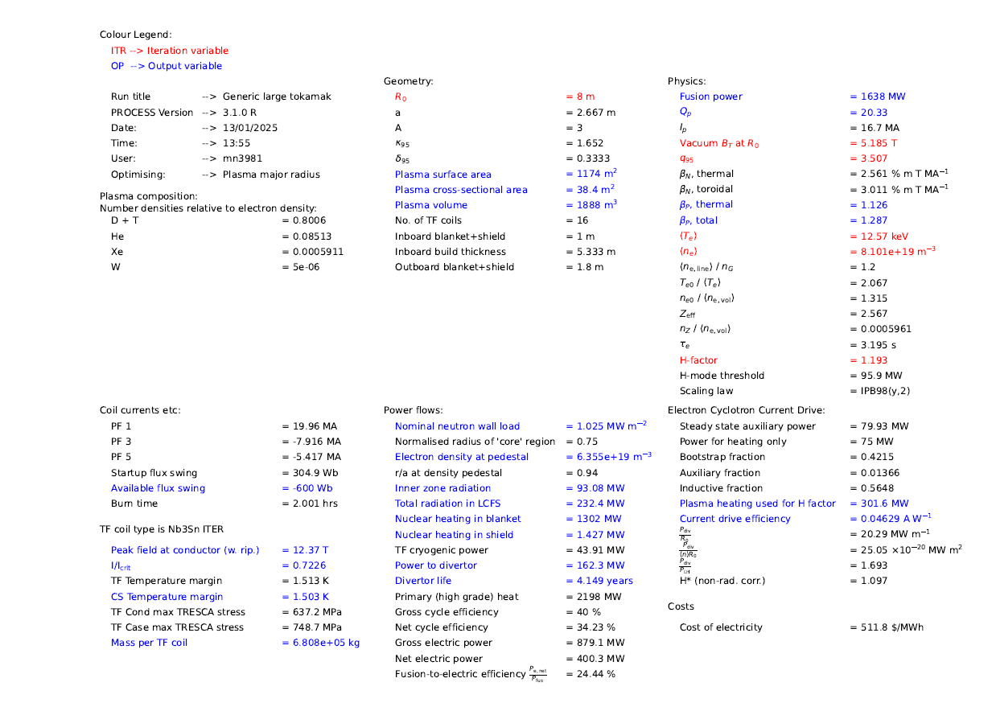
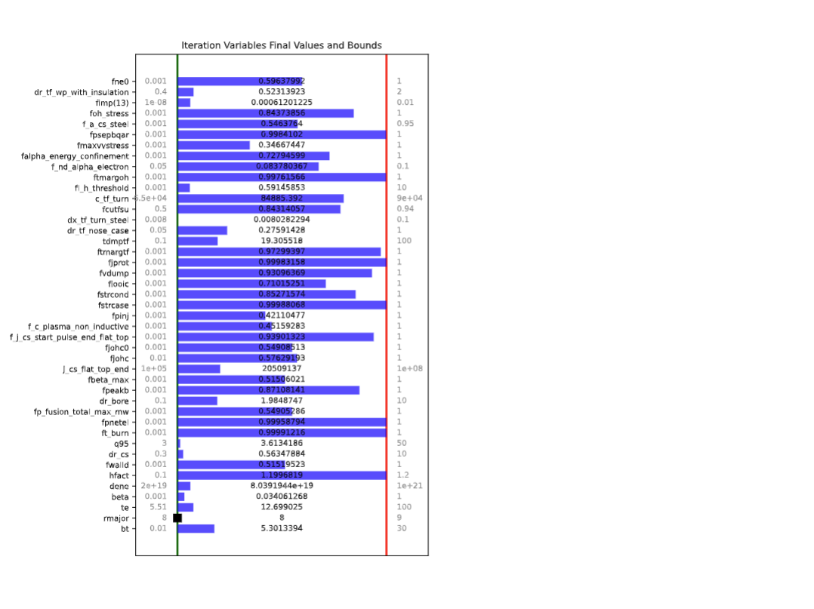
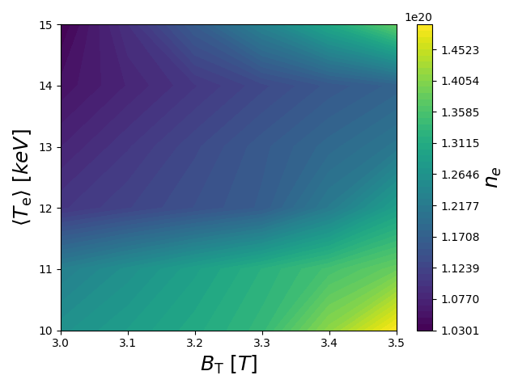
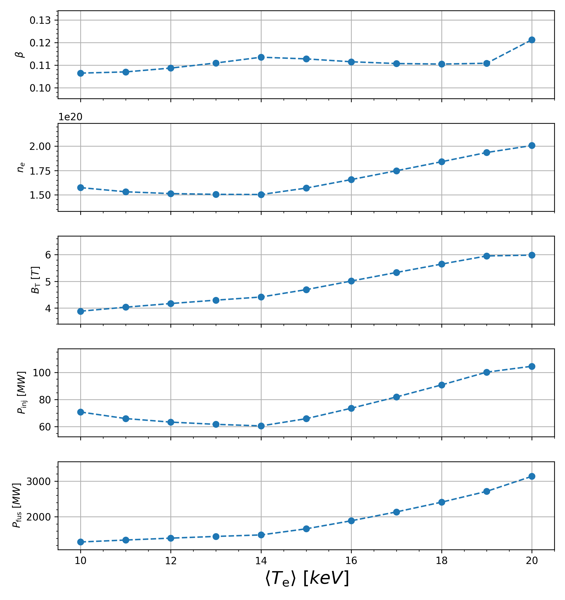
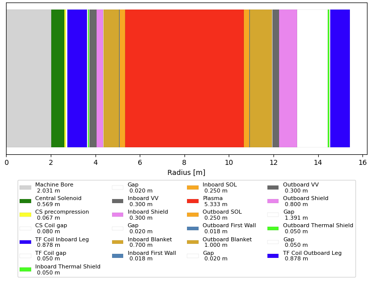

# Utilities

<h2>Plotting an MFILE</h2>

<h3>Summary document</h3>
`plot_proc` is used for plotting an overview of the results from an MFILE. It can be run using its own CLI:

```bash
python process/io/plot_proc.py -f path/to/MFILE.DAT
```

or through Process's main CLI (working, but still in development):

```bash
process -i path/to/IN.DAT --plot --mfile path/to/MFILE.DAT
``` 
<figure markdown>
{ width="100%"}
<figcaption>Figure 1: plot_proc front summary page </figcaption>
</figure>

<figure markdown>
{ width="100%"}
<figcaption>Figure 2: plot_proc plasma profiles and cross-sections page </figcaption>
</figure>

<h3>Scan files</h3>

`plot_scans` is a tool to show the change in variables as a scan variable is varied.
Scans can be done in one or two dimensions.

```bash
python process/io/plot_scans.py -f path/to/MFILE.DAT
```
<figure markdown>
{figures-side, width="100%"}  
<figcaption>Figure 3: 2D scan contour plot </figcaption>
</figure>

<figure markdown>
{figures-side, width="100%"}  
<figcaption>Figure 3: 1D scan plot </figcaption>
</figure>


<h3>Radial build</h3>

`plot_radial_build` is to plot the radial build of the machine in terms of bar segments. It can be run as follows:

```bash
python process/io/plot_radial_build.py -f path/to/MFILE.DAT
```
<figure markdown>
{ width="100%"}
<figcaption>Figure 5: Simple radial build plot </figcaption>
</figure>

