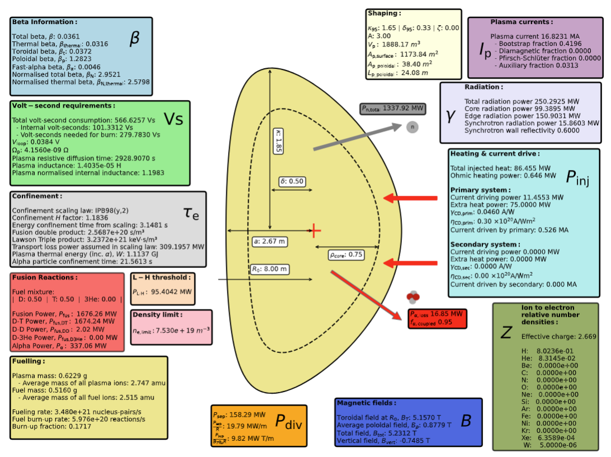
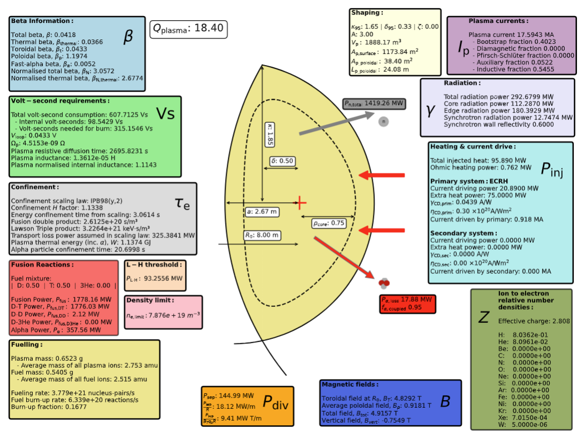
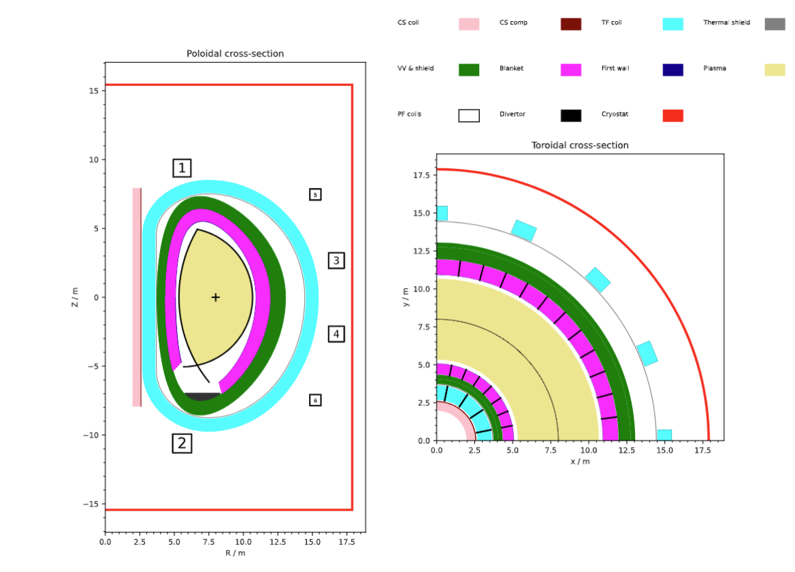
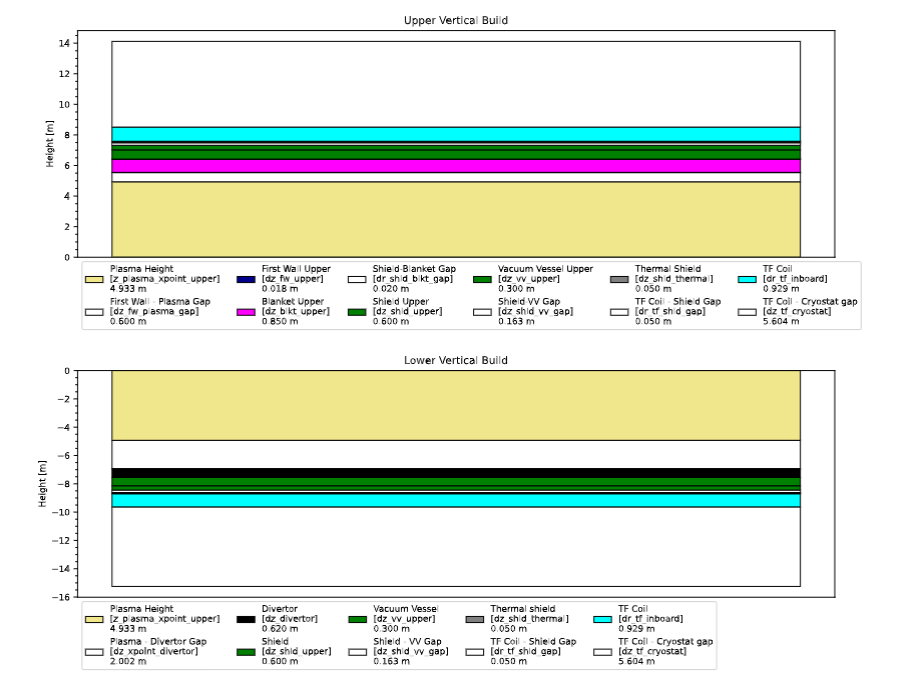
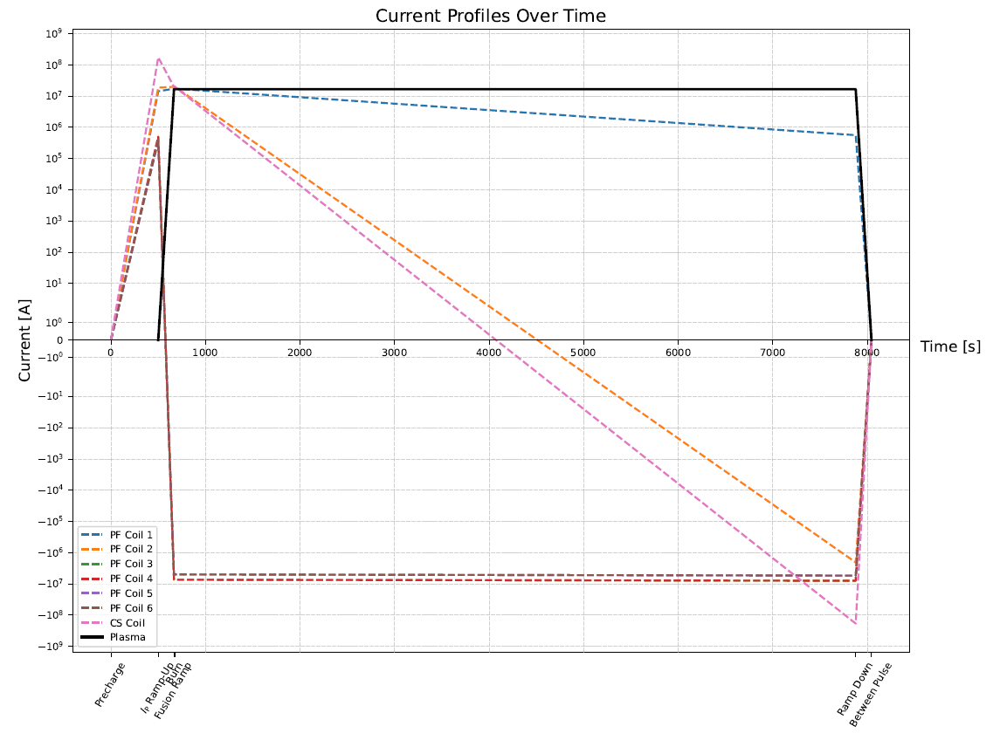

# Utilities

## Plotting an MFILE

!!! note 

    The majority of the output plots can be automatically generated at the end of the `PROCESS` run by using the `--full-output` flag.
    See the [running process](./running-process.md) section for more info.

### Summary document | `plot_proc.py`

`plot_proc` is used for plotting an overview of the results from an MFILE. It can be run using its own CLI:

```bash
python process/io/plot_proc.py -f path/to/MFILE.DAT
```

or through Process's main CLI (working, but still in development):

```bash
process -i path/to/IN.DAT --plot --mfile path/to/MFILE.DAT
``` 
<figure markdown>
{ width="100%"}
<figcaption>Figure 1: plot_proc front summary page </figcaption>
</figure>

<figure markdown>
{ width="100%"}
<figcaption>Figure 2: plot_proc solution point information page </figcaption>
</figure>

<figure markdown>
{ width="100%"}
<figcaption>Figure 3: plot_proc main plasma information page </figcaption>
</figure>

<figure markdown>
{ width="100%"}
<figcaption>Figure 4: plot_proc plasma profiles page </figcaption>
</figure>

<figure markdown>
{ width="100%"}
<figcaption>Figure 5: plot_proc machine cross-section page </figcaption>
</figure>

<figure markdown>
{ width="100%"}
<figcaption>Figure 6: plot_proc radial build page </figcaption>
</figure>

<figure markdown>
{ width="100%"}
<figcaption>Figure 7: plot_proc TF coil and turn cross-section page </figcaption>
{ width="100%"}
<figcaption>Figure 7: plot_proc vertical build page </figcaption>
</figure>

<figure markdown>
{ width="100%"}
<figcaption>Figure 8: plot_proc TF coil and turn cross-section page </figcaption>
</figure>

<figure markdown>
{ width="100%"}
<figcaption>Figure 9: plot_proc bootstrap current model and L-H threshold comparison page </figcaption>
</figure>

<figure markdown>
{ width="100%"}
<figcaption>Figure 10: plot_proc TF coil structure  </figcaption>
</figure>

<figure markdown>
{ width="100%"}
<figcaption>Figure 11: plot_proc density limit and confinement time comparison page  </figcaption>
</figure>

<figure markdown>
{ width="100%"}
<figcaption>Figure 12: plot_proc current profiles comparison page  </figcaption>
</figure>

<figure markdown>
{ width="100%"}
<figcaption>Figure 13: plot_proc central solenoid and turn cross-section page  </figcaption>
</figure>

<figure markdown>
{ width="100%"}
<figcaption>Figure 14: plot_proc first wall comparison page  </figcaption>
</figure>

----------------

### Scan files

`plot_scans` is a tool to show the change in variables as a scan variable is varied.
Scans can be done in one or two dimensions.

```bash
python process/io/plot_scans.py -f path/to/MFILE.DAT
```
<figure markdown>
{figures-side, width="100%"}  
<figcaption>Figure 10: 2D scan contour plot </figcaption>
</figure>

<figure markdown>
{figures-side, width="100%"}  
<figcaption>Figure 11: 1D scan plot </figcaption>
</figure>

----------------

### Radial build

`plot_radial_build` is to plot the radial build of the machine in terms of bar segments. It can be run as follows:

```bash
python process/io/plot_radial_build.py -f path/to/MFILE.DAT
```
<figure markdown>
{ width="100%"}
<figcaption>Figure 12: Simple radial build plot </figcaption>
</figure>

