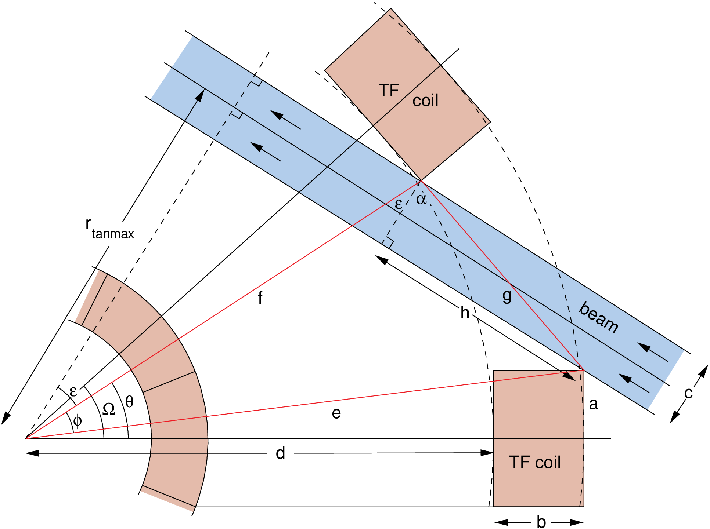

# Neutral Beam Injection Heating | `NeutralBeam`

!!! Warning "NBI Models" 
    At present, the neutral beam models do not include the effect of an edge transport barrier (pedestal) in the plasma profile.

## Neutral beam access | `calculate_beam_port_size()`

If present, a neutral beam injection system needs sufficient space between the TF coils to be able to intercept the plasma tangentially. The major radius `radius_beam_tangency` at which the centre-line of the beam is tangential to the toroidal direction is user-defined using input parameter `f_radius_beam_tangency_rmajor`, which is the ratio of `radius_beam_tangency` to the plasma major radius `rmajor`.

The maximum possible tangency radius `radius_beam_tangency_max` is determined by the geometry of the TF coils - see Figure 1, and this can be enforced using `icc = 20`. The thickness of the beam duct walls may be set using input parameter `dx_beam_shield`.

<figure markdown>
{ width = "300"}
<figcaption>Figure 1: Top-down schematic of the neutral beam access geometry. The beam with the maximum possible tangency radius is shown here.</figcaption>
</figure>

$$
\Omega = \frac{2\pi}{\underbrace{N_{\text{TF,coils}}}_{\texttt{n_tf_coils}}}
$$

$$
a = 0.5 \times \overbrace{\mathrm{d}x_{\text{TF,inboard-out}}}^{\texttt{dx_tf_inboard_out_toroidal}}
$$

$$
b = \overbrace{\mathrm{d}R_{\text{TF,outboard}}}^{\texttt{dr_tf_outboard}}
$$

$$
c = \overbrace{\mathrm{d}x_{\text{beam,duct}}}^{\texttt{dx_beam_duct}} + \left(2 \times \overbrace{\mathrm{d}x_{\text{beam,shield}}}^{\texttt{dx_beam_shield}}\right)
$$

$$
d = \overbrace{R_{\text{TF,outboard,mid}}}^{\texttt{r_tf_outboard_mid}} - \left(0.5 \times b\right)
$$

$$
e = \sqrt{a^2+\left(d+b\right)^2}
$$

$$
f = \sqrt{a^2 + d^2}
$$

$$
\theta = \Omega - \arctan{\left(\frac{a}{d}\right)}
$$

$$
\phi = \theta - \arcsin{\left(\frac{a}{e}\right)}
$$

$$
g = \sqrt{e^2+f^2-2ef\cos{\phi}}
$$

If the value of $g$ is greater than $c$, then:

$$
h = \sqrt{g^2-c^2}
$$

$$
\epsilon = \arcsin{\left(\frac{e\sin{\left(\phi\right)}}{g}\right)} - \arctan{\left(\frac{h}{c}\right)}
$$

The maximum possible tangency radius, which can be applied as a constraint, is:

$$
\overbrace{R_{\text{tangency,max}}}^{\texttt{radius_beam_tangency_max}} = f \cos{\left(\epsilon\right)}- \frac{c}{2}
$$

--------------

## Neutral beam losses

Input parameter `f_p_beam_orbit_loss` can be used to specify the fraction of the net injected neutral beam power that is lost between the beam particles' ionisation and thermalisation (known as the first orbit loss). This quantity cannot easily be calculated as it depends on the field ripple and other three-dimensional effects. The power lost is assumed to be absorbed by the first wall.

The power in the beam atoms that are not ionised as they pass through the plasma (shine-through) is calculated by the code. There are two constraint equations that can be used to control the beam penetration and deposition, as follows:

- It is necessary to use a beam energy that simultaneously gives adequate penetration of the beam to the centre of the plasma and tolerable shine-through of the beam on the wall after the beam has traversed the plasma. The number of exponential decay lengths, $\tau$, for the beam power to fall before it reaches the plasma centre should be in the region of ~ 4-6[^2],. Constraint equation no. 14 may be used to force $\tau$ to be equal to the value given by input parameter `n_beam_decay_lengths_core_required`, and is therefore in effect a beam energy consistency equation.
- Alternatively, constraint equation no. 59 with iteration variable no. 105 (`fnbshineef`) may be used to ensure that the beam power fraction emerging from the plasma is no more than the value given by input parameter `f_p_beam_shine_through_max`.

It is recommended that <b>only one</b> of these two constraint equations is used during a run.

------------

## Beam stopping cross-section | `sigbeam()`

| Input       | Description                          |
| :---------- | :----------------------------------- |
| $\mathtt{eb}$      | Beam energy $\left(\text{keV}/\text{amu}\right)$   |
| $\mathtt{temp_plasma_electron_vol_avg_kev}$, $T_{\text{e}}$       | Electron temperature $\left(\text{keV}\right)$   |
| $\mathtt{ne}$, $n_{\text{e}}$       | Electron density $\left(10^{20}\text{m}^{-3}\right)$  |
| $\mathtt{rnhe}$      | Alpha density / $n_{\text{e}}$   |
| $\mathtt{rnc}$,        | Carbon density /$n_{\text{e}}$   |
| $\mathtt{rno}$,      | Oxygen density /$n_{\text{e}}$  |
| $\mathtt{rnfe}$      | Iron density /$n_{\text{e}}$   |

Both the [ITER](./iter_nb.md) and [Culham](culham_nb.md) NBI models both use the `sigbeam` method to calculate the stopping cross section[^1]. It finds a suitable analytic expression for $\sigma_s^{(Z)}(E,n_{\text{e}},T_{\text{e}},Z_{\text{eff}})$ for fitting $\sigma_s$ data for a single impurity $(\text{Z)}$ plasma:

$$
\sigma_s^{(Z)}(E,n_{\text{e}},T_{\text{e}},Z_\text{eff}) = \frac{e^{[S_{1} (E,n_{\text{e}}, T_{\text{e}})]}}{E} \times\left [1 +(Z_\text{eff}-1) S_z(E, n_{\text{e}}, T_{\text{e}})\right] \  (\times 10^{-16} \text{cm}^2)
$$

where

$$
S_{1} = \sum_{i=1}^2 \sum_{j=1}^3 \sum_{k=1}^2 \ \{A_{ijk} \times (\ln E)^{i-1} \ [\ln(n/n_{0})]^{j-1} \ (\ln T_{\text{e}})^{k-1} \}
$$

$$
S_{Z} = \sum_{i=1}^3 \sum_{j=1}^2 \sum_{k=1}^2 \ \{B_{ijk}^{(z)} \times (\ln E)^{i-1} \ [\ln(n/n_{0})]^{j-1} \ (\ln T_{\text{e}})^{k-1} \}
$$

with $E, n_e, T$ expressed in units of keV/u, $\text{cm}^3$ and keV, respectively, and $n_0 = 10^{13} \text{cm}^3$. The function $S_1 (E, n_{\text{e}}, T_{\text{e}})$ together with the $E^{-1}$ factor describes the beam stopping in a pure hydrogenic plasma, while the function $(Z_{\text{eff}}- 1)\  S_z (E, n_e, T_e)$ describes the effect of the impurity $Z$ on the beam stopping.

!!! info "Info" 
    For the full table of values for $A_{ijk}$ & $B_{ijk}^{(z)}$\  please see the accompanying paper[^1] or `current_drive.py`

!!! warning "Model applicability with different impurities"
    Be cautious that the model only incorporates the presence of carbon, oxygen and iron impurities. Using other impurities will mean that the cross-section is not calculated appropriately.

For a plasma having an arbitrary mix of $N$ different types of impurities with densities $n$, and charges $Z_q (q = 1, ..., N)$, the beam stopping cross-section can be represented as the weighted sum of the stopping cross- sections for $N$ reference single-impurity plasmas. In each of these reference plasmas, the electron density and the proton density (including that of deuterium and tritium ions) are the same as in a true plasma. The impurity density, however, is increased in order to satisfy quasi-neutrality. The weighting function is the electron density $n_qZ_q$ associated with the amu impurity (in the true plasma), divided by the sum of these densities. The result is: 

$$
\sigma_s^{(N)}=\frac{ e^{S_{1}(E, n_{\text{e}}, T_{\text{e}})}}{E} \times\left[1+\frac{1}{n_{\text{e}}} \sum_q n_q Z_q(Z_q-1) S_{Z_q}(E, n_{\text{e}}, T_{\text{e}})\right] 
(\times 10^{-16} \mathrm{~cm}^2)
$$

---------------

## Ion coupled power | `cfnbi()`
Both the [ITER](./iter_nb.md) and [Culham](culham_nb.md) NBI models both use the `cfnbi` method to calculate the fraction of the fast particle energy coupled to the ions.

| Input       | Description                          |
| :---------- | :----------------------------------- |
| $\mathtt{afast}$, $m_{\text{u,fast}}$      | Mass of fast particle (units of proton mass)   |
| $\mathtt{efast}$, $E_{\text{fast}}$     | Energy of fast particle ($\text{keV}$)   |
| $\mathtt{temp_plasma_electron_vol_avg_kev}$, $T_{\text{e}}$       | Density weighted average electron temperature ($\text{keV}$)   |
| $\mathtt{ne}$, $n_{\text{e}}$       | Volume averaged electron density ($\text{m}^{-3}$)  |
| $\mathtt{nd}$      | Deuterium beam density ($\text{m}^{-3}$)   |
| $\mathtt{nt}$      | Tritium beam density ($\text{m}^{-3}$)   |
| $\mathtt{zeffai}$      | Mass weighted plasma effective charge   |
| $\mathtt{xlmbda}$      | Ion-electron Coulomb logarithm   |

### Coloumb logarithm | `xlmbdabi()`
Firstly, the Coulomb logarithm for the ion-ion collisions ($\ln \Lambda$) is calculated using the `xlmbdabi` method [^2]. The calculation follows these steps:

1. Calculate $x_1$ using the formula:
    $$
    x_1 = \frac{T_{\text{e}}}{10} E_{\text{fast}} \frac{m_{\text{u,fast}}}{n_{\text{e}}}
    $$
    where $T_{\text{e}}$ is the density-weighted average electron temperature (in $\text{keV}$), $E_{\text{fast}}$ is the energy of the fast particle (in $\text{MeV}$), $m_{\text{u,fast}}$ is the mass of the fast particle (in units of proton mass), and $n_{\text{e}}$ is the volume-averaged electron density ($1\times 10^{20}/ \text{m}^3$).

2. Calculate $x_2$ using the formula:
    $$
    x_2 = \frac{m_{\text{u,ion}}}{m_{\text{u,ion}} + m_{\text{u,fast}}}
    $$
    where $m_{\text{u,ion}}$ is the mass of the background ions (in units of proton mass).

3. Calculate $\ln \Lambda$ using the formula:
    $$
    \ln \Lambda = 23.7 + \log(x_2 \sqrt{x_1})
    $$

---

---

Next, the following calculations are performed:

1. Calculate `sumln` using the formula:
    $$
    \mathtt{sumln} = \mathtt{zeffai} \times \frac{\mathtt{xlmbdai}}{\mathtt{xlmbda}}
    $$
    where $\mathtt{zeffai}$ is the mass-weighted plasma effective charge and $\ln\Lambda_{\text{i-e}}$ is the ion-electron Coulomb logarithm.

2. Calculate `xlnrat` using the formula:
    $$
    \mathtt{xlnrat} = 3 \left(\frac{\sqrt \pi}{4}\frac{m_{\text{e}}}{m_{\text{p}} \  \mathtt{sumln}}\right)^{\frac{2}{3}}
    $$
    where $m_{\text{e}}$ is the electron mass and $m_{\text{p}}$ is the proton mass.

3. Calculate $v_{\text{e}}$ using the formula:
    $$
    v_{\text{e}} = c \sqrt{\left(\frac{2 \ T_{\text{e}}}{511}\right)}
    $$
    where $c$ is the speed of light.

4. Calculate `ecritfi` using the formula:
    $$
    \mathtt{ecritfi} = \frac{m_{\text{u,fast}} m_{\text{p}} v_{\text{e}}^2 \  \mathtt{xlnrat}} {(2000 \times e)}
    $$
    where $e$ is the elementary charge.

5. Calculate `x` using the formula:
    $$
    \mathtt{x} = \sqrt{\frac{\mathtt{efast}}{\mathtt{ecritfi}}}
    $$

6. Calculate `ti` using the formula:
   
    $$
    \mathtt{ti} = \log{\frac{x^2-x+1}{(x+1)^2}}
    $$

7. Calculate `thx` using the formula:
    $$
    \mathtt{thx} = \frac{(2x-1)}{\sqrt{3}}
    $$

8. Calculate `t2` using the formula:
    $$
    \mathtt{t2} = 2 \sqrt{3} \arctan({\mathtt{thx}})+\frac{\pi}{6}
    $$

Finally, the fraction of fast particle energy coupled to ions is calculated using the formula:
$$
\text{Fraction of fast particle energy coupled to ions} = \frac{(\mathtt{t1}+\mathtt{t2})}{3\mathtt{x}^2}
$$

[^1]:Janev, R. K., Boley, C. D., & Post, D. E. (1989). *"Penetration of energetic neutral beams into fusion plasmas."* Nuclear Fusion, 29(12), 006. https://doi.org/10.1088/0029-5515/29/12/006

[^2]: David R. Mikkelsen & Clifford E. Singer (1983) *"Optimization of Steady-State Beam-Driven Tokamak Reactors"*, Nuclear Technology - Fusion, 4:2P1, 237-252, DOI: 10.13182/FST83-A22816