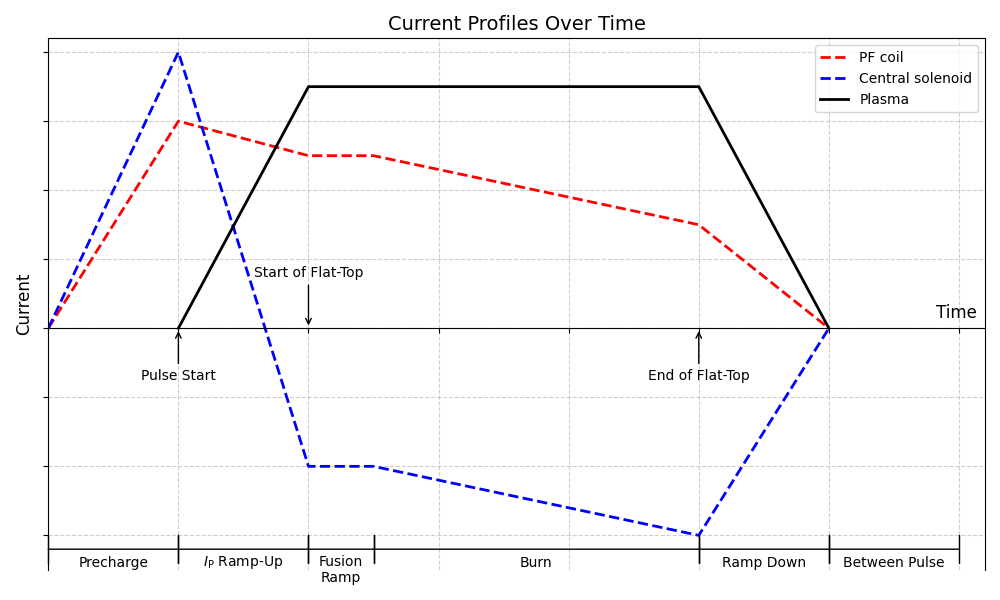

# PF Coil Model

The poloidal field (PF) coils are used initially to cancel the vertical field produced at the 
centre of the plasma by the central solenoid during start-up, and then to maintain the plasma 
position and shape during the flat-top period.

## Positioning

The positions and sizes of te PF coils are partly input, and partly calculated after consideration 
of the required currents and allowable current density.

The PF coil locations are controlled using a set of switches stored in array `i_pf_location[]`. The coils are (usually) organised into groups 
containing two PF coils placed symmetrically above and below the midplane, and each group `j` has 
an element `i_pf_location(j)` assigned to it. Input parameter `n_pf_coil_groups` should be set to the number of groups, 
and `n_pf_coils_in_group(j)` should be assigned the number of coils in each group - which should be 2 in each case.

The values for `dr_pf_cs_middle_offset`, `rpf2`, `zref(j)` and `dr_pf_tf_outboard_out_offset` should be adjusted by the user to locate the PF 
coils accurately.

For PF coils going to be placed outside the TF coils the key radius is defined as:

$$
\overbrace{R_{\text{PF, outside-TF}}}^{\texttt{r_pf_outside_tf_midplane}} = \overbrace{R_{\text{TF,outboard-out}}}^{\texttt{r_tf_outboard_out}} + \overbrace{dR_{\text{PF,TF-offset}}}^{\texttt{dr_tf_outboard_out_offset}}
$$

The four possible values of `i_pf_location(j)` correspond to the following PF coil positions: 

### Above the central solenoid (one group only) | `place_pf_above_cs()`

- `i_pf_location(j) = 1`;

    $$
    R = \overbrace{R_{\text{CS,middle}}}^{\texttt{r_cs_middle}} + \overbrace{dR_{\text{offset}}}^{\texttt{dr_pf_cs_middle_offset}}
    $$

    $$
    Z = \pm \ \overbrace{Z_{\text{CS,top}}}^{\texttt{z_cs_coil_upper}} + 0.1 
    \\ + \frac{1}{2}\left(\left(\underbrace{Z_{\text{TF,inside}}}_{\texttt{z_tf_inside_half}}-Z_{\text{CS,top}}\right)+\underbrace{dR_{\text{TF,inboard}}}_{\texttt{dr_tf_inboard}}+0.1\right)
    $$

-----------------------------

### Above the TF coils (one group only) | `place_pf_above_tf()`

- `i_pf_location(j) = 2`;

    $$
    R = R_0 + \texttt{rpf2} \times \delta \times a
    $$

    Due to the nature of the TF coils not being top-down symmetric for single null cases the positioning slightly differs if the coil is above or below the midplane.
    
    For above the midplane:

    $$
    Z = Z_{\text{TF,top}} + 0.86
    $$    

    For below the midplane:

    $$
    Z = - \left(Z_{\text{TF,top}} - \overbrace{dZ_{\text{TF,upper-lower-midplane}}}^{\texttt{dz_tf_upper_lower_midplane}} + 0.86  \right)
    $$

-------------------

### Outside the TF coils | `place_pf_outside_tf()`

- `i_pf_location(j) = 3`;

    The PF coils can either be stacked vertically outside the TF (ideal for a picture frame coil) or follow the TF coil curve (D-shaped):

    If the chosen value for `i_tf_shape` is that of a picture frame or `i_r_pf_outside_tf_placement == 1` then:

    $$
    R = \overbrace{R_{\text{PF, outside-TF}}}^{\texttt{r_pf_outside_tf_midplane}}
    $$

    Else, the coils follow a D-shape curve

    $$
    R =  \sqrt{\left(\overbrace{R_{\text{PF, outside-TF}}}^{\texttt{r_pf_outside_tf_midplane}}\right)^2 - Z^2}
    $$

    $$
    Z = \pm \ a \times \texttt{zref}
    $$

---------------------

### General placement | `place_pf_generally()`

- `i_pf_location(j) = 4`;

    The PF coils are placed generally in units of minor radius ($a$) relative to the mid-plane and plasma major radius ($R_0$);

    $$
    R = \pm \ a \times \texttt{rref[]} + R_0
    $$

    $$
    Z = \pm \ a \times \texttt{zref[]}
    $$    

-------------------------

## Coil currents

The peak current per turn, `c_pf_coil_turn_peak_input(i)`, and the winding pack peak current density `j_pf_coil_wp_peak(i)` in 
each PF coil `i` are inputs. The PF coil currents vary as a function of time during the tokamak 
operation as indicated in Figure 2. They contribute part of the flux swing necessary to maintain the plasma current.

<figure markdown>
{ width="100%"}
<figcaption>Figure 2: Plot showing schematically the current waveforms for the plasma, a typical PF 
coil, and the central solenoid. Note that the currents in some of the PF coils may be the opposite 
sign to that shown, and the central solenoid current may remain positive during the Ip 
ramp-up period, although it will pass through zero during the burn phase.</figcaption>
</figure>

## Materials

The PF coils can be either resistive or superconducting. This is determined from the value of 
`i_pf_conductor`. If `i_pf_conductor` = 0, the PF coils and the central solenoid are assumed to be superconducting. 
If `i_pf_conductor` = 1, they are assumed to be resistive, with their resistivity given by the value of variable `rho_pf_coil`.

If `i_pf_conductor` = 0, switch `i_pf_superconductor` specifies which superconducting material is to be used for the 
PF coils. The values of `i_pf_superconductor` are used in the same way as switch `isumattf` is for the TF coils.

The fraction of copper present in the superconducting filaments if given by the value of 
variable `fcupfsu`.

If the PF coils are superconducting, a steel case is assumed to surround the current-carrying 
winding pack to take the hoop stress. Its cross-sectional area is determined by the *J* $\times$ 
*B* hoop force on the coil divided by the allowable hoop stress, given by input parameter `sigpfcalw`. 
The input parameters `sigpfcf` provides a scale factor (default is 0.666) to adjust the hoop force 
if required, to indicate what proportion of the force is supported by the case.
