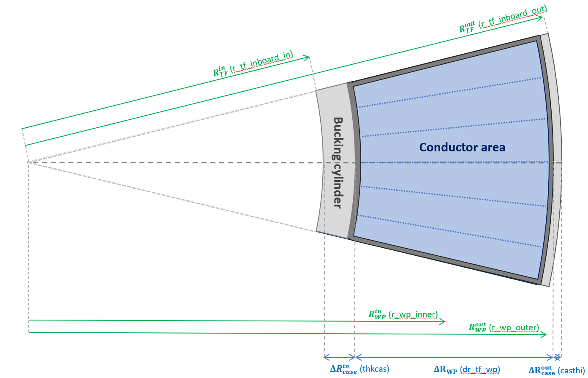
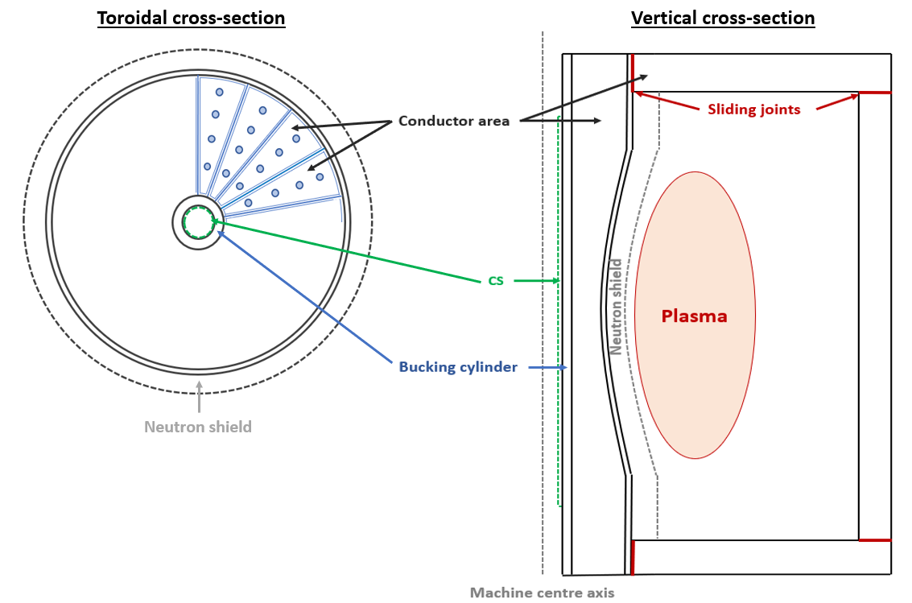

# Resistive TF Coil

### Resistive coil geometry

A much simpler inboard mid-plane geometry is used for resistive TF coils, as shown in <em>Figure 6</em>. The most important difference is the absence of the lateral steel casing structure. Three main sections can be distinguished:

- **The bucking cylinder:** radial thickness `dr_tf_nose_case` (iteration variable 57), is present to support the centering forces.  Its presence is however not mandatory and can be can be removed setting TODO.
- **The conductor area:** radial thickness `dr_tf_wp_with_insulation` (iteration variable 140). Ground insulation, corresponding to the dark grey area in *Figure 6* is included in this section by convention.
- **The outer cylinder:** radial thickness `dr_tf_plasma_case`. This cylinder plays no role in the structural models in PROCESS.
  
<figure>
    

    
      
    <figcaption><i>
      

        Figure 6: Resistive TF coil inboard leg structure at mid-plane. The
        disjoint steel case (no lateral case) are shown in light grey. The
        ground insulation wrapping the turns is shown in grey and the conductor
        region containing the turns in light blue. The dotted blue illustrate 
        the location of the 6 coils turn.
      

    </i></figcaption>
     
    

</figure>

The conductor layer is made of \(N_\mathrm{turn}\) turns per coil, set by the `n_tf_coil_turns` user input. The entire coil is wrapped with ground insulation of thickness `dx_tf_wp_insulation`. Inside the ground insulation, each conductor ("turn") is wrapped in a turn insulation,  thickness `dx_tf_turn_insulation`. The coolant occupies using a fraction of the mid-plane cross-section given by `fcoolcp` (iteration variable 23).

<figure>
    

    
      
    <figcaption><i>
      

      Figure 7: Schematic view of a single TF coil cross-section with four resistive turns. The positions of the cooling channels are 
      not specified in PROCESS - only the area occupied by coolant and the channel diameters.
      

    </i></figcaption>
     
    

</figure>

### Resistive centre-post

In a spherical tokamak the inboard legs of a resistive TF coil are known collectively as the "centre-post" (CP).

  As the resistive heating depends on the magnet cross-section (in the plan
  perpendicular to the current direction), heating can be substantially reduced
  by flaring the central section of the TF coils. The corresponding shape is
  illustrated in the right hand side of <em>Figure 8</em>. The radius of the inboard
  leg then increases away from the midlane as shown. This design is used by default for spherical tokamaks (<em>itart = 1</em>).

<figure>
    

    
      
    <figcaption><i>
      

        Figure 8: Mid-plane toroidal (left) and vertical (right) 
        cross-section of a magnet using the itart == 1 geometry option. The toroidal
        cross-section (left) shows the presence of vaulted turn geometry with a
        bucking cylinder (that is not present by default for copper magnets) with
        insulation and cooling. The vertical cross-section (right) shows the
        presence of 4 sliding joints for remote maintenance purposes.
      

    </i></figcaption>
     
    

</figure>

The radius of the top and bottom of the inboard leg `r_cp_top` (iteration variable 174) can be set in three
different ways:

- 

    **Calculated (`i_r_cp_top = 0`, default):** , the top CP radius is calculated
    from the positions of the X-points. This option generally leads to a relatively
    large degree of flare.
  

- 

    **User input (`i_r_cp_top = 1`):** the user sets the value of `r_cp_top`, or selects it as an iteration
    variable (174).  If `r_cp_top` is less than 1.01$R_\mathrm{TF}^\mathrm{mid}$
    (TF inboard mid-plane outer radius), the TF top radius is set to
    `1.01*r_tf_inboard_out` with an error warning.  If `r_cp_top` is too large, causing the centre-post to interfere with the X-point, an error message is generated.
  

- 

    **Mid/top TF radius ratio (`i_r_cp_top = 2`):** `r_cp_top` is set as a ratio
    of the inboard mid-plane radius to the input parameter `f_r_cp`, defined as \( \frac{
    R_\mathrm{TF}^\mathrm{top} }{R_\mathrm{TF}^\mathrm{out}} \). If `r_cp_top` is too large, causing the centre-post to interfere with the X-point, an error message is generated. This option allows the shape of the centre-post to remain constant when varying the machine size.

  The resistive heating, cooling requirement and material masses are calculated taking the
  flaring into account, parametrized with an arc. The cross-sectional area of the coolant channels is uniform throughout the centre-post, making the coolant fraction smaller at the top where less resistive heating is expected due to the larger conductor section. 

--------------

## Resistive TF coil class | `ResistiveTFCoil(TFCoil)`