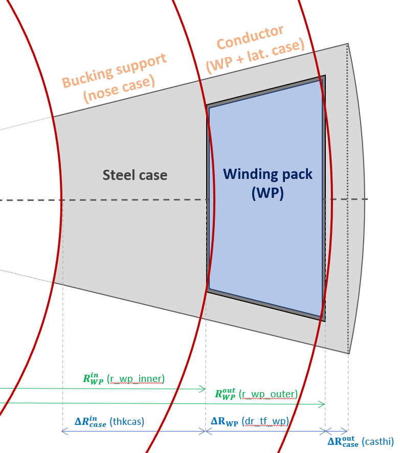

# Toroidal field (TF) coils

The switches for initially configuring a TF coil are found below:

---------------------

## TF coil shape

Two shapes can be selected using the `i_tf_shape` integer switch:

- **D-shape (`i_tf_shape = 1`):** simplified D-shape parametrization defined
    in the ($R,Z$) plane by a straight section and four elliptical arcs. The
    corresponding shape is not exactly the constant tension Princeton D but, but
    it is not so critical as the shape is mostly used to provide the coil 
    circumference and illustration purposes in the current version of the
    `PROCESS` code. This shape is considered by default for conventional aspect
    ratio tokamaks (`itart = 0`).

- **Picture frame `i_tf_shape = 2`:** rectangular shape, allowing space for
    an eventual Super-X divertor. However this design can only be used for at
    low aspect ratio, characterized by low vertical forces on the TF outboard
    section. This shape is considered by default for low aspect ratios
    tokamaks (`itart = 1`).

Resistive coils can benefit in having a larger outboard conductor area than
the inboard one, to reduce resistive heating without increasing the plasma
major radius or increasing its aspect ratio. For this reason, thicker outboard
can be set using the f_dr_tf_outboard_inboard user input defined as the ratio between
outboard and inboard TF coil legs. The possibility of having different coil
thicknesses is only available for resistive coils and f_dr_tf_outboard_inboard
would have no effect if superconducting coils are selected (`i_tf_sup = 1`)

--------------

## TF Plasma Case shape

Two different plasma side casing shapes can be selected using the `i_tf_case_geom` integer switch:

  - `i_tf_case_geom = 0` : The case has a rounded (cylindrical) profile on the plasma side. As it is the ITER design choice, this configuration is taken as default.
    
  - `i_tf_case_geom = 1` : The case has a flat profile on the plasma side.

  *Figure 2* illustrates the two plasma side casing configurations.

  <figure>
      

      
      <figcaption>
        Figure 2: Visual illustration of the two front casing geometry options. The to diagram shows the default ``i_tf_case_geom = 0`` rounded option and the bottom the ``i_tf_case_geom = 1`` straight option.
      </figcaption>
      

  </figure>

--------------

## Topology of TF coils and Central Solenoid
The engineering models are based on a topology like that used in ITER: the central solenoid and the TF coils are not linked: the central solenoid can be inserted or removed without cutting the TF coils.

However, an option does exist which permits the alternative topology, in which the inboard legs of the TF coils pass through the middle of the central solenoid.  This layout is used in MAST, where the copper TF coils can be dismantled to allow the central solenoid to be inserted or removed.

The topology is set as follows:    
- `i_tf_inside_cs = 0` (default) ITER-like topology: the central solenoid and the TF coils are not linked.   
- `i_tf_inside_cs = 1` The inboard legs of the TF coils pass through the middle of the central solenoid.  Note that this model does not provide a physically self-consistent result for superconducting coils.  

--------------------

## TF Coil conductor type
Two major types of toroidal field (TF) coils can be considered in PROCESS: Resistive magnets or Superconducting magnets.  The choice of conductor type is made using the following integer switch:

- `i_tf_sup == 0` : Resistive copper or copper alloy magnets with water cooling. 
- `i_tf_sup == 1` : Superconducting magnets with helium cooling.
- `i_tf_sup == 2` : Resistive aluminium (high purity) magnet with helium cooling at low temperature (15-30 K at the helium inlet).

--------------------

## Base TF coil class | `TFCoil`

This class contains all the methods that are used by all types of TF coils (resistive or superconducting).

---------------------

### TF Global Geometry | `tf_global_geometry()`

This function calculates the global geometry of the TF, it sets up the toroidal spacing of the coils, the mid-plane areas of the inboard and outboard legs, the geometry of the steel casing. The radial thicknesses and positions of the TF coil parts are calculated in `build.py` as part of the radial build construction.

1. The half toroidal angle taken up by a TF coil is equal to:

    $$
    \overbrace{\phi_{\text{TF,half}}}^{\texttt{rad_tf_coil_inboard_toroidal_half}} = \frac{\pi}{\underbrace{N_{\text{TF,coils}}}_{\texttt{n_tf_coils}}}
    $$

    This means the inboard TF coils are all wedged together.

2. The top down surface area of the TF coil at the mid-plane is calculated depending on what type of plasma case is selected:

    If `i_tf_case_geom == 0` then a circular plasma case is used so the inboard TF leg mid-plane area is simply:

    $$
    A_{\text{TF,inboard}} = \pi \left(R_{\text{TF,inboard-out}}^2-R_{\text{TF,inboard-in}}^2\right)
    $$

    This is just finding the difference in 

    Else, if `i_tf_case_geom == 1` the plasma case is flat and so the inboard TF leg mid-plane area is:

    $$
    A_{\text{TF,inboard}} = N_{\text{TF,coils}} \times \left(\sin{(\phi_{\text{TF,half}})}\cos{(\phi_{\text{TF,half}})}R_{\text{TF,inboard-out}}^2\right) \\
    - \left(\pi \times R_{\text{TF,inboard-in}}^2\right)
    $$

3. The toroidal width at the outboard edge of the inboard TF coil leg is:

    $$
    \mathrm{d}x_{\text{TF,inboard-out}} = 2R_{\text{inboard,-out}} \times \sin{(\phi_{\text{TF,half}})}
    $$

4. The inboard and outboard edges of the outboard TF leg are simply set:

    $$
    R_{\text{TF,outboard-in}} = R_{\text{TF,outboard-mid}} - \left(0.5 \times \mathrm{d}R_{\text{TF,outboard}}\right) \\
    R_{\text{TF,outboard-out}} = R_{\text{TF,outboard-mid}} + \left(0.5 \times \mathrm{d}R_{\text{TF,outboard}}\right)
    $$

5. The rectangular cross-section of the outboard TF leg is:

    $$
    A_{\text{TF,outboard}} = \mathrm{d}x_{\text{TF,inboard-out}} \times \mathrm{d}R_{\text{TF,outboard}}
    $$

6. The radial thickness of the plasma facing front case is set depending on the `i_f_dr_tf_plasma_case` switch value:

    If the switch is `True` then the radial thickness of the plasma front case is set as a fraction of the inboard leg radial thickness:

    $$
    \overbrace{\mathrm{d}R_{\text{TF,plasma-case}}}^{\texttt{dr_tf_plasma_case}} = \overbrace{f_{\text{TF, plasma-case}}}^{\texttt{f_dr_tf_plasma_case}} \times \mathrm{d}R_{\text{TF,inboard}}
    $$

    If the switch is `False` then the value of the radial plasma case thickness is set by input or default value:

    $$
    \mathrm{d}R_{\text{TF,plasma-case}} \equiv \mathrm{d}R_{\text{TF,plasma-case}}
    $$

    It is possible that if the value of $\mathrm{d}R_{\text{TF,plasma-case}}$ is too small then the WP will clash with the corners of the casing.

    To prevent this the minimum required value of $\mathrm{d}R_{\text{TF,plasma-case}}$ to prevent collisions is defined as:

    $$
    \mathrm{d}R_{\text{TF,plasma-case}} \ge \left(R_{\text{TF,inboard-in}}+\mathrm{d}R_{\text{TF,inboard}}\right) \times \left(1 -\cos\left(\frac{\pi}{N_{TF}}\right)\right)
    $$

    For self-consistency `PROCESS` will force $\mathrm{d}R_{\text{TF,plasma-case}}$ to always be equal to or greater than this value.

7. The toroidal thickness of the side case is set depending on the `tfc_sidewall_is_fraction` switch value:

    If the switch is `True` then the value of the minimum side case thickness is set as a fraction:

    $$
    \overbrace{\mathrm{d}R_{\text{TF,side-case}}}^{\texttt{dx_tf_side_case_min}} = \overbrace{f_{\text{TF, side-case}}}^{\texttt{casths_fraction}} \times \left(R_{\text{TF,inboard-in}} + \mathrm{d}R_{\text{TF,nose-case}} \right)\\
    \times \tan{\left(\frac{\pi}{N_{\text{TF,coils}}}\right)}
    $$

    If the switch is `False` then the value of the side case thickness is set by input or default value:

    $$
    \mathrm{d}R_{\text{TF,side-case}} \equiv \mathrm{d}R_{\text{TF,side-case}}
    $$

------------------

### TF coil currents | `tf_current()`

This function calculates the required currents in the TF coils given a required $B_\mathrm{T}$ (`b_plasma_toroidal_on_axis`) on the plasma. The below is simply deduced using [Ampere's law](https://en.wikipedia.org/wiki/Amp%C3%A8re%27s_circuital_law).

1. The peak field on the inboard TF coil is calculated:

    $$
    \overbrace{B_{\text{TF,peak}}}^{\texttt{b_tf_inboard_peak_symmetric}} = \frac{B_{\text{T}}R_0}{\underbrace{R_{\text{TF,peak}}}_{\texttt{r_b_tf_inboard_peak}}}
    $$

    The value of $R_{\text{TF,peak}}$ is specified as:

    $$
    R_{\text{TF,peak}} = 
    \\ R_{\text{TF,inboard-out}} - \mathrm{d}R_{\text{TF,plasma-case}} - \mathrm{d}x_{\text{TF,turn-insulation}} - \mathrm{d}x_{\text{TF,WP-insulation}}
    $$

2. The total current flowing in the TF coil set is calculated using the approximation of axisymmetry from the vacuum toroidal field at the plasma geometric centre $B_\mathrm{T}$ (`b_plasma_toroidal_on_axis`) and the plasma geometric major radius $R_0$ (`rmajor`):

    [Ampere's law](https://en.wikipedia.org/wiki/Amp%C3%A8re%27s_circuital_law) for a infinite current-carrying wire with a circular Amperian loop of radius, $R$ is:

    $$
    B = \frac{\mu_0 I}{2\pi R}
    $$

    Substituting in the required machine / plasma parameters we get:

    $$
    \overbrace{I_\mathrm{TF, total}}^{\texttt{c_tf_total}} = \frac{2\pi}{\mu_0} B_{\text{T}} R_0
    $$

3. The current required in each TF coil is then simply:

    $$
    \overbrace{I_\mathrm{TF, coil}}^{\texttt{c_tf_coil}} = \frac{I_\mathrm{TF, total}}{N_{\text{TF,coils}}}
    $$

4. The global inboard leg current density for the total coil area is:

-------------------

### TF Poloidal shape | `tf_coil_shape_inner()`

-------------------

### TF Self-inductance | `tf_coil_self_inductance()`

--------------------

### TF Forces | `tf_field_and_force()`

This function calculates the centering and vertical forces on a TF coil

1. The inner and outer radial positions of the winding packs are calculated depending on the coil type.

2. The centering force **per unit length** of the inboard is:

  $$
  F_{\text{centering}} = \frac{I_{\text{TF,coil}}\overbrace{B_{\text{TF,peak}}}^{\texttt{b_tf_inboard_peak_symmetric}}}{2}
  $$

  This assumes the average field in the TF coil is half the peak value, which is true for the infinitely long circular conductor approximation.

---------------

#### No sliding joints case

The interaction between the TF coil field with the horizontal component of its current induces an identical and opposite vertical force
$F_\mathrm{z}$ on the upper and lower sections of the TF coils. If axisymmetry is assumed, this force only depends on the coil current  $\left( \frac{I_\mathrm{TF}^\mathrm{tot}}{N_\mathrm{TF}} \right)$ and its radial build. If we parametrize the conductor layer radial build with its in/outboard $\left(\frac{R_{\text{TF-inner}}}{R_{\text{TF-outer}}}\right)$  radii and its thickness $\left(dR_{\text{TF,WP}}\right)$, the vertical force is given by: 

$$
F_{\text{Z}} = \frac{B_{\text{T}} R_0 I_{\text{TF,coil}}}{2 \times dR_{\text{TF,WP}}^2} \times \\
 \left[R_{\text{TF-inner,WP-outer}}^2 \ln{\left(\frac{R_{\text{TF-inner,WP-outer}}}{R_{\text{TF-inner,WP-inner}}}\right)} \\ 
 + R_{\text{TF-outer,WP-inner}}^2 \ln{\left(\frac{R_{\text{TF-outer,WP-inner}}+dR_{\text{TF,WP}}}{R_{\text{TF-outer,WP-inner}}}\right)} \\
 + dR_{\text{TF,WP}}^2 \ln{\left(\frac{R_{\text{TF-outer,WP-inner}}+dR_{\text{TF,WP}}}{R_{\text{TF-inner,WP-inner}}}\right)} -dR_{\text{TF,WP}}\left(R_{\text{TF-inner,WP-outer}} + R_{\text{TF-outer,WP-inner}} \right) \\
 + 2\times dR_{\text{TF,WP}} \left(R_{\text{TF-inner,WP-outer}} \ln{\left(\frac{R_{\text{TF-inner,WP-inner}}}{R_{\text{TF-inner,WP-outer}}}\right)} + \\ R_{\text{TF-outboard,WP-inner}} \ln{\left(\frac{R_{\text{TF-outboard,WP-inner}}+dR_{\text{TF,WP}}}{R_{\text{TF-outboard,WP-inner}}}\right)}\right)
 \right]
$$

-----------------

#### Sliding joints case

The presence of sliding joints allows to decouple the vertical tension generated by the outboard legs horizontal current from the inboard coil section. If the joints are placed just after the TF coil central section, significant inboard tension reduction can be achieved (the inboard section takes 10-20% of the total vertical force depending on the configurations). The same method as the no sliding joints case is used to estimate the vertical tension with the only difference being that the force integral is stopped at the joint
location $\left( R_\mathrm{joint}\right)$ instead of the outboard leg. The inboard vertical tension is then given by:

$$
F_{\text{Z}} = \frac{B_{\text{T}} R_0 I_{\text{TF,coil}}}{4 \times dR_{\text{TF-inner,WP}}^2} \times \left[\left(2\times R_{\text{TF-inner,WP-outer}}^2  \ln{\left(\frac{R_{\text{TF-outer,WP-inner}}}{R_{\text{TF-inboard,WP-inner}}}\right)}\right) \\
+ \left(2\times dR_{\text{TF-inboard,WP}}^2\ln{\left(\frac{R_{\text{CP-top}}}{R_{\text{TF-inboard,WP-inner}}}\right)} \right)+\left(3\times dR_{\text{TF-inboard,WP}}^2 \right) \\
- \left(2 \times dR_{\text{TF-inboard,WP}} R_{\text{TF-inboard,WP-outer}}\right) \\
+ \left(4\times dR_{\text{TF-inboard,WP}} R_{\text{TF-inboard,WP-outer}} \ln{\left(\frac{R_{\text{TF-inboard,WP-inner}}}{R_{\text{TF-inboard,WP-outer}}}\right)} \right)\right]
$$

------------------

The resulting tensions are in general not equals as they depends on coil shape. This asymmetry is parametrized in `PROCESS` by the following user input `f_vforce_inboard` 
$\left(f_{F_\mathrm{z}}^\mathrm{in}\right)$ defined as:

$$
T_\mathrm{z}^\mathrm{in} = f_{F_\mathrm{z}} F_\mathrm{z}
$$

with $\left(T_\mathrm{z}^\mathrm{in}\right)$ the vertical tension acting on the inboard leg of a TF coil. The `f_vforce_inboard` default value (0.5) corresponds to the special case of a perfect Princeton-D. On the other hand a picture frame coil can show larger asymmetries with `f_vforce_inboard` values around 0.65.

-----------------------

## TF coil joints

  Another aspect of the TF coil design is the presence of demountable joints.
  Having demountable joints can ease the maintenance strategy by allowing to
  remove the inboard section of the coil vertically without moving the
  outboard section of the Tokamak. Moreover, if the joints allows some
  longitudinal and toroidal movements (sliding joints), they can also ease the
  TF coils structural design by significantly reducing the inboard mid-plane
  vertical tension. Some other advantages not captured by process of sliding
  joins is the reduction of out-of-plane stresses generated from PF coils fields
  of the TF corners. Finally, although the increase of resistive power
  dissipation is took into account in <em>PROCESS</em>, the technical feasibility
  of sliding joints with superconducting magnets is not addressed. The joint
  option can by selected by following switch:

- 

    **No TF joints (`i_cp_joints = 0`, SC magnets default):** this corresponds
    to a conservative DEMO/ITER like strategy making the coil more reliable at
    the cost of a more complex remote maintenance strategy.
  

- 

    **Sliding joints (`i_cp_joints = 1`, resistive magnet default):** the joints
    is made of Feldmetal connectors allowing longitudinal sliding and toroidal
    torsion. Such joints allows to decouple the inboard TF coil vertical tension
    from the outer legs ones (effect captured in *PROCESS*) and cancel the
    out-of-plane (OOP) shear stress at the joints (effect not captured in
    *PROCESS* as OOP stress is not calculated). The joint resistive heating is
    also calculated and more specific design can be set by tuning the
    joints surfacic resistivity (`rho_tf_joints`), the number of joints per coil
    (`n_tf_joints`), the number of contact per joints (`n_tf_joints_contact`)
    and the thickness of the joint contact (`th_joint_contact`). It is possible
    to use sliding joints with SC coils in *PROCESS*, but it is not advised to
    do so except if the user has a very specific design in mind.
  

## TF stress modelling

  The <em>PROCESS</em> TF coil module only considers the inboard mid-plane stress
  constraint. Although it is the most stringent design constraint for the
  machine build, out-of-plane stress, local bending stresses due to the coil
  shaping, ripple and inter-coil structure effects remains to be evaluated after  
  a <em>PROCESS</em> run. Inboard mid-plane stress limits can be introduced
  using the following constraints equations:

- 

    **Conducting layer stress limit (`icc = 32`):** stress limit on the
    conductor layer on the material take the most of stress that supports.
    For superconducting TF coils, the stress limit is applied on the steel case
    jacket/conduit while for resistive coil, the stress limit is applied on the
    conductor itself. Set the maximum stress using the variable
    `sig_tf_wp_max`. This constraint can also be used with a stellarator.
  

- 

    **Centring support structure stress limit (`icc = 31`):** stress limit on the
    coil centering support structures. For superconducting coils, this stress
    limit is applied on the nose case (machine center direction) while for
    resistive coil this stress limit is applied on a cylindrical bucking
    cylinder. Set the maximum stress using the variable `sig_tf_case_max`.
    This constraint can not be used with a stellarator.
  

### Vertical tension

#### No sliding joints case

  The interaction between the TF coil field with the horizontal
  component of its current induces an identical and opposite vertical force
  \( F_\mathrm{z}\) on the upper and lower sections of the TF coils. If
  axisymmetry is assumed, this force only depends on the coil current
  \( \left( \frac{I_\mathrm{TF}^\mathrm{tot}}{N_\mathrm{TF}} \right) \)  
  and its radial build. If we parametrize the conductor layer radial build
  with its in/outboard (\(R_\mathrm{in}\)/\(R_\mathrm{out}\) )  radii and
  its thickness (\(\Delta R_\mathrm{cond} \)), the vertical force is given by:

$$
\begin{align}\label{eq: vforce}
	F_\mathrm{z} = \frac{ I_\mathrm{TF}^\mathrm{tot} }{N_\mathrm{TF}} 
   \frac{B_\mathrm{T} R_\mathrm{maj}}{2 {\Delta R_\mathrm{cond}}^2}  
    & \left[{R_\mathrm{out}}^2 \ln\left( \frac{R_\mathrm{out} + \Delta R_\mathrm{cond}}{R_\mathrm{out}} \right)  + {R_\mathrm{in}}^2 \ln\left( \frac{R_\mathrm{in} }{R_\mathrm{out} - \Delta R_\mathrm{cond}} \right) \right.  \\
	& \qquad \left. {} + {\Delta R_\mathrm{cond}}^2 \ln\left( \frac{R_\mathrm{out} + \Delta R_\mathrm{cond} }{R_\mathrm{in} - \Delta R_\mathrm{cond}} \right)  - \Delta R_\mathrm{cond}\left( R_\mathrm{in} + R_\mathrm{out} \right)   \right.\nonumber \\
	& \qquad \left. {} + 2\Delta R_\mathrm{cond} \left\{ R_\mathrm{in}\ln\left(\frac{R_\mathrm{in}-\Delta R_\mathrm{cond}}{R_\mathrm{in}} \right) + R_\mathrm{out}\ln\left(\frac{R_\mathrm{out}+ \Delta R_\mathrm{cond}}{R_\mathrm{out}}  \right)   \right\}  \right] \nonumber
\end{align}
$$

  with \(B_\mathrm{T}\) and \(R_\mathrm{maj}\) the plasma center toroidal field
  and major radius, respectively. This force is distributed between inboard
  \( \left( T_\mathrm{z}^\mathrm{in}\right)\) and outboard \(\left(T_\mathrm{z}
  ^\mathrm{out}\right)\) legs. The resulting tensions are in general not equals
  as they depends on coil shape. This asymmetry is parametrized <em>PROCESS</em>
  buy the following user input <em>f_vforce_inboard</em> \(\left(f_{F_\mathrm{z}}
  ^\mathrm{in}\right)\) defined as:

$$
  T_\mathrm{z}^\mathrm{in} = f_{F_\mathrm{z}} F_\mathrm{z}
$$

  with \(T_\mathrm{z}^\mathrm{in}\) the vertical tension acting on the inboard
  leg of a TF coil. The <em>f_vforce_inboard</em> default value (0.5)
  corresponds to the special case of a perfect Princeton-D. On the other hand
  a picture frame coil can show larger asymmetries with <em>f_vforce_inboard</em>
  values around 0.65.

#### Sliding joint case

  The presence of sliding joints allows to decouple the vertical tension
  generated by the outboard legs horizontal current from inboard coil section.
  If the joints are placed just after the TF coil central section, significant
  inboard tension reduction can be achieved (the inboard section takes 10-20%
  of the total vertical force depending on the configurations). The same method
  as the no sliding joints case is used to estimate the vertical tension with
  the only difference being that the force integral is stopped at the joint
  location \(\left( R_\mathrm{joint}\right)\) instead of the outboard leg. The
  inboard vertical tension is then given by:

$$
\begin{align}
	T_\mathrm{z}^\mathrm{in} = \frac{1}{2} \frac{B_\text{max}R_{B_\mathrm{max}} I_\mathrm{tot}}{N_\mathrm{TF} {\Delta R_\mathrm{cond}}^2} &\left[ 
	{R_\mathrm{in}}^2 \ln\left( \frac{R_\mathrm{in}}{R_\mathrm{in}-\Delta R_\mathrm{cond}} \right) + {\Delta R_\mathrm{cond}}^2 \ln\left( \frac{ R_\mathrm{joint} }{ R_\mathrm{in}-\Delta R_\mathrm{cond}} \right) \right. \\	
	& \qquad \left. {} + \frac{2}{3} {\Delta R_\mathrm{cond}}^2  +  R_\mathrm{in} \Delta R_\mathrm{cond} 
	\left(2\ln\left( \frac{R_\mathrm{in}-\Delta R_\mathrm{cond}}{R_\mathrm{in}} \right) -1 \right) \right]\nonumber
\end{align}
$$

  with \(R_\mathrm{in}\) and \(\Delta R_\mathrm{cond} \) the inboard mid-plane
  plasma facing side conductor radius and its inboard thickness.

### Inboard mid-plane stress

  The inboard mid-plane stress is calculated using a simplified cylindrical
  geometry. This geometry assumption applies perfectly for the resistive coil
  geometry but is less adapted to the SC coil more complex geometry, that mixes
  a discontinuous WP-case nose interface with a continuous sidewall-nose case
  interface depending (depending on the toroidal angle). Thus even if the
  <em>PROCESS</em> TF SC coil stress
  model provide acceptable (within 4-10% error margins) stress distributions
  for global machine design, it is advised to finalize the stress analysis with
  FEA models that captures the stress variations in the toroidal direction and 
  its associated maximum stresses. Two models can be used to calculate inboard
  mid-plane normal stresses radial distributions. They both support an arbitrary
  number of different material layers and mainly differs in the way the vertical
  tension is introduced:

- 

    **Plane stress (`i_tf_stress_model = 1`, default):** the calculations are
    made under the plane stress assumption. Plane strain model applies for thin
    layer in the vertical direction and is there fore not applicable to
    this configuration in theory. The radial and toroidal stress calculations
    are made assuming no vertical tension. A constant vertical stress is then
    estimated *a posteriori* by dividing the inboard vertical tension by the
    support structure area to obtain the 3 normal stress necessary to for the
    *TRESCA* yield stress estimate as described in [1]. Although using
    un-adapted model hypothesis this model is still used by default as it
    has been validated on FEA analysis and benchmarked with the *MADMAX* *CEA*
    code on DEMO designs.

- 

    **Generalized plane strain (`i_tf_stress_model = 0,2`):** the
    calculations are made using the generalized plane strain hypothesis that
    applies for tall cylinders with external external force applied at the end
    (vertical tension). This is the correct assumption for inboard mid-plane
    stress calculations that allows to derive the vertical stress distribution
    coherently [2]. This formulation has been developed for transverse orthotropic
    materials (isotropic in the \(\left(r, \theta\right) \) plane with different
    properties in the vertical direction). This allows to applies different
    Poisson's ratio, one for the \(\left(r, \theta\right) \) plane to \(z\) and
    another for the radial to toroidal direction. Although more coherent and
    complete this model is not yet used by default as more FEA validations
    are needed. `i_tf_stress_model = 0` is the older model, which is O(n^3)
    in the number of layers and fails if there is a solid dr_bore. 
    `i_tf_stress_model = 2` is the newer model, which is O(n) and accepts a solid
    dr_bore, but is otherwise identical to the older model `i_tf_stress_model = 0`.
  

  These two models can use any number of material layers with different
  Young modulus and Poisson's ratios for each layers (two pairs of Young modulus
  and Poisson's ratio are used for the generalized plane strain model). As the
  conductor layer of a TF coil is relatively complex, smeared properties are
  used to set the Young modulus, as described in the next section.

#### Stress layer definition

  Defining the stress model layers is straightforward for resistive as the
  inboard coils and the model shares the same axi-symmetry (see <em>Figure 6
  </em>). However the SC coils inboard geometry shown in <em>Figure
  4</em> is more complex as the presence of lateral case breaks the
  axi-symmetry and the rectangular nature of the winding pack breaks the
  cylindrical geometry of the stress layers. Therefore, several adjustments must
  be made to properly define the stress model parametrization. First, as the
  model does not allow to take the lateral to plasma side case connection into
  account (axi-symmetry), the plasma side case effect is taken into account
  by reducing the effective vertical tension in the calculation assuming a
  constant vertical strain (generalized plane strain) by the following factor :

$$
  f_{F_\mathrm{z}} = \frac{ E_\mathrm{steel} A_\mathrm{steel}^{eff} + E_\mathrm{ins} A_\mathrm{ins} }
                          { E_\mathrm{steel} A_\mathrm{steel}^{tot} + E_\mathrm{ins} A_\mathrm{ins} }
$$

  with \( A_\mathrm{steel}^{eff} \) the effective steel cross-section area
  defined as the total steel TF cross section \(A_\mathrm{steel}^{tot}\) minus
  the front casing one. For free standing coils, only two layers are therefore
  considered for the stress calculations TF coils (<em>Figure 9</em>):

- 

    **Structural support layer:** made of the steel case nose section. No <em>e.
    m.</em> body forces are present in this layer, therefore so the stress 
    variations are only driven by geometrical effects (constant vertical stress)
- 

    **Conductor layers:** made of the winding packs and the lateral casings.
    Two levels of property smearing is performed for this layer, the WP-lateral
    case smearing and the internal WP smearing from the turn structure. This
    section contains the <em>e.m.</em> body forces driving a vertical stress
    radial dependency though Poisson's ratio effects.
  

<figure>
    

    
     
    <figcaption><i>
      
 
        Figure 9: Positioning of the layers used in the stress calculations
        delimited by the red lines. The corresponding radii are defined keeping
        the nose and plasma side casing area constant to get consistent vertical
        stress calculations.
      

    </i></figcaption>
     
    

</figure>

  Due to the squared WP geometry, its inner/outer radius can take different
  values depending on the considered toroidal angle. To bypass this difficulty,
  the WP stress layer radii (\( R_\mathrm{WP,\ eff}^\mathrm{in/out}\)) has been
  defined is such a way that the nose casing and the plasma side area remain the
  same between the geometrical calculation and the cylindrical ones with [3].
  As the property smearing is based on area fractions in the vertical direction
  this definition allows consistent vertical tension calculations. These
  \(R_\mathrm{WP,\ eff}^\mathrm{in}\) and \(R_\mathrm{WP,\ eff}^\mathrm{out}\)
  radii are given by:

$$
  R_\mathrm{WP,\ eff}^\mathrm{in/out} = R_\mathrm{WP}^\mathrm{in/out}
    \sqrt{\frac{\tan\theta_\mathrm{TF}}{\theta_\mathrm{TF}}}
$$

  with \(R_\mathrm{WP}^\mathrm{in/out}\) the inner or outer middle-coil WP
  radius used to parametrize the coil geometry (see <em>Figure 1</em>) and
  \(\theta_\mathrm{TF} = \frac{\pi}{N_\mathrm{TF}}\) the half radial extent
  of the TF coil inboard leg.

#### Structural properties smearing

##### Resistive coil conductor smearing

  The resistive TF coil properties are only smeared in the vertical direction
  to take the effect of the cross section taken by the cooling and the, with the
  corresponding effective young modulus \(\bar{E_\mathrm{z}}\)

$$
  \bar{E_\mathrm{z}}\ = f_\mathrm{ins} E_\mathrm{ins} +  \left( 1 - f_\mathrm{ins} \right)
    \left( 1 - f_\mathrm{cool} \right) E_\mathrm{cond}
$$

  with \(E_\mathrm{ins}\)/\(E_\mathrm{cond}\) the insulation layer/ conductor
  material Young modulus and \(f_\mathrm{ins}\)/\(f_\mathrm{cool}\) the
  insulation/conductor cooling mid-plane cross-section area fractions.
  \(f_\mathrm{ins}\) is calculated from the insulation layers thicknesses and
  number of turns while \(f_\mathrm{cool}\) is a defined by the user with
  <em>fcoolcp</em>, defined with the conductor area after the insulation area
  subtracted. Even though the presence of insulation layer tends lower the Young
  modulus in the toroidal direction, no property smearing is done for now for
  resistive coils for now.

##### Superconducting coil winding pack smearing

  The transverse and the vertical WP smeared properties are calculated
  separately. The WP smeared Young modulus in the vertical direction
  \(\bar{E}_\mathrm{z}^\mathrm{WP}\) is calculated assuming constant vertical
  strain (generalized plane strain or parallel case), and is give by:

$$
  \bar{E}_\mathrm{z}^\mathrm{WP} = \frac{A^\mathrm{steel}_\mathrm{WP\ eff} E_\mathrm{steel}
                                   + A^\mathrm{ins}_\mathrm{WP} E_\mathrm{ins}}
                               { \pi \left( {R_\mathrm{WP,\ eff}^\mathrm{out}}^2
                                 - {R_\mathrm{WP,\ eff}^\mathrm{in}}^2 \right) }
$$

  with \(A^\mathrm{steel}_\mathrm{WP\ eff}\) and \(A^\mathrm{ins}_\mathrm{WP}\)
  being the area taken by the WP steel turn jackets plus the sidewall case area
  and the WP total insulation area, respectively. The WP transverse properties
  are calculated decomposing the turn geometry in series (constant strain), as
  illustrated in <em>Figure 10</em>.

  
<figure>
    

    
     
    <figcaption><i>
      
 
        Figure 10: turn structure decomposition used to estimate the average
        winding pack average Young modulus. The decomposition is made considering
        a vertical stress component, corresponding to a parallel decomposition
        (constant strain).
      

    </i></figcaption>
     
    

</figure>

  As the steel conduit is much stiffer the force is approximated to go only on
  the \(c\) section, lowering the young by ratio between the total and the steel
  conduit case thickness. This approximation is wrong if the insulation's or the
  conductor cable Young modulus is at the same order of magnitude as the steel
  support's one. The \(c\) section properties are then calculated using the
  series case assumption (constant stress). The final WP effective young modulus
  is then given by

$$
  \bar{E}_\mathrm{t}^\mathrm{WP} = \frac{2t_\mathrm{cond}}
    {2\frac{t_\mathrm{ins}}{E_\mathrm{ins}} + \frac{ t_\mathrm{turn} - 2t_\mathrm{ins} }{E_\mathrm{steel}} }
$$

  with \( t_\mathrm{ins} \), \( t_\mathrm{turn} \) and \( t_\mathrm{cond} \) the
  insulation, turn and steel conduit structures thicknesses. For CICC cables
  the vertical Young's modulus is generally about 2-3 times larger than the
  transverse. It is expected as the vertical smearing is based on steel area
  and the transverse one steel thickness ratios, with the support structure
  being round the cable, the area ratio is naturally more favorable. Finally, to
  properly take the effect on the lateral casing on the WP layer properties, an
  additional series smearing is performed, using the average lateral casing
  thickness for the smearing. The effective Young modulus for the stress
  calculation is therefore given by:

$$
  \bar{E}_\mathrm{t}^\mathrm{WP\ eff} = \frac{ 2 \left< t_\mathrm{side\ case} \right>
                                               + \left< t_\mathrm{WP} \right> }
                                             { 2 \frac{\left< t_\mathrm{side\ case} \right>}{E_\mathrm{ins}}
                                               + \frac{\left< t_\mathrm{WP} \right>}{\bar{E}_\mathrm{t}^\mathrm{WP}} }
$$

  with \(\left< t_\mathrm{side\ case} \right>\) and \(\left< t_\mathrm{side\ case
  } \right>\) the average thickness in the toroidal direction of the sidewall
  case and the winding pack, respectively.
  If the integer turn option is used (<em>i_tf_turns_integer = 1</em>), the cases
  are not always squared. The smearing procedure will therefore produce a
  different young modulus in the radial and the toroidal direction. However, a
  study using a similar stress model, but with fully orthotropic material
  (different radial and toroidal Young modulus) [3], has shown that the radial
  direction Young's modulus value has almost no effect on the stress distribution
  ITER like magnets. For this reason the toroidal direction Young modulus on the
  toroidal direction is used as the WP transverse young modulus.

#### Stress unsmearing

  The raw stress distributions calculated with the smeared properties cannot be
  used directly for the conductor structural constraints. The stress distribution
  must be corrected to get the stress on the actual support structures. The
  un-smeared support structure stress on the vertical direction \(\sigma_
  \mathrm{zz}\) is obtained simply by:

$$
  \sigma_\mathrm{zz} = \bar{\sigma}_\mathrm{zz} \frac{E_\mathrm{struc.}}
    {\bar{E}_\mathrm{z}^\mathrm{WP\ eff}}
$$

  A stress unsmearing is also necessary on the transverse direction for SC coils.
  Two unsmearing transverse factors are defined (lateral and toroidal), that
  will differ if the integer turn option is selected (non squared turns
  selected with <em>i_tf_turns_integer = 1</em>).

#### Inboard TF coil support

Several centering forces support options structures are proposed in *PROCESS*,
selected with the `i_tf_bucking` integer switch.

- 

    **No support (`i_tf_bucking = 0`):** the TF coil is only made of
    a conducting layer. This is the default option for copper magnets
    (`i_tf_sup = 0`). However, as the superconducting magnets winding pack is
    surrounded by a closed steel case, this option is incompatible with
    superconducting coils (`i_tf_sup = 1`).
  

- 

    **Free standing TF bucking (`i_tf_bucking == 1`):** the conductor is
    supported by a dedicated centering support and is not in contact with the CS
    coil. This support is nown as a bucking cylinder for resistive magnets, and is referred to as the 'nose'
    of the case for superconducting magnets. This is the default option
    for aluminium (`i_tf_sup = 2`) and superconducting magnets (`i_tf_sup = 1`).
  

- 

    **Bucked and wedged (`i_tf_bucking == 2,3`):** the TF coil uses the CS coil
    as centering forces structural support. This design allows to substantially
    reduce the thickness of the TF coil individual support structure if a large
    CS coil is present. As the CS coil current generates a beneficial CS radial
    outward forces, the most critical instant for structural support is the
    moment when no current flows in the CS coil. The CS coil is therefore
    represented as an additional stress layer with `e.m.` no body forces.
    The layer structural properties are defined using using similar smearing/
    unsmeating procedure as the TF coil, as detailed in issue [4]. The maximum
    between the CS stress from the this model and the on calculated in the
    `pfcoil` module is taken as the CS coil stress limit (constraint 72). A fast
    version, neglecting the interface layer properties is implemented 
    (`i_tf_bucking == 2`). And a more complete one, taking explicitly the Kapton
    interface into account in the stress calculations (`i_tf_bucking == 3`) is
    also implemented. Before using this design option, the user must know two
    major potential issues not captured by *PROCESS*. The first is the fatigue
    introduced by the CS on the TF coil. The second is the nature of the CS-TF
    coil interface that has to allow vertical sliding at cryogenic temperatures,
    as the CS vertical size reduces when energized and the TF coil vertical
    tension makes TF grow taller with current flowing in it. The CS and the TF
    coil are therefore strain insulated, therefore all the vertical tension is
    taken by the TF coil structures.
  

  It is also possible to fill the CS coil dr_bore with structural material to
  further support the TF centering forces. Although not currently implemented
  in <em>PROCESS</em>, to technical issues prevents simulating its structural
  effects. Please contact the <em>PROCESS</em> team if you wish to consider
  this option in your design and you are sure to understand the increase in
  complexity such design requires.

#### Stress limits

  The maximum of the stress distributions after unsmearing, is used to compute
  the TRESCA yield stress, defined as:

$$
  \sigma_\mathrm{TRESCA} = \max{ \left(
                                 \left| \sigma_\mathrm{rr} - \sigma_\mathrm{\theta\theta} \right|,
                                 \left| \sigma_\mathrm{\theta\theta} - \sigma_\mathrm{zz} \right|,
                                 \left| \sigma_\mathrm{zz} - \sigma_\mathrm{rr} \right|
                                 \right)
                               }
$$

  The transverse stresses (\(\sigma_\mathrm{rr}\) and \(\sigma_\mathrm{\theta\theta}\))
  are negative and the vertical streess (\(\sigma_\mathrm{zz}\)) positive. As
  the toroidal stress is generally larger than the toroidal one, the \(\left|
  \sigma_\mathrm{\theta\theta} - \sigma_\mathrm{zz} \right|\) term is expected
  to drive the yield stress value. The associated constraint equations are the
  31, 32 and the 72 (if <em>i_tf_bucking == 2 or 3</em>). The value of the
  Von-Mises yeild stress is also shown in the output for information.

-------------

## TF coil ripple

Because of the finite number of TF coils used in a tokamak (18 for ITER and 16
for DEMO), the axisymmetry is effectively broken. Therefore, in addition to
the radial dependency, the toroidal field also varies as a function of the toroidal
angle and the vertical position. This effect is known as ripple. Electromagnetic
ripple impacts TF coil design in two ways:

- **Plasma ripple:** The toroidal filed variation on the low field side
    generates some instabilities that degrades the plasma confinement.
    Moreover, some significant fast particles losses can be present if the
    field variation becomes too large between coils, threatening the divertor
    and first wall integrity.  

- **On coil ripple:** If the lateral case is separating the conductor region
    (winding pack), the genuine magnetic field at the inboard superconducting
    conductor is larger than the value obtained using the axisymmetric
    assumption. This is only true in `PROCESS` for the superconducting coil case. More info can be found [here](../eng-models/tf-coil-superconducting.md#on-coil-ripple-peak_tf_with_ripple).

-------------

### Plasma ripple | `plasma_outboard_edge_toroidal_ripple()`

The maximum toroidal plasma ripple at the outboard is defined in `PROCESS` with the user input `ripple_b_tf_plasma_edge_max`
as:

$$
  \delta = \frac{B_\mathrm{max}-B_\mathrm{min}}{B_\mathrm{max}+B_\mathrm{min}}
$$

with $B_\mathrm{min}$ and $B_\mathrm{max}$ minimum field (between coils)
and the maximum field (on coil toroidal direction) respectively, measured at
the mid-plane plasma outer limit (separatrix). 

To prevent intolerable fast particles losses and plasma instabilities,
$\delta$ must be limited to a few percent, approximately \( \delta \in
[0.5-1]\) . If intolerable, the plasma ripple can be reduced with many
different techniques, for example the TF coil shape, stabilisation coils can
be added, more coils can be used or the coil outboard radius can be increased.
All these design modifications affects the coil system design, for example
ripple shape optimisation should be done without generating too much bending
stress due to the un-adapted curvature radius, and adding coils must not prevent
remote maintenance. To keep the design procedure as simple as possible in
`PROCESS`, unacceptable ripple is reduced by simply moving the
TF coil leg to a larger radius. The outboard ripple is directly obtained reverting the ripple fit to provide
$R_\mathrm{outboard\ WP}^\mathrm{mid}$ as a function of the ripple.
The minimal $R_\mathrm{outboard\ WP}^\mathrm{mid}$ is technically obtained
by increasing the gap between the vacuum vessel and the coil (`dr_shld_vv_gap_outboard`).

#### D-shaped coils

`PROCESS` plasma ripple is estimated using a parametric Bio-Savart calculation fitted using the
UKAEA free boundary MHD code FIESTA. The shape (Princeton-D) 
used for these MHD model is shown in the left section of Figure 11. 

<figure>
    

    
    
     
    <figcaption><i>
      
 
        Figure 11 : The top graph shows the filament shape used in the
        FIESTA ripple calculations. The current loops are made straight
        section (red lines) connecting vertices (blue dots) following the coil
        shape. The bottom plot shows the ripple calculated by FIESTA (lines with
        open circles) compared to the fit values (lines without circles) for
        different number of coils (16, 18 and 20) and lateral winding pack to
        TF size ratio (\(x = 0.737\) and \(x = 2.947\)) as a function of the
        outer leg winding centre position.
      

    </i></figcaption>
     
    

</figure>

The results of the ripple fit is shown on the right section of Figure 11 and
its analytical expression given by:

$$
  \delta = (0.875 - 0.0557x)\ y^{N_\mathrm{TF}-\left(1.617+0.0832x\right)}
$$

with \(x\) the lateral thickness of the winding pack normalised to the coil
dimensions defined as:

$$
  x = \frac{\Delta x_\mathrm{WP,max}}{R_\mathrm{maj}} N_\mathrm{TF}
$$

  
with $\Delta x_\mathrm{WP,max}$ the maximum toroidal width of the WP on the plasma side, $N_\mathrm{TF}$ the number of coils and
$R_\mathrm{maj}$ the plasma centre radius. $y$ is the plasma outer
mid-plane separatrix to outboard TF leg mid-plane radius ratio:

$$
  y = \frac{R_\mathrm{maj} + a_\mathrm{min}}{R_\mathrm{outboard\ TF}^\mathrm{mid}}
$$

with $a_\mathrm{min}$ the plasma minor radius and $R_\mathrm{outboard\ TF}
^\mathrm{mid}$ the TF winding pack outboard leg midplane radius at its
centre. The scaling fitting range is provided by:

- **Number of coils:** $N_\mathrm{TF} \in \{16, 18, 20\}$

- **Winding pack size ratio:** $x \in [0.737-2.95]$

- **separatrix to TF ratio:** $y \in [0.7-0.8]$

#### Picture frame coils 

For the picture frame coils the presence of a straight outboard leg means the ripple is just given by:

$$
\delta = \left(\frac{R_{\text{maj}}+a_{\text{min}}}{R_\mathrm{outboard\ TF}^\mathrm{mid}}\right)^{\frac{1}{N_{\text{TF}}}}
$$

------------

## TF coil parameter summary table

### General parameters

| Parameter     | description                                                                                                                                                                                                                                                                                                                                                                                                                                                                                                                                                                                                                                  | Default |
| ------------- | -------------------------------------------------------------------------------------------------------------------------------------------------------------------------------------------------------------------------------------------------------------------------------------------------------------------------------------------------------------------------------------------------------------------------------------------------------------------------------------------------------------------------------------------------------------------------------------------------------------------------------------------- | ------- |
| `n_tf_coils`  | Number of TF coils                                                                                                                                                                                                                                                                                                                                                                                                                                                                                                                                                                                                                           | 16      |
| `i_tf_sup`    | Switch selecting the conductor technology:    - 0 : Water cooled copper (GLIDCOP)    - 1 : Superconducting TF magnets    - 2 : Helium cooled Aluminium magnets                                                                                                                                                                                                                                                                                                                                                                                                                                                                      | 1       |
| `i_tf_sc_mat` | Switch for superconducting material    1 : Nb$_3$Sn superconductor, ITER critical surface parameterization[^1], standard critical values   2 : Bi-2212 high temperature superconductor   3 : NbTi superconductor   4 : Nb$_3$Sn superconductor, ITER critical surface  parameterization[^1], user-defined critical parameters   5 : WST Nb$_3$Sn parameterization   6 : REBCO HTS tape in CroCo strand   7 : Durham Ginzburg-Landau critical surface model for Nb-Ti   8 : Durham Ginzburg-Landau critical surface model for REBCO   9 : Hazelton experimental data combined with Zhai conceptual model for REBCO | 1       |

 

### Mid-plane geometry parameters

| Parameter             | description                                                                                                                                          | Iteration variable | Default                              | Unit |
| --------------------- | ---------------------------------------------------------------------------------------------------------------------------------------------------- | ------------------ | ------------------------------------ | ---- |
| `i_tf_inside_cs`      | TF coil inboard leg radial placement switch.   - 0 : Outside of central solenoid   - 1 : Inside of central solenoid                            | -                  | 0                                    | -    |
| `dr_tf_inboard`       | TF coil maximum radial size   calculated if `dr_tf_wp_with_insulation` is used as iteration variable                                                              | ixc = 13           | No default                           | m    |
| `f_dr_tf_outboard_inboard`             | Outboard/inboard TF coil thickness ratio                                                                                                             | -                  | 1                                    | -    |
| `dr_tf_wp_with_insulation`            | Winding pack radial thickness   calculated if `dr_tf_inboard` is used as iteration variable. Include the ground insulation and the insertion gap. | ixc = 140          | No default                           | m    |
| `dr_tf_nose_case`     | Nose/inner case radial thickness                                                                                                                     | ixc = 57           | 0.3                                  | m    |
| `dx_tf_side_case_min`     | Minimal sidewall casing thickness                                                                                                                    | -                  | -                                    | m    |
| `casths_fraction`     | Minimal sidewall casing thickness as a fraction of the TF coil toroidal thickness. Overwites the `dx_tf_side_case_min` input value                       | -                  | 0.03                                 | -    |
| `casthi`              | Minimal plasma side casing thickness                                                                                                                 | -                  | -                                    | m    |
| `casthi_fraction`     | Minimal plasma side casing thickness as a fraction of the TF thickness (`dr_tf_inboard`). Overwites the `casthi` input value                         | -                  | 0.05                                 | -    |
| `i_tf_case_geom`      | Plasma side casing geometry option:  - 0 : rounder front casing (ITER)   - 1 : Straight casing                                                 | -                  | 0                                    | -    |
| `i_tf_wp_geom`        | Winding pack geometry option:  - 0 : rectangular   - 1 : double rectangle   - 2 : trapezoidal                                               | -                  | Integer turn : 0    otherwise : 1 | -    |
| `dx_tf_wp_insulation`              | WP ground insulation thickness                                                                                                                       | -                  | 0.018                                | m    |
| `dx_tf_wp_insertion_gap`            | WP insertion gap thickness                                                                                                                           | -                  | 0.01                                 | m    |
| Parameter             | description                                                                                                                                          | Iteration variable | Default                              | Unit |
| -                     | -                                                                                                                                                    | -                  | -                                    | -    |
| `i_tf_inside_cs`      | TF coil inboard leg radial placement switch.   - 0 : Outside of central solenoid   - 1 : Inside of central solenoid                            | -                  | 0                                    | -    |
| `dr_tf_inboard`       | TF coil maximum radial size   calculated if `dr_tf_wp_with_insulation` is used as iteration variable                                                              | ixc = 13           | No default                           | m    |
| `f_dr_tf_outboard_inboard`             | Outboard/inboard TF coil thickness ratio                                                                                                             | -                  | 1                                    | -    |
| `dr_tf_wp_with_insulation`            | Winding pack radial thickness   calculated if `dr_tf_inboard` is used as iteration variable. Include the ground insulation and the insertion gap. | ixc = 140          | No default                           | m    |
| `dr_tf_nose_case`     | Nose/inner case radial thickness                                                                                                                     | ixc = 57           | 0.3                                  | m    |
| `dx_tf_side_case_min`     | Minimal sidewall casing thickness                                                                                                                    | -                  | -                                    | m    |
| `casths_fraction`     | Minimal sidewall casing thickness as a fraction of the TF coil toroidal thickness. Overwites the `dx_tf_side_case_min` input value                       | -                  | 0.03                                 | -    |
| `dr_tf_plasma_case`   | Minimal plasma side casing thickness                                                                                                                 | -                  | -                                    | m    |
| `f_dr_tf_plasma_case` | Minimal plasma side casing thickness as a fraction of the TF thickness (`dr_tf_inboard`). Overwites the `dr_tf_plasma_case` input value              | -                  | 0.05                                 | -    |
| `i_tf_case_geom`      | Plasma side casing geometry option:  - 0 : rounder front casing (ITER)   - 1 : Straight casing                                                 | -                  | 0                                    | -    |
| `i_tf_wp_geom`        | Winding pack geometry option:  - 0 : rectangular   - 1 : double rectangle   - 2 : trapezoidal                                               | -                  | Integer turn : 0    otherwise : 1 | -    |
| `dx_tf_wp_insulation`              | WP ground insulation thickness                                                                                                                       | -                  | 0.018                                | m    |
| `dx_tf_wp_insertion_gap`            | WP insertion gap thickness                                                                                                                           | -                  | 0.01                                 | m    |

 

### Turn parameters

| Parameter            | description                                                                                                                 | Iteration variable | Default       | Unit |
| -------------------- | --------------------------------------------------------------------------------------------------------------------------- | ------------------ | ------------- | ---- |
| `i_tf_turns_integer` | Switch activating the integer turn parametrization   - 0 : Integer number of turns   - 1 : non integer number of turn | -                  | 0             | -    |
| `n_tf_wp_layers`            | Number of turns in the radial direction (`i_tf_turns_integer = 1` only)                                                     | -                  | 20            | -    |
| `n_tf_wp_pancakes`          | Number of turns in the toroidal direction (`i_tf_turns_integer = 1` only)                                                   | -                  | 10            | -    |
| `dx_tf_turn_general`          | TF turn squared size                                                                                                        | -                  | No default    | m    |
| `dx_tf_turn_cable_space_general`         | TF cable diameter size                                                                                                      | -                  | No default    | m    |
| `t_turn_tf_max`      | Maximum turn squared size for constraint (icc = 86)                                                                         | -                  | 0.05          | m    |
| `c_tf_turn`              | Current per turn   Overwitten if `dx_tf_turn_general` is set by the user                                                          | ixc = 60           | $70.10^3$     | A    |
| `dx_tf_turn_insulation`           | Turn insulation layer thickness                                                                                             | -                  | $0.8.10^{-3}$ | m    |
| `dx_tf_turn_steel`           | Steekl jacket/conduit thickness                                                                                             | 58                 | $8.10^{-3}$   | m    |
| `dia_tf_turn_coolant_channel`            | Helium cooling channel diameter                                                                                             | -                  | $5.10^{-3}$   | m    |
| `f_a_tf_turn_cable_space_extra_void`               | Cable void fraction                                                                                                         | -                  | 0.4           | -    |
| `f_a_tf_turn_cable_copper`            | Copper cable fraction   defined with the cable area minus the void and cooling channel area                              | ixc = 59           | 0.69          | -    |

 

### Vertical shape

| Parameter    | description                                                                                                                                               | Iteration variable | Default                                    | Unit |
| ------------ | --------------------------------------------------------------------------------------------------------------------------------------------------------- | ------------------ | ------------------------------------------ | ---- |
| `itart`      | Switch for tapered inboard TF section   0 : conventional inboard leg   1 : Tapered inboard leg (centrepost, CP)                                     | -                  | 0                                          | -    |
| `i_tf_shape` | Switch selecting the TF coil shape   1 : D-shape approximation   2 : Rectangular (picture frame) shape                                              | -                  | 1 : if `itart = 0`   2 : if `itart = 1` | -    |
| `r_cp_top`   | CP TF coil top/bottom radius                                                                                                                              | ixc = 174          | No default                                 | m    |
| `f_r_cp`     | CP TF top/mid-plane outer radius fraction                                                                                                                 | -                  | 1.4                                        | -    |
| `i_r_cp_top` | Switch selecting the `r_cp_top` parametrization   0 : `r_cp_top` calculated using the X-point location   1 : Set by user   2 : Set with `f_r_cp` | -                  | 0                                          | -    |

 

### TF coil joints

| Parameter             | description                                                                                                               | Iteration variable | Default                                    | Unit       |
| --------------------- | ------------------------------------------------------------------------------------------------------------------------- | ------------------ | ------------------------------------------ | ---------- |
| `i_cp_joints`         | Switch selecting the TF coil demoutable joints strategy   0 : No demountable joints    1 : MAST like sliding joints | -                  | 0 : if `itart = 0`   1 : if `itart = 1` | -          |
| `n_tf_joints`         | Number of joints per coils                                                                                                | -                  | 4                                          | -          |
| `n_tf_joints_contact` | Number of contacts per joints                                                                                             | -                  | 6                                          | -          |
| `rho_tf_joints`       | Joint surfacic resistivity                                                                                                | -                  | $2.5.10^{-10}$                             | $\Omega.m$ |
| `th_joint_contact`    | Joint contact thickness                                                                                                   | -                  | 0.03                                       | m          |

 

### TF coil inboard mid-plane stress

| Parameter           | description                                                                                                                                                                                              | Iteration variable | Default                                             | Unit |
| ------------------- | -------------------------------------------------------------------------------------------------------------------------------------------------------------------------------------------------------- | ------------------ | --------------------------------------------------- | ---- |
| `f_vforce_inboard`  | Fraction of the vertical force supported by the inboard leg                                                                                                                                              | -                  | 0.5                                                 | -    |
| `i_tf_stress_model` | Switch to select the inboard mid-plane stress model   1 : Plane stress   0,2 : Generalized plane stress                                                                                            | -                  | 0                                                   | -    |
| `i_tf_bucking`      | Switch to select the bucking strategy   0 : No bucking structure   1 : TF bucking structure   2 : TF bucked on CS coil   3 : TF bucked on CS coil (CS-TF layer included in the stress calc.) | -                  | 0 : if `i_tf_coil \= 1`   1 : if `i_tf_coil = 1` | -    |

 

## TF coil python utilities

  The <em>plot_stress_tf.py</em> utility provides a summary of the stress
  calculations providing by plotting the radial distributions of:

- 

    **Radial displacement** used to calculated the strain/stress distribtions.
    No toroidal displacement is assumed on the vertical direction due to up/down
    symmetry and no toriodal diplacement is present as axysymmetry is assumed
    in the stress model
  

- 

    **Smeared normal strains:** in the radial, toroidal and vertical directions.
    By definition the vertical strain distribution is constant in the generalized
    plane strain formulation. Continuous toroidal strain and discontinuouns
    radial strain is expected between the different layers.
  

- 

    **Smeared normal stress:** in the radial, toroidal and vertical directions.
    Vertical stress is expected to vary in the condictor layer but to remain
    constant in each other layers (no body forces). Continuous radial stress is
    expected as the layers are assumed to be in contact while discontinous
    toroidal stress is expexted between layer if the toroilal young modulus are
    different.
- 

    **Structure normal stress:** in the three directions. These corresponds to
    the stress after unsearing. The associated *Von-Mises* and *TRESCA* yield
    are also shown. The maximum *TRESCA* stress is used to set the limit on the
    TF coil structures.
  

Please note that only a fraction of the plots will be performed if the plane
stress option is chosen (this is the default stress option). The full set of
plots is however performed if the generalized plane strain option chosen.

# TF coil fast discharge : stress in vacuum vessel

In a TF coil fast discharge a large poloidal current is induced in the vessel.  See Vacuum Vessel.

# References

[^1]: "PROCESS": A systems code for fusion power plants - Part 2: Engineering M. Kovari, F. Fox, C. Harrington, R. Kembleton, P. Knight, H. Lux, J. Morris Fusion Engineering and Design 104 (2016) 9-20 
[^2]: Derivation_of_multilayer_generalized_plain_strain.docx in 
<a href="https://github.com/ukaea/PROCESS/issues/992"> PROCESS issue 992</a>
[^3]:  <a href = "https://github.com/ukaea/PROCESS/issues/1049"> PROCESS issue 1049 </a>
[^4]: <a href = "https://github.com/ukaea/PROCESS/issues/1032"> PROCESS issue 1032 </a>
[^5]: $J_c(B,T,\epsilon)$ Parameterizations for the ITER Nb$_3$Sn Production',
ITER Document 2MMF7J (2008), \texttt{https://user.iter.org/?uid=2MMF7J\&action=get\_document}

(Updated 13/4/23)
