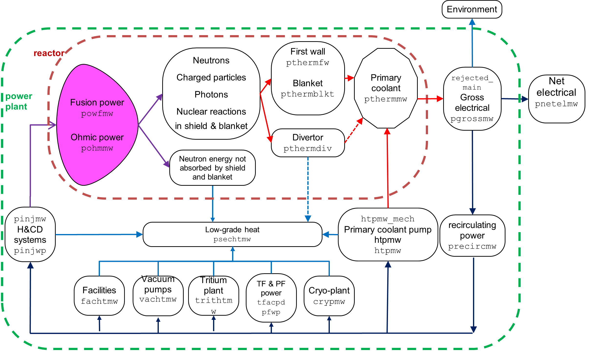

# Plasma Core Power Balance

The figure below shows the flow of power as calculated by the code.

<figure markdown>
{ width="100%"}
<figcaption>Figure 1: Machine build for D-shaped major components</figcaption>
</figure>

The primary sources of power are the fusion reactions themselves, ohmic power
due to resistive heating within the plasma, and any auxiliary power provided
for heating and current drive. The power carried by the fusion-generated 
neutrons is lost from the plasma, but is deposited in the surrounding material. 
A fraction `f_p_alpha_plasma_deposited` of the alpha particle power is assumed to stay within the
plasma core to contribute to the plasma power balance. The sum of this core
alpha power, any power carried by non-alpha charged particles, the ohmic power
and any injected power, is converted into charged particle transport power
($P_{\mbox{loss}}$) plus core radiation power, as shown in the Figure. The core 
power balance calculation is turned on using constraint equation no. 2 (which 
should therefore always be used).