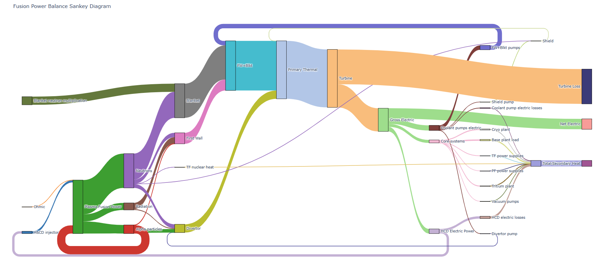

# Plotting

## Plotting an MFILE

!!! note 

    The majority of the output plots can be automatically generated at the end of the `PROCESS` run by using the `--full-output` flag.
    See the [running process](./running-process.md) section for more info.

### Summary document | `plot_proc.py`

`plot_proc` is used for plotting an overview of the results from an MFILE. It can be run using its own CLI (see [here](https://ukaea.github.io/process/core/io/utilities/) for full details):

```bash
python process/core/io/plot_proc.py -f path/to/MFILE.DAT
```

or through PROCESS's main CLI:

```bash
process -i path/to/IN.DAT --full-output
``` 

An example of a plot proc output PDF for the large tokamak regression test is shown below:
<embed src="../../images/plot_proc.pdf" type="application/pdf" width="100%" height="600">

----------------

### Scan files

`plot_scans` is a tool to show the change in variables as a scan variable is varied.
Scans can be done in one or two dimensions.

```bash
python process/core/io/plot_scans.py -f path/to/MFILE.DAT
```
<figure markdown>
{figures-side, width="100%"}  
<figcaption>Figure 10: 2D scan contour plot </figcaption>
</figure>

<figure markdown>
{figures-side, width="100%"}  
<figcaption>Figure 11: 1D scan plot </figcaption>
</figure>

----------------

### Interactive Sankey diagram

`plot_plotly_sankey` is to plot an interactive `.html` Sankey diagram for looking at the plants power balance. It can be run as follows:

```bash
python process/core/io/plot_plotly_sankey.py -m path/to/MFILE.DAT
```

<figure markdown>
{ width="100%"}
<figcaption>Figure 13: Interactive HTML Sankey diagram </figcaption>
</figure>


